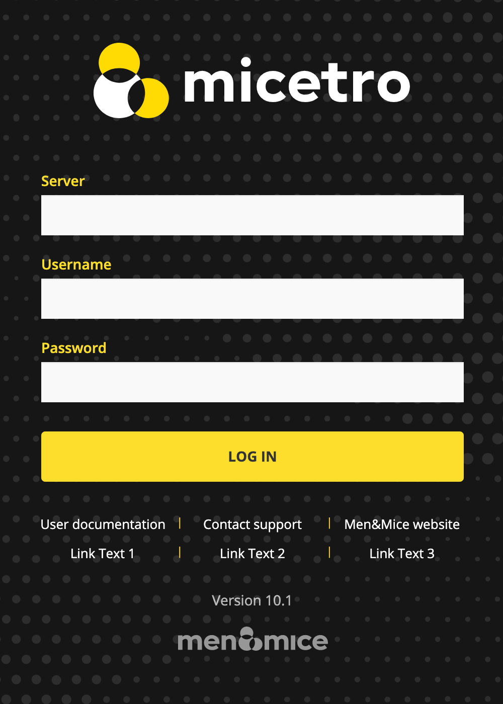

.. _webapp-custom-links:

Custom Links in the Micetro Web Interface 
-----------------------------------------

You can add up to three custom links that show up on the Micetro login page.

**To add your custom links (for example internal support channel)**:

1. Open the ``preferences.cfg`` file for Micetro Web Services.

   * Default location on Windows: ``C:\ProgramData\Men and Mice\Web Services\preferences.cfg``

   * Default location on Linux: ``/var/mmsuite/web_services/preferences.cfg``

2. To the end of the file, add the links in the following format: 

   .. code-block::

      <LoginFootnote value="Link Text 1[https://www.example.com/link1],Link Text 2[https://www.example.com/link2],Link Text 3[https://www.example.com/link3]" />

3. Restart the Micetro Web Service to pick up the changes:

   * On Windows: ``mmws.exe`` 

   * On Linux:

   .. code-block:: bash

     systemctl restart mmws

.. note::
    The Micetro Web Service always needs to be restarted after changes to its preferences file.