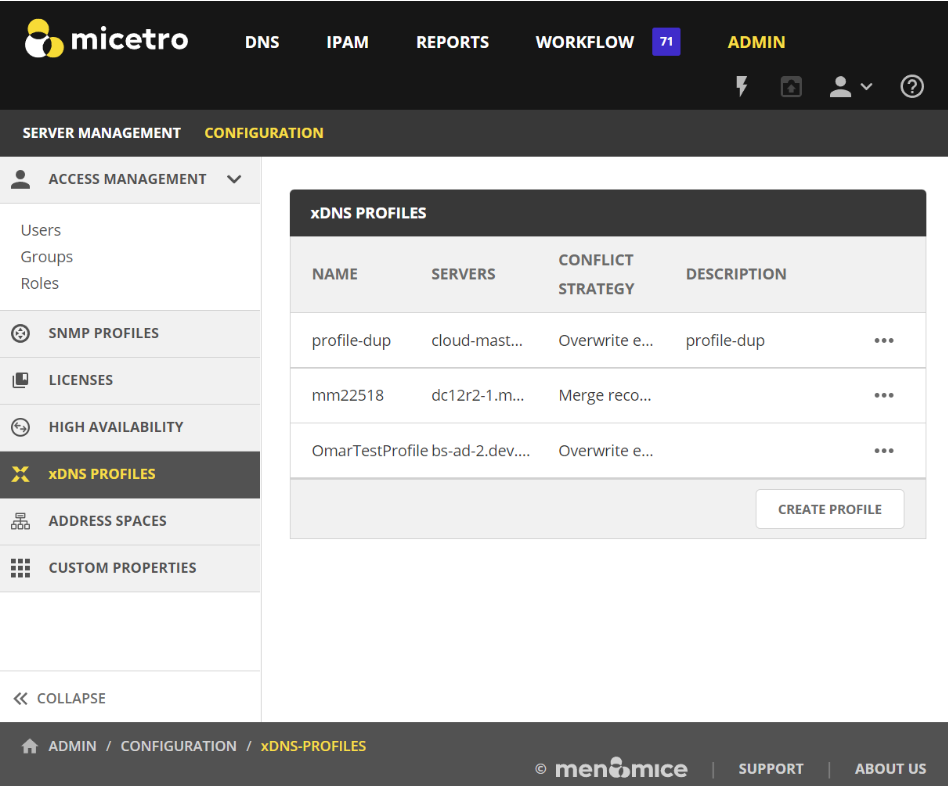
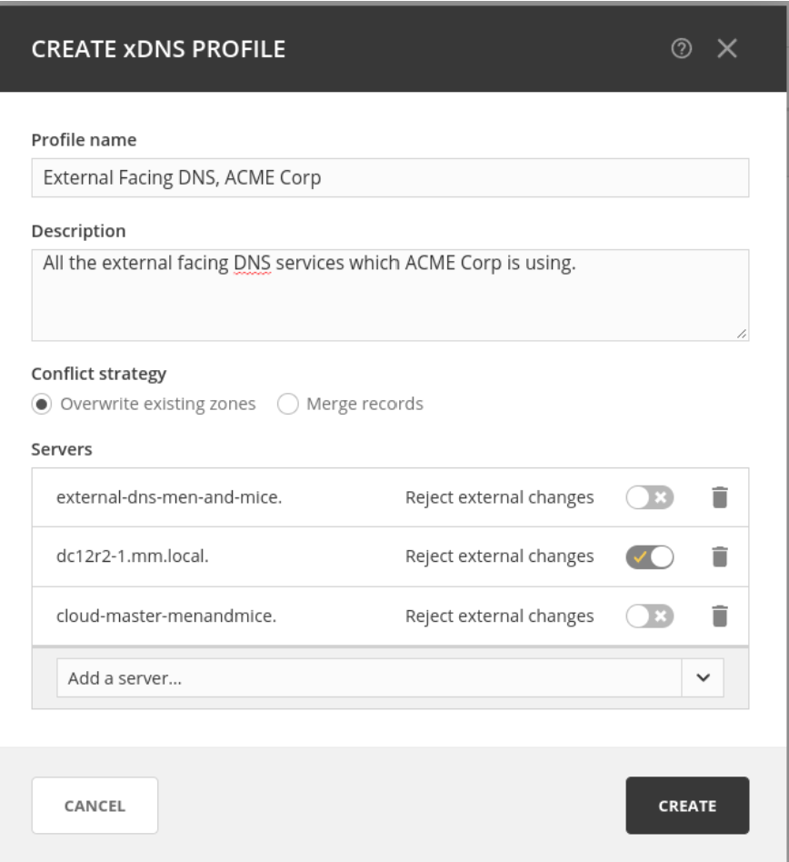
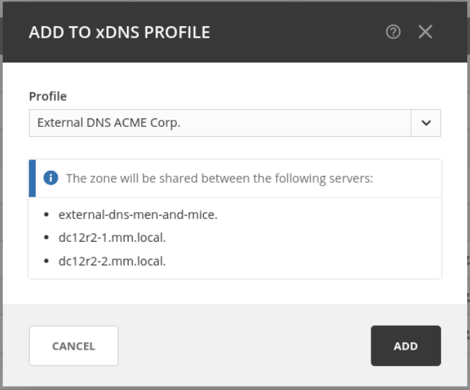
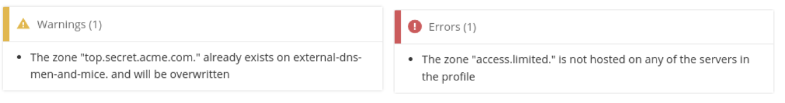
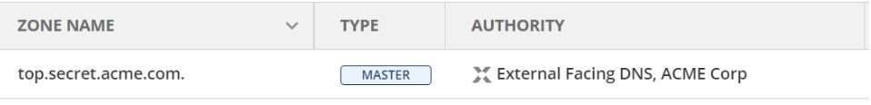
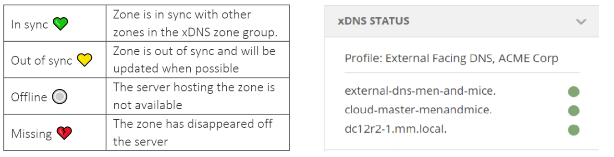

.. meta::
   :description: Configuring and managing xDNS profiles in Micetro by Men&Mice
   :keywords: xDNS Redundancy, DNS, Micetro 

.. _xdns-redundancy:

xDNS Redundancy
===========================

Overview
--------
xDNS offers service level, platform agnostic DNS redundancy. xDNS has been reimagined and simplified with the introduction of xDNS profiles. 

.. _xdns-profiles:

xDNS Profiles 
-------------

xDNS Profiles groups together two or more DNS services which are to share the authority of a list of zones. Changes within and outside of Micetro are automatically replicated to all DNS services which have been added to the profile. If a conflict arises, Micetro will try to resolve it automatically using by default the conflict resolution strategy set on the profile. 

Creating/modifying an xDNS profile 
---------------------------------

To add an xDNS profile go to the Admin page under Configuration in Micetro, in the left-hand side bar click xDNS profiles. 

Each profile has the following properties: 

* Name, which must be unique among the xDNS profiles defined in the system 

* Description, optional field to describe the purpose of the xDNS profile 

* Conflict Strategy, controls whether Micetro attempts to overwrite or merge record conflicts which may occur during sync. This value also controls the default value for when adding new zones to the profile. 

* Servers, two DNS services at least must be added to the profile.  

* Each service can also be configured to reject external changes I.e., changes to record data on one service that is made outside of Micetro is not replicated by xDNS to other services. 

  
.. note::
   The list of servers **cannot** be changed after the profile has been created 
   
 Users must have administrative access inside of Micetro to the DNS Services they wish to add to their xDNS profile. 
 
Deleting an xDNS profile 
-----------------------

Once a xDNS profile has been deleted each service is left with a copy of the zones which had been added to the profile. Authority is still shared but all replication between them will stop. 

Users must have administrative access inside of Micetro to all the DNS services which make up the xDNS profile to be able to delete the profile. 

Adding zones to xDNS profiles
------------------------------

xDNS profiles do not include any of the zones to begin with. To add zones to an xDNS profile navigate to the DNS section and in the left-hand side bar select Master Zones. 

.. note::
xDNS only supports Master zones 

Either from the Actions dropdown or the Meatball menu select the “Add to xDNS profile” task. 

  
When a profile is selected inside the task from the dropdown menu Micetro runs preflight checks and will display any warnings or potential errors which are detected. 

.. note::
   To add a DNS zone to an xDNS profile users must have "create zone access" on all DNS services which make up the xDNS profile which is selected. 
   
 Adding a zone to xDNS will, if necessary, create zone instances on other DNS services which make up the profile selected and add delegation records. After which other record data in the source zone will be replicated over to the newly created zone instances. 

The overview grid for DNS zones will show only one instance, with the authority column showing the name of the profile which the zone has been added to. 

  
xDNS Status on Zones
--------------------

The status of the xDNS zones is shown in the inspector when selected. Each underlying zone instance is represented by the name of the DNS service and the traffic light. 

See table below for exact information about each color and state: 

  
Multiselecting is supported if all xDNS zones are members of the same profile, with each entry being the aggregate state of the zone instances on each DNS service. If zones from multiple profiles are selected, then the xDNS status section will be hidden.

Removing zones from an xDNS profile 
------------------------------------

Removing a zone will stop all replication between the zone instances on each DNS service, delegation will not be changed, nor will any zone instances be deleted. 

Addendum
--------

**xDNS zones and the API** 

xDNS zones are represented by a single instance in the API with the Authority value denoting the profile which they belong to. The individual zone instances are still accessible, for example by calling GetDNSZones and filtering to each DNS service via dnsServerRef parameter. 

**Conflict strategy**  

*Overwrite existing zones*, if a zone with the same name exists on any of the other DNS services which make up the xDNS profile, its records will be overwritten with the record data from the zone instance which is being added to the xDNS profile.  

*Merge records*, if a zone with the same name exists on any secondary service, its contents will be merged with the contents of the zone on the primary service.  
