.. _xdns-redundancy-groups:

xDNS Zone Redundancy Groups
===========================

Overview
--------

Zone redundancy groups can be used to keep different zones in sync. If a DNS record is added, modified or deleted in a zone that is a member of a zone redundancy group, then the changes will be replicated to other zones in the group.

Any unsigned non-AD integrated master zone can be added to a redundancy group, as long as it is not already a member of a different group.

Manage xDNS Zone Redundancy Groups
----------------------------------

To manage xDNS Redundancy Groups select :guilabel:`Zone --> Manage xDNS Zone Redundancy Groups`.

This will open the **xDNS Zone Redundancy Groups** Dialog. The dialog can be used to add, edit or remove a redundancy group.

Adding a zone redundancy group
^^^^^^^^^^^^^^^^^^^^^^^^^^^^^^

To add a redundancy group from within the xDNS Zone Redundancy Groups Dialog, click the :guilabel:`Add` button to open the xDNS Zone Redundancy Group Wizard:

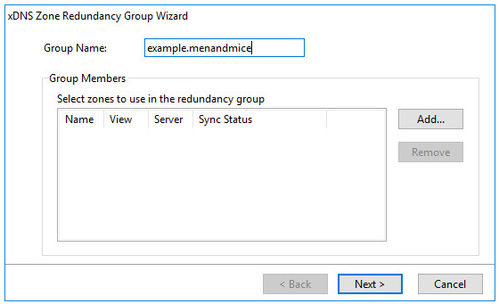

Select a unique name for the redundancy group and then click :guilabel:`Add` to select the zones to use in the group.

The following dialog is displayed:

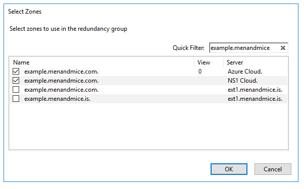

Select zones to use in the redundancy group. Note that you can use the quick filter to reduce the number of zones displayed in the list. It is also possible to right click on the list to check or uncheck all zones.

Click the :guilabel:`Ok` button to close the zone selection dialog once the zones to use in the group have been selected:

.. image:: ../../images/xdns-add-3.png
  :width: 60%
  :align: center

Click :guilabel:`Next` to select an initial zone to use when syncing the redundancy group:

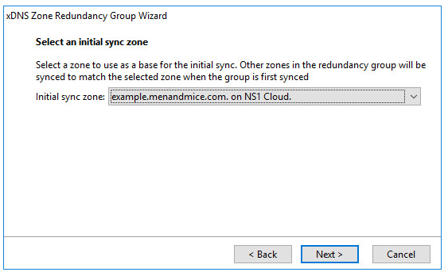

The initial sync zone is used as a base for determining how to sync the zones. The initial sync zone will only be used for the first sync, when the group is created. After the zones have been synced for the first time, they will all be checked for changes that are replicated to other group members.

Note that you will be given a chance to decide how to deal with records that conflict between zones before the redundancy group is created.

Click :guilabel:`Next` to configure the sync policy for the zones in the redundancy group.

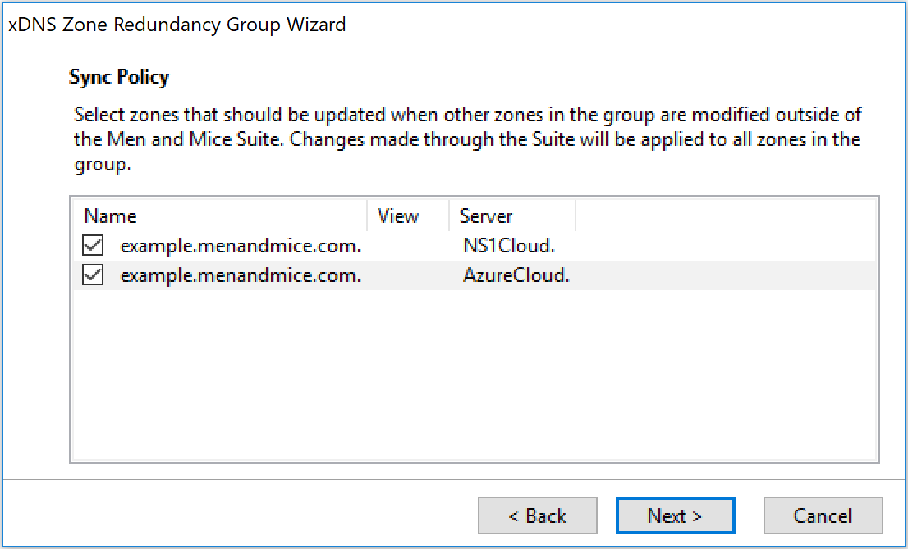

The sync policy specifies how each zone handles external changes from other zones in the group. The zones selected here will replicate the changes when other zones in the group are modified externally, outside of Micetro. The zones not selected will act as "readonly" and only receive updates done through Micetro or when the zone itself is modified externally, for example through it's corresponding cloud portal.

Click :guilabel:`Next` to write a save comment that will saved when the group is created:

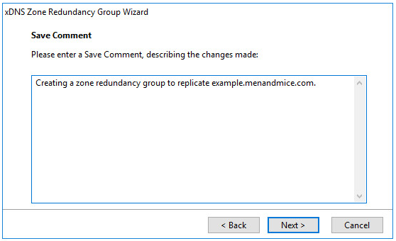

Click :guilabel:`Next` to see a summary of how the group will be configured:

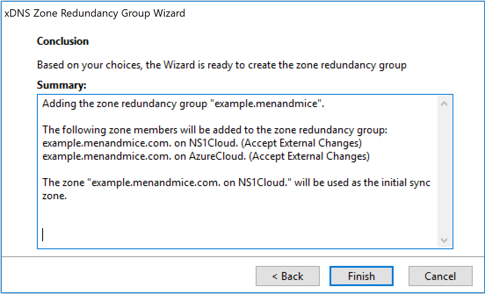

When the :guilabel:`Finish` button is clicked, a check is made to see if a zone contains any DNS records that are not in the zone that was selected as the initial sync zone. If there are no conflicts, then the redundancy group will be created and the wizard will close.

If there are however any conflicts, then they will have to be resolved before the group is created:

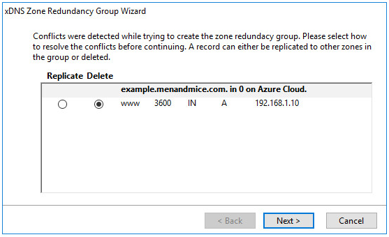

The conflict can either be resolved by replicating the DNS record to other zones in the group or by deleting the record.

Click :guilabel:`Next` to see a summary of the changes and then click "Finish" to create the zone redundancy group.

It is also possible to create a redundancy group by right clicking selected zones and then click :guilabel:`Create xDNS Redundancy Group`:

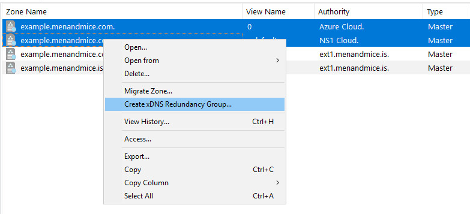

The xDNS Zone Redundancy Group Wizard will then open with the selected zones.

Edit a zone redundancy group
^^^^^^^^^^^^^^^^^^^^^^^^^^^^

To edit a redundancy group from within the xDNS Zone Redundancy Groups Dialog, click the :guilabel:`Edit` button (or double click the group name) to open the xDNS Zone Redundancy Group Wizard.

It is not possible to change the group name, but zones can be added and removed from the redundancy group.

Here the master zone residing on the Azure Cloud service has been removed and the zone example.menandmice.is on the DNS server ext1.menandmice.is has been added to the group.

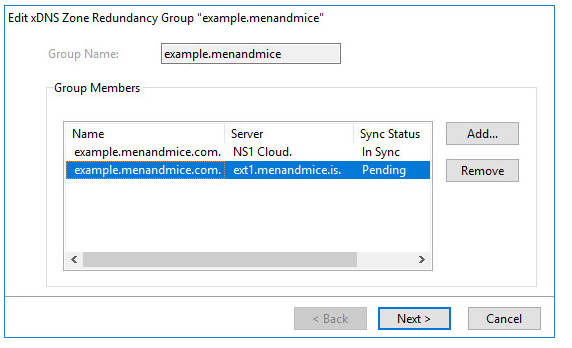

Click :guilabel:`Next` to add a save comment.

Click :guilabel:`Next` to see a summary for the changes that will be made:

When the :guilabel:`Finish` button is clicked, a check is made to see if a zone being added contains any DNS records that are not in already in the group. If there are no conflicts, then the redundancy group will be modified and the wizard will close.

If there are however any conflicts, then they will have to be resolved before the changes are applied:

.. image:: ../../images/xdns-edit-2.png
  :width: 60%
  :align: center

The conflict can either be resolved by replicating the DNS record to other zones in the group or by deleting the record.

Click :guilabel:`Next` to see a summary of the changes and then click :guilabel:`Finish` to modify the zone redundancy group.

It is also possible to add and remove a zone from a redundancy group by right clicking on a zone in a zone list:

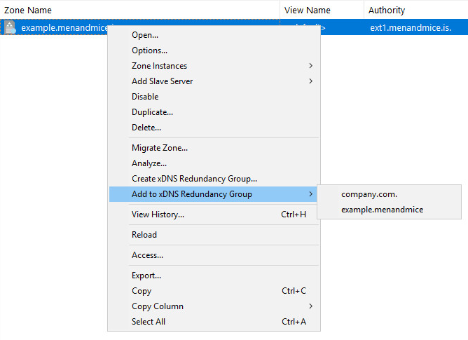

The xDNS Zone Redundancy Group Wizard will then open with the selected zones.

Removing a redundancy group
^^^^^^^^^^^^^^^^^^^^^^^^^^^

A redundancy group can be removed from within the xDNS Zone Redundancy Groups Dialog.

Select one or more redundancy groups that you want to remove and click :guilabel:`Remove`.

Confirm the removal, enter a save comment and click :guilabel:`Ok` to remove the selected zone redundancy groups.

Re-syncing zone redundancy groups when all members are out-of-sync
------------------------------------------------------------------

When a zone in a redundancy group can not be kept in sync with other zones in the group (e.g. if a DNS server is offline), then its status will be set to "Out Of Sync". Once the zone comes back online it will automatically be synced with a different zone in the group that is in sync. The zone state will then be set to "In Sync". However, if all group members are out of sync, then the group has to be manually synced again.

If a zone that is out of sync changes, then the changes will not be replicated to other zones in the group, until it is back in sync. Note that it is still possible to make changes to the zone and manage it in Micetro.  The changes will however not be replicated to other group members.

To re-sync a redundancy group from within the xDNS Zone Redundancy Dialog, click the :guilabel:`Edit` button (or double click the group name) to open the xDNS Zone Redundancy Group Wizard:

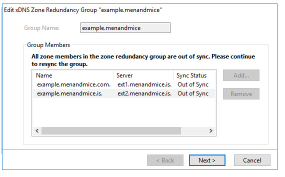

Click :guilabel:`Next` to select an initial sync zone to use:

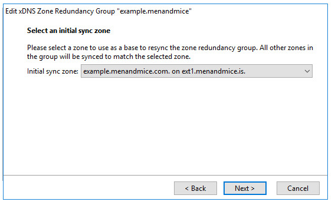

The initial zone will be used as a base when the group is re-synced. If there are any DNS record in other zones in the group that are not in the initial zone, then an option will be given on how to resolve the conflicts before the group is re-synced.

Click :guilabel:`Next` to add a save comment.

Click :guilabel:`Next` to see a summary of the changes that will be made:

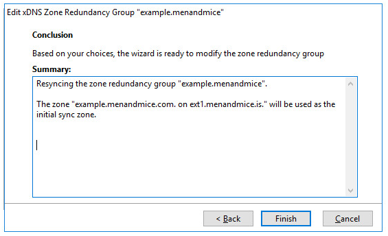

When the :guilabel:`Finish` button is clicked, a check is made to see if a zone in the redundancy group contains a DNS record that is not in the zone selected as the initial sync zone.

If there are no conflicts, then the redundancy group will be re-synced and the wizard will close. If there are however any conflicts, then they will have to be resolved before the group can be re-synced.
