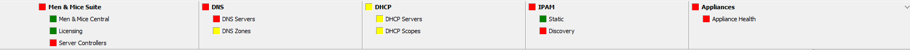
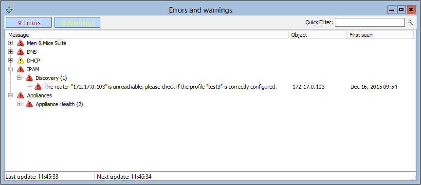

.. meta::
   :description: The Men&Mice Health Monitoring provides an overview of the general health of Micetro and other systems and services  
   :keywords: DNS health monitoring

.. _console-health-bar:

Health Monitoring Bar
---------------------

Overview
^^^^^^^^

The Men&Mice Health Monitoring provides the administrator with valuable information they need to maintain their systems and services. First, a good overview of the general health of Micetro and related services. More importantly, it will give the administrator an indication if there is a problem that needs to be acted on and corrected, for example if there is a secondary zone that is expiring or if there is a zone that has not been loaded on a server due to an error. Both cases can cause outages for users and therefore be a serious impact for the business.

Categories
^^^^^^^^^^

The health status is displayed on the health bar which is positioned at the bottom of the management console window. The status indicators are split into five categories

* Micetro

* DNS

* DHCP

* IPAM

* Appliance

.. image:: ../../images/health_bar_small.png
  :width: 90%
  :align: center

A color code is used to represent the severity of the error. If an indicator in any of those categories has a warning or error, it is shown as yellow or red, respectively; otherwise as green. The health bar can be expanded and then the indicator subcategories are shown and more details can be obtained about the health indicators. More importantly, details about each error are given in a separate window where a detailed description about the error is given and also the administrator is given the opportunity to navigate to the object that is affected and from there, fix the error.

  The health bar has been expanded by clicking the up arrow in the upper right corner of the health bar. There, it can be seen the there are errors in 'DNS Zones' and 'Server Controllers' and a warning in 'Version'.

Indicator details
^^^^^^^^^^^^^^^^^

+------------------+--------------------+---------------------------------------------------------------------------------------------------------------------------------+
| Category         | Subcategory        | Description                                                                                                                     |
+==================+====================+=================================================================================================================================+
|                  | Licensing          | An indication is given if there is a problem with the license, for example if a module license has been exceeded.               |
|                  +--------------------+---------------------------------------------------------------------------------------------------------------------------------+
|                  | Database           | An indication is given if the database size exceeds a default threshold of 1GB for SQLite.                                      |
|                  +--------------------+---------------------------------------------------------------------------------------------------------------------------------+
| Micetro          |                    | An indication is given if                                                                                                       |
|                  | Server Controllers | * the server controllers have a problem communicating with Men&Mice central                                                     |
|                  |                    | * there is a problem communicating with the update agents running beside the server controllers.                                |
|                  +--------------------+---------------------------------------------------------------------------------------------------------------------------------+
|                  | Version            | An indication is given if there is a new version available, if there are pending upgrades or if any components are out of date. |
+------------------+--------------------+---------------------------------------------------------------------------------------------------------------------------------+
|                  | DNS Servers        | An indication is given if there is a problem communicating with the servers or if the DNS server is down.                       |
|                  +--------------------+---------------------------------------------------------------------------------------------------------------------------------+
|                  |                    | An indication is given if                                                                                                       |
| DNS              | DNS Zones          | * the system is unable to get the zone status                                                                                   |
|                  |                    | * the slave zone will expire in the next 24 hours                                                                               |
|                  |                    | * the zone can not load on the server                                                                                           |
+------------------+--------------------+---------------------------------------------------------------------------------------------------------------------------------+
|                  | DHCP Servers       | An indication is given if there is a problem communicating with the servers or if the DHCP server is down.                      |
|                  +--------------------+---------------------------------------------------------------------------------------------------------------------------------+
|                  |                    | An indication is given if                                                                                                       |
|                  |                    | * the system is unable to get the scope status                                                                                  |
|                  |                    | * the static part of scope is over utilized                                                                                     |
|                  |                    | * the dynamic part of scope is over utilized                                                                                    |
|                  |                    | * a superscope is over utilized                                                                                                 |
| DHCP             | DHCP Scopes        | * there is a scope pool collision                                                                                               |
|                  |                    | * there is a scope reservation mismatch                                                                                         |
|                  |                    | * scope contains inconsistencies that need reconciling                                                                          |
|                  |                    | * the system is unable to check whether scope contains inconsistencies                                                          |
|                  |                    | * the system is unable to check whether scope is part of a failover relationship on partner server                              |
|                  |                    | * the DHCP failover partner server is unreachable                                                                               |
|                  |                    | * the system is unable to fetch scope info from the partner server                                                              |
|                  |                    | * if a scope is not part of a failover relationship on the partner server                                                       |
+------------------+--------------------+---------------------------------------------------------------------------------------------------------------------------------+
| IPAM             | Static             | An indication is given if a subnet is over utilized.                                                                            |
|                  +--------------------+---------------------------------------------------------------------------------------------------------------------------------+
|                  | Discovery          | An indication is given if there are problems with communicating with routers.                                                   |
+------------------+--------------------+---------------------------------------------------------------------------------------------------------------------------------+
| Appliance        | Appliance health   | An indication is given if an appliance is unreachable.                                                                          |
+------------------+--------------------+---------------------------------------------------------------------------------------------------------------------------------+

In any case of an warning or error above, there will be a detailed description of the error or warning, and a way to navigate to the proper place to fix an error/warning.

Ignoring indicators
"""""""""""""""""""

By right clicking a status indicator in the health bar and selecting **ignore**, that status indicator can be ignored.

Viewing error / warning indicators
""""""""""""""""""""""""""""""""""

In this window you can see more details about the status indicator. Following are descriptions about what each column shows.

Message
  Details about the error / warning for this indicator

Object
  Name of the object that the error / warning is related to

First seen
  The date of which the error / warning was first seen

  In the figure above, we have clicked on the 'Discovery' indicator to get more details about the error.

Right clicking an indicator will show a context menu with the following items (where applicable):

  * Show in manager window: Show the specific item in the manager window

  * Open: Opens a specific object, for example a scope

  * Reconnect: Reconnects to an already disconnected server

Disabling health monitoring
^^^^^^^^^^^^^^^^^^^^^^^^^^^

The system health monitoring can be disabled completely by setting an advanced system option. See :ref:`console-advanced-settings` for more details.
