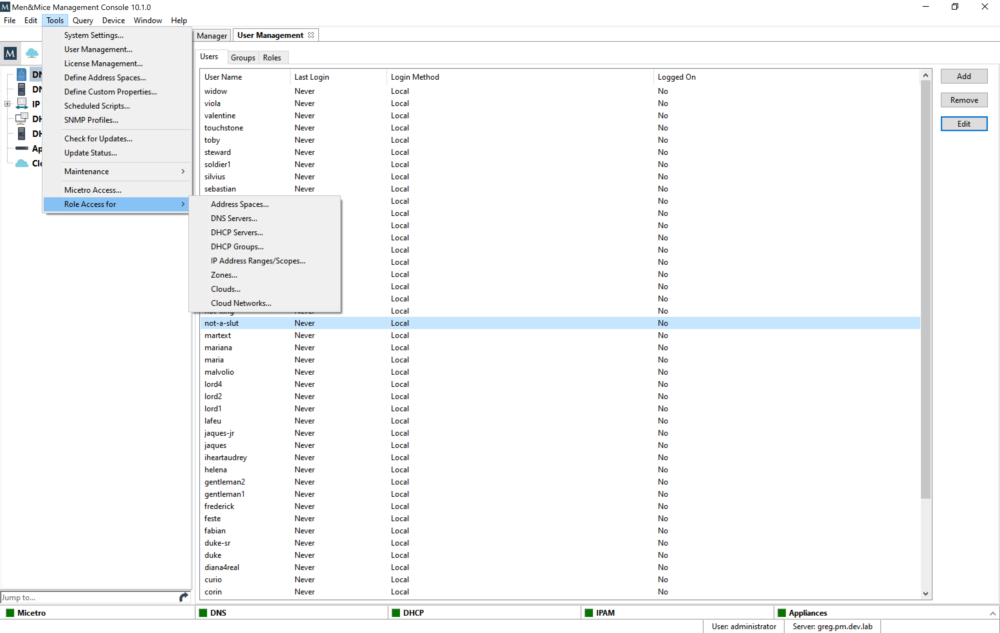
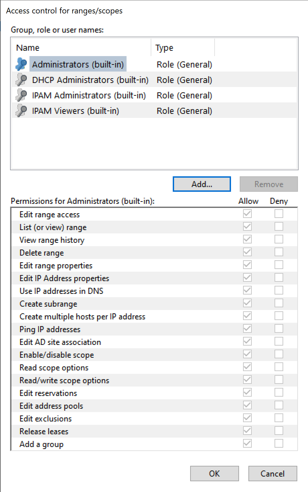
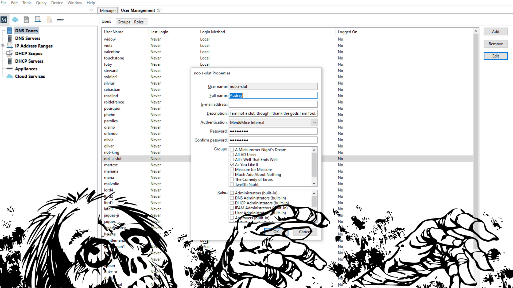

.. meta::
   :description: Access control management with the Management Console in Micetro by Men&Mice
   :keywords: access control, access control management, role-based access, security, Micetro

.. include:: ../user-manual/access_control.rst

.. _acl-console:

Managing access control in the Management Console 👣👣
-------------------------------------------------

Access control management in the Management Console uses the new access control model, but its features are slightly different than those available in the Web Application.

.. note::
  Men&Mice recommends configuring and managing access through the Web Application, as the preferred method. Functionality in the Management Console is mostly implemented in a transitional capacity.

Key differences between the Web Application and the Management Console
^^^^^^^^^^^^^^^^^^^^^^^^^^^^^^^^^^^^^^^^^^^^^^^^^^^^^^^^^^^^^^^^^^^^^^

Effective access
""""""""""""""""

In the Management Console's :menuselection:`Tools --> User Management`, the functionality for :ref:`acl-effective-access` is not available.

Users and groups
""""""""""""""""

In the Management Console's :menuselection:`Tools --> User Management`, users and groups cannot be edited to assign roles. Instead, roles need to be configured with users and groups.

Roles
"""""

In the Management Console's :menuselection:`Tools --> User Management`, adding a new role doesn't allow configuring access for it.

Configuring access in the Management Console
^^^^^^^^^^^^^^^^^^^^^^^^^^^^^^^^^^^^^^^^^^^^

Adding a new role
"""""""""""""""""

1. Open :menuselection:`Tools --> User Management` and switch to the **Roles** tab.

2. Click :guilabel:`Add`.

3. Fill in the name and description for the role. Optionally, you can add users and groups to the role.

4. Click :guilabel:`Ok`.

.. important::
  The function for *creating* the role doesn't contain options to set access for it in the Management Console. For configuring access, follow the steps in :ref:`console-role-perms`.

.. _console-role-perms:

Configuring access for a role
"""""""""""""""""""""""""""""

.. note::
  Unlike the in Web Application, configuring access for roles is sectioned by object type (i.e. DNS servers, zones, clouds, etc.).

1. Open :menuselection:`Tools --> Role access for` and select the object type from the menu.

.. note::
  To manage access for Micetro (module access, setting user admins, etc.) use :menuselection:`Tools --> Micetro access`.

2. In the **Access control** dialog, you'll see all roles that have relevant access configured on them.

3. To configure access for the selected object type to a role:

  3/1. Select the role in the top window, or click :ref:`Add...` to add a role that doesn't have access configured for the object type yet.

  3/2. In the bottom panel, select all checkboxes for the access permissions you'd like to enable.

  .. note::
    Selecting **Deny** is the equivalent of **Block** in the Web Application. See :ref:`block-permission` for more details. Setting 'deny' on a permission will block any other role to overwrite this setting.

4. Click :guilabel:`OK` when all the desired access permissions are set.

Removing a role
"""""""""""""""

To *remove a role's access permissions from an object type* use the :menuselection:`Tools --> Role access for` menu. Select the role in the top panel and click on :guilabel:`Remove`. This will remove all configured access permissions from the role, but **not the role itself**.

To *remove a role from Micetro* use :menuselection:`Tools --> User Management` and click on the **Roles** tab. Select the role(s) to remove, and click :guilabel:`Remove`. This will remove **the role and all its configured access permissions** from Micetro completely.

Adding users and groups to a role
"""""""""""""""""""""""""""""""""

To add users or groups to a role:

1. Open :menuselection:`Tools --> User Management`.

2. Select the user(s) and/or group(s), click :guilabel:`Edit` and in the bottom panel select the roles to attach the user(s)/group(s) to.

3. Click :guilabel:`OK` to save the new membership settings.

.. note::
  Using the **Roles** tab of :menuselection:`Tools --> User Management`, examining a role will display the users and groups attached to the role, but cannot be used for adding users/groups to it.
