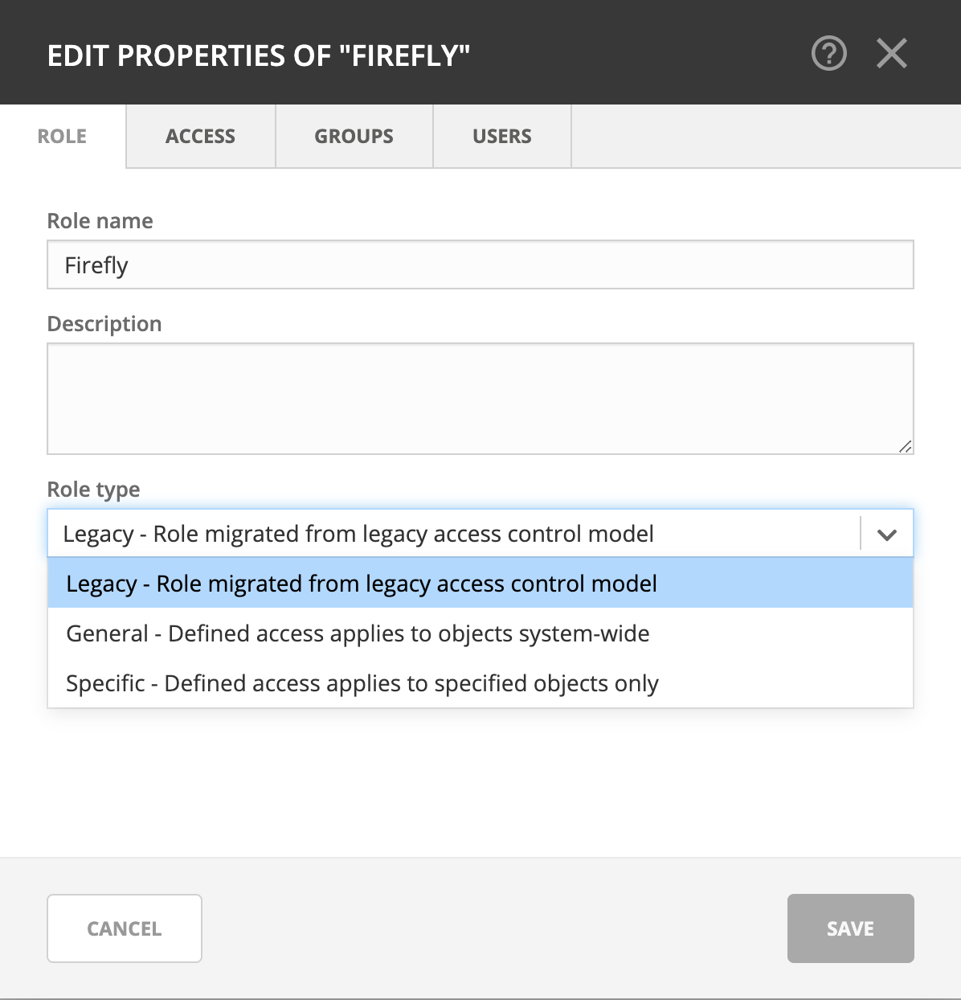
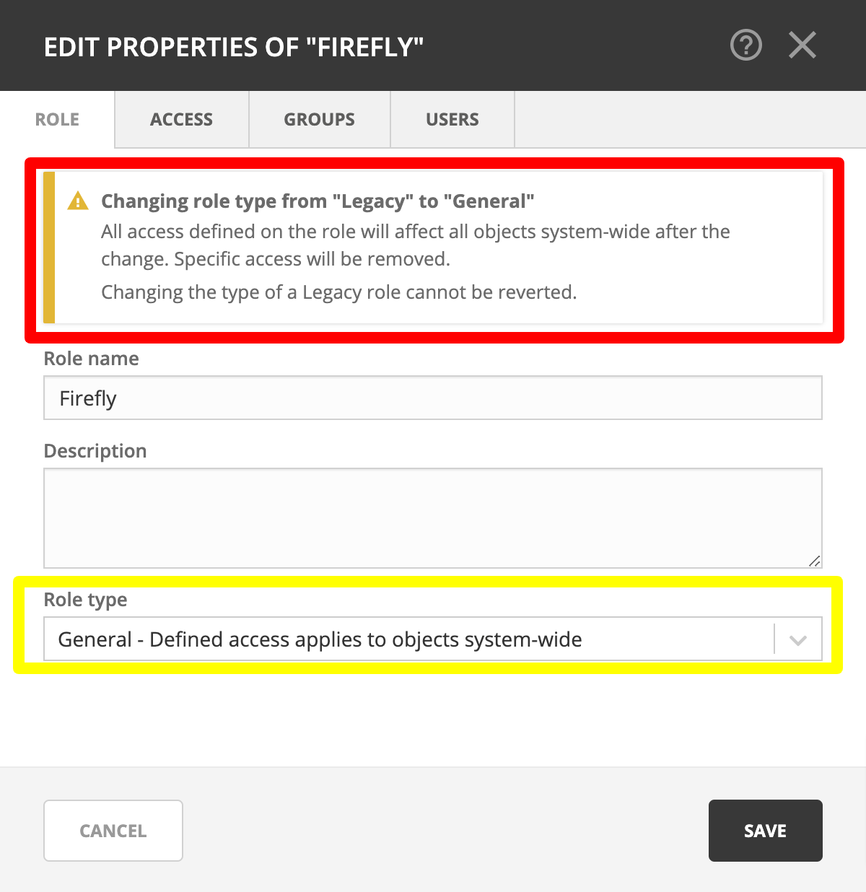
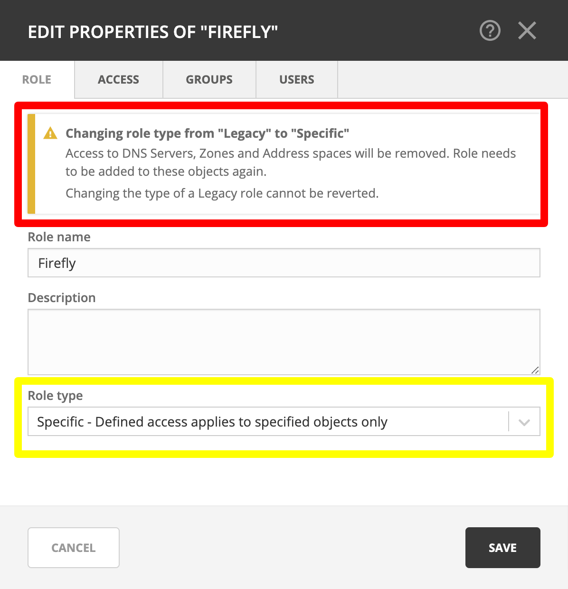

.. meta::
   :description: Converting existing configurations to the new access control model in Micetro 10.1
   :keywords: access control, access control management, role-based access, security, Micetro

.. _acl-convert:

Converting existing access control configurations in Micetro 10.1
=================================================================

Micetro 10.1 updated access control management from an object-based to a role-based model. This page is intended to provide a recommendation for handling access controls in existing environments.

Upgrading to Micetro 10.1
-------------------------

.. important::
  Men&Mice recommends performing a database backup before updating to 10.1.

Environments using a version of Micetro prior to 10.1 will be converted to the new model when you upgrade your Micetro components (see :ref:`updates`). The database is migrated automatically. *All existing* access control configuration is preserved, but will use the new model:

* built-in roles are converted into their new :ref:`acl-general-roles` equivalents

* custom roles previously used for access control are converted into :ref:`acl-legacy-roles`

* access settings for legacy roles on objects are preserved, using the :ref:`acl-specific-roles` mechanism (i.e. configured on existing objects, and not applied automatically to new objects)

Automatically created :ref:`acl-legacy-roles`
^^^^^^^^^^^^^^^^^^^^^^^^^^^^^^^^^^^^^^^^^^^^^

Legacy roles are a transitional role type to help migration and preserve backward compatibility.

:ref:`acl-legacy-roles` are generated for any user or group previously configured with *Initial access* that had general access for an object type. The legacy roles have the same permissions as their initial access.

The generated legacy roles are named after their original name. E.g. the user *Viola* will become the legacy role ``Viola (converted user)`` while the group *Illyria* will become the legacy role ``Illyria (converted group)``.

.. note::
  Creating legacy roles based on users and groups will leave the existing user and group intact, and automatically assigned to their respective legacy roles.

Converting :ref:`acl-legacy-roles`
---------------------------------

If needed, legacy roles can be converted into a general or specific role, using the dropdown in the :guilabel:`Edit role properties` action.

.. danger::
  Changing the type of a legacy role **cannot** be reverted.

Converting legacy roles into :ref:`acl-general-roles`
^^^^^^^^^^^^^^^^^^^^^^^^^^^^^^^^^^^^^^^^^^^^^^^^^^^^^

Converting a legacy role into a general role *removes all object-specific access* and makes the legacy role's configured permissions *applicable to all objects* in the system. If the legacy role had an exclusion (see :ref:`block-permission`) for specific object types, the exclusion will also be applied system-wide.

Converting to :ref:`acl-specific-roles`
^^^^^^^^^^^^^^^^^^^^^^^^^^^^^^^^^^^^^^^

If the legacy role was general for some object types it *will not* have access to **any** of the objects of that type after converting to specific.

Any object-specific overrides will inherit the access from the role.

Example of converting legacy role into specific
"""""""""""""""""""""""""""""""""""""""""""""""

A legacy role had initial access on DNS servers previously (e.g. *list/view*) but not on zones, but was granted the role access to select zones.

After conversion:

* the role *will not have* access to any servers (even if some servers had overridden/different permissions or were excluded)

* the role *will have* access to the same zones as before, with consistent permissions across these zones

..
  Legacy -> Specific (the hard one). If the legacy role was general for some object type, after converting to Specific it will not have access to any of the objects of that type. For other object types, we cleanup the access, such that any object specific overrides will instead inherit the access from the role. Example: if you had initial access on DNS servers before (e.g. list/view) but not on Zones, but had granted the role access to select zones, then after converting to Specific, the role will not have access to any servers (even if some servers had overridden/different permissions or were excluded) but it will have access to the same zones as before, with consistent permissions across these zones

.. note::
  Because of the complicated nature of matching access controls between the old and new models, Men&Mice recommends re-creating the configuration of legacy roles as specific roles, instead of changing the type.
