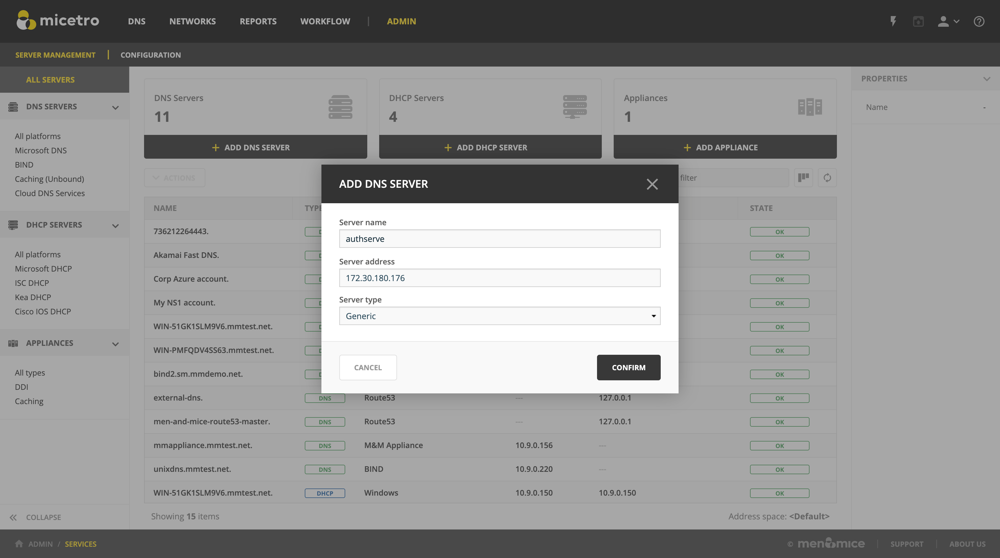

.. meta::
   :description: Using the Men&Mice Generic DNS Server Controller with the Akamai AuthServe authoritative DNS server.
   :keywords: Akamai, AuthServe, DNS, NomCC, DNS Server Controller

.. _authserve-nomcc:

Configuring AuthServe
=====================

The Men&Mice Generic DNS Server Controller is able to connect to and control an Akamai AuthServe DNS server through the ``nomcc`` Python library.

.. important::
  Each AuthServe DNS Server requires an instance of the Generic DNS Server Controller (see :ref:`generic-dns-controller`) installed on the same machine.

Installing the nomCC library
----------------------------

The Men&Mice DNS Server Controller uses tge ``nomcc`` Python library to control the AuthServe service.

Install ``nomcc`` Python library according to the instructions on its `Github repository <https://github.com/akamai/nomcc>`_.

.. note::
  The Python library ``crypto`` might be needed to be isntalled as a dependency for ``nomcc``.

In the file ``/etc/channel.conf`` make sure the channel name set to ``ansp``:

.. code-block::
  :linenos:

  ansp          172.30.180.176#9553    qJgOtzsmhI7KoshVWWDZPqI5c9G0pGd5dfVoQLllXO80dqoo

Installing the Men&Mice Generic DNS Server Controller
-----------------------------------------------------

1. Follow the instructions on :ref:`generic-dns-controller` and use the install parameter ``--generic-dns-controller``.  This will install the base Generic DNS Server Controller.

2. Copy the provided :ref:`nomcc-script` script to a local directory such as ``/var/mmSuite/scripts/``:

.. code-block:: bash

  cp nomccDNS.py /var/mmSuite/scripts/

3. Add a reference to the ``nomccDNS.py`` script in ``/var/mmSuite/dns_server_controller/preferences.cfg`` by adding the line:

.. code-block::
  :linenos:

  '<GenericDNSScript value="python3 /var/mmSuite/scripts/nomccDNS.py" />'

4. Start the Men&Mice Generic DNS Server Controller (``mmremoted``):

.. code-block:: bash

  systemctl start mmremoted

Adding AutServe DNS server(s) to Micetro
----------------------------------------

With the Men&Mice DNS Server Controller running on **all** AuthServe DNS servers you'd like to add, open the Men&Mice Web Application, navigate to :menuselection:`Admin --> Server Management` and click on :guilabel:`+ Add DNS Server`.

Fill in the server name and IP address, and from the **Type** dropdown menu select *Generic*. Click :guilabel:`Confirm` to add the server to Micetro.

