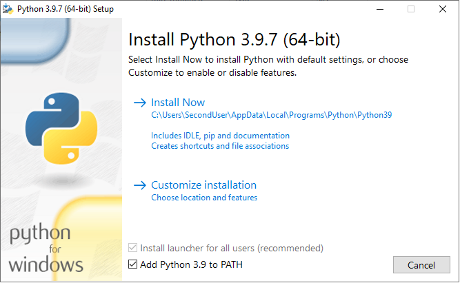
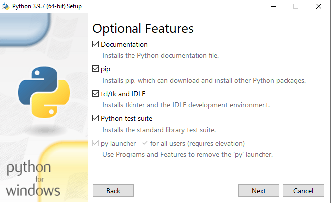
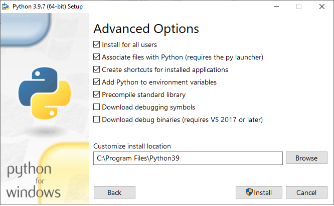

.. meta::
   :description: Using Python with Micetro on Windows Server
   :keywords: Micetro, Micetro Central, server, installation, how to, Python

.. _central-python-ldap:

Installing Python for Micetro Central on Windows
-------------------------------------------------

Using LDAP (see :ref:`configure-ldap`) with :ref:`install-central` on a Windows server requires Python to be installed for all users.

If you haven't yet installed Python, or just for the current user, follow these steps:

1. Download and run the installer for Python from `https://www.python.org/downloads/windows/ <https://www.python.org/downloads/windows/>`_.

2. On the first screen, select :guilabel:`Add Python 3.x to PATH` and click :guilabel:`Customize installation`.

3. Select the optional features. Central only requires **pip** to be installed.

4. On *Advanced features*, enable :guilabel:`Install for all users`. (Leave the rest unchanged.)

5. Proceed with the installation.

6. Restart Central, if it's already running.
