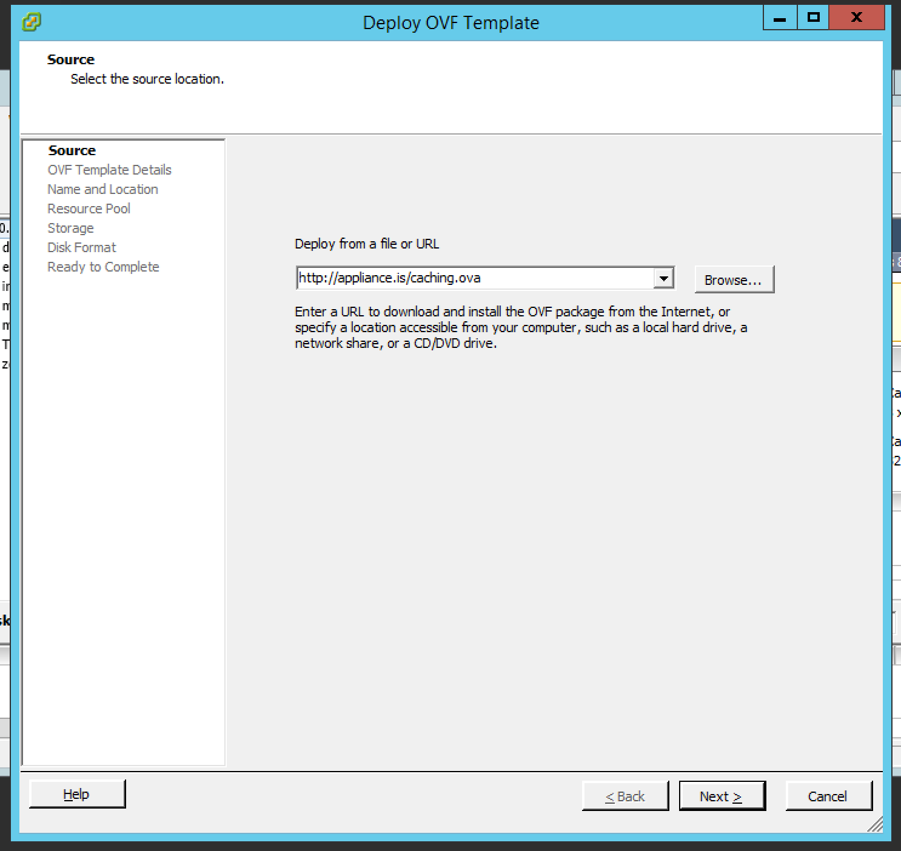
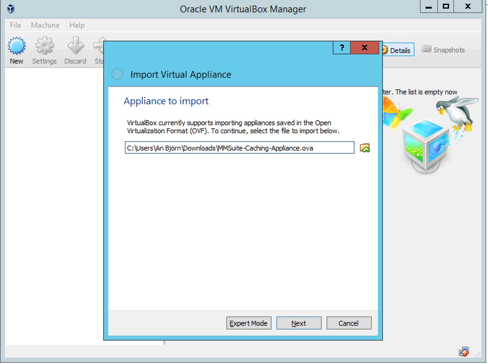

.. _dns-caching-appliance:

Virtual Caching Appliance Setup Guide
=====================================

Introduction
------------

Overview
--------

The Virtual Caching Appliance System is an integrated Caching server focusing on performance and reliability.

This document contains information about installation and initial configuration of the Virtual Caching Appliance.

Software Requirements
^^^^^^^^^^^^^^^^^^^^^

* VMWare Workstation 6.5 or higher

* VMWare ESX/ESXi 4 or higher

* VMWare Fusion 2 or higher

* VirtualBox 4.2.18 or higher

Hardware Requirements
^^^^^^^^^^^^^^^^^^^^^

Minimal requirements
""""""""""""""""""""

* 20 GB of disk space
* 4 GB RAM.
* 1 Processor Core

Recommended
"""""""""""

* 8 GB RAM.

* 4 Processor Cores

Installation
------------

Setting Up the Virtual Machine
^^^^^^^^^^^^^^^^^^^^^^^^^^^^^^

Importing the Virtual Appliance
"""""""""""""""""""""""""""""""

VMWare Fusion/Workstation
"""""""""""""""""""""""""

1. First, download the OVA file (http://appliance.is/caching.ova) or use http://download.menandmice.com/Appliance/ for a specific version

2. To setup the Virtual Appliance in VMWare Fusion, either double click the OVA file, or navigate to File and select import.

3. A dialog box appears that will allow you to specify the location of the OVA file. Confirm by clicking the 'Open' button.

4. After specifying the name of the new virtual appliance, clicking 'Import' will finalize the importing of the virtual appliance.

5. The Virtual Appliance is now ready to be started up.

VMWare ESX/ESXi
"""""""""""""""

The Virtual Appliance can be imported through a template on the ESX server. As seen in figure 1, the 'Deploy OVF template' is selected, and in figure 2, the deployment URL is pasted in. The next steps in the importing wizard should be self-explanatory.

.. figure:: ../../images/menandmice-caching-appliance-1.png
  :width: 60%
  :align: center

  Select 'Deploy OVF template from the File menu.

  Paste in the deployment URL (http://appliance.is/caching.ova) as shown and press 'Next'

VirtualBox
""""""""""

1. First, download the OVA file (http://appliance.is/caching.ova) or use http://download.menandmice.com/Appliance/ for a specific version

2. In the VirtualBox Manager open the File menu and select Import Appliance.

3. Click on the Open appliance button and select the Men&Mice Virtual appliance OVA file and click on the Continue button (see figure 3).

4. The next dialog page shows an overview of the settings. It's recommended to select the option to re-initialize the MAC addresses of the two virtual interfaces eth0 (Management Interface) and eth1 (Service Interface) as shown in figure 4.

Finally press the File... - Import Virtual Appliance button to load the Men&Mice virtual machine into your the VirtualBox environment.

  Importing the Men and Mice Virtual Caching Appliance .ova image.

.. figure:: ../../images/menandmice-caching-appliance-4.png
  :width: 60%
  :align: center

  Importing the Men and Mice Virtual Caching Appliance .ova image.

The Virtual Appliance only contains two virtual ethernet interfaces, eth0 and eth1. The eth0 interface serves as a management interface, while the eth1 interface serves as an external interface.

Configuration
-------------

Entering Appliance Network Information
^^^^^^^^^^^^^^^^^^^^^^^^^^^^^^^^^^^^^^

This section contains instructions on how to configure the network on the appliance. That is performed through the console on the virtual host.

Once the network information has been entered, you can add the appliance to the Men&Mice Suite. For further information refer to Chapter 4: Appliance Management in the Men&Mice Suite User's Guide.

Follow these instructions to configure the network settings

1. Access the Appliance menu by pressing the Escape button and then press the Enter button on the keyboard.

2. From the main menu, select 1. Network.

3. From the menu, select 1.1IP Address.

4. Enter the IPv4 address for the Appliance.

5. From the menu, select 1.2 Netmask.

6. Enter the network mask using a CIDR notation.

7. From the menu, select 1.3 Gateway.

8. Enter the IP Address of the gateway for the network.

Adding the Appliance to the Men&Mice Suite
^^^^^^^^^^^^^^^^^^^^^^^^^^^^^^^^^^^^^^^^^^^^

Please refer to the :ref:`appliance-management` chapter in the :ref:`manual` for instructions on how to add the appliance to the Men&Mice Suite.
