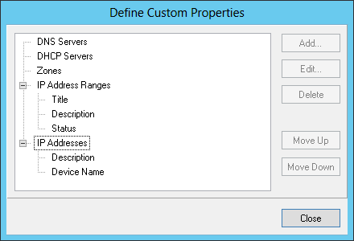

.. meta::
   :description: Before the IP address ranges are imported into Micetro the administrator has to identify which custom properties he wants to maintain for IP address ranges and individual IP addresses (devices).
   :keywords: IPAM, IP address, Micetro, IP address management

.. _import-ipam-old:

Importing the IP Address Ranges and Device Properties via CLI (deprecated)
--------------------------------------------------------------------------

Before the IP address ranges are imported into Micetro the administrator has to identify which custom properties he wants to maintain for IP address ranges and individual IP addresses (devices).

To define the custom properties the administrator will select "Define Custom Properties" from the "Tools" menu and add the necessary custom properties for IP address ranges and IP addresses. After that has been done the administrator can start importing the data from the spreadsheet.

The import format is a comma separated value (csv) list, like:

Subnets (IP Address Ranges)
^^^^^^^^^^^^^^^^^^^^^^^^^^^

.. code-block::

  network_address, subnet_mask, is_subnet, locked, can_auto_assign, Title,[custom_property_1,...]

network_address
  possible format is "1.2.3.0", "1.2.3.0/24" or "1.2.3.4-1.2.3.6"

subnet_mask
  if the network_address includes the mask (such as "1.2.3.0/24") or is not on bit boundaries (such as "1.2.3.4-1.2.3.6") then the subnet_mask can be empty

is_subnet:is
  "1" except when the subnet (range) is not on bit boundaries (such as "1.2.3.4-1.2.3.6")

locked:
  "1" if subnet is locked and IPs can't be allocated from the subnet in Micetro, else "0"

can_auto_assign:
  "1" if users (that have access to the subnet) can use IPs from the subnet in auto assignment in DNS

Title
  the name (or title) of the subnet

custom_property_n
  One entry per custom property or property maintained for subnets in the spreadsheet

Devices (IP Addresses)
^^^^^^^^^^^^^^^^^^^^^^

address
  IP address of the device

custom_property_n
  One entry per custom property maintained for IP addresses in the spreadsheet

The administrator will import the subnets and devices separately. First he will import the subnets. In this example the company has "Title, Description and Status" custom properties for subnets (IP Address Ranges) and "Description" and "Device Name" for IP Addresses.

The "Define Custom Properties" window, which appears when :guilabel:`Define Custom Properties` is selected from the :menuselection:`Tools` menu.

After the custom properties have been defined for IP Address Ranges and IP Addresses the file to import the subnets will look like the following in the csv format (note that the first line is needed in the file):

.. code-block::

  network_address,subnet_mask,is_subnet,locked,can_auto_assign,Title,Description,Status
  192.168.202.0,255.255.255.0,1,0,0,First subnet,,used
  192.168.203.0,255.255.255.0,1,0,0,Second subnet,,used
  192.168.204.0,255.255.255.0,1,0,0,Third subnet,,used

To import the data into Micetro the administrator will start the CLI (mmcmd) from the command prompt like:

.. code-block:: bash

  mmcmd -s 127.0.0.1 -u administrator

The administrator will be prompted for a password.

Before the data is actually imported, there is a possibility to do a syntax check of the file to be imported:

.. code-block:: bash

  mmcmd> importdata -c subnets <mysubnetfile.csv>

If the file is reported clean, the data can be imported using:

.. code-block:: bash

  mmcmd> importdata subnets <mysubnetfile.csv>

Importing the device data (IP addresses) is very similar to the process above.  As noted earlier, the company has the custom properties "Description" and "Device Name" for IP Addresses:

.. code-block::

  address,Description, Device Name
  192.168.202.253,Router 1, my_device_1.mydom.com.
  192.168.203.253,Router 2, my_device_2.mydom.com.

In a similar fashion the administrator will validate the syntax of the csv file:

.. code-block:: bash

  mmcmd> importdata -c devices <mydevicefile.csv>

And if the file doesn't contain any issues it can be imported with:

.. code-block:: bash

  mmcmd> importdata devices <mydevicefile.csv>

This might take a while depending on the amount of data but after the operation has completed, all the imported devices will appear in Micetro with the associated data.
