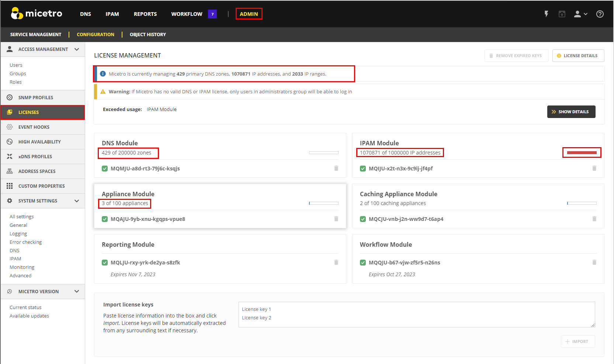

.. meta::
   :description: How Micetro counts the IP Addresses.Calculating IP Usage + Cleanup Tips
   :keywords: IPAM, IP address, Micetro, IP usage

.. _ip-count:

License Management - Calculating IP Usage
-----------------------------------------

Connecting to Services
^^^^^^^^^^^^^^^^^^^^^^

As the administrators connect to the services and enable discovery, the tool reads the data coming in and begins calculating usage. It will then do a comparison with the keys provided at time of purchase and display the number of IPs in use to the number that is encoded in the keys. At times, the customer is not 100% sure of their IP count, so the number is negotiated (best effort) with the Sales team.  

.. note::
  M&M does not lock the tool in any way if the license count is exceeded. Sustaining services is our top priority.

How Micetro Calculates IPs
^^^^^^^^^^^^^^^^^^^^^^^^^^
  
In the **System Settings**, there is a section called **Determine address usage**. 
An IP is counted as “in use” by Micetro when:

1.	There is a DNS record assigned to the IP address (data from the DNS server).

2.	There is an active lease in a DHCP pool (this will cause usage to fluctuate in the license count).

3.	There is a DHCP reservation configured on the IP.

4.	If the IP address has a custom property configured and it is populated.

5.	The IP address has been explicitly claimed (using the “Claim IP” feature).

6.	Discovery is enabled and there is an active client on the IP (configurable by # of days).

.. note::
   Micetro will only count dual-stacked clients as one IP (IPV4/IPV6).

These settings are all checked on by default upon installation.
