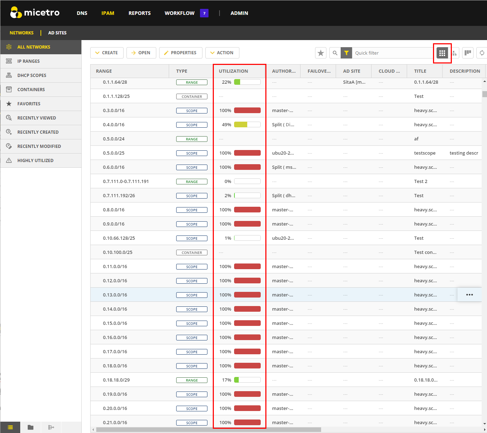
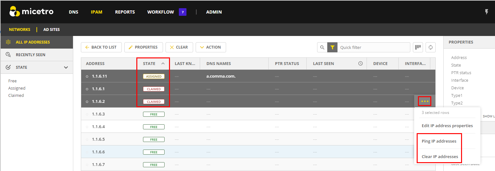
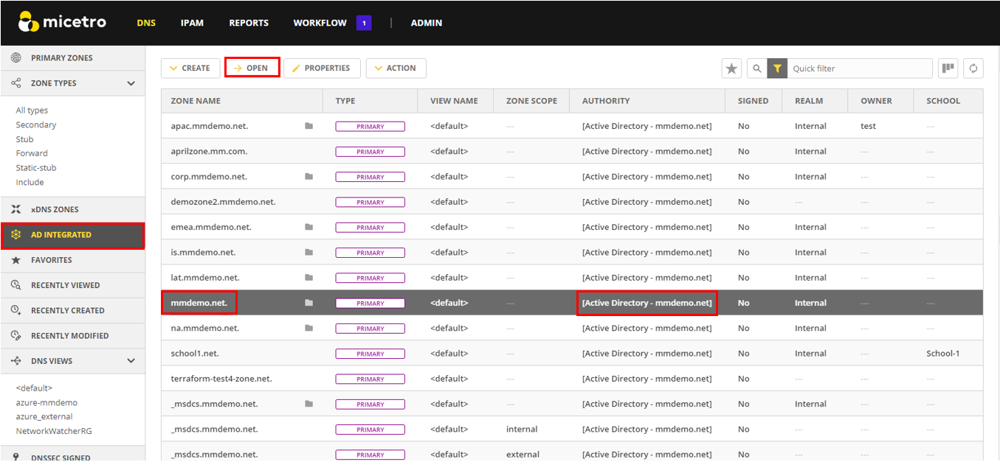
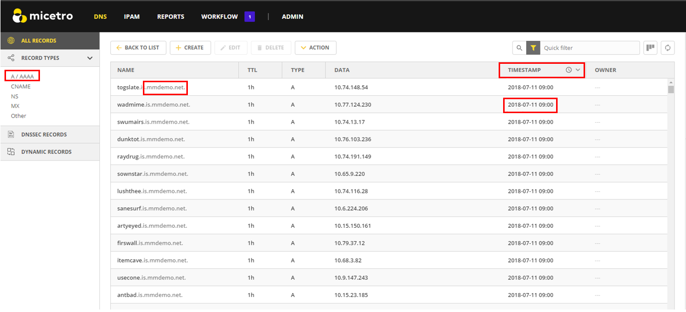

.. meta::
   :description: How Micetro counts the IP Addresses. Calculating IP Usage + Cleanup Tips
   :keywords: IPAM, IP address, Micetro, IP usage

.. _ip-count:

Calculating IP Usage
----------------------

As you connect to the services and enable discovery, Micetro reads incoming data to calculate IP address usage. It then compares the usage with the keys provided at the time of purchase to display the number of IP addresses in use, based on the encoded information in the keys.  If you are unsure about your IP count, the number can be negotiated with the sales team (best effort).

.. note::
  M&M does not lock the system in any way if the license count is exceeded. Sustaining services is our top priority.

.. image:: ../../images/license-management-ip-usage.png
   :width: 75%

How Micetro Calculates IP Address Usage
^^^^^^^^^^^^^^^^^^^^^^^^^^^^^^^^^^^^^^^

Micetro considers an IP address to be “in use” when:

#.	There is a DNS record assigned to the IP address (data from the DNS server).

#.	There is an active lease in a DHCP pool. This will cause usage to fluctuate in the license count.

#.	There is a DHCP reservation configured for the IP address.

#.	A custom property is configured for the IP address and it is populated.

#.	The IP address has been explicitly claimed using the “Claim IP” feature.

#.	Discovery is enabled and there is an active client on the IP address. This feature is configurable by the number of days.

.. note::
   Micetro will only count dual-stacked clients as one IP (IPV4/IPV6).

In the **System Settings**, there is a section called **Determine address usage**. 

.. image:: ../../images/system-settings-address-usage.png
   :width: 75%

By deault, all address usage settings are selected upon installation.

Micetro allows Administrators to toggle the license count configuration on and off to get a more granular picture of where the usage is coming from, which will then allow them to focus on clean-up.

Common Reasons for Excessive IP Usage:
^^^^^^^^^^^^^^^^^^^^^^^^^^^^^^^^^^^^^^^

*	Stale DNS records (static or missed by AD scavenging).
*	Old automation tools that were using the Custom Properties on the IPs, but were not cleaned up.
*	Old claims that were not cleaned up.
*	DHCP reservations that are not in use.
*	DHCP lease times need to be adjusted.

Seeing IP Usage in Micetro
^^^^^^^^^^^^^^^^^^^^^^^^^^^
Micetro provides a comprehensive view of your network, allowing you to quickly assess its status and understand what is happening in real-time. As you use Micetro, you will naturally become more knowledgeable about the environment and start to recognize patterns of usage, as well as identifying issues in configurations.

Network Utilization
"""""""""""""""""""
Network Utilization is shown in the IPAM (IP address management) module. For more information about utilization history, see :ref:`console-ipam-utilization-history`.

   

.. tip::
   You can switch the view to “flat view”, and then click the **Utilization** header to sort by most highly utilized networks. 
   
.. tip::
   You can use a quick filter (uses reg-ex) to find all subnets above a certain capacity (utilization < 80). Additional filtering can be added for any of the ranges or scopes (type = Scope and (utilization > 0).

.. note::
   Micetro also gives you the total number of Ranges in the filter.

.. image:: ../../images/ipam-utilization-filter.png
   :width: 65%

Viewing and Reclaiming IPs at the IP Level
^^^^^^^^^^^^^^^^^^^^^^^^^^^^^^^^^^^^^^^^^^^

When you open a static Range or a DHCP scope, you can also see the DNS data on the IP. 

.. tip::
   If you know a DHCP scope or network is not in use, you can safely select all and delete all of the DNS data out of it by selecting :guilabel:`Clear IP address`.

.. note::
   Deleting a range does not delete the DNS data out of the zone. If a new range is created and the DNS data is still in the zone, it will re-populate in the tool.
   

Cleaning up Stale DNS Records
^^^^^^^^^^^^^^^^^^^^^^^^^^^^^

It is not uncommon for AD records to be missed in Scavenging. Micetro gives you the ability to clean stale records up from within the DNS zone. A quick cleanup is to open the AD zone.

   
Then sort by **TIMESTAMP**. You can choose to delete records in bulk here (shift or ctrl, then select) based on the age of the record. This is a good indicator that the AD Scavenging should also be adjusted.

   
These are just a few ways that Micetro can be used to assist you in reclaiming IP space. Micetro is designed to help administrators gain a better understanding of their networks and users.

Other useful tools to assist are the Reporting tool (to run simple reports) and the API (if you have an internal Dev/ops team) to automate the cleanup processes once they are identified. 

We also offer Professional Services to assist for cleanup or automation projects https://www.menandmice.com/professional-services. 

