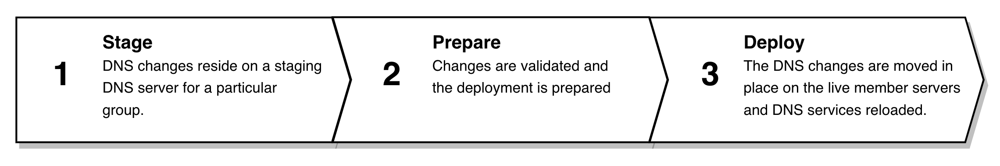
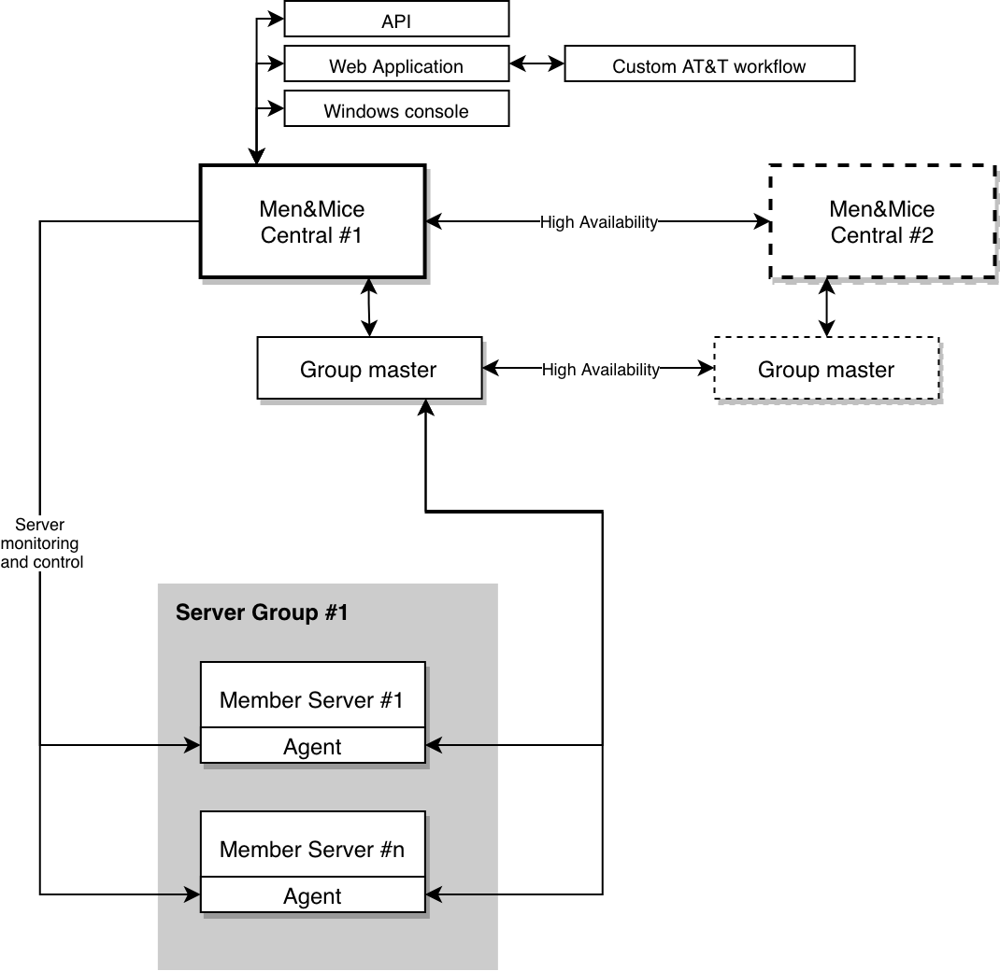

.. _server-groups:

Server Groups Guide
###################

.. toctree::
  :maxdepth: 2

  managing_server-groups
  managing_group_dns_zones
  managing_server_group_members
  server_groups_prepare
  server_groups_deploy
  manual_sync_server-group

Overview
********

The Server Groups feature in the Men&Mice Suite was designed to maintain the same set of data and configuration for each DNS server in a group. This allows to manage a group of DNS servers through a single point of abstraction, instead of individually. The Men&Mice Suite takes care of maintaining the data and synchronization between the servers.

When making DNS changes in the system a specific staging DNS server is acting the master server for the group. All DNS changes are staged, until they are allowed to deploy to the live servers. After deploying the DNS changes, the Member Servers are reloaded to ensure the changes are propagated throughout all servers in the group.

The Server Groups can be managed in the Web Application by navigating to the AT&T > Server Groups context. Here a list of all server groups, accessible to the user, is shown by default, along with various properties for the server group.

The following diagram shows the basic high-level steps that are taken when using the server groups feature:

Server group architecture
=========================

Use this overview to see the architecture of and relationships between elements within the Men&Mice Suite:

Concepts
========

Here is a list of terms and concepts used in the Men&Mice Suite:

Server Group
  a group of DNS servers which are all managed as if they were a single server.  DNS configuration and zone data are identical on all servers within the group.

    Possible states for Server Groups:

    * In-sync: a server group is in-sync if all of its members are in-sync
    * Out-of-sync: a server group is out-of-sync if some or all of its members are out-of-sync

Group Master Server
  the primary member of the group that hosts the following special DNS servers:

    Staging server
      the main pseudo DNS server that owns the staged changes.

    Live server
      a DNS server that hosts the live config that all Member Servers use.

    Member Server
      any DNS server within a Server Group that isn’t designated as the Group Master Server. Member Servers run a supported version of BIND and the Men&Mice DNS Server Controller. Related terms:

        Active config
          the BIND config that the DNS server is currently serving.

        In-sync
          a Member Server is in-sync if it’s active config is identical to the Group Master Server’s live config.

        Out-of-sync
          a Member Server is out-of-sync if it’s active config is not identical to the Group Master Server’s live config.

Prepare
  an operation where DNS data is read from a staging server, verified, and then pushed to all Member Servers in the group.

Deploy
  an operation where prepared DNS data is deployed to be the active BIND config of a member server and the BIND service is reloaded. The live server is also updated to represent the new state.
