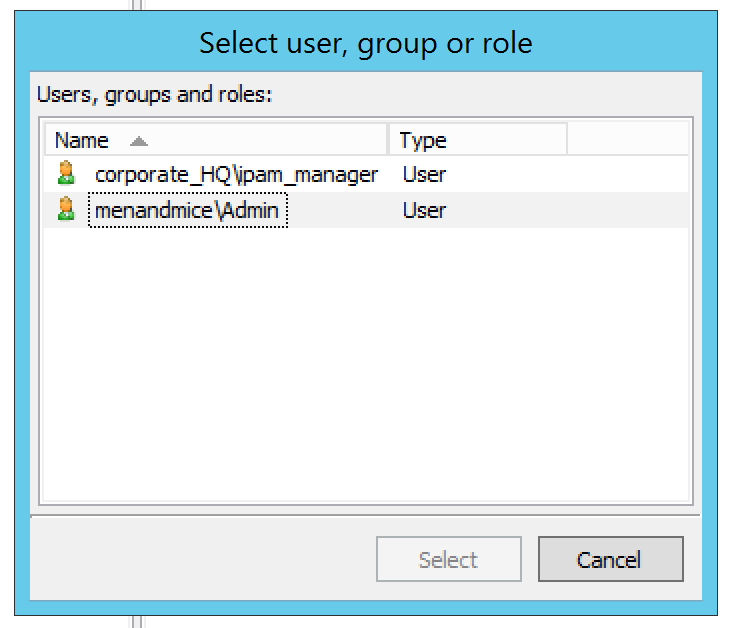

.. meta:: 
   :description: Access control to Micetro by Men&Mice for users, groups and roles
   :keywords: Micetro access model

.. _access-control:

Access control
==============

.. important::
  Micetro 10.1 (released in September 2021) brought changes to the access management in order to make it more streamlined and easier to use, while keeping the flexibility. This page describes the new access control. IF you're using an older version, or would like information on the legacy access control model, see :ref:`access-control-legacy`.

**[TO-DO: everything.]**

The Micetro access model is object-based. This is similar to mainstream operating system access models such as the Windows Security model, where you choose an object and set access restrictions for particular Users, Groups or Roles for the chosen object. We define a set of object types, and a set of Access Flags for each object type. These flags can then be set to Allow or Deny for each User, Group or Role.

The relationship between Groups, Users and Roles is as follows:

* Groups can contain Users

* Groups cannot contain Groups

* Users can be a member of any number of Groups

* Users and Groups can be assigned to Roles.

Built-in Roles
--------------

.. note::
  Please note that in previous versions (< 6.7) roles did not exist and the built-in roles described below were previously built-in groups. All of the users that were members in specific built-in groups are now assigned to the corresponding built-in roles.

Five Roles are built-in to Micetro. These roles are special in that they get full access for their respective domains for all Access Flags.

When new objects are created, the Built-in Role that presides over that object, as well as the user or group that created the object, receives full access to it.

Each administrator role also receives default access to its corresponding module (including an Access Flag set on Micetro object allowing them administrator privileges for their domain). The Administrators role receives default access to all the Access Flags on Micetro object. Default access for each Built-in role is as follows:

* Administrators. Full access to all objects

* DNS Administrators. Full access to DNS objects, including zones, DNS servers, etc.

* DHCP Administrators. Full access to DHCP objects, including scopes, DHCP servers, etc.

* IPAM Administrators. Full access to IPAM objects, including IPAM ranges, etc.

* User Administrators. Full access to User and Group objects.

It is recommended that our clients use these Roles. These roles are the only roles that can receive default access to new items. User-defined Roles do not receive any access information for new objects and are considered to have "denied" access. To allow a User or a Group to receive default full access to a new object, include the User or Group as a member in the corresponding Built-in Role. If you need to reduce this particular User's access, refer to :ref:`access-overrde` section below.

When it's mentioned that a User or Group has Full access to an object we mean that the User or Group has all known Access Flags for the object set to Allow.

The Administrator User
----------------------

A single user is Built-in to Micetro. The Administrator User exists completely outside of the access model. This User can do everything, and it is not possible to deny any action to this User.

Examples:

The Micetro object will have the following access bits set to Allow for the DNS Administrators Role:

.. csv-table::
  :header: "Access Flags", "Allow", "Deny"
  :widths: 20, 10, 10

  "Administer DNS servers", 1, 0
  "Access DNS Module", 1, 0

For every DNS server created, the server will have the following flags set to Allow for the DNS Administrators Role:

.. csv-table::
  :header: "Access Flags", "Allow", "Deny"
  :widths: 20, 10, 10

  "Edit DNS Server access", 1, 0
  "List (or view) DNS Server", 1, 0
  "Edit DNS Server options", 1, 0
  "Add Master Zones", 1, 0
  "Add non-Master Zones", 1, 0
  "View DNS Server Log", 1, 0
  "Clear DNS Server Log", 1, 0
  "Edit DNS server properties", 1, 0

For every DNS Zone created, the zone will have these flags set to Allow for the DNS Administrators Role:

.. csv-table::
  :header: "Access Flags", "Allow", "Deny"
  :widths: 20, 10, 10

  "Edit Zone access", 1, 0
  "List (or view) Zone", 1, 0
  "Enable/disable Zone", 1, 0
  "Edit Zone options", 1, 0
  "Delete Zone", 1, 0
  "Enable/disable apex records", 1, 0
  "Edit apex records", 1, 0
  "Enable/disable wildcard records", 1,	0
  "Edit wildcard records", 1, 0
  "Enable/disable other records", 1, 0
  "Edit other records", 1, 0
  "Edit zone properties", 1, 0

.. _access-override:

Overriding Access Settings
--------------------------

The Deny setting for an Access Flag allows you to override access settings inherited from Roles. A User's Access Footprint is calculated from the aggregate access settings of all Roles in which he is a member. In this calculation, the Deny flag overrides the Allow flag. This means that if a User is in several Roles where a specific Access Flag is set to Allow, and only a single Role where the same Access Flag is set to Deny, the result of the calculation for that Access Flag is Deny.

Let us take an example. Assume you want to add a new user that has DNS Administrator privileges to all servers and zones, but on a particular zone, this user should not be able to view or clear the history, nor should he be able to edit custom properties. To accomplish this, you would first include the new user in the Built-in Role named DNS Administrators.

To restrict the user for a particular zone you would locate the zone and set access for your new user to the following:

.. csv-table::
  :header: "Access Flags", "Allow", "Deny"
  :widths: 20, 10, 10

  "Edit Zone access", 1, 0
  "List (or view) Zone", 1, 0
  "Enable/disable Zone", 1, 0
  "Edit Zone options", 1, 0
  "Delete Zone", 1, 0
  "Enable/disable apex records", 1, 0
  "Edit apex records", 1, 0
  "Enable/disable wildcard records", 1,	0
  "Edit wildcard records", 1,	0
  "Enable/disable other records", 1, 0
  "Edit other records", 1, 0
  "Edit zone properties", 0, 1

If you wanted to give similar access to other users, you could instead create a new Role, add the Users to the Role, and apply the aforementioned access to the zone in question for the new Role.

This system allows for a great deal of flexibility when designing your security. Any Role can be extended or overridden for a set of Users by simply adding the Users to another Role with a different access setup, or by directly overriding certain Access Flags on the Users themselves.

If no access is defined for a User or Role on a particular object, the access model assumes that all the Flags are set to Deny.

New Objects
-----------

When a User creates a new object in Micetro, the object is afforded a certain default access based on the initial access settings for the object type. To define initial access settings for different object types, do the following:

1. From the menu bar, select :menuselection:`Tools --> Initial Access For`.

2. Select the object type for which you want to set the initial access. The Access Control dialog box displays.

3. Set the desired access for new objects and click :guilabel:`OK`.

Edit Access Flag
----------------

Each object type has an Access Flag named *Edit Access*. This flag is special in that it directs a User, Group's or Role's access to the object's access information. In other words, if a User has this flag set on an object, he may edit the Access Flags for the object. This means that the User could remove a different User or Group from the object completely. He could even remove the User that created the object. In light of this, the Edit Access flag should be treated with care.

Access for Built-in groups is impossible to change. However, it would be possible to shut out all Users in Micetro from a certain object by simply editing access for each User directly. You could even shut yourself out. The Administrator User will always have full access to every object, so if such situations arise, the Administrator User should be used to set things straight.

Access Flags Defined
--------------------

Each object type in Micetro has a set of Access Flags defined.

.. _global-access:

Global Access
^^^^^^^^^^^^^

This is an object referring to Micetro as a whole. It contains flags that define access to the different clients and modules available in Micetro, as well as Administration tasks.

.. csv-table::
  :header: "Object", "Description"
  :widths: 30, 70

  "Administer users/groups", "Access to create, edit, and delete users and groups"
  "Administer IP Address Ranges", "Access to admin IPAM ranges"
  "Administer DNS servers", "Access to create, edit, and delete DNS servers"
  "Administer DHCP servers", "Access to create, edit, and delete DHCP servers"
  "Access IPAM Module", "Access to the IPAM Module"
  "Access DNS Module", "Access to the DNS Module"
  "Access DHCP Module", "Access to the DHCP Module"
  "Access Management Console", "Access to the Management Console"
  "Access CLI", "Access to the CLI"
  "Access to Web Interface", "Access to the Men&Mice Web Interface"
  "Access to basic zone view in Web Interface", "Access to the basic zone view in the Men&Mice Web Interface"
  "Access to advanced zone view in Web Interface", "Access to the advanced zone view in the Men&Mice Web Interface"
  "Access to IPAM view in Web Interface", "Access to the IPAM view in the Men&Mice Web Interface"
  "Access to report view in Web interface", "Access to the report view in the Men&Mice Web Interface"
  "Access to task list view in Web interface", "Access to the task list view in the Men&Mice Web Interface"
  "Access to view history", "Access to history window in the Management Console. Also provides access to the history for all objects."
  "Access to Host editor", "Access to the host editor view in the Men&Mice Web interface"
  "Access to manage AD Sites and Site Links", "Access to work with AD Sites and Site Links."
  "Access to manage clouds", "Access to add/remove cloud providers into Men&Mice"
  "Access Workflow module", "If customer has workflow license, grants user access to submit DNS record requests, and approvers to view and approve submitted requests"
  "Access to advanced reporting", "If customer has reporting license, grants access to advanced reporting features"
  "Access to 'Import Data' web task", "Access the Import Data task in Web Interface as well as to Import data into the newer Men&Mice Web Application"

DNS Zone
^^^^^^^^

.. csv-table::
  :header: "Object", "Description"
  :widths: 25, 75

  "Edit Zone access", "Access to edit an object's access"
  "List (or view) Zone", "Access to list (view) a zone"
  "View zone history", "Access to viewing the history for the zone"
  "Enable/disable Zone", "Access to enable/disable the zone"
  "Edit Zone options", "Access to edit zone options"
  "Delete Zone", "Access to delete zone"
  "Enable/disable apex records", "Access to enable/disable zone's APEX records"
  "Edit apex records", "Access to edit zone's APEX records"
  "Enable/disable wildcard records", "Access to enable/disable zone's wildcard records"
  "Edit wildcard records", "Access to edit zone's wildcard records"
  "Enable/disable other records", "Access to enable/disable zone records other than APEX"
  "Edit other records", "Access to edit zone records other than APEX records"
  "Edit zone properties", "Access to edit properties for the zone"

DHCP Scopes and IP Address Ranges
^^^^^^^^^^^^^^^^^^^^^^^^^^^^^^^^^

.. csv-table::
  :header: "Object", "Description"
  :widths: 25, 75

  "Edit range Access", "Access to edit an object's access"
  "List (or view) a range", "Access to list (view) a range/scope"
  "View range history", "Access to viewing the history for the range/scope"
  "Delete range", "Access to delete a range/scope"
  "Edit range properties", "Access to edit range/scope properties"
  "Edit IP Address properties", "Access to edit the properties for an IP Address in the range/scope"
  "Use IP Address in DNS", "Access to create a DNS entry for the selected IP Address"
  "Create a subrange", "Access to create a new subrange of the range/scope"
  "Create multiple hosts per IP Address", "Access to create multiple address records with the same IP Address"
  "Ping IP Address", "Access to perform a ping request for hosts in the range/scope"
  "Edit AD site association", "Allows editing of associations for AD sites"
  "Enable/disable scope", "Access to enable/disable scope"
  "Read scope options", "Access to read scope options"
  "Read/write Scope options", "Access to read and write scope options"
  "Edit Reservations", Access to edit reservations"
  "Edit address pools", "Access to edit address pools"
  "Edit exclusions", "Access to edit exclusions"
  "Release Leases", "Access to release leases"
  "Add a group", "Access to add a DHCP group (ISC DHCP only)"

DNS Server
^^^^^^^^^^

.. csv-table::
  :header: "Object", "Description"
  :widths: 25, 75

  "Edit DNS Server access", "Access to edit an object's access"
  "List (or view) DNS Server", "Access to list (or view) server"
  "View DNS server history", "Access to viewing the history for the DNS server"
  "Edit DNS Server options", "Access to server options"
  "Add Master Zones", "Access to add a master zone"
  "Add non-Master Zones", "Access to add a non-master zone"
  "View DNS Server Log", "Access to view the server log"
  "Clear DNS Server Log", "Access to clear the server log"
  "Edit DNS server properties", "Access to edit properties for the DNS Server"

DHCP Server
^^^^^^^^^^^

.. csv-table::
  :header: "Object", "Description"
  :widths: 25, 75

  "Edit DHCP Server Access", "Access to edit an object's access"
  "List (or view) DHCP Server", "Access to list (or view) server"
  "View DHCP server history", "Access to viewing the history for the DHCP server"
  "Read DHCP Server options", "Access to view server options"
  "Read/write DHCP Server options", "Access to read and write server options"
  "Add a scope", "Access to add a DHCP scope"
  "Edit DHCP server properties", "Access to edit properties for the DHCP Server"
  "Edit reservations", "Access to edit reservations in DHCP scopes"
  "Add a group", "Access to add DHCP groups (ISC DHCP only)"
  "Read DHCP class data", "Access to view DHCP class data on an (ISC DHCP only)"
  "Read/write DHCP class data", "Access to read and write DHCP class data (ISC DHCP only)"

DHCP Groups
^^^^^^^^^^^

.. csv-table::
  :header: "Object", "Description"
  :widths: 25, 75

  "Edit DHCP group", "Access to edit an object's access"
  "List (or view) DHCP group", "Access to list (or view) DHCP group"
  "View DHCP group history", "Access to viewing the history for the DHCP group"
  "Edit Reservations", "Access to edit reservations"
  "Read DHCP group options", "Access to view group options"
  "Read/write DHCP group options", "Access to read and write group options"
  "Delete DHCP group", "Access to delete a DHCP group"

Address Spaces
^^^^^^^^^^^^^^

.. csv-table::
  :header: "Object", "Description"
  :widths: 25, 75

  "Edit address space access", "Access to edit an object's access"
  "List (or view) address space", "Access to list (or view) address space"
  "View address space history", "Access to viewing the history for the address space"

Access Control Dialog Box
-------------------------

Through the Access Control module, you select groups/users for which you want to manage permissions.

The Access Control dialog box is used to define access to individual objects in the system. To define access for an object, right-click the object and choose :guilabel:`Access` from the popup menu.

To define access for individual components of Micetro, select :menuselection:`Tools --> Global Access`. The Access Control for Micetro dialog box displays. The default groups/user names are shown. The permissions for any selected group/user are also shown.

Edit access controls
^^^^^^^^^^^^^^^^^^^^

1. While viewing the Access Control dialog box, click the Add button. The Select user, group or role dialog box displays.

2. Highlight the user, group and/or role for which you want to assign permissions.

3. Click the :guilabel:`Select` button.

4. When you return to the main dialog box, the user/group is highlighted in the list of users and groups.

.. image:: ../../images/admin-access-controls-console.png
  :width: 70%
  :align: center

5. To specify the permissions for this selected group/user/role, do the following:

  * Move to the Permission for [group/user/role selected] list.

  * Click in the checkbox for each permission you want to Allow or Deny.

  .. note::
    It is not necessary to select Deny unless you want to ensure that a user/group/role does not have permission to a specific object. However, if you do not specify the permission for an individual user, but the group(s) or role(s) to which the user belong does Allow access to that object, the user (by default) also has access.

6. When all selections are made, click :guilabel:`OK`. The dialog box closes.

7. Repeat the above for any additional groups/users.

Initial Access For
------------------

Through this function, you specify access privileges that should be set for objects when they are created. This function is identical to the Access Model and Permissions function except that a new user type – "Creator" (Meta user) - is used to specify the access privileges that should be set for the object creator.

.. note::
  The access control dialog box for IP Address Ranges and Scopes contains a checkbox, 'IP Address Ranges/Scopes inherit access by default'. If this checkbox is checked, a new range or scope will inherit all access bits from its parent. For more information on inherited access, refer to  IP Address Management—Range Access.

From the menu bar, select :menuselection:`Tools --> Initial Access For`, and then the object type for which you want to set the initial access. The Access Control dialog box displays. Refer to :ref:`global-access` for details on working with this dialog box.

.. toctree::
  :maxdepth: 1

  acl_access_flags
  acl_general_roles
  acl_specific_roles
  acl_legacy_roles
  acl_effective_access
  acl_groups
  acl_users

----

Access flags 
------------

:: 

  {
    Suite: {
      access_adminUser: 'Administer users/groups',
      access_adminIPAM: 'Administer IP address ranges',
      access_adminDNS: 'Administer DNS servers',
      access_adminDHCP: 'Administer DHCP servers',
      access_adminAppliance: 'Administer appliances',
      access_adminDevice: 'Administer devices',
      access_IPAMModule: 'Access IPAM module',
      access_DNSModule: 'Access DNS module',
      access_DHCPModule: 'Access DHCP module',
      access_console: 'Access to the Management Console',
      access_commandLine: 'Access to the CLI',
      access_web: 'Access to the web interface',
      access_basicZoneView: 'Access to basic zone view in web interface',
      access_advancedZoneView: 'Access to advanced zone view in web interface',
      access_IPAMView: 'Access to IPAM view in web interface',
      access_basicReporting: 'Access to basic reporting',
      access_tasksView: 'Access to task list view in web interface',
      access_viewHistory: 'Access to view history',
      access_webHostEditor: 'Access to Host editor',
      access_adminADSites: 'Access to manage AD Sites and Site Links',
      access_adminClouds: 'Access to manage clouds',
      access_workflowModule: 'Access Workflow module',
      access_advancedReporting: 'Access to advanced reporting',
      access_importDataCustom: 'Access to "Import Data" web task.',
    },
    DNSServer: {
      access_editAccess: 'Edit DNS server access',
      access_list: 'List (or view) DNS server',
      access_viewHistory: 'View DNS server history',
      access_options: 'Edit DNS server options',
      access_addMaster: 'Add master zones',
      access_addNonMaster: 'Add non-master zones',
      access_viewLog: 'View DNS server log',
      access_clearLog: 'Clear DNS server log',
      access_editProperties: 'Edit DNS server properties',
      access_manageLocalZones: 'Manage local zones',
    },
    DHCPServer: {
      access_editAccess: 'Edit DHCP server access',
      access_list: 'List (or view) DHCP server',
      access_viewHistory: 'View DHCP server history',
      access_readOptions: 'Read DHCP server options',
      access_options: 'Read/write DHCP server options',
      access_addScope: 'Add a scope',
      access_editProperties: 'Edit DHCP server properties',
      access_reservations: 'Edit reservations',
      access_addGroup: 'Add a group',
      access_readClassData: 'Read DHCP class data',
      access_classData: 'Read/write DHCP class data',
    },
    DNSZone: {
      access_editAccess: 'Edit zone access',
      access_list: 'List (or view) zone',
      access_viewHistory: 'View zone history',
      access_enable: 'Enable/disable zone',
      access_options: 'Edit zone options',
      access_delete: 'Delete zone',
      access_enableApex: 'Enable/disable apex records',
      access_editApex: 'Edit apex records',
      access_enableWildcard: 'Enable/disable wildcard records',
      access_editWildcard: 'Edit wildcard records',
      access_enableOther: 'Enable/disable other records',
      access_editOther: 'Edit other records',
      access_editProperties: 'Edit zone properties',
    },
    Range: {
      access_editAccess: 'Edit range access',
      access_list: 'List (or view) range',
      access_viewHistory: 'View range history',
      access_delete: 'Delete range',
      access_editProperties: 'Edit range properties',
      access_editDeviceProperties: 'Edit IP Address properties',
      access_editDNSHosts: 'Use IP addresses in DNS',
      access_createSubrange: 'Create subrange',
      access_reuseAddress: 'Create multiple hosts per IP address',
      access_pingAddresses: 'Ping IP addresses',
      access_siteAssociation: 'Edit AD site association',
      access_enable: 'Enable/disable scope',
      access_readOptions: 'Read scope options',
      access_options: 'Read/write scope options',
      access_reservations: 'Edit reservations',
      access_addressPools: 'Edit address pools',
      access_exclusions: 'Edit exclusions',
      access_releaseLeases: 'Release leases',
      access_addGroup: 'Add a group',
    },
    DHCPGroup: {
      access_editAccess: 'Edit DHCP group access',
      access_list: 'List (or view) DHCP group',
      access_viewHistory: 'View DHCP group history',
      access_reservations: 'Edit reservations',
      access_readOptions: 'Read DHCP group options',
      access_options: 'Read/write DHCP group options',
      access_delete: 'Delete DHCP group',
    },
    CloudNetwork: {
      access_editAccess: 'Edit cloud network access',
      access_list: 'List (or view) cloud network',
      access_viewHistory: 'View cloud network history',
      access_editProperties: 'Edit cloud network properties',
      access_delete: 'Delete cloud network',
    },
    CloudService: {
      access_editAccess: 'Edit cloud access',
      access_list: 'List (or view) cloud',
      access_viewHistory: 'View cloud history',
      access_editProperties: 'Edit cloud properties',
      access_createCloudNetwork: 'Create cloud network',
    },
    AddressSpace: {
      access_editAccess: 'Edit address space access',
      access_list: 'List (or view) address space',
      access_viewHistory: 'View address space history',
    },
    ServerGroup: {
      access_editAccess: 'Edit server group access',
      access_list: 'List (or view) server group',
      access_viewHistory: 'View server group history',
    },
  };