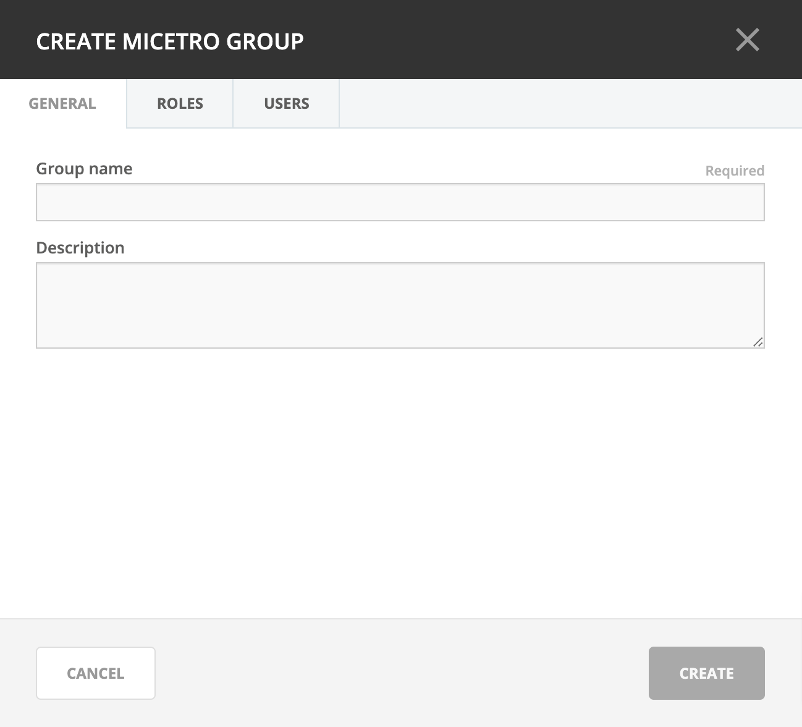

.. meta:: 
   :description: Access control for groups in Micetro by Men&Mice 10.1
   :keywords: Micetro access model

.. _acl-groups:

Groups
------

Groups allow you to manage multiple individual users, based on needs for the same access across the system.

Adding a New Group
^^^^^^^^^^^^^^^^^^

1. Navigate to :menuselection:`Admin --> Configuration` and select :guilabel:`Groups` in the filtering sidebar. The default groups are displayed here, as well as any other groups you have already created.

2. Click the :guilabel:`Add` button and select whether to add an external (authenticated and managed through an external source such as Active Directory or LDAP) or create a local group (authenticated and managed through Micetro only). 

For **local group** the following dialog box displays:

  Group name
    The name for the group you are creating.

  Description field
    (Optional) Some information that describes the function of this group.

  AD Integrated
    Check this box to define this group as an Active Directory Integrated group. When checked this group name will be matched against groups defined in Active Directory. For more information how on this works refer to External Authentication.

  Roles
    Any roles that members of this group will automatically assume.

  Users
    Any users that you want to add to this group. (Users can be added/removed at any time.)
   

3. When all selections/entries are made, click :guilabel:`Save`.

.. note::
   For **external groups**, the group name field must match the name in the external authentication. See :ref:`external-auth`.

   External groups do not have a *Users* tab, and users cannot be added or removed through Micetro.

Editing a Group
^^^^^^^^^^^^^^^

Through this function, you can edit the group name and/or description, and indicate whether this group is Active Directory integrated.

1. Navigate to :menuselection:`Admin --> Configuration` and select :guilabel:`Groups` in the filtering sidebar.

2. To select a single group, click on the group's name. To select multiple groups, press/hold the Ctrl (Cmd on Mac) key and then click on each group's name.

3. From the ellipsis menu, select :guilabel:`Edit group properties` or use :menuselection:`Actions --> Edit group properties`.

4. Make the desired changes to the group's information. In the :guilabel:`Users` tab you can remove users from the group.

5. Click :guilabel:`Save` to save the changes.

Deleting a Group
^^^^^^^^^^^^^^^^

Through this function, you delete a group.

1. Navigate to :menuselection:`Admin --> Configuration` and select :guilabel:`Groups` in the filtering sidebar.

2. To remove a single group, click on the group's name. To remove multiple groups, press/hold the Ctrl (Cmd on Mac) key and then click on each group's name.

3. From the ellipsis menu, select :guilabel:`Remove user` or use :menuselection:`Actions --> Remove user`.

4. To remove the group, click the :guilabel:`Yes` button. The group is removed.
