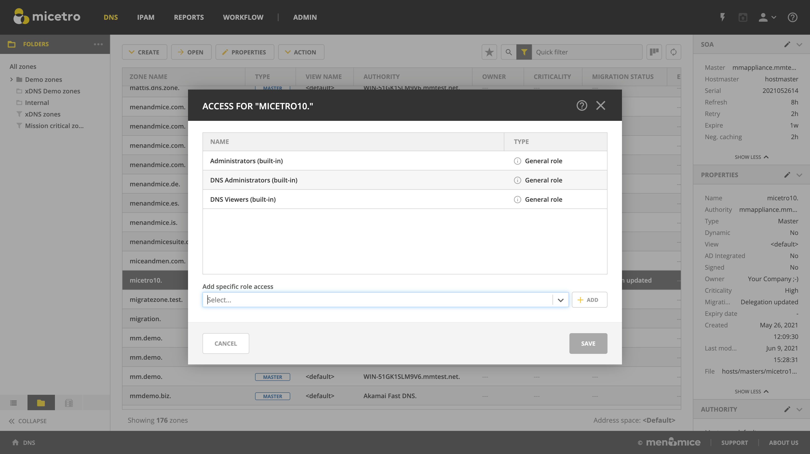
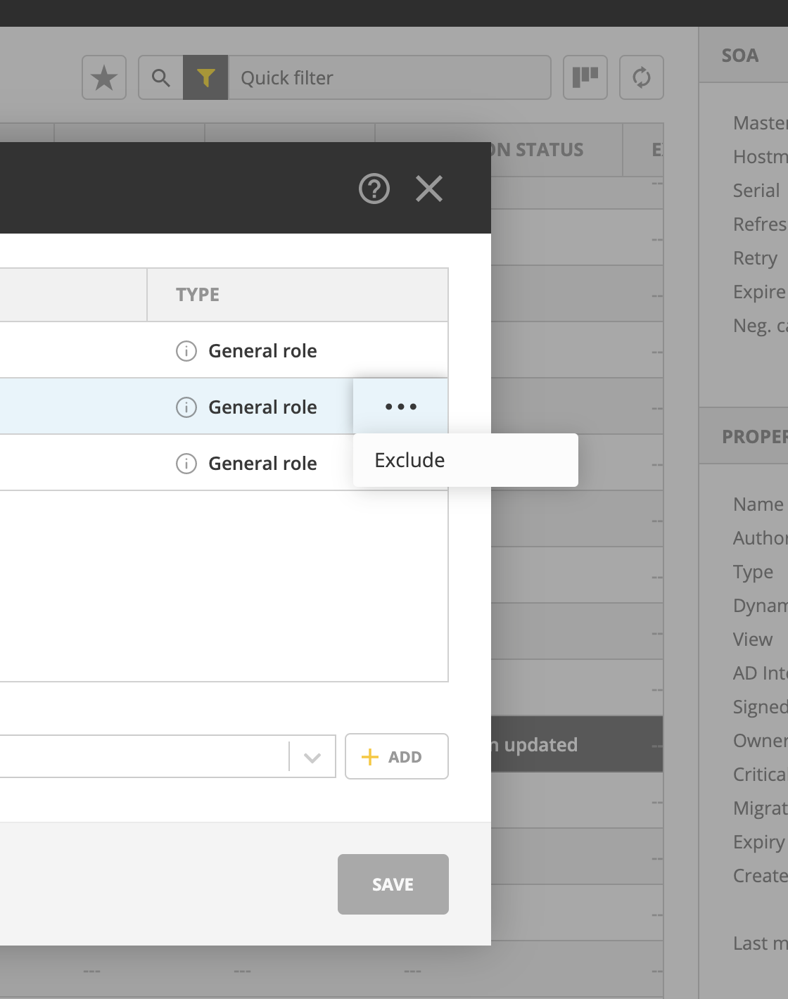
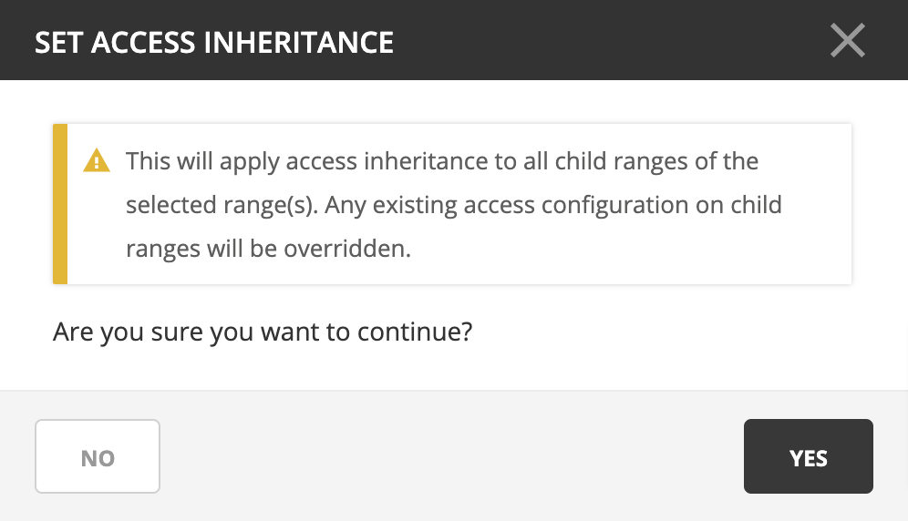
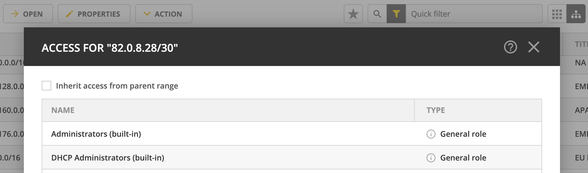

.. meta::
   :description: Access control on objects in Micetro by Men&Mice
   :keywords: Micetro access model

.. _acl-object-access:

Object access
-------------

Single objects in the DNS, IPAM, and Admin contexts can be selected to examine and adjust access with the :guilabel:`Action --> Access` task from the top bar or the ellipsis menu.

Here you can add :ref:`acl-specific-roles` to the object using the dropdown menu.

.. note::
  Only specific roles that have the necessary access enabled are shown in the list.

Exclude roles from object access
^^^^^^^^^^^^^^^^^^^^^^^^^^^^^^^^

If needed, :ref:`acl-general-roles` can be excluded from access to the single object.

The excluded role will still be shown in the list, but greyed out and struck through.

.. information::
  Specific roles cannot be excluded, as they're set on single objects. The 'exclude role' function is available to manage (restrict) object access on a case-by-case basis for general roles.

Access inheritance
^^^^^^^^^^^^^^^^^^

.. note::
  Access inheritance is enabled for all applicable IPAM objects by default. You can change this in :ref:`admin-system-settings` in the Management Console.

For containers, scopes, and ranges in the IPAM context, users with IPAM administration permissions can configure access inheritance. Access for objects set to inherit access from their parent cannot be edited. Editing access on the parent object will be applied to all child objects.

If disabled, it can be enabled by using the :guilabel:`Action --> Set access inheritance` action from the top bar or ellipsis menu. This will enable access inheritance to all *existing and new* child objects.

Using the :guilabel:`Action --> Access` action from the top bar or ellipsis menu allows you to disable or enable access inheritance by checking the **Inherit access from parent range** checkbox.

.. important::
  Existing access settings are **not** modified by *disabling* inheritance, but **it is overwritten** when *enabling* it.

.. note::
  Access inheritance honors *all* roles added to the parent object, including legacy and specific roles. Adding a specific role to a parent object will apply the change to all child objects that have access inheritance enabled.
