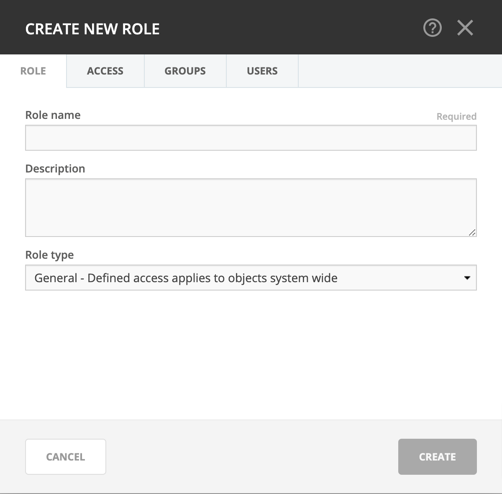
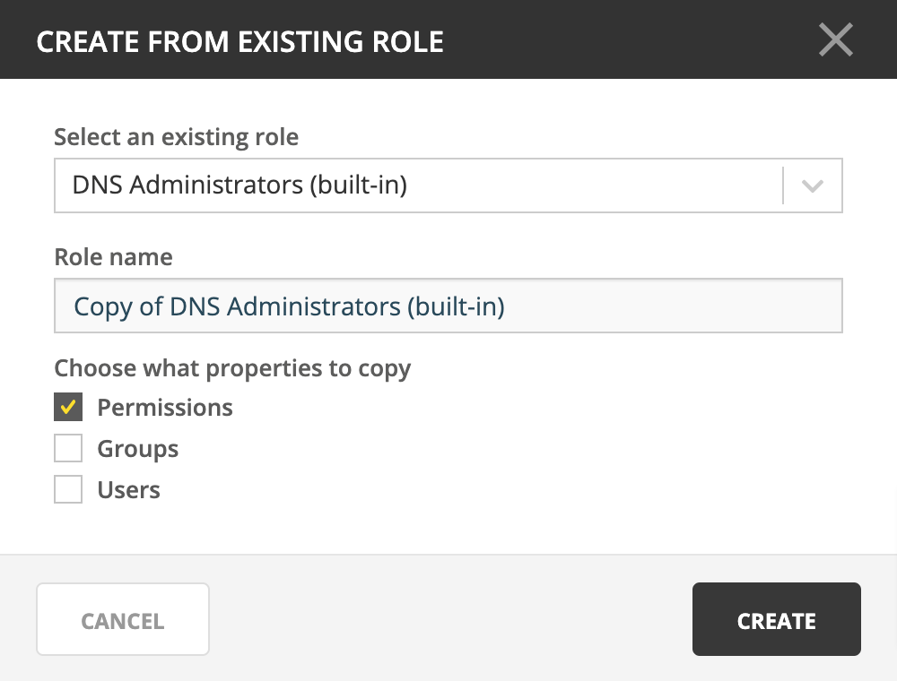

.. meta::
   :description: Roles in Micetro by Men&Mice 10.1
   :keywords: Micetro access model

.. _acl-roles:

Roles
-----

Through roles you can manage access control in Micetro.

Objects (servers, zones, scopes, IP addresses, etc.) in Micetro are accessed through :ref:`acl-roles` configured with :ref:`acl-permissions`. :ref:`acl-users` and :ref:`acl-groups` do not have direct access to objects, only if they're **assigned to roles**. Administrators can control a user or group's access by assigning or removing them from roles.

.. note::
    This page is for generic management of roles. See :ref:`acl-general-roles`, :ref:`acl-specific-roles`, and :ref:`acl-legacy-roles` for the particularities of the different role types.

.. _new-role:

Adding a new role
^^^^^^^^^^^^^^^^^

Through this function, you add new roles to Micetro.

1. Navigate to :menuselection:`Admin --> Configuration` and select :guilabel:`Roles` in the filtering sidebar. The built-in roles are displayed here, as well as all other roles that have been added to Micetro already.

2. Click the :guilabel:`Create` button. The *Create role* dialog box displays.

Role name
  Give the new role a name.

Description
  Brief description for the role.

    .. tip::
        Using clear and descriptive names and descriptions makes access management easier.

3. Switch over to the :guilabel:`Access` tab and set the permissions. (See :ref:`acl-permissions`.)

4. When all necessary information and permissions are configured, click :guilabel:`Save`.

.. note::
    The default for new roles is :ref:`general-roles`.

.. tip::
  See :ref:`new-role-example` for an example process for creating a role anew.

Editing a role
^^^^^^^^^^^^^^

Through this function, you can edit the role's name, description, permissions, and attached users/groups.

1. Navigate to :menuselection:`Admin --> Configuration` and select :guilabel:`Roles` in the filtering sidebar.

2. To select a single role, click on the role's name. To select multiple roles, press/hold the Ctrl (Cmd on Mac) key and then click on each role's name.

3. From the ellipsis menu, select :guilabel:`Edit role properties` or use :menuselection:`Actions --> Edit role properties`.

4. Make the desired changes to the role's information. In the :guilabel:`Users` and :guilabel:`Groups` tabs you can remove users/groups from the role.

5. Click :guilabel:`Save` to save the changes.

Deleting a role
^^^^^^^^^^^^^^^

Through this function, you remove a role from Micetro.

.. note::
  Built-in roles cannot be removed.

1. Navigate to :menuselection:`Admin --> Configuration` and select :guilabel:`Roles` in the filtering sidebar.

2. To remove a single role, click on the role's name. To remove multiple roles, press/hold the Ctrl (Cmd on Mac) key and then click on each role's name.

3. From the ellipsis menu, select :guilabel:`Remove role` or use :menuselection:`Actions --> Remove role`.

4. To remove the role, click the :guilabel:`Yes` button. The role is removed.

.. _duplicate-role:

Duplicating a role
^^^^^^^^^^^^^^^^^^

It is possible to duplicate roles and copy the original's configured permissions, users, and groups to a new role.

1. Navigate to :menuselection:`Admin --> Configuration --> Roles` in the web application.

2. Use the :guilabel:`+ Create --> From existing role` action from the top bar.

3. Select the role to duplicate, and name the new role.

4. Select which settings (permissions, groups, roles) to copy.

5. Click :ref:`Create`.

.. note::
    Roles created from existing ones are always :ref:`general-roles`.

.. tip::
  See :ref:`duplicate-role-example` for an example process for creating a role from an existing template.

.. toctree::
    :maxdepth: 1

    acl_general_roles
    acl_specific_roles
    acl_legacy_roles
