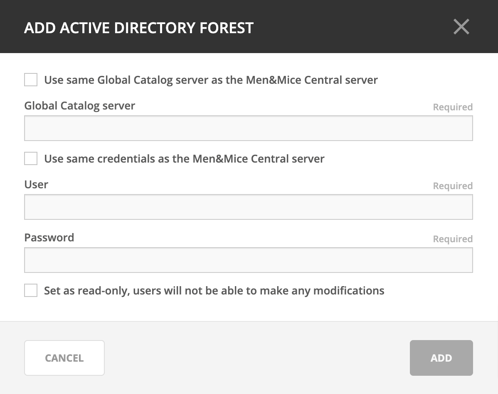
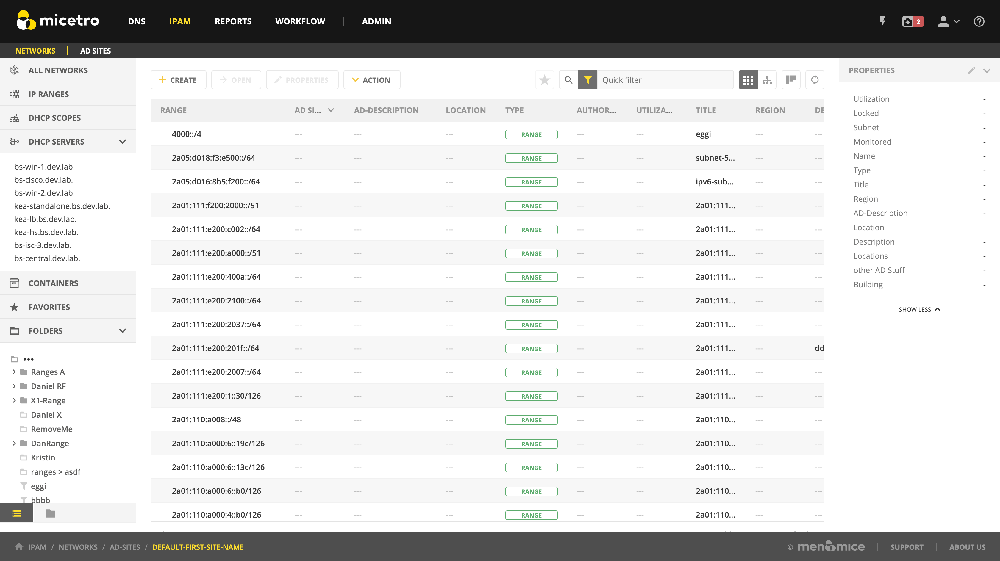

.. meta::
   :description: Integrating Active Directory (AD) sites in Micetro, view subnets within these sites and add, remove and move subnets between the sites.
   :keywords: Micetro Active Directory, Micetro, Micetro subnets

.. _active-directory:

AD Sites and Subnets
====================

Overview
--------

Micetro allows administrators to integrate Active Directory (AD) sites into the IPAM context, view subnets within these sites and add, remove, and move subnets between the sites.

.. note::
  AD sites and subnets integration is only available when Men&Mice Central is running on a Windows server, and it is enabled by default. See :ref:`admin-general`.

  AD sites are only assigned to and visible in the ``Default`` address space.

  To add/remove a subnet to/from a site, the user must have the *Can edit range properties* flag set for the subnet. **[TO-DO: update this when rewriting the access control page.]**

AD sites and subnets are displayed in the :guilabel:`IPAM` context:

* subnets in the main :menuselection:`IPAM --> Networks` grid, along with all other subnets in Micetro (if any). The *AD Site* column displays the site the subnet belongs to.

* sites in a separate :menuselection:`IPAM --> AD sites` grid, grouped by Forests. The Inspector box on the right displays the subnets (if any) belonging to the selected AD site.

AD Forests
----------

To manage sites and subnets, Micetro needs to be configured with AD Forest(s).

.. note::
  You can manage sites and subnets from multiple forests.

Adding an AD Forest
^^^^^^^^^^^^^^^^^^^

1. In the web application, navigate to :menuselection:`IPAM --> AD sites`.

2. Use the :guilabel:`Add Forest` action from the top bar. A dialog box displays.

Use same Global Catalog as the Men&Mice Central server
  If checked, Micetro will use the same Global Catalog server as the Men&Mice Central server is using. If you unselect this checkbox, you must specify the Global Catalog server's FQDN or IP address in the **Global Catalog Server** field.

Global Catalog Server
  If you want to specify a Global Catalog server, enter the server's FQDN or IP address in this field. (To unlock this field, the :guilabel:`Use same Global Catalog as the Men&Mice Central server` checkbox needs to be unchecked.)

Use the same credentials as the Men&Mice Central server
  If checked, Micetro uses the same credentials as the Men&Mice Central server when accessing the site information.

User and Password
  If you don't want to use the default credentials for the machine running Men&Mice Central, enter the desired user name and password in these fields. (To unlock these fields, the :guilabel:`Use the same credentials as the Men&Mice Central server` checkbox needs to be unchecked.)

Set as read only
  If checked, users will be able to display data from Active Directory, but unable to make any modifications.

3. Click :guilabel:`OK` to save the changes. The forest is added and the sites belonging to the forest are displayed.

Edit AD Forest
^^^^^^^^^^^^^^

To edit an existing AD Forest (to, for example, change the read-only status):

1. In the web application, navigate to :menuselection:`IPAM --> AD sites`.

2. Use the :guilabel:`Edit AD Forest` action from the top bar or the ellipsis menu.

3. Update the settings in the dialog box.

4. Click :guilabel:`OK` to save your changes.

Removing an AD Forest
^^^^^^^^^^^^^^^^^^^^^

To remove an AD Forest from Micetro:

1. In the web application, navigate to :menuselection:`IPAM --> AD sites`.

2. Select the AD Forest(s) you want to remove.

2. Use the :guilabel:`Remove AD Forest` action from the top bar or the ellipsis menu.

3. Click :guilabel:`OK` in the confirmation box to remove the Forest(s).

Reloading the Sites in an AD Forest
^^^^^^^^^^^^^^^^^^^^^^^^^^^^^^^^^^^

Data from AD Forests is synchronized by Men&Mice Central regularly. To manually synchronize forests and reload the data for sites and subnets:

1. In the web application, navigate to :menuselection:`IPAM --> AD sites`.

2. Select the AD Forest(s) you want to synchronize.

3. Use the :guilabel:`Synchronize` action from the top bar.

3. Click :guilabel:`OK` in the confirmation box to synchronize the Forests.

AD Subnets
----------

View subnets in a site
^^^^^^^^^^^^^^^^^^^^^^

To view subnets within a specific site:

1. In the web application, navigate to :menuselection:`IPAM --> AD sites`.

2. Select the AD Forest the site is in, or use the :ref:`webapp-quick-filter` to find it by name.

3. Use the :guilabel:`View networks` action with the site selected from the top bar or the ellipsis menu.

This will open the :menuselection:`IPAM --> Networks` context with a filter applied to show all subnets that belong to the site.

.. note::
  You can also use the :guilabel:`-> View` button in the Inspector of the selected AD site to open the subnet view.

Moving subnets between AD sites
^^^^^^^^^^^^^^^^^^^^^^^^^^^^^^^

To add subnet(s) to a site, or move between sites:

1. Select the subnet(s) in the :menuselection:`IPAM --> Networks` grid.

2. Use the :guilabel:`Set AD Site` action from the top bar or the ellipsis menu.

3. Set the (new) AD Site in the dropdown and click :guilabel:`Save`.

.. note::
  Child subnets cannot be moved to a different site than the parent subnet unless the ``Enforce site inheritance`` checkbox is unchecked in the System Settings dialog box.

  Subnets whose AD site settings are inherited from a parent range will have a ``<AD Site Name> (inherited)`` notation added.

  See :ref:`admin-general`.

Remove subnet from AD site
^^^^^^^^^^^^^^^^^^^^^^^^^^

1. Select the subnet(s) in the :menuselection:`IPAM --> Networks` grid.

2. Use the :guilabel:`Remove from AD Site` action from the top bar or the ellipsis menu.

3. Click :guilabel:`Yes` to confirm the removal.

Subnets outside of sites
^^^^^^^^^^^^^^^^^^^^^^^^

To view subnets that don't belong to any AD site:

1. In the web application, navigate to :menuselection:`IPAM --> AD sites`.

2. Click on the ``Flat view`` button (see :ref:`webapp-quick-filter`) next to the Quick Filter to change the view.

3. Sort the IP address ranges by the **AD Site** column in *ascending* order:

