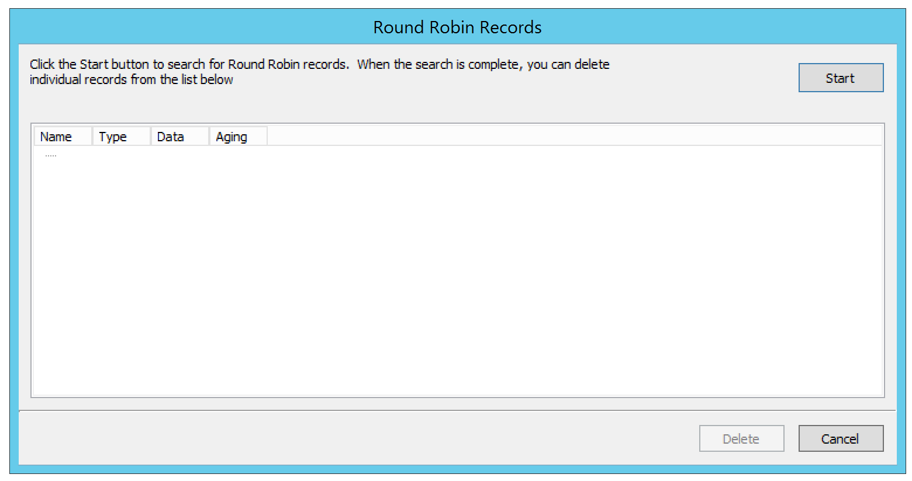
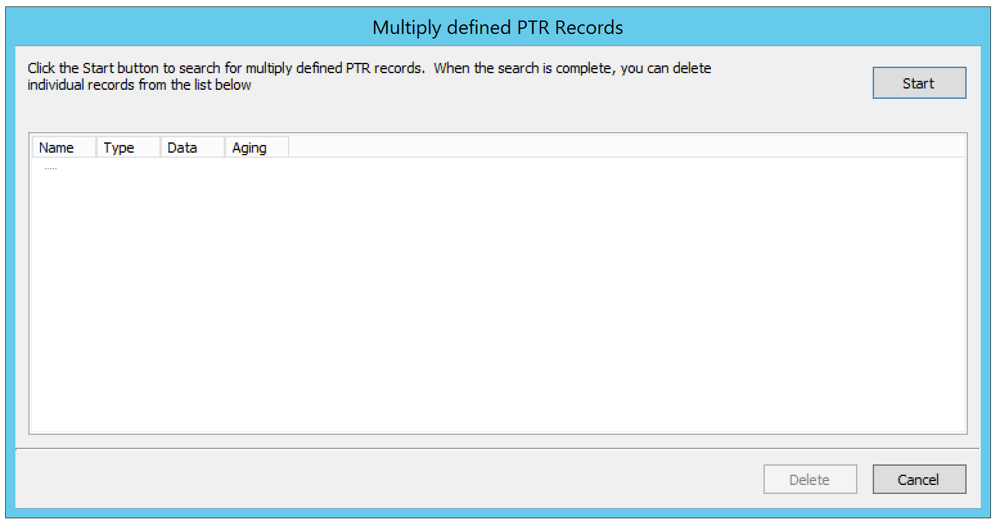

.. _admin-maintenance:

Maintenance
===========

The Men & Mice Suite contains several options for cleaning up the network space. To access the network maintenance functions, select Tools, Maintenance and then the maintenance operation you want to perform.

.. contents::

Find Orphaned PTR Records
-------------------------

The Find Orphaned PTR Records maintenance operation allows you to see and remove orphaned PTR records in reverse zones. PTR records that have no corresponding address (A) records in the system are considered orphaned.

To find and remove orphaned PTR records, do the following:

1. From the Tools menu, select Maintenance, Find Orphaned PTR Records. A dialog box displays.

2. Click Start to start looking for orphaned PTR records.

  .. note::
    Due to the fact that the result could be a large number of records, there is now a limit of 1000 records being shown.

.. image:: ../../images/admin-oprhaned-ptr-records.png
  :width: 70%
  :align: center

3. Select the PTR records you want to remove, and click the Delete button. The selected PTR records are removed.

Find Concurrent Leases
----------------------

The Find Concurrent Leases maintenance operation allows you to see and release concurrent DHCP leases. Concurrent DHCP leases are multiple active leases that are assigned to the same MAC address.

To see and remove concurrent DHCP leases, do the following:

1. From the Tools menu, select Maintenance, Find Concurrent Leases. A dialog box opens.

2. Click Start to start looking for concurrent DHCP leases.

  .. note::
    Finding all concurrent leases might take a while in large environments.

.. image:: ../../images/admin-concurrent-leases.png
  :width: 70%
  :align: center

3. Select the leases you want to release, and click the Release button. The selected leases are released.

Show Round Robin Records
------------------------

The Show Round Robin Records maintenance operation allows you to see and delete round robin DNS records. Round robin records are multiple address (A / AAAA) records with the same name.

To see and remove round robin records, do the following:

1. From the Tools menu, select Maintenance, Show Round Robin Records. A dialog box displays.

2. Click Start to start looking for round robin records.

  .. note::
    Finding all round robin records might take a while in large environments.

3. Select the records you want to delete and click the Delete button. The selected records are deleted.

Show Multiply Defined PTR Records
---------------------------------

The Show Multiply Defined Records maintenance operation allows you to see and delete multiply defined PTR records. Multiply defined PTR records are multiple PTR records with the same name.

To see and remove multiply defined PTR records, do the following:

1. From the Tools menu, select Maintenance, Show Multiply Defined PTR Records. A dialog box displays.

2. Click Start to start looking for multiply defined PTR records.

  .. note:: 
    Finding all multiply defined PTR records might take a while in large environments.

3. Select the records you want to delete, and click the Delete button. The selected records are deleted.
