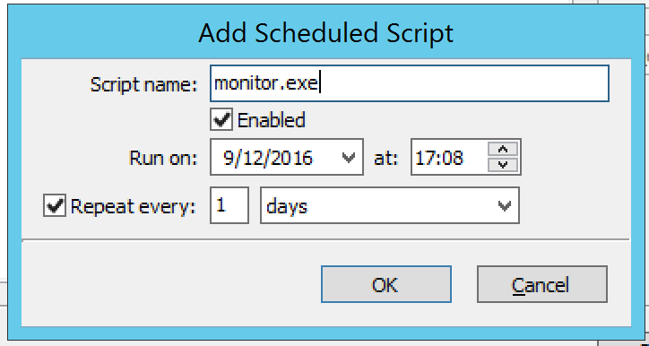

.. _admin-schedule-scripts:

Scheduled Scripts
=================

The administrator can configure the system to run scripts in a schedule – e.g., to back up the database every night at 3:00 AM, perform changes early in the morning, etc.

To configure this option, do the following:

1. From the menu bar, select :guilabel:`Tools --> Scheduled Scripts`. The *Scheduled Scripts* dialog box displays. Any already defined scripts are displayed.

.. image:: ../../images/admin-scheduled-script-list.png
  :width: 75%
  :align: center

2. To add a new script, click the :guilabel:`Add` button. The *Schedule Script* dialog box displays.

Script name.
  In the applicable Script name field, type the script name and necessary startup parameters. You must enter all information for the script as you would when invoking the script from the command line. It is assumed that the script is located in the same directory as the Men&Mice Central database file (mmsuite.db); however, if the script is stored in a different location, the path for the script must be entered.

Example 1: Running a script named mytest.vb. To run a script named mytest.vb that is located in the Men&Mice Central directory using the scripting host cscript, the following would be placed in the appropriate field: cscript /B mytest.vb.

Example 2: Running an executable named checkdata.exe. To run an executable named checkdata.exe that is located in the Men&Mice Central directory the following would be placed in the appropriate field: checkdata.exe.

It is possible to create a special user that has permissions to run scripts. When this user exists, it is possible to execute scripts that access the Men&Mice Suite without having to enter a user name and password in the script itself.

To enable this feature, create a user named ScriptRunner. This user must use the Men&Mice Internal authentication method. When this user has been created, you only have to enter $u as a user name and $p as a password when logging in to the Men&Mice Suite through the script.

.. note::
  This method only works if the script scheduler invokes the script. When running the script, the Men&Mice Suite uses a temporary password that changes every time the script runs.

Example 1: The following example shows how the command line interface can be invoked by the scheduler to execute a backup. This statement can be entered directly into the Script name field:

.. code-block::

  mmcmd -s 127.0.0.1 -u $u -p $p backup;exit

Example 2: The following Visual Basic script checks which users are logged in and writes the list of logged in users to the file logger.txt. To invoke the script you would enter the following statement into the Script name field:

.. code-block::

  cscript /B scripts\test.vbs $u $p

  ' Script starts here
  Option Explicit
  Dim objArgs, objFSO, objShell, objFile, objTextFile
  Dim strFile, strUser, strPassword, i

  strFile = "logger.txt"
  strUser = ""strPassword = ""

  ' We should get username and password as arguments
  Set objArgs = WScript.Arguments
  If objArgs.Count > 0 Then str
      User = objArgs(0)
    End If
  If objArgs.Count > 1 Then
    strPassword = objArgs(1)
  End If

  ' First we move into the right directory
  set objShell = createobject("wscript.shell")
  Set objFSO = CreateObject("Scripting.FileSystemObject")
  objShell.CurrentDirectory = objShell.CurrentDirectory & "\scripts"

  ' write extra info into the log file
  If Not objFSO.FileExists(strFile) Then
    Set objFile = objFSO.CreateTextFile(strFile)
  End If
  set objFile = nothing
  Set objTextFile = objFSO.OpenTextFile(strFile, 8, True)
  objTextFile.WriteLine("*****")
  objTextFile.WriteLine("Date/Time: " & Now())
  objTextFile.Close

  objShell.Run "cmd /c mmcmd.exe -s 127.0.0.1 -u " & strUser & " -p " & strPassword & " who; exit >> " & strFile, 0, true
  set objShell = nothing
  WScript.Quit

Enabled.
  Click the checkbox to enable the scheduling process for the script. Likewise, at any time if you wish to disable the script, return to this dialog box and uncheck this option.

Run on.
  Either type the date the script should run, or click the drop-down list field and select the date from the calendar.

At.
  Type or use the up/down arrows to select the time.

Repeat every.
  If this script should repeat at a designed frequency, click in the checkbox. Then, in the next two fields, select the interval – e.g., 1 week, 1 month, etc.

3. When all selections/entries are made, click :guilabel:`OK`.
