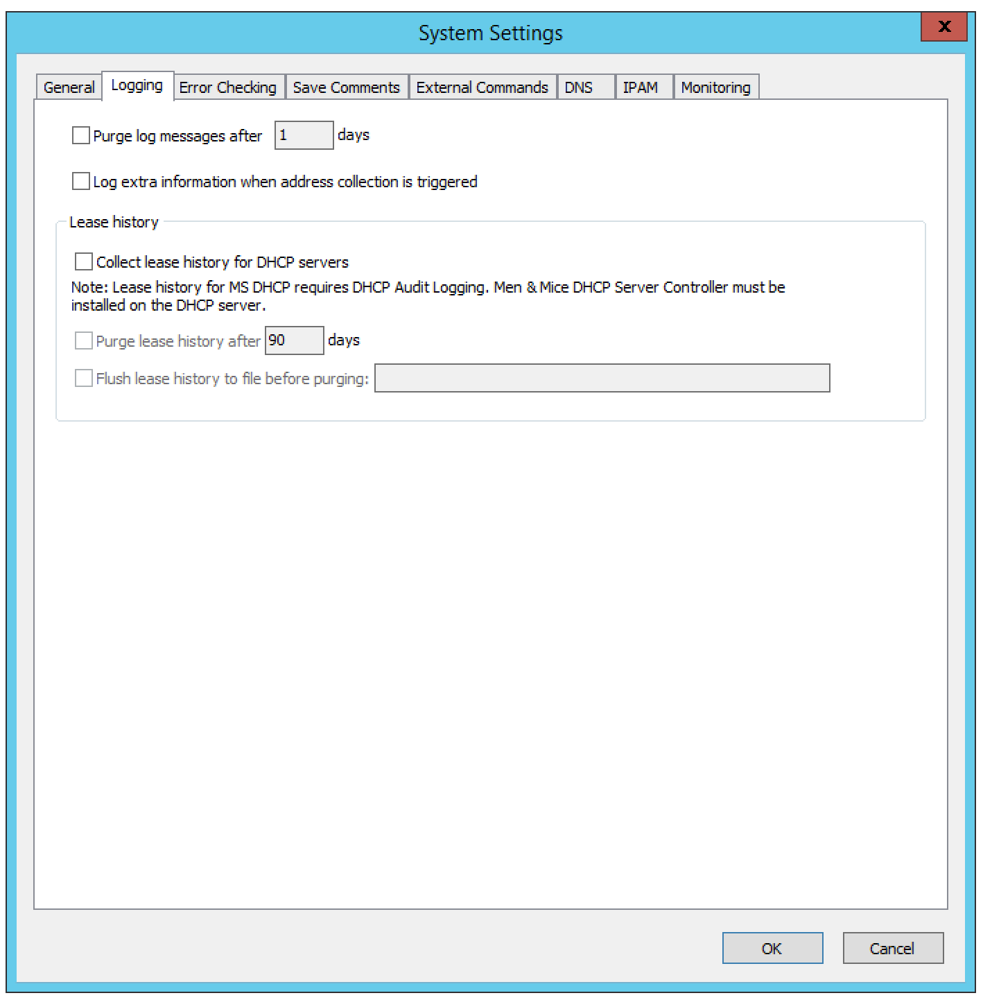
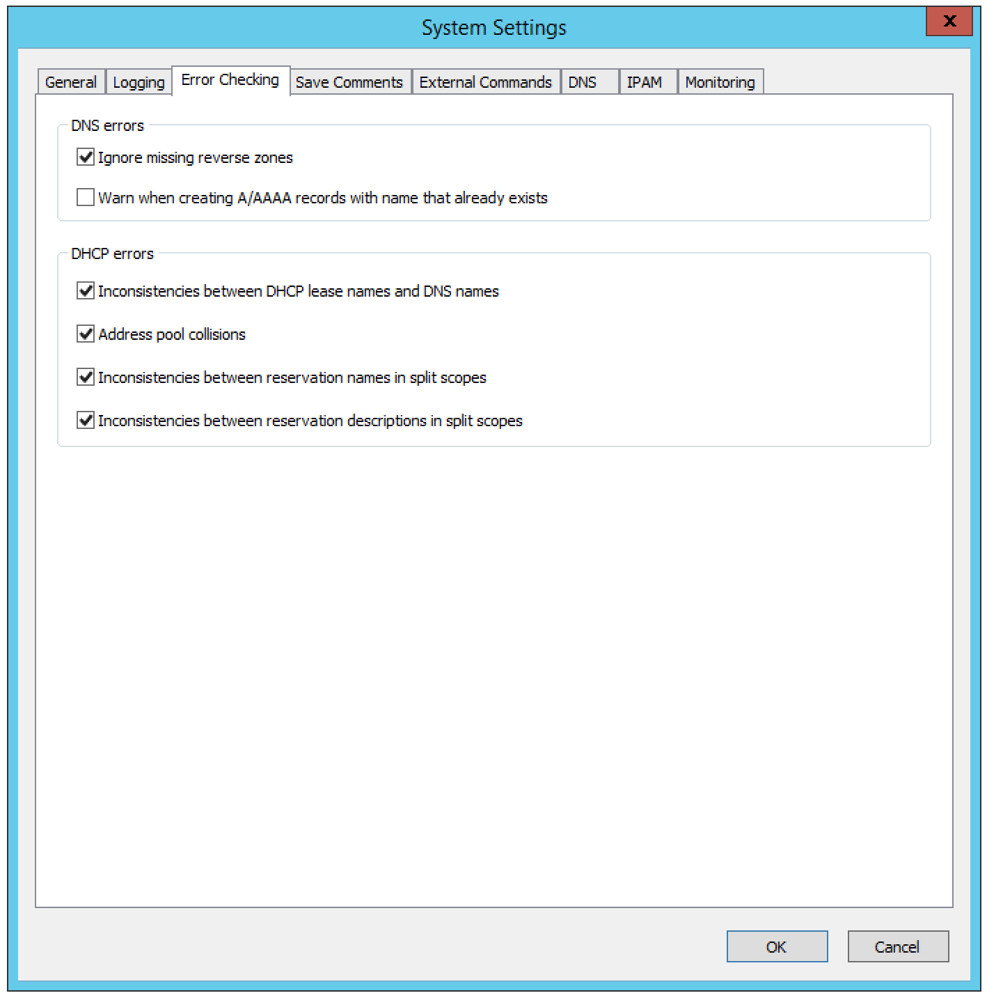
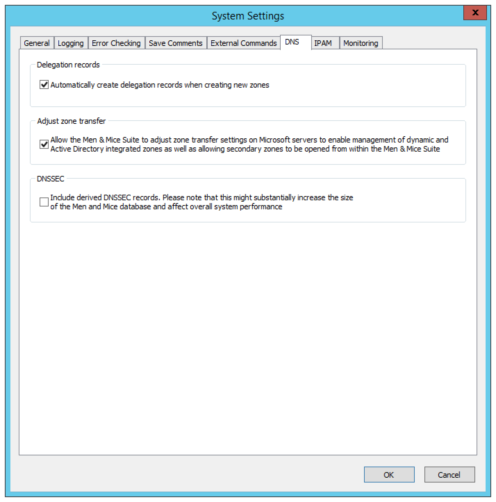
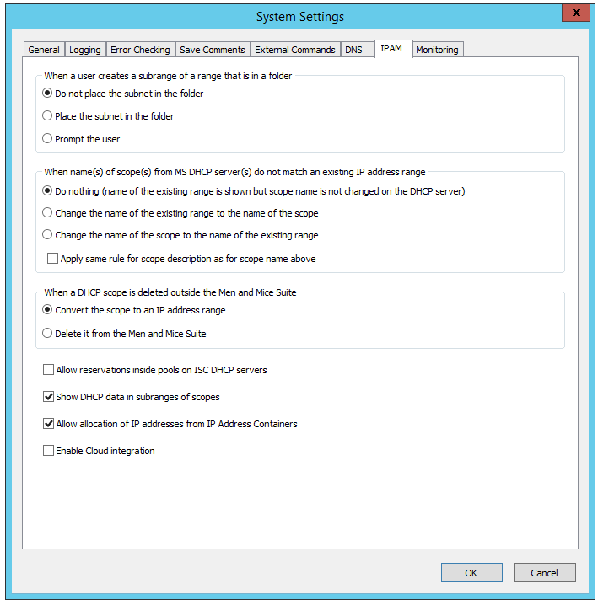
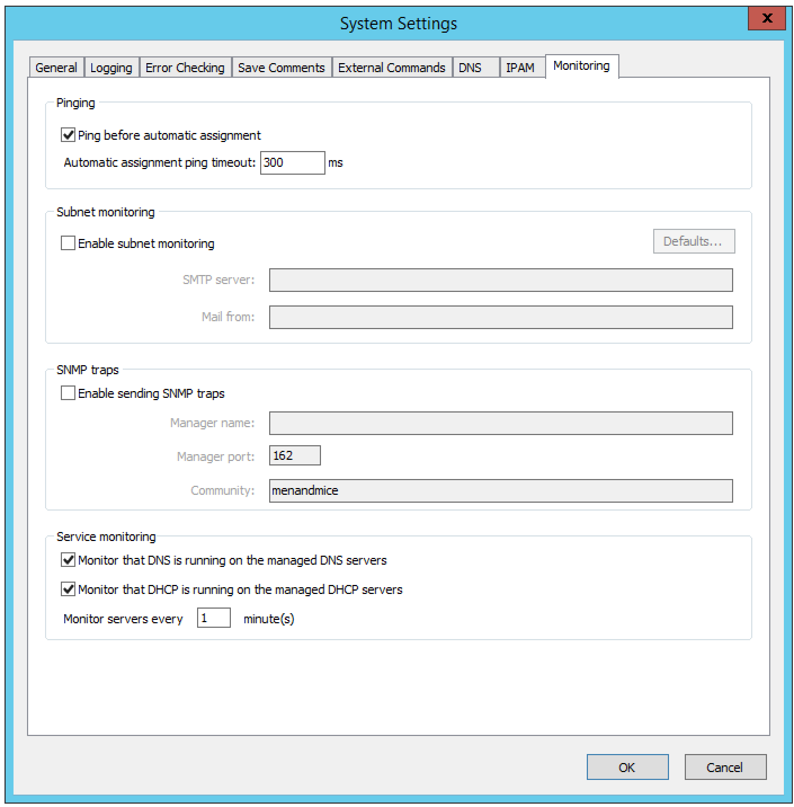

.. meta::
   :description: The System Settings to configure sign-ons, enabling AD sites and subnets integration, determining IP addresses in use and other advanced settings.   
   :keywords: system settings, tools, DNS, DHCP

.. _admin-system-settings:

System Settings
===============

From the menu bar, select Tools, System Settings.

The System Settings dialog box displays and includes these tabs:

  * :ref:`admin-general`

  * :ref:`admin-logging`

  * :ref:`admin-error-checking`

  * :ref:`admin-comments`

  * :ref:`admin-external-commands`

  * :ref:`admin-dns`

  * :ref:`admin-ipam`

  * :ref:`admin-monitoring`

.. _admin-general:

General
-------

Through this function, you can specify the following:

  * Whether to allow single sign-on

  * Settings for AD Sites and Subnets integration

  * Rules to determine when an IP address is considered as being in use

  * Advanced system settings

To display the General Settings dialog box, do the following:

1. From the menu bar, select :menuselection:`Tools --> System Settings`.

.. image:: ../../images/console-system-settings.png
  :width: 90%
  :align: center

2. In the *System settings* dialog box, click the :guilabel:`General` tab.

Allow Single Sign-on.
  When selected, Active Directory users do not have to authenticate when logging in through the Management Console or the Command Line Interface.

Allow single sign-on through web interface on IIS.
  To enable single sign-on in the web interface, the web server needs to be configured. Refer to :ref:`external-auth`.

Enable AD sites and subnets integration.
  Check this checkbox to enable the integration feature. When the integration is active, all sites and their corresponding subnets in Active Directory displays in Micetro and you can add and remove subnets in sites and move subnets to different sites. Once Sites and Subnets integration has been enabled, an  AD Sites  object displays in the object list on the left hand side of the Manager window and a new column,  AD Site  displays in the range list in the Manager window. If you want to synchronize the  Location  and  Description  fields of the subnets in Active Directory against custom properties in Micetro, choose the custom properties to synchronize against. When synchronization is active, any changes made to the fields in Active Directory will update the corresponding fields in Micetro and vice versa.

Enforce AD site inheritance.
  Select this checkbox if you want to enforce site inheritance in AD. When site inheritance is enforced, child subnets must reside in the same site as the parent subnet. If site inheritance is not enforced, child subnets can be placed in different sites than the parent subnet.

Determine Address in use.
  This section contains several checkboxes that determine whether an IP Address should be considered as being in use. Check the appropriate checkboxes to specify which rules should be applied to the IP Addresses.

Advanced system settings.
  Click this button to display the dialog box for entering advanced system settings. For more information about the contents of this dialog box, see the Men&Mice Knowledge Base.

3. When the desired selections/entries are made, click :guilabel:`OK`.

.. _admin-logging:

Logging
-------

Through this function, you specify when log messages should be purged and whether lease history for DHCP servers should be collected.

1. From the menu, select :menuselection:`Tools --> System Settings`.

2. In the *System Settings* dialog box, click the :guilabel:`Logging` tab.

Purge log message after ____  days.
  When selected a number is typed in the field indicating the number of days the logs should be kept.

Log extra information when address collection is triggered.
  When selected, information about the start and duration of the address collection is written in the Micetro log file.

Lease History.
  Through this function, you configure the setting that allows for viewing the history of DHCP leases.

    * Collect lease history for DHCP servers. Click the checkbox to begin history collection for DHCP servers.

    * Purge lease history after ___ days. Click the checkbox to select this option. Then, in the field, type the number of days to retain the history.

    * Flush lease history to file before purging. To save the lease history to a comma separated text file before it is purged, click the checkbox, and then type the name of the file.

3. When all selections/entries are made, click :guilabel:`OK`.

.. _admin-error-checking:

Error Checking
--------------

The *Error Checking* tab allows you to specify how the system reports certain errors related to DHCP and DNS. This tab is also used to enable or disable DHCP scope monitoring.

1. From the menu bar, select :menuselection:`Tools --> System Settings`.

2. In the *System Settings* dialog box, click the :guilabel:`Error Checking` tab.

Ignore missing reverse zones.
  An error message displays when Micetro is unable to update a reverse record for a changed address record. It is possible to suppress this error message if no reverse zone exists for the given address record by selecting the Ignore missing reverse zones checkbox.

Warn when creating A/AAAA records with name that already exists.
  When enabled, a warning message displays if a user creates an address (A or AAAA) record using the name of an existing record of the same type.

Inconsistencies in DHCP lease names and DNS names.
  When enabled, an icon displays for each DHCP lease for which the DNS name does not match the lease name. The user can click on the icon and display a dialog box showing details about the error and (if applicable) how to fix it.

Address pool collisions.
  When enabled, an icon displays in split scope entries if the address pool in the scope collides with the address pool of another split scope instance. The user can click on the icon and display a dialog box showing details about the error and (if applicable) how to fix it.

Inconsistencies between reservation names in split scopes.
  When enabled, an icon displays in split scope entries if a reservation name in a split scope differs from the reservation name in another split scope instance. The user can click on the icon and display a dialog box showing details about the error and (if applicable) how to fix it.

Inconsistencies between reservation descriptions in split scopes.
  When enabled, an icon displays in split scope entries if a reservation description in a split scope differs from the reservation description in another split scope instance. The user can click on the icon and display a dialog box showing details about the error and (if applicable) how to fix it.

When all selections/entries are made, click :guilabel:`OK`.

.. _admin-comments:

Save Comments
-------------

When saving changes to various objects, the Save Comment window may display. When this window displays is determined by the selections you make on this tab. The user simply types comments into the dialog box, explaining a reason for any actions taken (e.g., delete object as it was a duplicate). Then the user clicks OK.

To define when comments can be entered (and this can only be when logged on as a System Administrator), do the following:

1. From the menu bar, select :menuselection:`Tools --> System Settings`.

.. image:: ../../images/admin-comments.png
  :width: 80%
  :align: center

2. In the *System settings* dialog box, click the :guilabel:`Save Comments` tab.

3. Click in the checkbox next to all the instances in which you want the *Save Comment* dialog box to display.

4. When all selections are made, click :guilabel:`OK`.

.. _admin-external-commands:

External Commands
-----------------

Refer to :ref:`external-scripts`.

.. _admin-dns:

DNS
---

Use the *DNS settings* dialog box to specify various DNS related settings. To display the DNS Settings dialog box, do the following:

1. From the menu bar, select :guilabel:`Tools --> System Settings`.

2. In the *System Settings* dialog box, click the :guilabel:`DNS` tab.

Delegation records.
  When automatically create delegation records when creating new zones is selected, delegation records (NS records) are automatically created in the corresponding parent zones when subzones are created, maintaining a correct delegation chain between parent and subzones.

Adjust Zone Transfer.
  Select the checkbox to allow Micetro to automatically adjust zone transfer settings on Microsoft DNS servers to enable management of dynamic and Active Directory integrated zones.

DNSSEC.
  Select the checkbox to include derived DNSSEC records when viewing DNSSEC signed zones in Micetro. Note that this will increase the size of the Micetro database significantly and may affect overall system performance.

3. When the desired selections/entries are made, click :guilabel:`OK`.

.. _admin-ipam:

IPAM
----

The *IPAM* tab allows you to specify various IPAM related settings:

  * How the system should handle new subranges if the parent range is in a folder.

  * How the system should behave if DHCP scopes are removed outside Micetro.

  * How the system should behave when naming conflicts between existing IP Address ranges and DHCP scopes occur.

  * Whether the system should allow reservations inside address pools on ISC DHCP servers.

1. From the menu bar, select :menuselection:`Tools --> System Settings`.

2. In the *System Settings* dialog box, click the :guilabel:`IPAM` tab.

Subranges.
  The selection made here determines what happens when a user creates a subrange of a range in a folder. Click the desired action.

DHCP Scope Deletion.
  If a scope is removed directly from a DHCP server (instead of using Micetro), you can select whether to convert it to an IP Address range or remove it completely.

Name conflicts between ranges and scopes.
  The selection made her determines what happens if the name of an MS DHCP scope does not match the name of an existing IP Address range.

Apply same rule for scope description as for scope name above.
  When selected, the system will use the same rules to update scope description as it does for updating scope names.

Allow reservations inside pools on ISC DHCP servers.
  When selected, the system allows users to create reservations inside pools on ISC DHCP servers. When a reservation is created inside a pool, the pool is split to make space for the reservation.

  .. warning::
    If a reservation that has been created inside a pool is deleted, the address is not made a part of the pool again.

Show DHCP data in subranges of scopes.
  When selected, the system will display contents of subranges of scopes in the same view that is used for scopes and users with the required privileges will be able to work with reservations in these subranges. If the checkbox is not selected, contents of subranges of scopes will be displayed in the regular range view.

Allow allocation of IP Addresses from IP Address Containers.
  When selected, the system will allow allocation of IP Addresses that reside in IP Address Containers. For more information on IP Address Containers,  refer to  IPAM Settings.

Enable Cloud integration.
  Check this checkbox to enable the Cloud integration feature. When Cloud integration is active you can add OpenStack clouds to Micetro. You can manage cloud networks and and you can add and remove subnets from cloud networks and move subnets to cloud networks. Cloud integration has been enabled, a :guilabel:`Cloud` object displays in the object list on the left hand side of the Manager window and a new column, *Cloud Network* displays in the range list in the Manager window.

3. When all selections/entries are made, click :guilabel:`OK`.

.. _admin-monitoring:

Monitoring
----------

Use the *Monitoring settings* dialog box to specify various monitoring related settings.

To display the Monitoring Settings dialog box, do the following:

1. From the menu bar, select :menuselection:`Tools --> System Settings`.

1. In the *System Settings* dialog box, click the :guilabel:`Monitoring` tab.

Ping before automatic assignment.
  When selected, when an IP Address is being auto-assigned, the system checks as to whether the IP Address is responding to a ping request before it is allocated to a new host. If the IP Address responds to the ping request, it is not used for auto-assignment.

Automatic assignment ping timeout _____ ms.
  Specifies how long the system should wait (in milliseconds) for a response to the ping request. If a response is not received within the specified time, the system considers this to be a non-responding IP Address.

Enable subnet monitoring.
  When enabled, the system monitors the free addresses in DHCP address pools and subnets, and performs an action if the number of free addresses goes below a user-definable threshold. When subnet monitoring has been enabled, it is possible to configure the global settings for this feature by clicking the Details button.

  .. note::
    The global subnet monitoring setting can be overridden for individual subnets by changing the setting explicitly for the subnet. Refer to  IP Address Management—Subnet Monitoring and Utilization History  for information on how to change monitoring settings for individual subnets.

  To change the subnet monitoring settings, do the following:

    1. Click the Defaults... button. The Subnet Monitoring dialog box displays.

    .. image:: ../../images/admin-subnet-monitoring.png
      :width: 40%
      :align: center

    Enabled.
      When checked, all subnets are monitored by default. If you only want to monitor a subset of the subnets in the system, leave this checkbox unchecked and enable monitoring for the individual subnets instead by selecting the subnet and then selecting Set Subnet Monitoring from the Range menu.

    Script to invoke.
      Enter the path of the script to run when the number of free addresses goes below the set threshold. Refer to External Scripts for information on the script interface and the format for calling the script.

    Dynamic Threshold.
      Enter the threshold for the free addresses in a DHCP scope address pool.

      .. note::
        For split scopes and scopes in a superscope (on MS DHCP servers) and address pools using the shared-network feature on ISC DHCP servers, the total number of free addresses in all of the scope instances is used when calculating the number of free addresses.

    Static Threshold.
      Enter the threshold for the free addresses in a subnet.

    Only perform action once (until fixed).
      When checked, the action is performed only once when the number of free addresses goes below the threshold.

    Perform action when fixed.
      When checked, the action is performed when the number of free addresses is no longer below the threshold.

  When subnet monitoring is enabled, a new column, Monitoring, displays when viewing the subnet list. To quickly see all subnets that are monitored, you can use the Quick Filter and filter by this column by entering "Monitor: Yes" in the Quick Filter search field.

  .. note::
    Only DHCP scopes that are enabled are monitored. Disabled scopes are ignored.

  When subnet monitoring is enabled, you must specify the mail server and the sender e-mail address to use if you want the subnet monitor to send an e-mail. Place the appropriate information in the SMTP Server and Mail from fields.

Enable sending SNMP traps.
  When enabled, the system will send SNMP traps when certain events occur:

    * When the number of free IP Addresses in monitored subnets goes below a user-definable threshold.

    * When a log event of type Error or Notice occurs. Refer to :ref:`admin-logging` for more information on log events.

  When enabling sending of SNMP traps, you must provide additional information:

    Manager name.
      Enter the host name of the computer that should receive the SNMP traps.

    Manager port.
      Enter the port number the Manager uses for the SNMP traps.

    Community.
      Enter the community string (password) to use for the SNMP traps.

Enable collection of IP information from routers.
  When enabled, the system will query hosts that have been specified as routers for IP information. This feature is used along with the host discovery Ping feature to find active IP Addresses on the network. Refer to IP Address Management—Host Discovery for more information on how to specify hosts as routers.

  When this feature is enabled, some additional information must be provided:

    SNMP query interval.
      Determines how frequently the routers are queried for IP information.

    Router SNMP community.
      Enter the SNMP community string (password) to use when querying the routers for IP information.
