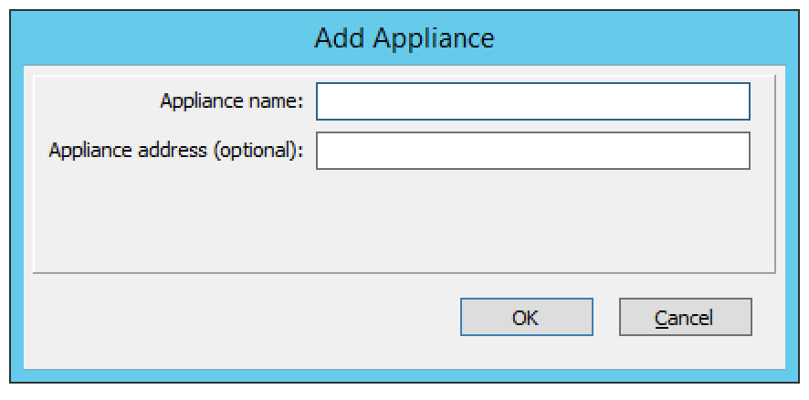
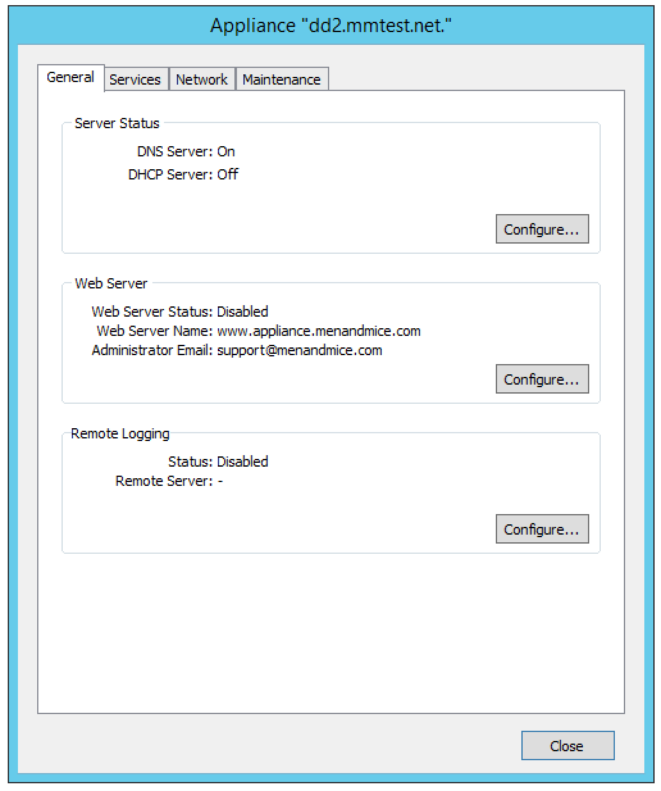
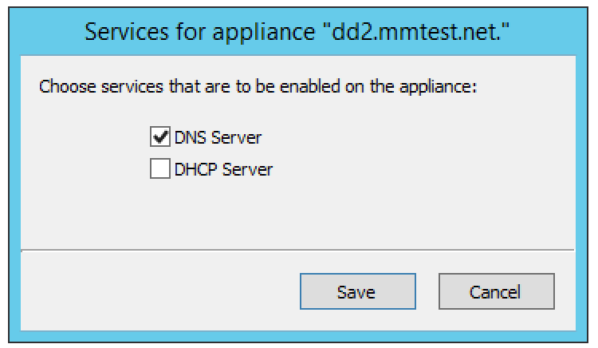
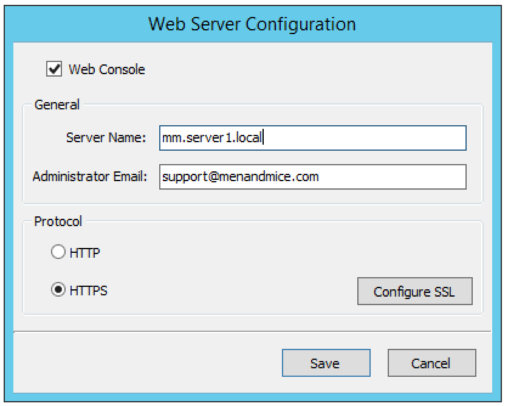
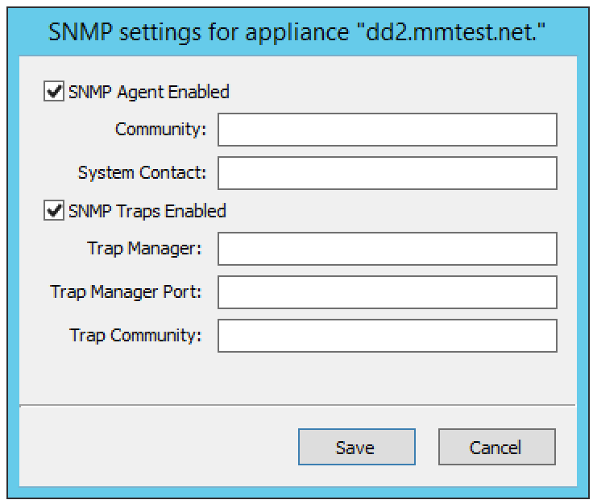
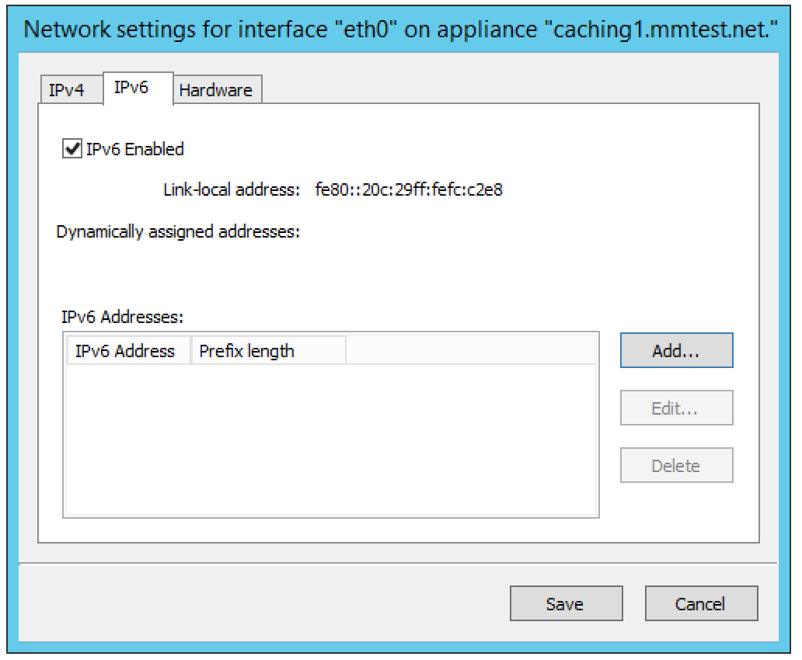
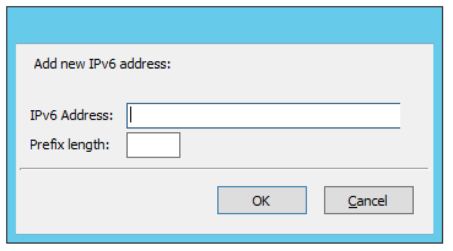
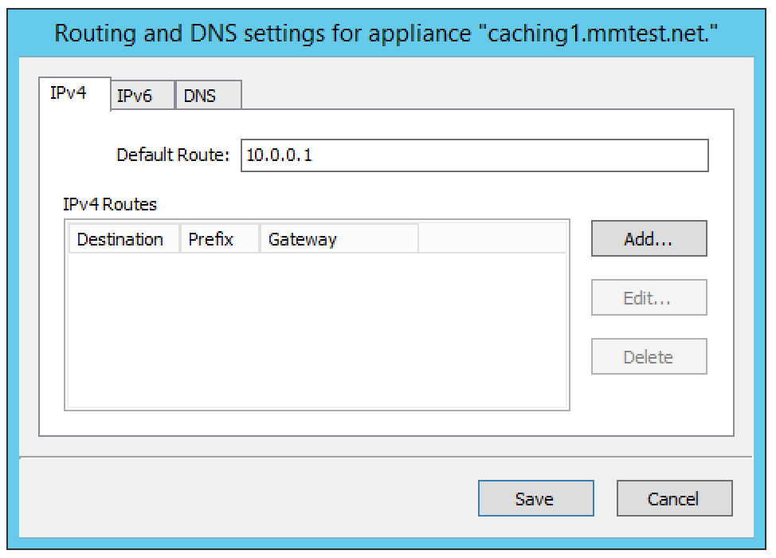
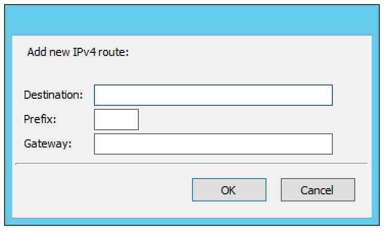
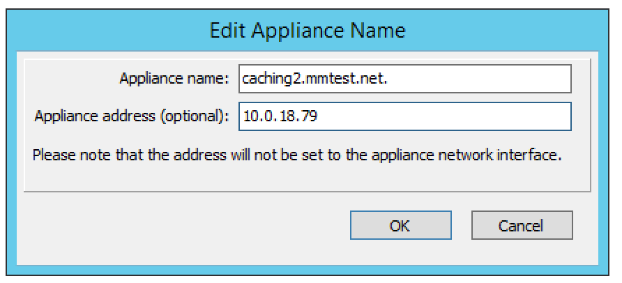

.. meta::
   :description: Managing two types Men&Mice Appliances: a DNS/DHCP Appliance and a DNS Caching Appliance
   :keywords: Men&Mice appliances, DNS management, DNS/DHCP appliance, DNS caching appliance, Men&Mice

.. _appliance-management:

Appliance management
====================

Overview
--------

There are two types of Men&Mice Appliances: a DNS/DHCP Appliance and a DNS Caching Appliance.

DNS/DHCP Appliance
  Can be used as a DNS and a DHCP server. You can also use the DNS/DHCP Appliance act as a server for the Micetro Web Application. Once the DNS/DHCP appliance has been configured, you work with the DNS and DHCP server just as you would work with the BIND and ISC DHCP servers.

DNS Caching Appliance
  Contains a high-performance Caching-only DNS server. See :ref:`caching-appliance` for information on managing the DNS server on the DNS Caching appliance.

.. note::
  Separate activation keys are required to add and manage a Men&Mice Appliance. The DNS/DHCP Appliance and the DNS Caching Appliance use different activation keys.

  Unless otherwise stated, the information in this chapter applies to both the DNS/DHCP Appliance and the DNS Caching Appliance.

New Appliance
-------------

You must be logged in as a user with administrator privileges to add a new Men&Mice Appliance.

To add a new Men&Mice Appliance, do the following:

1. From the menu bar, select :menuselection:`File --> New --> Appliance`. The *Add Appliance* dialog box displays.

Appliance Name
  Type the name (host name) of the Men&Mice Appliance. Note that his name is also used for the DNS and DHCP servers hosted on the Appliance.

Appliance address (optional)
  If desired, type the IPv4 address for the Appliance. This is not required, but doing so allows the Management Console to connect to the Appliance by IP Address instead of by name. The Appliance name will still be used when displaying Appliance information.

2. Click :guilabel:`OK`. The Men&Mice Appliance is added and the Appliance Properties dialog box opens. Once added, the name of the newly added Appliance displays under Appliances in the Object Section. (You may need to click the :guilabel:`+` sign next to *Appliances* to see it.)

.. _appliance-properties:

Appliance Properties
--------------------

You can use the *Appliance Properties* dialog box to configure various settings for the Men&Mice Appliance.

To open the *Appliance Properties* dialog box, do the following:

1. Locate the applicable Appliance.

2. Right-click and, from the shortcut menu, select :guilabel:`Properties`. The *Men&Mice Appliance Properties* dialog box displays.

The settings in the following sections are all available from within the *Appliance Properties* dialog box.

Enabling/Disabling DNS/DHCP Service (DNS/DHCP Appliance only)
-------------------------------------------------------------

You can choose whether you use the Men&Mice Appliance as a DNS server, DHCP server or both.

To enable or disable DNS and DHCP service on the Appliance:

1. Select the :guilabel:`General` tab in the *Appliance Properties* dialog box.

2. Click the :guilabel:`Configure `button in the *Server Status* section. The *Service Status* dialog box displays.

3. Select the services you want to run on the Appliance and click :guilabel:`Save`. If you enable a service, a server that has the same name as the appliance is displayed in the appropriate section in the object list in the Manager window. To disable a service, unselect the corresponding checkbox in the dialog box.

Using as Web Server (DNS/DHCP Appliance only)
---------------------------------------------

The Men&Mice Appliance can be configured to act as a web server for Micetro. When enabled, users can connect to the Men&Mice Appliance using a web browser to access the interface.

To enable the web server on the Appliance:

1. Select the :guilabel:`General` tab in the *Appliance Properties* dialog box.

2. Click the :guilabel:`Configure` button in the *Web Server* section. The *Web Server configuration* dialog box displays.

3. Select the :guilabel:`Web Console` checkbox to enable the web server on the Appliance.

4. Enter the name of the server in the *Server Name* field. This is the name the server uses to identify itself.

5. Enter the email address of the server administrator in the *Administrator email* field. This address is used as a contact address in any error messages sent to the client.

6. Select the protocol to use, HTTP or HTTPS. If you use HTTPS, you can click the :guilabel:`Configure SSL` button to import your own Certificate and Private Key files.

7. Click :guilabel:`OK` to save your settings.

Enabling Remote Logging (DNS/DHCP Appliance only)
-------------------------------------------------

The DNS/DHCP appliance can be configured such that specific logging channel can be logged to a remote syslog server.

1. Select the :guilabel:`General` tab in the *Appliance Properties* dialog box.

2. Click the :guilabel:`Configure` button in the *Remote Logging* section and you will be presented with the following dialog:

.. image:: ../../images/admin-appliance-remote-logging.png
  :width: 70%
  :align: center

3. To enable remote logging

  * check the :guilabel:`Enable Remote Logging` checkbox.

  * Specify the remote **Syslog Server** that will receive the logs.

  * Optionally specify a **Port Number** and protocol that the remote syslog listens on. Default is 514/UDP.

4. To finalize the configuration, configure in the DNS server options/logging a logging channel and a logging facility that will be logged to this remote server. For more information see the BIND logging section in Authoritative DNS Servers.

Using a Time Server
-------------------

You can configure the Appliance to synchronize its time with a time server. This ensures that the time on the Appliance is always correct. By default, the appliance synchronizes its time using servers in the NTP pool.

To configure the Appliance to use a Time Server:

1. Select the :guilabel:`Services` tab in the *Appliance Properties* dialog box.

2. Click the :guilabel:`Configure button` in the *Network Time Protocol* section. The *Time Server configuration* dialog box displays.

.. image:: ../../images/admin-appliance-ntp.png
  :width: 60%
  :align: center

4. Use the dialog box to add, modify or delete the time servers to use. If no time server is configured, the Appliance will not synchronize its time.

Enabling Remote Access
----------------------

For troubleshooting purposes, it is possible to enable Remote Access for the Men&Mice Appliance. When Remote Access is enabled, SSH access is granted on the Men&Mice Appliance for the user name ``mmadmin``.

To enable Remote Access on the Men&Mice Appliance:

1. Select the :guilabel:`Services` tab in the *Appliance Properties* dialog box.

2. Click the :guilabel:`Configure button` in the *Remote Access* section. The *Remote Access configuration* dialog box displays.

.. image:: ../../images/admin-appliance-remote-access.png
  :width: 60%
  :align: center

3. Select the :guilabel:`Enable access` checkbox to enable Remote Access.

4. Enter a login password. Note that the password must be entered twice.

5. Click :guilabel:`OK` to save the changes and close the dialog box.

Configuring SNMP Monitoring
---------------------------

You can use SNMP monitoring to get various information about the Men&Mice Appliance and receive SNMP traps if certain events occur on the Appliance.

To configure SNMP Monitoring on the Men&Mice Appliance:

1. Select the :guilabel:`Services` tab in the *Appliance Properties* dialog box.

2. Click the :guilabel:`Configure` button in the SNMP section. The *SNMP configuration* dialog box displays.

3. Check the :guilabel:`SNMP Agent Enabled` checkbox to enable the SNMP agent. When the SNMP agent is enabled, you can retrieve information about the system using SNMP.

4. In the **Community** field, enter The community string (password) to use for the SNMP agent.

5. In the **System Contact** field, enter the email address of a contact person for the system.

6. Check the :guilabel:`SNMP Traps Enabled` checkbox to enable sending of SNMP traps. When sending SNMP traps is enabled, the appliances will send SNMP traps when certain events occur.

7. In the **Trap Manager** field, enter the host name of the computer that should receive the SNMP traps.

8. In the **Trap Manager Port** field, enter the port number the Manager uses for the SNMP traps.

9. In the **Trap Community** field, enter the community string (password) to use for the SNMP traps.

10. Click :guilabel:`Save` to save your settings and close the dialog box.

Configuring Anycast
-------------------

The Men&Mice Appliance supports Anycast network configuration through two routing protocols, BGP (Border Gateway Protocol) and OSPF (Open Shortest Path First).

Configuring Anycast using BGP
^^^^^^^^^^^^^^^^^^^^^^^^^^^^^

To configure Anycast using BGP on the Men&Mice Appliance:

1. Select the :guilabel:`Services` tab in the *Appliance Properties* dialog box.

2. Click the :guilabel:`Configure` button in the *Anycast* section. The *Anycast configuration* dialog box is displayed with the *BGP* tab selected.

3. Check the :guilabel:`Enable BGP Anycast` checkbox to enable BGP.

4. In the **Local AS** field enter the local Autonomous System number for the Men&Mice Appliance.

5. In the **Router ID** field enter a unique ID for the Men&Mice Appliance in dotted-decimal form (A.B.C.D). It can be any (unique) value, but it is recommended to use a number that represents the Appliance, such as its eth0 IP address.

6. In the **Anycast Addresses** list add the IP addresses that the Men&Mice Appliance shall advertise through the routing protocol. The Appliance will also automatically configure a loopback adapter with this address and provide DNS service. To add an anycast address, click the :guilabel:`Add` button and enter the required information. To modify an existing anycast address entry, select the address and click the :guilabel:`Edit` button. To delete an anycast address, select the address in the list and click the :guilabel:`Delete` button.

7. In the **Neighbor Configuration** list, add the IP addresses of the routers that the Appliance shall form a neighbor relationship with. These routers must be capable of using the BGP protocol and they must also be configured to form a relationship with the Appliance. To add a neighbor address, click the :guilabel:`Add` button and enter the required information. To modify an existing neighbor address entry, select the address and click the :guilabel:`Edit` button. To delete a neighbor address, select the address in the list and click the :guilabel:`Delete` button.

8. Click :guilabel:`OK` to save the changes.

Configuring Anycast using OSPF
^^^^^^^^^^^^^^^^^^^^^^^^^^^^^^

To configure Anycast using OSPF on the Men&Mice Appliance:

1. Select the :guilabel:`Services` tab in the *Appliance Properties* dialog box.

2. Click the :guilabel:`Configure` button in the *Anycast* section. The *Anycast configuration* dialog box is displayed with the *BGP* tab selected.

3. Click the :guilabel:`OSPF` tab to activate it.

.. image:: ../../images/admin-appliance-anycast.png
  :width: 70%
  :align: center

4. Check the :guilabel:`Enable OSPF Anycast` checkbox to enable OSPF.

5. In the **OSPF Area** field enter the OSPF Area that the Men&Mice Appliance will participate in in dotted-decimal form (A.B.C.D). Each OSPF network must contain at least a backbone area (area 0 or 0.0.0.0), but can also contain other areas by through Area Border Routers (ABRs). The Area ID is only configured once for all networks since the Appliance never acts as an ABR and uses the same Area ID on all adapters.

6. In the **Router ID** field enter a unique ID for the Men&Mice Appliance in dotted-decimal form (A.B.C.D). It can be any (unique) value, but it is recommended to use a number that represents the Appliance, such as its eth0 IP address.

7. In the **Anycast Addresses** list add the IP addresses that the Men&Mice Appliance shall advertise through the routing protocol. The Appliance will also automatically configure a loopback adapter with this address and provide DNS service. To add an anycast address, click the :guilabel:`Add` button and enter the required information. To modify an existing anycast address entry, select the address and click the :guilabel:`Edit` button. To delete an anycast address, select the address in the list and click the :guilabel:`Delete` button.

8. In the **Neighbor Configuration** list, add the networks that should participate in the OSPF routing protocol. Normally this will be the networks that are configured on the eth0 or eth1 network interfaces. To successfully form neighbor relationships in OSPF, the Men&Mice Appliance and the routers must be located on the same network prefix and be configured with the same area ID. To add a neighbor network, click the :guilabel:`Add` button and enter the required information. To modify an existing neighbor network entry, select the address and click the :guilabel:`Edit` button. To delete a neighbor network, select the entry in the list and click the :guilabel:`Delete` button.

9. Click :guilabel:`OK` to save the changes.

Configuring Network Settings
----------------------------

Using the network settings, you can enable or disable IPv6 and change the IP address, network mask and routing information for the Appliance. You can also enable and configure the secondary network interface (eth1) on the Appliance.

Enabling/disabling the secondary network interface (eth1)
^^^^^^^^^^^^^^^^^^^^^^^^^^^^^^^^^^^^^^^^^^^^^^^^^^^^^^^^^

The Men&Mice Appliance has two network interfaces. The primary network interface (eth0) is enabled by default.

To enable or disable the secondary network interface (eth1):

1. Select the :guilabel:`Network` tab in the *Appliance Properties* dialog box.

2. Click the :guilabel:`Configure` button in the *Interface eth1* section. The interface configuration dialog box displays.

.. image:: ../../images/admin-appliance-secondary-network-interface.png
  :width: 70%
  :align: center

3. Check the :guilabel:`Enabled` checkbox to enable the eth1 interface. To disable the interface, uncheck the checkbox.

4. Click :guilabel:`Save` to save your settings.

Enabling/disabling IPv6 addresses on the primary/secondary network interface
^^^^^^^^^^^^^^^^^^^^^^^^^^^^^^^^^^^^^^^^^^^^^^^^^^^^^^^^^^^^^^^^^^^^^^^^^^^^

IPv6 can be enabled on either or both of the network interfaces on the Men&Mice Appliance.

To enable or disable IPv6 on the Men&Mice Appliance do the following:

1. Select the :guilabel:`Network` tab in the *Appliance Properties* dialog box.

2. Click the :guilabel:`Configure` button in the *Interface* section for the interface you want to configure. The *interface configuration* dialog box displays.

3. Click the :guilabel:`IPv6` tab in the *interface configuration* dialog box.

..

4. Check the :guilabel:`IPv6 Enabled` checkbox to enable IPv6 on the selected interface. To disable IPv6 on the interface interface, uncheck the checkbox.

5. Click :guilabel:`Save` to save your settings.

When IPv6 is enabled, the Link-local address and any dynamically assigned addresses for the interface are displayed in the dialog box.

Configuring IPv4 addresses on the primary/secondary network interface
^^^^^^^^^^^^^^^^^^^^^^^^^^^^^^^^^^^^^^^^^^^^^^^^^^^^^^^^^^^^^^^^^^^^^

Each interface on the Men&Mice Appliance can have one or more IPv4 addresses assigned to it.

To configure IPv4 addresses on the Appliance, do the following:

1. Select the :guilabel:`Network` tab in the *Appliance Properties* dialog box.

2. Click the :guilabel:`Configure` button in the *Interface* section for the interface you want to configure. The *interface configuration* dialog box is displayed with the *IPv4* tab selected.

.. image:: ../../images/admin-appliance-ipv4.png
  :width: 50%
  :align: center

3. In the **IPv4 Address** field enter the IPv4 IP address for the Men&Mice Appliance. NOTE: The main IPv4 address on the primary network interface (eth0) is used by Micetro to communicate with the Appliance. If you change the main IPv4 address of the primary network interface, you will lose the connection to the Appliance once the changes are saved, and you must update the connection information for the Appliance. Refer to :ref:`edit-appliance-name` for details on how to change the connection information.

4. In the **Subnet Mask** field, enter the subnet mask to use.

5. In the **Default Route** field, enter the default IPv4 route.

6. If you want to add more IPv4 IP addresses for the Men&Mice Appliance, click the :guilabel:`Add` button next to the IPv4 Aliases list and enter the relevant IP address information.

To edit or delete additional IPv4 addresses, use the :guilabel:`Edit` and :guilabel:`Delete` buttons next to the IPv4 Aliases list.

Configuring IPv6 addresses on the primary/secondary network interface
^^^^^^^^^^^^^^^^^^^^^^^^^^^^^^^^^^^^^^^^^^^^^^^^^^^^^^^^^^^^^^^^^^^^^

Each interface on the Men&Mice Appliance can have one or more addresses assigned to it.

To configure IPv6 addresses on the Appliance, do the following:

1. Select the :guilabel:`Network` tab in the *Appliance Properties* dialog box.

2. Click the :guilabel:`Configure` button in the *Interface* section for the interface you want to configure. The *interface configuration* dialog box is displayed with the *IPv4* tab selected.

3. Click the :guilabel:`IPv6` tab in the *interface configuration* dialog box

4. Select the :guilabel:`IPv6 Enabled` checkbox to enable IPv6

5. Click the :guilabel:`Add` button to add a new IPv6 address.

6. Enter the **IPv6 address** and the **Prefix length**.

7. Click :guilabel:`OK` to add the IPv6 address.

To edit or delete IPv6 addresses, use the :guilabel:`Edit` and :guilabel:`Delete` buttons next to the IPv4 Addresses list.

Configuring the Network Mode on the primary/secondary network interface
^^^^^^^^^^^^^^^^^^^^^^^^^^^^^^^^^^^^^^^^^^^^^^^^^^^^^^^^^^^^^^^^^^^^^^^

It is possible to change the network speed and duplex mode for the network interfaces on the Men&Mice Appliance.

To change the Network Mode on the Men&Mice Appliance do the following:

1. Select the :guilabel:`Network` tab in the *Appliance Properties* dialog box.

2. Click the :guilabel:`Configure` button in the *Interface* section for the interface you want to configure. The *interface configuration* dialog box displays.

3. Click the :guilabel:`Hardware` tab in the *interface configuration* dialog box. The MAC address of the interface is shown and a drop-down box with the available network modes displays.

.. image:: ../../images/admin-appliance-network-mode.png
  :width: 50%
  :align: center

Configuring IPv4 routing information
^^^^^^^^^^^^^^^^^^^^^^^^^^^^^^^^^^^^

To configure IPv4 routing on the Appliance, do the following:

1. Select the :guilabel:`Network` tab in the *Appliance Properties* dialog box.

2. Click the :guilabel:`Configure` button in the *Routing* section. The *routing configuration* dialog box is displayed with the *IPv4* tab selected.

3. Enter the **default route** to use for IPv4.

4. If needed, click the :guilabel:`Add` button to add a new IPv4 route.

.. image:: ../../images/admin-appliance-add-ipv4-route.png
  :width: 50%
  :align: center

5. Enter the **destination**, **prefix**, and **gateway**.

6. Click :guilabel:`OK` to add the route.

To edit or delete routes, use the :guilabel:`Edit` and :guilabel:`Delete` buttons next to the IPv4 Routes list.

Configuring IPv6 routing information
^^^^^^^^^^^^^^^^^^^^^^^^^^^^^^^^^^^^

To configure IPv6 routing on the Appliance, do the following:

1. Select the :guilabel:`Network` tab in the *Appliance Properties* dialog box.

2. Click the :guilabel:`Configure` button in the *Routing* section. The *routing configuration* dialog box is displayed with the *IPv4* tab selected.

3. Click the :guilabel:`IPv6` tab in the *routing configuration* dialog box.

.. image:: ../../images/admin-appliance-ipv6-routing.png
  :width: 50%
  :align: center

4. Enter the **default route** to use for IPv6 and choose the interface for the route. You can choose the enabled interfaces or Auto.

5. If needed, click the :guilabel:`Add` button to add a new IPv6 route.

.. THIS DOESN'T SEEM LIKE THE RIGHT SCREENSHOT 🧐

6. Enter the **destination**, **prefix** and **gateway** and choose the **interface** for the route. Click :guilabel:`OK` to add the route.

To edit or delete routes, use the :guilabel:`Edit` and :guilabel:`Delete` buttons next to the *IPv6 Routes* list.

Shutting down or Restarting the Men&Mice Appliance
----------------------------------------------------

You can shut down or restart the Men&Mice Appliance from the Maintenance tab in the Appliance Properties dialog box.

.. danger::
  If you shutdown the Men&Mice Appliance, it will be turned off and you will need physical access to the Men&Mice Appliance to turn it on again.

To shut down or restart the Men&Mice Appliance:

1. Select the :guilabel:`Maintenance` tab in the *Appliance Properties* dialog box.

2. Click the :guilabel:`Shutdown` or :guilabel:`Restart` button and click :guilabel:`OK` in the confirmation dialog box. The Men&Mice Appliance shuts down or restarts, depending on your selection.

Support Information
-------------------

To help in troubleshooting, it is possible to generate and save support information for a Men&Mice Appliance. The support information file contains various information on the Men&Mice Appliance setup and helps the Men&Mice Support team diagnose problems you might have with the Appliance.

To generate a support information file:

1. Locate the applicable Appliance.

2. Right-click and, from the shortcut menu, select :guilabel:`Support Info`. A *Save File* dialog box displays. A default name for the support information file is ``mmSupportInfo.tgz``. Click :guilabel:`Save` to save the support information file.

.. note::
  The support information file contains various text files in a .tgz archive. If you are interested in seeing the contents of the support information file, you can use any tool that can extract data from .tgz archives and look at the text files.

.. _edit-appliance-name:

Edit Appliance Name
-------------------

This feature allows you to change the name or IP Address used to connect to a Men&Mice Appliance. This is useful if you need to refer to the Appliance by another name or if you are connecting to the Appliance by an IP Address and the IP Address has changed.

To access this feature, do the following:

1. Locate the applicable Appliance.

2. Right-click and, from the shortcut menu, select :guilabel:`Edit Appliance Name`. The *Edit Appliance name* dialog box displays.

3. Change the **Appliance name**, and/or **Appliance address (optional)**.

  .. note::
    This will only change the name or IP address used to connect to the Men&Mice Appliance. The actual IP address on the Appliance is not changed. For information on changing the IP address on the Men&Mice Appliance itself, refer to :ref:`appliance-properties`.

4. Click :guilabel:`OK`.

Delete Appliance
----------------

.. note::
  This command is only available with the Administrator account.

Use this command to remove a Men&Mice Appliance from Micetro.

1. In the *Object browser* of the Management Console, click on :guilabel:`Appliances`.

2. In the *Object List*, select the Appliance(s) you want to remove. To select multiple Appliances, hold down the Ctrl key while making your selection

3. On the toolbar, click the :guilabel:`Remove` button. A dialog box prompts you to confirm your decision. To remove the Appliance, click :guilabel:`Yes`. Otherwise, click :guilabel:`No` to keep the Appliance.

.. warning::
  When you remove an Appliance from Micetro, the DNS and DHCP servers hosted on the Appliance are removed from Micetro as well.

Backup and Restore
------------------

Micetro will automatically backup configuration for all appliances it manages. The backup can then be used to restore the appliance to the backed-up copy of the configuration. The backup is fully automatic and there is no configuration needed.

If an appliance crashes and has to be replaced with another appliance with the same IP Address, Micetro will detect the new server and consider it to be in an uninitialized state. To be able to work with the server the administrator needs to initialize the server. To initialize the server right-click on the server and select Initialize. This will display a dialog box where the user can choose how the server should be initialized:

.. image:: ../../images/admin-appliance-backup-restore.png
  :width: 60%
  :align: center

* If **Restore Backup** is selected, all configurations on the appliance will be overwritten with the backed-up data.

* If **Use appliance without backup** is selected, all data kept in Men&Mice Central will be ignored and overwritten with current data on the appliance.

Basically, the restore scenario is as follows:

1. The appliance crashes and becomes unusable.

2. A new appliance is configured to replace the broken appliance, using the same IP Address as the old appliance.

3. When the new appliance is up and running, in the Management Console, right-click the appliance and choose :guilabel:`Reconnect`.

When a connection has been established, Micetro detects that this is a new, uninitialized appliance. See above for a description on what happens next.
