.. _caching-appliance:

Caching DNS Servers
===================

Overview
--------

This section shows you how to perform specific actions in the Men & Mice Management Console associated with maintaining your Caching DNS servers on a Men & Mice DNS Caching Appliance. For some more general options and features of DNS servers in general, please see Authoritative DNS Servers.

.. information::
  The contents of this section are only relevant if you are using the Men & Mice DNS Caching Appliance.

Options
-------

The Server Options dialog box lets you configure settings for each caching DNS server individually. It is also possible to select multiple caching DNS servers and set specific options for all of the selected servers.

To open the caching DNS server Options dialog box, do the following:

1. In the Object Section, select DNS Servers so the servers appear in the Object List.

2. Right-click on the caching DNS server you want to make changes to and select Options from the context menu. The Server Options dialog box displays.

The settings in the following sections are all available from within the caching DNS server options dialog box.

Setting Network and Transfer Protocols
^^^^^^^^^^^^^^^^^^^^^^^^^^^^^^^^^^^^^^

You can choose which network protocols (IPv4, IPv6 or both) and transport protocols (TCP, UDP or both) you want to use and you can also set the EDNS Buffer size.

To set the network and transfer protocols for the caching DNS server, do the following:

1. Select the Network tab in the caching DNS server Options dialog box.

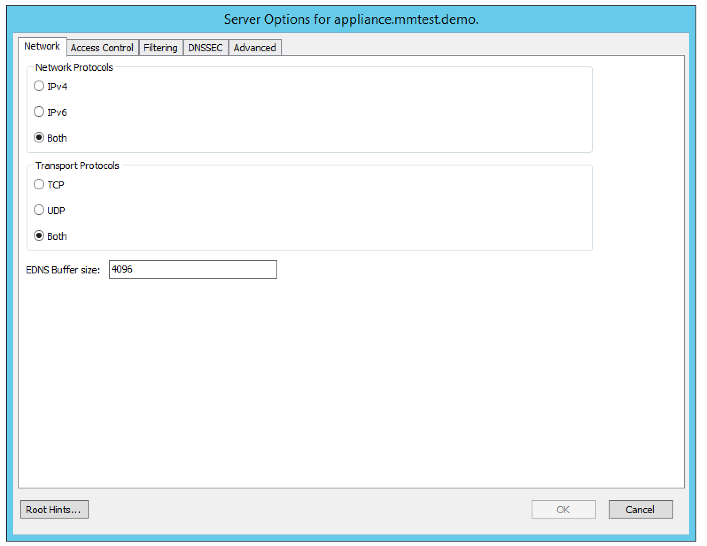

2. Select the Network Protocols to use. You can specify whether you want to enable DNS on IPv4, IPv6 or both.

3. Select the Transport Protocols to use. You can specify whether you want to enable DNS on TCP, UDP or both.

4. Set the EDNS Buffer size. This is the number of bytes to advertise as the EDNS reassembly buffer size. This is the value put into datagrams over UDP towards peers. The default is 4096 which is RFC recommended. If you have fragmentation reassembly problems, usually seen as timeouts, then a value of 1480 can fix it. Setting to 512 bypasses even the most stringent path MTU problems, but is seen as extreme, since the amount of TCP fallback generated is excessive (probably also for this resolver, consider tuning the outgoing TCP number).

Setting Access Control for the Caching DNS Server
^^^^^^^^^^^^^^^^^^^^^^^^^^^^^^^^^^^^^^^^^^^^^^^^^

Access control for the caching DNS server is used to specify who can query the server. You can specify access based on individual IP addresses or address blocks and you can create multiple access control entries.

To set access control for the caching DNS server, do the following:

1. Select the Access Control tab in the caching DNS server Options dialog box.

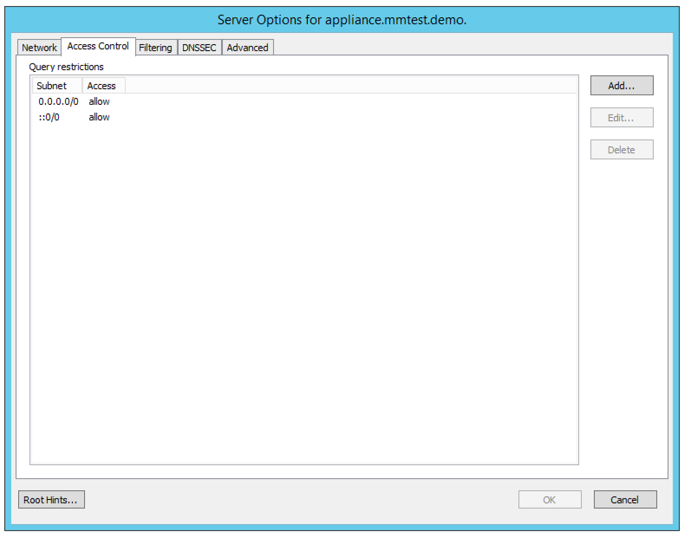

2. Click the Add button to create a new access control entry.

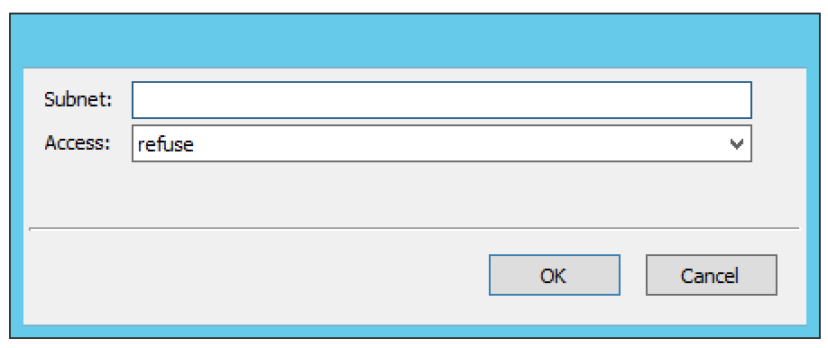

3. Enter the address or subnet in the field provided and choose the access type for the subnet from the drop-down list. There are four access types available:

  refuse.
    Stops all queries from the specified host or network and sends the DNS rcode REFUSED error message back.

  deny.
    Stops all queries from the specified host or network.

  allow.
    Allows the specified host or network to query the server using non-recursive queries.

  allow-snoop.
    Allows the specified host or network to query the server using both non-recursive and recursive queries.

4. Click OK to save the access control entry.

Setting Private Addresses and Private Domains
^^^^^^^^^^^^^^^^^^^^^^^^^^^^^^^^^^^^^^^^^^^^^

It is possible to specify private addresses and private domains on the caching DNS server.

* Private addresses are addresses on your private network, and are not allowed to be returned for public Internet names. Any occurrences of such addresses are removed from DNS answers.
* Private domains are domains that may contain private addresses.

To specify private addresses, do the following:

1. Select the Filtering tab in the caching DNS server Options dialog box.

.. image:: ../../images/admin-caching-appliance-filtering-options.png
  :width: 70%
  :align: center

2. Click the Add button in the Private Addresses section to create a new private address entry.

3. Enter the address or subnet in the field provided, and click OK to save the private address entry.

To specify private domains:

1. Select the Filtering tab in the caching DNS server Options dialog box.

2. Click the Add button in the Private Domains section to create a new private domain entry.

3. Enter the domain name in the field provided, and click OK to save the private domain entry.

Specifying Addresses not to Query
^^^^^^^^^^^^^^^^^^^^^^^^^^^^^^^^^

It is possible to specify IPv4 or IPv6 addresses or subnets that the caching DNS server should not use when querying for DNS information.

To specify addresses that should not be queried, do the following:

1. Select the Filtering tab in the caching DNS server Options dialog box.

.. PROBABLY SHOULD UPDATE THIS SCREENSHOT TO BE MORE RELEVANT/INFORMATIVE

.. image:: ../../images/admin-caching-appliance-filtering-options.png
  :width: 70%
  :align: center

2. Click the Add button in the Addresses not to Query section to create a new address entry.

3. Enter the address or subnet in the field provided, and click OK to save the address entry.

Configuring DNSSEC Settings
^^^^^^^^^^^^^^^^^^^^^^^^^^^

Use the DNSSEC section to specify DNSSEC Trust Anchors, DLV Anchors and Insecure Domains

To configure DNSSEC settings, do the following:

1. Select the DNSSEC tab in the caching DNS server Options dialog box.

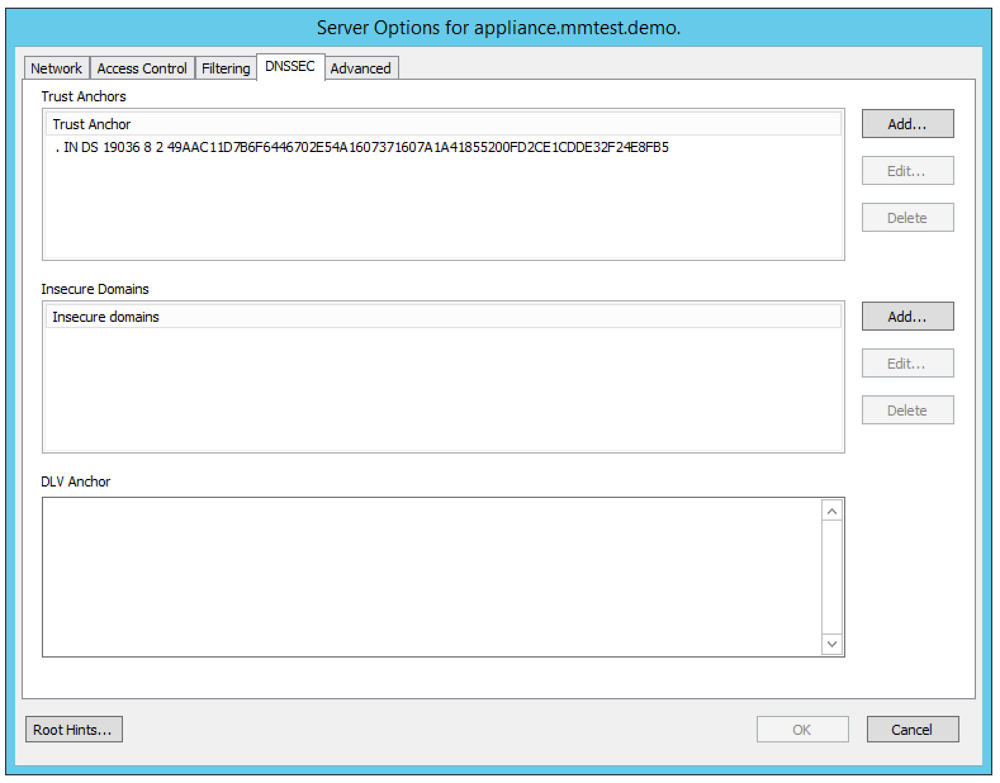

2. Click the Add button in the Trust Anchors section to create a new trust anchor entry. A trust anchor A is a DS or DNSKEY RR for a key to use for validation.

3. Click the Add button in the Insecure Domains section to create a new insecure domain entry. This sets the specified domain name to be insecure. The DNSSEC chain of trust is ignored towards the domain name. A trust anchor above the domain name cannot make the domain secure with a DS record and such a DS record is ignored. Also, keys from DLV are ignored for the domain. This can be useful if you want to make sure a trust anchor for external lookups does not affect an (unsigned) internal domain. DS record externally can create validation failures for that internal domain.

4. Enter the relevant DLV Anchor data in the DLV Anchor edit field to create a DLV anchor entry. Much like a trust anchor, a DLV anchor is a DS or DNSKEY RR for a key to use for validation. You can only create one DLV anchor entry.

Configuring Advanced Settings
^^^^^^^^^^^^^^^^^^^^^^^^^^^^^

The caching DNS server Options dialog box contains an Advanced tab where you can configure various advanced settings for the server.

To configure advanced settings, do the following:

1. Select the Advanced tab in the caching DNS server Options dialog box.

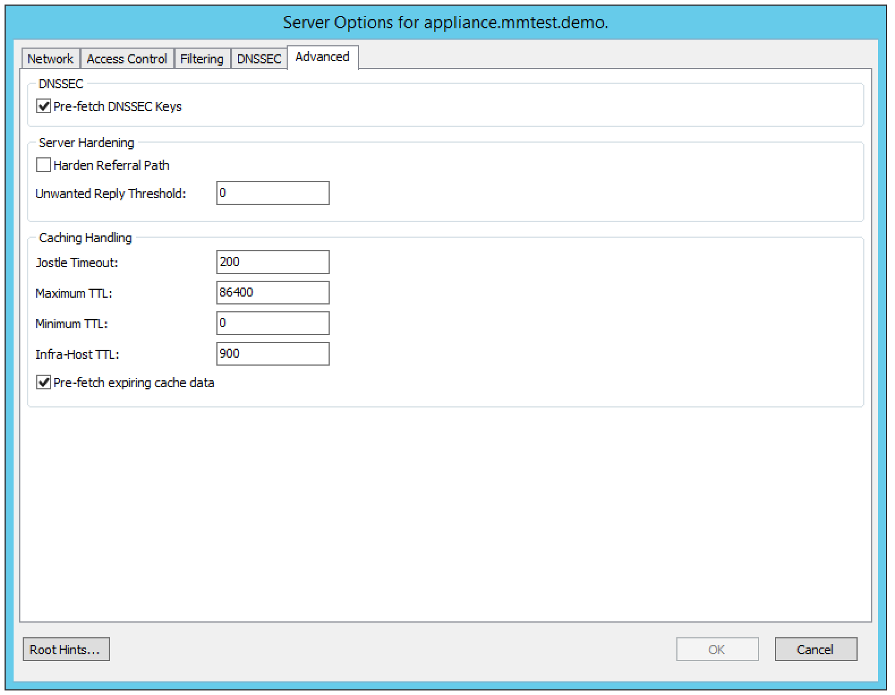

2. Configure the desired advanced settings.

  .. csv-table::
    :widths: 20, 80

    "Pre-fetch DNSSEC Keys", "If checked, fetches the DNSKEYs earlier in the validation process when a DS record is encountered. This lowers the latency of requests but uses a little more CPU."
    "Harden Referral Path", "If checked, hardens the referral path by performing additional queries for infrastructure data. Validates the replies if trust anchors are configured and the zones are signed. This enforces DNSSEC validation on name server NS sets and the name server addresses that are encountered on the referral path to the answer. Default off, because it burdens the authority servers, and it is not RFC standard, and could lead to performance problems because of the extra query load that is generated."
    "Jostle Timeout", "Timeout used (in milliseconds) when the server is very busy. The default is 200 milliseconds. Set to a value that usually results in one roundtrip to the authority servers. If too many queries arrive, then 50% of the queries are allowed to run to completion, and the other 50% are replaced with the new incoming query if they have already spent more than their allowed time. This protects against denial of service by slow queries or high query rates. The effect is that the qps for long-lasting queries is about (numqueriesperthread / 2) / (average time for such long queries) qps. The qps for short queries can be about (numqueriesperthread / 2) /(jostletimeout in whole seconds) qps per thread, about (1024/2)\*5 = 2560 qps by default."
    "Maximum TTL", "Maximum time to live (in seconds) for RRsets and messages in the cache. Default is 86400 seconds (1 day). If the maximum kicks in, responses to clients still get decrementing TTLs based on the original (larger) values. When the internal TTL expires, the cache item has expired. The Maximum TTL can be set lower to force the resolver to query for data often, and not trust (very large) TTL values."
    "Minimum TTL", "Minimum time to live (in seconds) for RRsets and messages in the cache. Default is 0. If the minimum kicks in, the data is cached for longer than the domain owner intended, and thus, fewer queries are made to look up the data. Zero makes sure the data in the cache is as the domain owner intended; higher values, especially more than an hour or so, can lead to trouble as the data in the cache does not match up with the actual data any more."
    "Infra-Host TTL", "Time to live (in seconds) for entries in the host cache. The host cache contains roundtrip timing, lameness, and EDNS support information. Default is 900."
    "Pre-fetch expiring cache data", "If checked, fetches the DNSKEYs earlier in the validation process when a DS record is encountered. This lowers the latency of requests but uses a little more CPU."

Working with Root Hints
"""""""""""""""""""""""

The Root Hints file contains information on the root DNS servers. If needed, you can change the contents of this file. After making changes to the Root Hints file you can revert to the built-in Root Hints file.

To configure Root Hints, do the following:

1. Click the Root Hints button in the caching DNS server Options dialog box. The Root Hints dialog box displays.

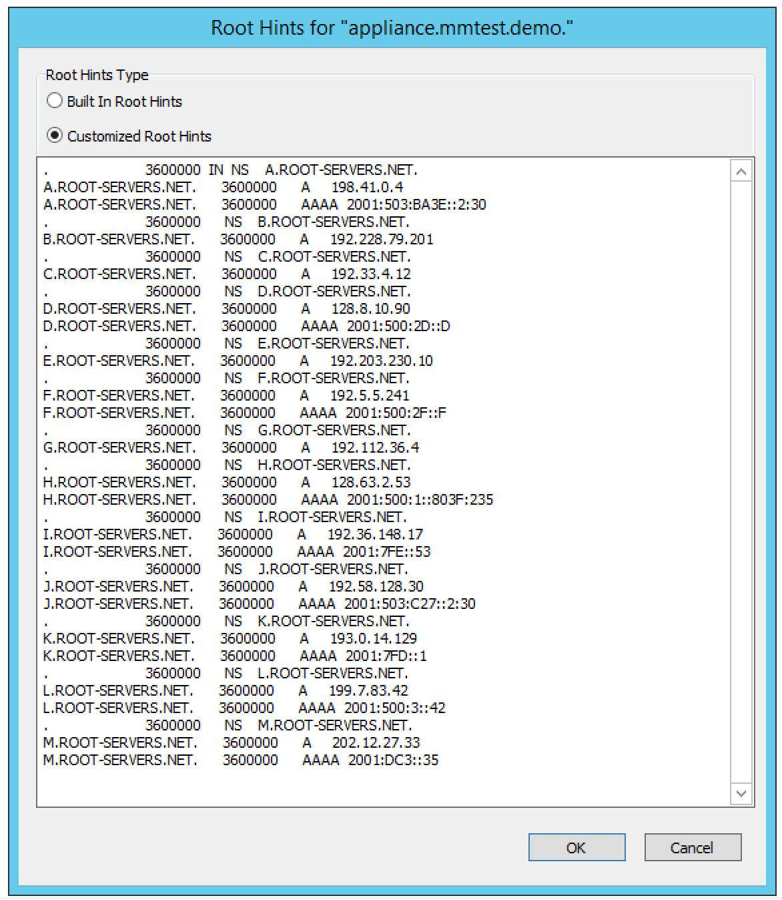

2. Select the Customized Root Hints radio button if it isn't already selected. The contents of the Root Hints edit field become editable.

3. Make the desired changes to the Root Hints file and click OK to save the changes.

To use the built-in Root Hints file, do the following:

1. Click the Root Hints button in the caching DNS server Options dialog box. The Root Hints dialog box displays.

2. Select the Built In Root Hints radio button. The contents of the Root Hints edit field become read-only.

3. Click OK to save the changes.

Server Log and Query Logging
----------------------------

To view the activity log for a particular server, in the Object List, right-click on the desired server and, from the shortcut menu, select Server Log. A Log tab opens for the selected server that contains a list of activity and maintenance that has occurred on that server since the last time the log was cleared.

You can clear the server log by clicking the Clear log button in the server log tab. You can start logging all queries by clicking the Start button in the Query Logging section in the server log window. If query logging is enabled, the Start button changes to a Stop button and clicking the button will stop query logging.

.. warning::
  Query logging may impact server performance significantly and should only be used for troubleshooting purposes.

You can save the contents of the server log tab by clicking the Save button.

To download the last server log file directly from the DNS Caching Appliance click the Download button.

.. image:: ../../images/admin-caching-appliance-log.png
  :width: 80%
  :align: center

Stopping the DNS Server
-----------------------

The Men & Mice DNS Caching Appliance is configured to keep the DNS service running at all times. This means that if the DNS server is stopped for some reason, it is restarted automatically. However, it is possible to override this setting and stop the DNS server from the Server menu. When the DNS server is stopped, the Men & Mice DNS Caching Appliance withdraws itself from the Anycast setup if Anycast has been configured on the Appliance. When the DNS server is started again, the Appliance re-enables the Anycast configuration. The stopped state for the DNS server is not persistent. If the Appliance is restarted while the DNS server is stopped, the DNS server will be started once the Appliance has restarted.

To stop the DNS server, select the caching DNS server in the DNS Server list and on the Server menu select Stop DNS Server.

To start the DNS server, on the Server menu select Start DNS Server.

Stub and Forward Zones
----------------------

You can create stub and forward zones on the caching DNS server. See Forward Zone and Stub Zone for more information on creating stub and forward zones.

.. information::
  When creating stub and forward zones on a caching DNS server, some additional settings are available for the zones.

For forward zones, the Forward only checkbox displays. Select this checkbox if you want the zone to be a forward only zone.

For stub zones, two additional settings are available:

Prime NS set
  If checked, the server performs NS set priming, which is similar to root hints, where it starts using the list of name servers currently published by the zone. Thus, if the hint list is slightly outdated, the resolver picks up a correct list online.

Stub-First
  If checked, a query is attempted without the stub clause if it fails.

Managing Local Zones
--------------------

Using the Local Zone management dialog box, you can add, modify and delete local zones and records. Local zones and records are only displayed in the Local Zone management dialog box.

To open the Local Zone management dialog box, do the following:

1. In the Object Section, select DNS Servers so the servers appear in the Object List.

2. Right-click on the caching DNS server you want to work with and select Manage Local Zones from the context menu. The Manage Local Zones dialog box displays.

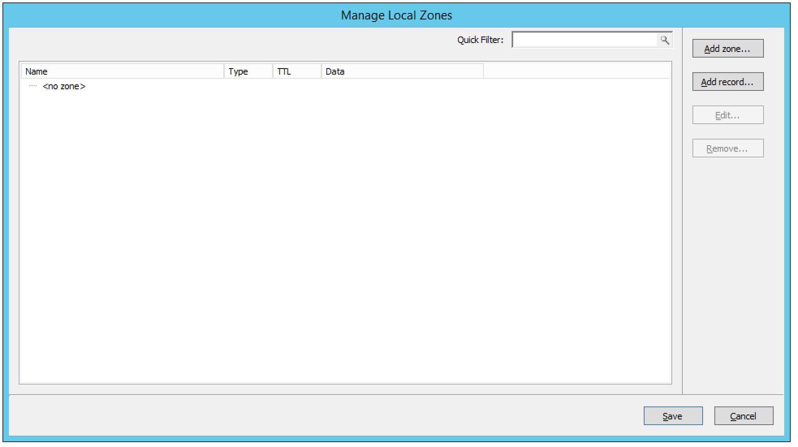

The dialog box is used to work with local zones and records.

After making changes to the local zone data, click Save to save and apply the changes.

The actions in the following sections are all available from within the Local Zone management dialog box.

Adding a Local Zone
^^^^^^^^^^^^^^^^^^^

To add a new local zone:

1. Click the Add zone button. A zone properties dialog box displays.

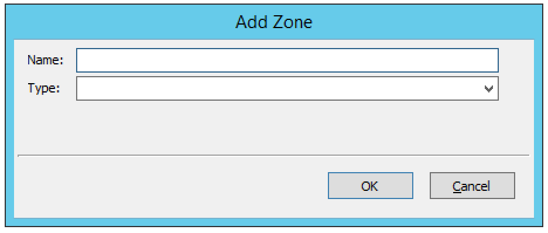

2. Enter the zone name in the field provided and choose the zone type from the drop-down list. There are several zone types available:

  deny.
    Do not send an answer and drop the query. If there is a match from local data, the query is answered.

  refuse.
    Send an error message reply, with rcode REFUSED. If there is a match from local data, the query is answered.

  static.
    If there is a match from local data, the query is answered. Otherwise, the query is answered with nodata or nxdomain. For a negative answer a SOA is included in the answer if present as local-data for the zone apex domain.

  transparent.
    If there is a match from local data, the query is answered. Otherwise, if the query has a different name, the query is resolved normally. If the query is for a name given in localdata but no such type of data is given in localdata, then a noerror nodata answer is returned.

  typetransparent.
    If there is a match from local data, the query is answered. If the query is for a different name, or for the same name but for a different type, the query is resolved normally. So, similar to transparent but types that are not listed in local data are resolved normally, so if an A record is in the local data that does not cause a nodata reply for AAAA queries.

  redirect.
    The query is answered from the local data for the zone name. There may be no local data beneath the zone name. This answers queries for the zone, and all subdomains of the zone with the local data for the zone. It can be used to redirect a domain to return a different address record to the end user, with local-zone: "example.com." redirect and local-data: "example.com. A 127.0.0.1" queries for www.example.com and www.foo.example.com are redirected, so that users with web browsers cannot access sites with suffix example.com.

3. Click OK to save the zone entry.

Editing/Deleting a Local Zone
^^^^^^^^^^^^^^^^^^^^^^^^^^^^^

To edit an existing local zone:

1. Select the zone and click the Edit button. The zone properties dialog box displays. Note that the server name is disabled and you can only change the zone type.

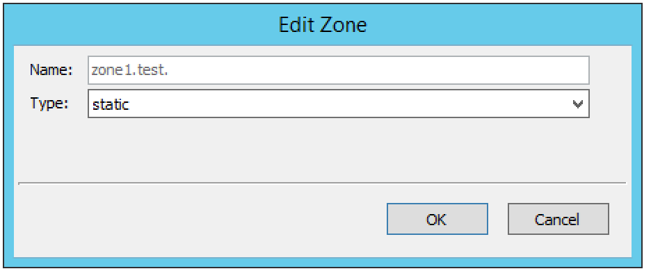

2. Make the necessary changes and click OK.

To delete a local zone:

1. Select the zone.

2. Click the Remove button. A confirmation box displays.

3. Click OK to delete the zone and all of the zone data.

Adding a Record
^^^^^^^^^^^^^^^

You can add a record to an existing local zone. It is also possible to add a record that does not belong to a specific local zone. Records that do not belong to any local zones are placed in the <no zone> section in the Local Zone management dialog box.

To add a new record:

1. Click the Add record button. A record properties dialog box displays. If you selected a zone before clicking the Add record button, the name of the selected zone has been added to the Name field.

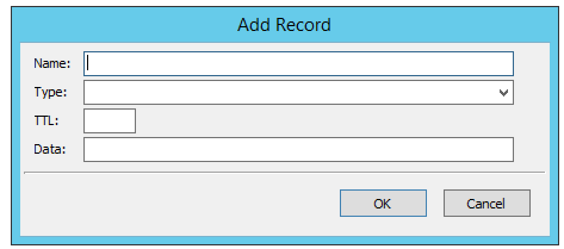

2. Enter a fully qualified record name including the zone name in the Name field.

3. Select the record type from the Type drop-down list.

4. Enter a TTL for the record in the TTL field (optional).

5. Enter the data for the record in the Data field.

6. Click OK to save the changes.

Editing/Deleting a Record
^^^^^^^^^^^^^^^^^^^^^^^^^

To edit an existing record:

1. Select the record.

2. Click the Edit button. The Edit Record dialog box displays.

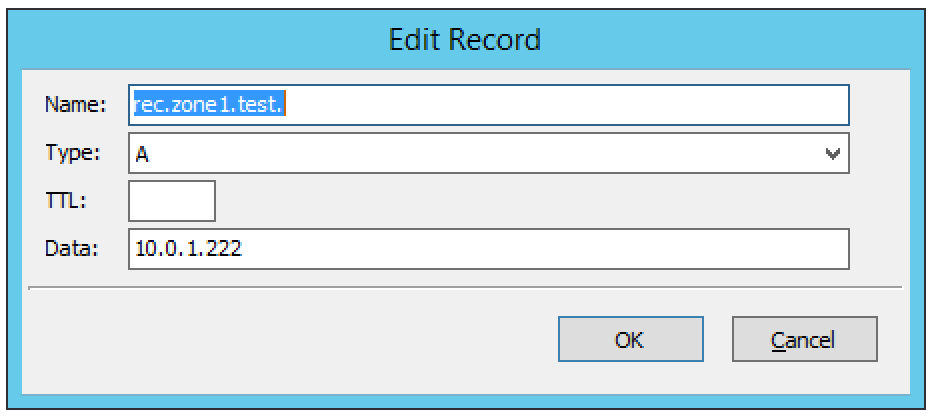

3. Make the necessary changes and click OK.

To delete a record:

1. Select the record.

2. Click the Remove button. A confirmation box displays.

3. Click OK to delete the record.
