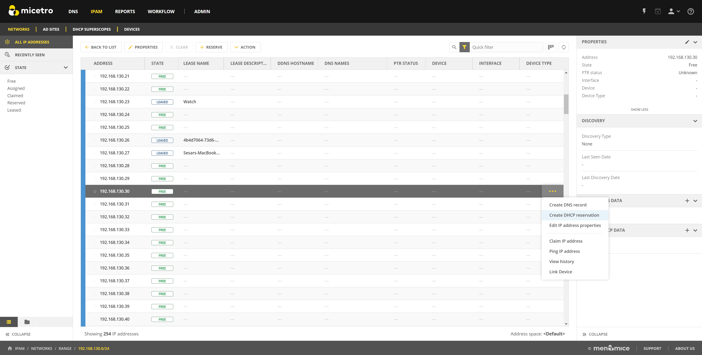
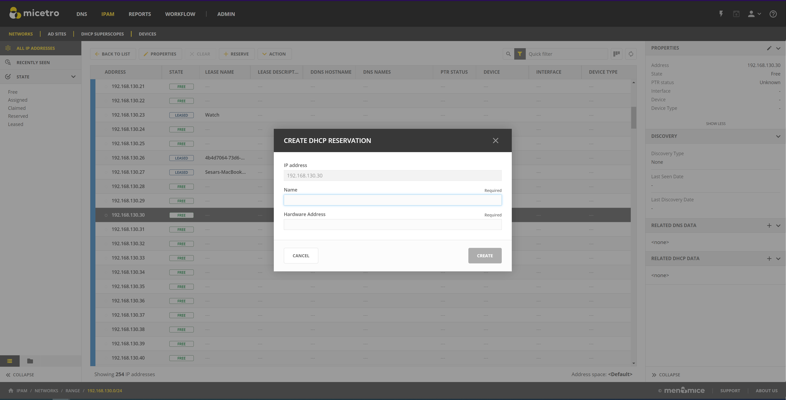
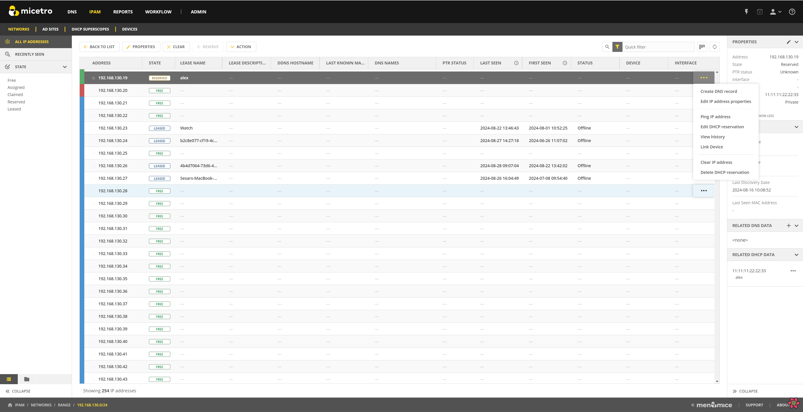
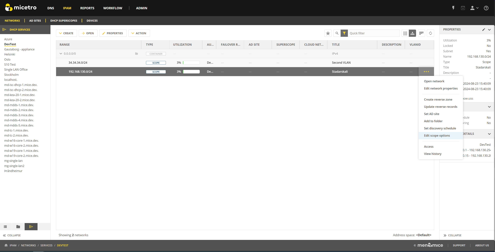
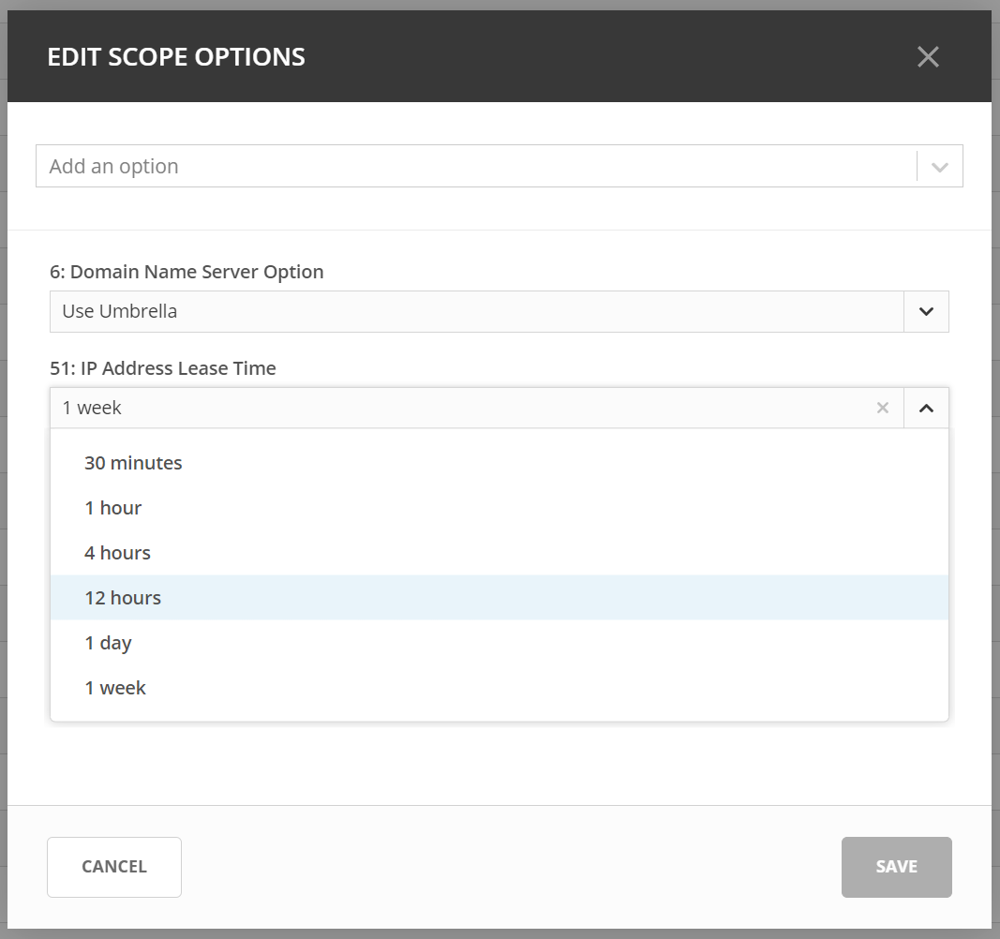

.. meta::
   :description: How to manage DHCP information with a Cisco Meraki service in Micetro
   :keywords: Cisco Meraki DHCP service, DHCP server, DHCP

.. _cisco-meraki:

.. Rename in toc to Cisco Meraki

Cisco Meraki
=============

Micetro seamlessly integrates with Cisco Meraki to provide centralized and customizable DDI orchestration for remote office networks. It helps synchronize and manage key IP resources and network data on the Cisco Meraki platform, such as IP ranges, addresses, VLANs, and DHCP settings. This ensures efficient mapping and management of these elements within the Micetro system.

This section provides an overview of managing your Meraki network infrastructure with Micetro.

.. tip::
    For information about how to set up a connection between Micetro and Meraki, see the instructions for :ref:`how to add a cloud service to Micetro<cloud>`.

Viewing Your Meraki Infrastructure
----------------------------------

When you have added your Meraki environment to Micetro, your networks will appear on the IPAM page. Micetro retrieves DHCP data from all networks that have an MX appliance. 

.. image:: ../../images/meraki/ipam-grid.png
  :width: 100%
  
Your VLANs and SingleLANs are displayed as scope instances in the IPAM view. In the bottom of the left filtering side bar there is a component that allows filtering on a DHCP service level.
Each of your Meraki networks will be displayed as a DHCP service so you can use that filter to limit the IPAM view to the VLANs/SingleLans for a single network.

.. image:: ../../images/meraki/ipam-grid-filtered.png
  :width: 100%

When you double click an a scope in the IPAM view, you will be taken to the IP address view for the scope. Here you can see the state of all the IP addresses in the scope. 
Your network clients will be visible as leases in the view. The IP address view is described in further details here (TODO link to networks.html#viewing-networks)

.. image:: ../../images/meraki/range-view.png
  :width: 100%

For further information about how Meraki data gets displayed in Micetro, please refer to :ref:`Mapping of Meraki objects to Micetro<meraki-mapping>`.

Overlapping LANs 
^^^^^^^^^^^^^^^^^^^^^^^^^^^^^^^^^^^^
In some Meraki environments there are LANs in different networks that share same IP address range. 
If there are multiple LANs that share the same IP range they are displayed as overlapping scope instances in Micetro.

.. image:: ../../images/meraki/scope-selector-1.png
  :width: 90%
  :align: center 

When you open up one of these scopes by double clicking on it a scope instance selector will be displayed in the IP Address view. 
The instance selector allows you to switch between different instances of the scope. 
When a different scope instance in the scope selector, the IP address view will update to show the status of the IP addresses for that instance.

.. image:: ../../images/meraki/scope-selector-2.png
  :width: 90%
  :align: center 

Updating Meraki DHCP configuration through Micetro
--------------------------------------------------

Since Micetro's connection with Meraki is bidirectional, Meraki environment configuration can also be updated through Micetro.
Users can perform some of the most common Meraki DHCP management tasks through. This includes the management of: 

    * DHCP Reservations
    * DHCP Options
    * DHCP Exclusions 

.. note::
    Micetro only allows for updates to VLAN networks. For Single LAN networks please use the Meraki dashboard.

DHCP Reservations
^^^^^^^^^^^^^^^^^^
You can create a DHCP reservation through Micetro from the IP address view by selecting an IP address in the table and either clicking the reserve button at the top
or by selecting "Create DHCP reservation" in the **row menu (...)** for the IP address.

From there you will get a dialog where you need to give the reservation a name and fill in the hardware address(MAC).

You can also create a DHCP reservation through the API through POST /dhcpScopes/{ownerRef}/dhcpReservations

You can also edit or delete a DHCP reservation through micetro from the IP address view by selecting an IP address that has an existing reservation in the table.
Then you can select "Edit DHCP Reservation" or "Delete DHCP Reservations" from either the action dropdown at the top of the page or the **row menu (...)** for the selected address. 

To update or remove DHCP reservations through the API you can use the following endpoints. 

PUT /dhcpReservations/{dhcpReservationRef}

DELETE /dhcpReservations/{dhcpReservationRef}

DHCP options
^^^^^^^^^^^^
Meraki users can manage their DHCP options on a scope level through Micetro. 
To manage DHCP options through Micetro select a scope from the IPAM view. 
Then you can select "Edit scope options" from either the action dropdown at the top of the page or from the **row menu (...)** for the selected scope.

This should open up the DHCP option dialog where you can view the options for the scope and update them if needed.

You can also update the DHCP Options for a scope through the API through PUT /dhcpScopes/{ref}/options

DHCP Exclusions
^^^^^^^^^^^^^^^^
Meraki users can manage excluded address ranges for their DHCP Scopes through Micetro.

TODO DESCRIBE WITH IMAGES

To Create, update or remove DHCP Exclusions through the API you can use the following endpoints. 

POST /dhcpScopes/{ownerRef}/dhcpExclusions

PUT /dhcpExclusions/{dhcpExclusionRef}

DELETE /dhcpExclusions/{dhcpExclusionRef}

**Related Resources/Links**

* :ref:`Mapping of Meraki objects to Micetro<meraki-mapping>`
