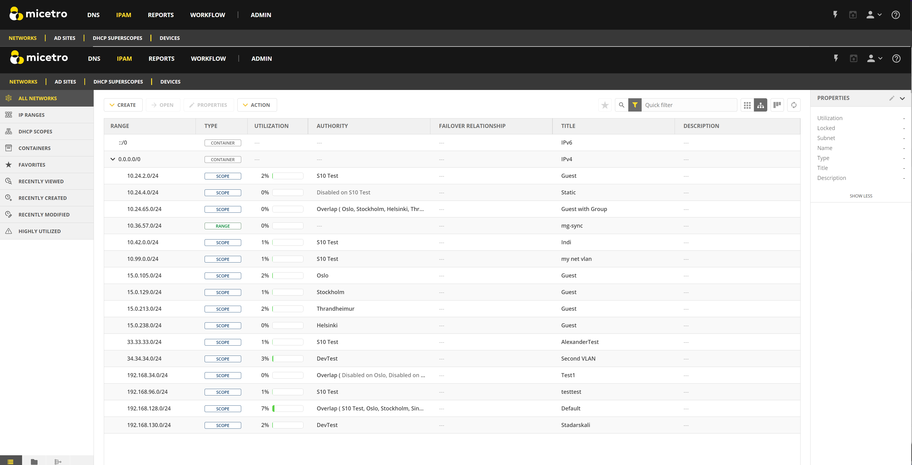
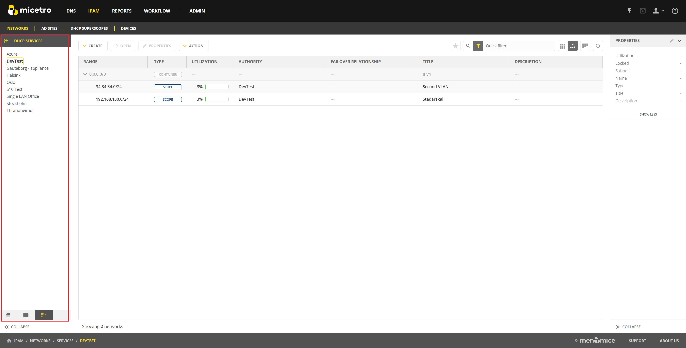
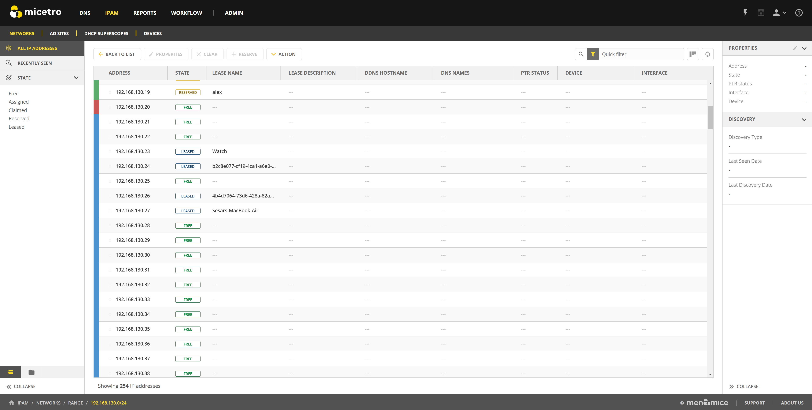
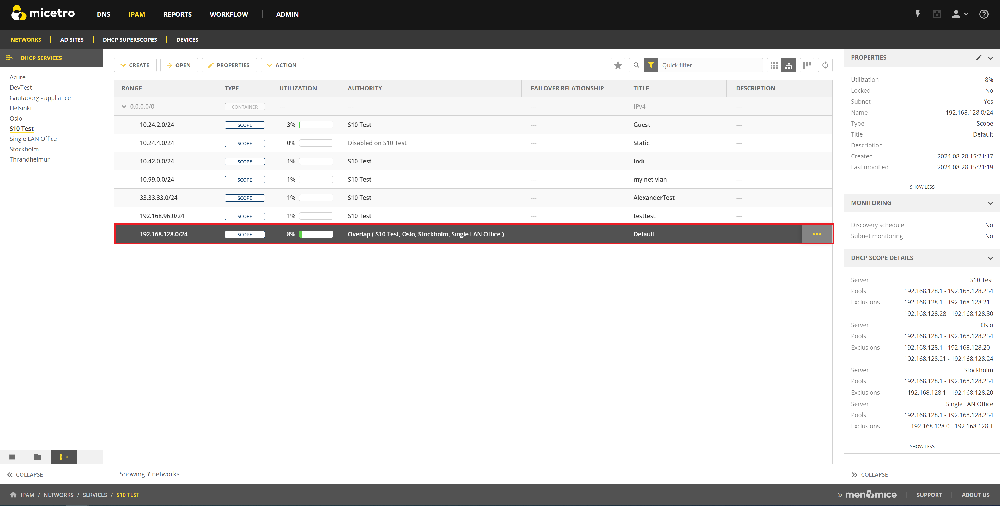
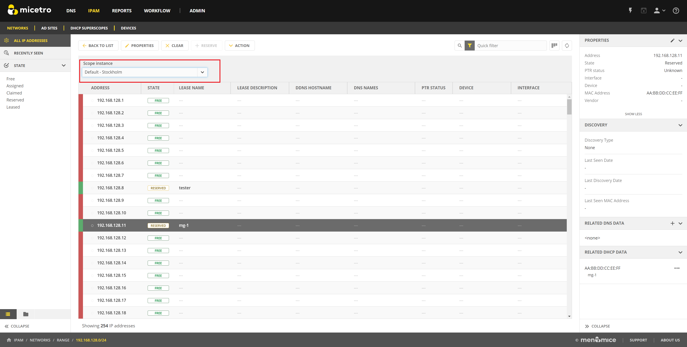

.. meta::
   :description: How to manage DHCP information with a Cisco Meraki service in Micetro
   :keywords: Cisco Meraki DHCP service, DHCP server, DHCP

.. Rename in toc to Cisco Meraki

.. _cisco-meraki:

Cisco Meraki
=============

Micetro integrates with Cisco Meraki to organize and customize DDI for remote office networks. It helps coordinate and manage important IP resources and network data on the Cisco Meraki platform, such as IP ranges, addresses, VLANs, and DHCP settings. This ensures efficient mapping and management of these elements within the Micetro system.

This section provides an overview of managing your Meraki network infrastructure with Micetro.

.. tip::
    For information about how to set up a connection between Micetro and Meraki, see the instructions for :ref:`how to add a cloud service to Micetro<cloud>`.

Viewing Your Meraki Infrastructure
----------------------------------

When you have added your Meraki environment to Micetro, your networks will appear on the **IPAM** page. Micetro retrieves DHCP data from all networks that have an MX appliance. 

  
VLANs and SingleLANs are displayed as scope instances in the IPAM view. The tabs at the bottom of the filtering sidebar on the left allow you to filter on a DHCP service level. Each Meraki network is displayed as a DHCP service, so you can use this filter to limit the view to the VLANs/SingleLans of a specific network:

Double-clicking a scope in the IPAM view brings up the IP address view for that scope, where you can monitor the status of all IP addresses within it. 
Network clients are shown as leases in the view. The IP address view is described in further details in :ref:`view-networks`.

For more information about how Meraki data is displayed in Micetro, see :ref:`Mapping of Meraki objects to Micetro<meraki-mapping>`.

Overlapping LANs 
^^^^^^^^^^^^^^^^^^^
In some Meraki environments, LANs on different networks may share same IP address range. When multiple LANs share the same IP range, they are displayed as overlapping scope instances in Micetro.

Double-clicking a scope opens a scope instance selector in the IP Address view. 
This selector allows you to switch between different instances of the scope. 
Selecting a different scope instance updates the IP address view to show the status of the IP addresses for the selected instance.

Updating Meraki DHCP Configuration via Micetro
--------------------------------------------------

Because Micetro's connection with Meraki is bidirectional, you con perform some of the most common Meraki DHCP management tasks directly through Micetro, including: 

    * :ref:`DHCP Reservations<reservations>`
    * :ref:`DHCP Options<options>`
    * :ref:`DHCP Exclusions<exclusions>` 

.. note::
    Micetro only allows updates to VLAN networks. For Single LAN networks, use the Meraki dashboard.

.. _reservations:

Creating DHCP Reservations
^^^^^^^^^^^^^^^^^^^^^^^^^^^
You can create a DHCP reservation through the IP address view in Micetro.

1. Select an IP address in the table and either click :guilabel:`Reserve` on the top toolbar or select :guilabel:`Create DHCP reservation` on the Row :guilabel:`...` menu for the IP address.

  .. image:: ../../images/meraki/create-reservation1.png
    :width: 90%

2. Give the reservation a name and fill in the hardware address(MAC).

  .. image:: ../../images/meraki/create-reservation2.png
    :width: 90%
  
**To create a DHCP reservation through the API, use the following endpoint**:

* ``POST /dhcpScopes/{ownerRef}/dhcpReservations``

Editing and Deleting Reservations
"""""""""""""""""""""""""""""""""
You can also edit or delete a DHCP reservation through Micetro from the IP address view.

**To edit or delete a reservation**:

1. Select an IP address that has an existing reservation in the table.
2. On the :guilabel:`Action` or Row :guilabel:`...` menu, select :guilabel:`Edit DHCP reservation` to modify the reservation or :guilabel:`Delete DHCP reservation(s)` to delete it. 

  .. image:: ../../images/meraki/edit-delete-reservation.png
    :width: 90%

**To update or remove DHCP reservations through the API, use the following endpoints**:

* ``PUT /dhcpReservations/{dhcpReservationRef}``

* ``DELETE /dhcpReservations/{dhcpReservationRef}``

.. _options:

Editing DHCP Scope Options
^^^^^^^^^^^^^^^^^^^^^^^^^^
You can manage your DHCP options on a scope level through Micetro. 

**To manage DHCP options**

1. Select the scope in the IPAM view. 
2. On the :guilabel:`Action` or the Row :guilabel:`...` menu, select :guilabel:`Edit scope options`.

  .. image:: ../../images/meraki/edit-options-1.png
    :width: 90%

3. In the dialog box that opens, you can view the options for the scope and update them if necessary.

  .. image:: ../../images/meraki/edit-options-2.png
    :width: 60%

**To update the DHCP scope options through the API, use the following endpoint**:

* ``PUT /dhcpScopes/{ref}/options``

.. _exclusions:

Adding DHCP Exclusions
^^^^^^^^^^^^^^^^^^^^^^
You can manage excluded address ranges for your DHCP scopes through Micetro.

**To create an exclusion**:

1. Select the relevant scope.

2. On :guilabel:`Action` or the Row :guilabel:`...` menu, select :guilabel:`Manage DHCP pools`.

3. Click :guilabel:`Add exclusion`.

  .. image::     ../../images/add-exclusion.png
    :width: 60%

4. In the **Add exclusion** dialog box, enter the range of addresses to be excluded in the :guilabel:`From` and :guilabel:`To` fields. All addresses within this range, including the start and end addresses, will be excluded.

**To create a DHCP exclusion through the API, use the following endpoint**:

* ``POST /dhcpScopes/{ownerRef}/dhcpExclusions``

Editing and Removing Exclusions
""""""""""""""""""""""""""""""""

**To edit or remove an existing exclusion**:

1. In the Manage DHCP pools dialog box, select the exclusion you want to edit or remove.

2. On the exclusion's row :guilabel:`...` menu, select :guilabel:`Edit` to modify the exclusion or :guilabel:`Remove` to delete it.

**To update or remove DHCP exclusions through the API, use the following endpoints**:

* ``PUT /dhcpExclusions/{dhcpExclusionRef}``

* ``DELETE /dhcpExclusions/{dhcpExclusionRef}``

**Related Topics**

* :ref:`Mapping of Meraki objects to Micetro<meraki-mapping>`
