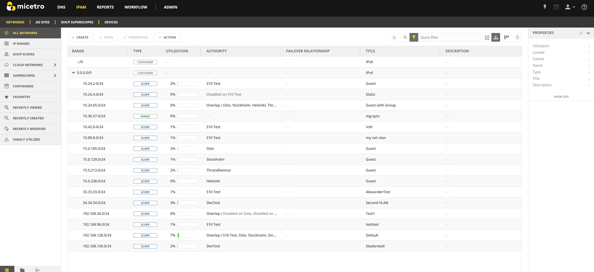
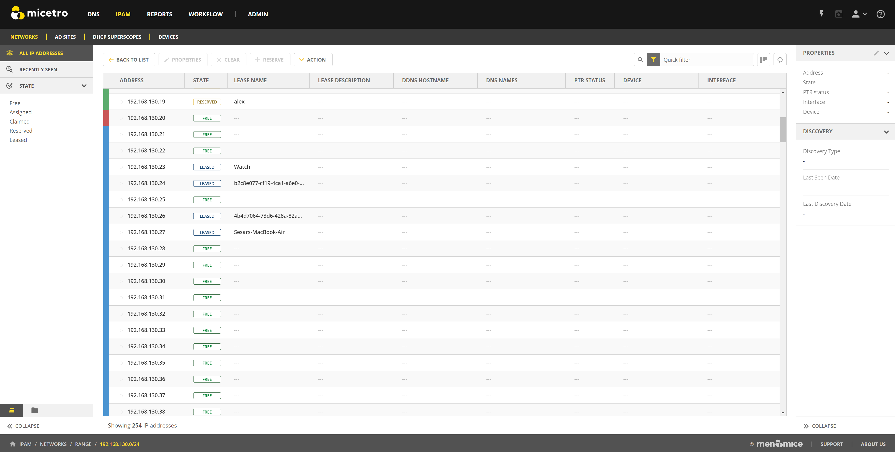
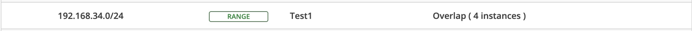
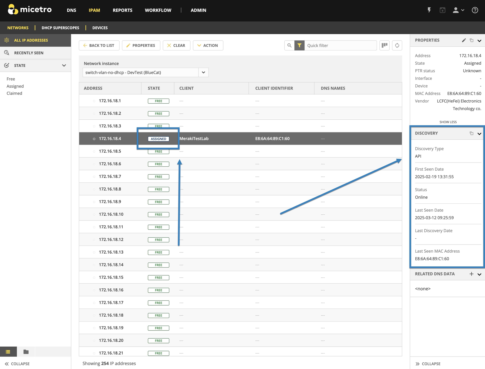
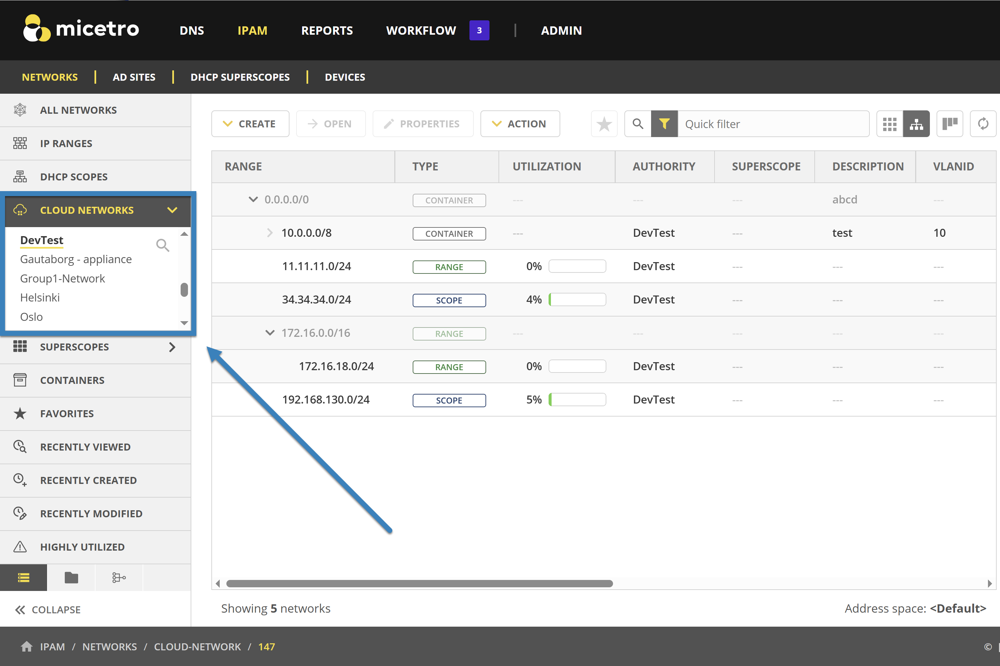
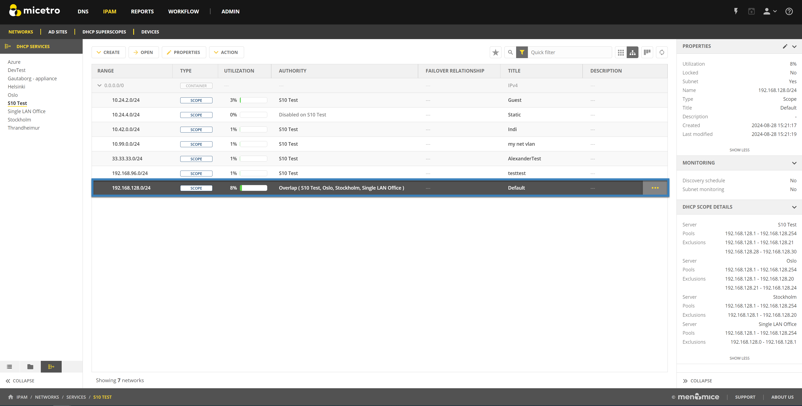
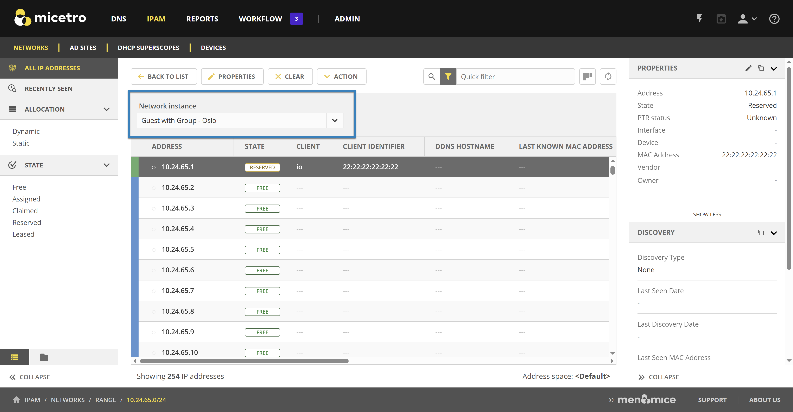

.. meta::
   :description: How to manage DHCP information with a Cisco Meraki service in Micetro
   :keywords: Cisco Meraki DHCP service, DHCP server, DHCP

.. Rename in toc to Cisco Meraki

.. _cisco-meraki:

Cisco Meraki
=============

Micetro integrates with Cisco Meraki to organize and customize DDI for remote office networks. It helps coordinate and manage important IP resources and network data on the Cisco Meraki platform, such as IP ranges, addresses, virtual local area networks (VLANs), and DHCP settings. This ensures efficient mapping and management of these elements in Micetro.

In Micetro, you can synchronize and manage both Meraki networks that have DHCP enabled and those that don't. Refer to :ref:`synchronize-meraki` below for more information about managing synchronized Meraki clients.

An ``admin`` user can configure synchronization parameters for your Meraki integration in :ref:`Advanced System Settings<admin-advanced>`.

.. tip::
    For information about how to set up a connection between Micetro and Meraki, refer to these instructions on :ref:`how to add a cloud service to Micetro<cloud>`.

Viewing Your Meraki Infrastructure
----------------------------------
When you have added your Meraki environment to Micetro, your networks will appear on the **IPAM** page. Micetro retrieves subnets from all networks that have an MX appliance. 

Double-click a range or scope in the **IPAM** grid to view its associated IP addresses. This opens the **IP Addresses** grid, where you can monitor the statuses of all IP addresses within the range or scope. 
When a Meraki client is synchronized in Micetro, the IP address history updates. For more information about viewing IP addresses, refer to :ref:`view-networks`.

.. _synchronize-meraki:

Viewing Synchronized Meraki Clients
-----------------------------------
It's possible to synchronize Meraki subnets and their clients regardless of whether the subnets have DHCP enabled or disabled, or have configured a DHCP relay to another server. A subnet is associated with a :guilabel:`Range`.

For Meraki subnets, the **Authority** column of the **IPAM** data grid is populated with the Meraki network to which the subnet belongs. Multiple subnets can be associated with the same range, in which case the **Authority** column is populated with **Overlap**. Depending on how many ranges the subnet is associated with, the **Authority** column also displays the names or the number of associated ranges.

Clients on DHCP networks may have a :guilabel:`Leased` or :guilabel:`Reserved` **State**, depending on whether the client has been temporarily or permanently assigned.

Clients on non-DHCP networks have an :guilabel:`Assigned` **State** and their **Discovery Type** is API, which can be viewed in the Inspector.

For more information about how Meraki data is displayed in Micetro, refer to :ref:`Mapping of Meraki objects to Micetro<meraki-mapping>`.

Managing VLANs and LANs
-----------------------
In Micetro, Meraki networks are cloud networks. You can use the :guilabel:`Cloud Networks` filter in the left sidebar to filter the data grid by an individual cloud network and view the VLANs/single LANs of that specific network.

Overlapping LANs 
^^^^^^^^^^^^^^^^^
In some Meraki environments, LANs on different networks may share the same IP address range. When multiple LANs share the same IP range, they are displayed in Micetro as overlapping instances. The **Authority** column of the grid displays "Overlap" and the names or number of instances, depending on the number of overlapping instances.

Double-clicking a scope or range with overlapping LANs opens a **Network instance** selector in the **IP Addresses** grid. You can use the selector to switch between different instances of the network. Selecting a different network instance updates the **IP Addresses** grid to show the statuses of the IP addresses for the selected instance.

Updating Meraki DHCP Configuration via Micetro
----------------------------------------------
Because Micetro's connection with Meraki is bidirectional, you can perform some of the most common Meraki DHCP management tasks for DHCP-enabled networks directly through Micetro, including: 

    * :ref:`DHCP Reservations<reservations>`
    * :ref:`DHCP Options<options>`
    * :ref:`DHCP Exclusions<exclusions>` 

.. note::
    Micetro only allows updates to VLAN networks. For single LAN networks, use the Meraki dashboard.

.. _reservations:

Creating DHCP Reservations
^^^^^^^^^^^^^^^^^^^^^^^^^^^
You can create a DHCP reservation through the **IP Address** page in Micetro.

1. Select an IP address in the data grid and select :guilabel:`Reserve` on the task bar or use the Row :guilabel:`...` menu to select :guilabel:`Create DHCP reservation`.

  .. image:: ../../images/meraki/create-reservation1.png
    :width: 90%

2. Give the reservation a **Name** and enter the **Hardware Address** (MAC).

  .. image:: ../../images/meraki/create-reservation2.png
    :width: 90%

3. Select :guilabel:`Create`.

**To create a DHCP reservation through the API, use the following endpoint**:

``POST /dhcpScopes/{ownerRef}/dhcpReservations``

Editing and Deleting Reservations
^^^^^^^^^^^^^^^^^^^^^^^^^^^^^^^^^
On the **IP Addresses** grid, you can also edit or delete a DHCP reservation.

**To edit or delete a reservation**:

1. In the grid, select an IP address that has an existing reservation.
2. Using the :guilabel:`Action` or Row :guilabel:`...` menu, select :guilabel:`Edit DHCP reservation` to modify the reservation or :guilabel:`Delete DHCP reservation(s)` to delete it. 

  .. image:: ../../images/meraki/edit-delete-reservation.png
    :width: 90%

**To edit or delete DHCP reservations through the API, use the following endpoints**:

* To edit: ``PUT /dhcpReservations/{dhcpReservationRef}``

* To delete: ``DELETE /dhcpReservations/{dhcpReservationRef}``

.. _options:

Editing DHCP Scope Options
^^^^^^^^^^^^^^^^^^^^^^^^^^
You can manage your DHCP options on a scope level through Micetro. 

**To edit DHCP options**

1. In the **IPAM** grid, select the scope whose options you want to edit. 
2. Using the :guilabel:`Action` or the Row :guilabel:`...` menu, select :guilabel:`Edit scope options`.

  .. image:: ../../images/meraki/edit-options-1.png
    :width: 90%

3. In the dialog box, you can view the options for the scope and update them, if necessary.

  .. image:: ../../images/meraki/edit-options-2.png
    :width: 60%

**To edit the DHCP scope options through the API, use the following endpoint**:

``PUT /dhcpScopes/{ref}/options``

.. _exclusions:

Adding DHCP Exclusions
^^^^^^^^^^^^^^^^^^^^^^
You can manage excluded address ranges for your DHCP scopes through Micetro.

**To create an exclusion**:

1. In the **IPAM** data grid, select the relevant scope.

2. Using the :guilabel:`Action` or the Row :guilabel:`...` menu, select :guilabel:`Manage DHCP pools`.

3. In the dialog box, select :guilabel:`Add Exclusion`.

  .. image::     ../../images/add-exclusion.png
    :width: 60%

4. In the **Add Exclusion** dialog box, enter the range of addresses you want to exclude in the :guilabel:`From` and :guilabel:`To` fields and select :guilabel:`Add`. All addresses within this range, including the start and end addresses, will be excluded.

5. Select :guilabel:`Save`.

**To create a DHCP exclusion through the API, use the following endpoint**:

* ``POST /dhcpScopes/{ownerRef}/dhcpExclusions``

Editing and Removing Exclusions
^^^^^^^^^^^^^^^^^^^^^^^^^^^^^^^
When necessary, you can edit and/or remove exclusions from a DHCP scope.

**To edit or remove an existing exclusion**:

1. In the **IPAM** grid, select the scope whose exclusions you want to edit or remove.

2. Use the :guilabel:`Action` or Row :guilabel:`...` menu to select :guilabel:`Manage DHCP pools`.

3. In the dialog box, select the exclusion you want to edit or remove.

4. Using the exclusion's Row :guilabel:`...` menu, select :guilabel:`Edit` to modify the exclusion or :guilabel:`Remove` to delete it.

**To update or remove DHCP exclusions through the API, use the following endpoints**:

* to edit: ``PUT /dhcpExclusions/{dhcpExclusionRef}``

* To delete: ``DELETE /dhcpExclusions/{dhcpExclusionRef}``

**Related Topics**

* :ref:`Mapping of Meraki objects to Micetro<meraki-mapping>`
