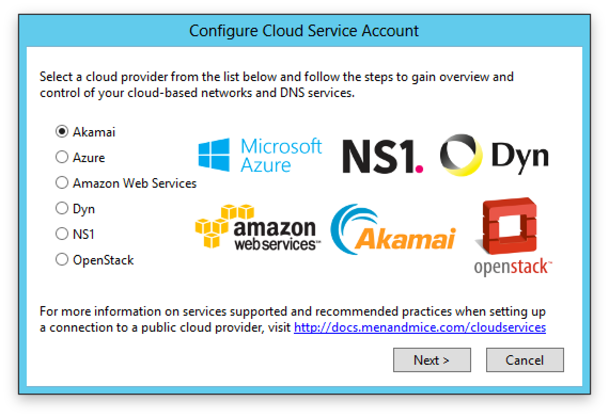

.. _configuring-cloud:

Configure Cloud Integration
===========================

Set up and configuration
------------------------

Before adding a cloud service instance
^^^^^^^^^^^^^^^^^^^^^^^^^^^^^^^^^^^^^^

The Men&Mice Suite communicates with the cloud services through Men&Mice Central (IPAM) and the Men&Mice DNS controller (DNS).

Before continuing, make sure:

* The DNS controller is installed and set up on the machine running Men&Mice Central.

* The machine running central can connect to the specific cloud instance on port  443/TCP.

If you want to add multiple AWS cloud accounts using single credentials make sure to check out how to configure an AWS multi account setup.

Adding a cloud service
----------------------

The following are the steps that are needed to start using a cloud service in Men&Mice.

1. File > New > Cloud Service. Access the Cloud service wizard by right clicking Cloud Services in the Object Browser of the Management Console and selecting "New Cloud Service ..." or highlight "Cloud Services" in the Object Browser and clicking the "+" sign in the manager window.

2. The following dialog is shown:

Proceed with one of the Cloud providers shown below and click "Next":

* :ref:`connect-akamai`

* :ref:`connect-azure`

* :ref:`connect-aws`

* :ref:`connect-openstack`

* :ref:`connect-ns1`

* :ref:`connect-dyn`

.. _connect-akamai:

Akamai Fast DNS
^^^^^^^^^^^^^^^

Fill in the following fields required to connect to Akamai Fast DNS

+---------------+-----------------------------------------------------------+
| Name          | The name of the cloud service in Men&Mice                 |
+---------------+-----------------------------------------------------------+
| Client Secret | The credentials needed for Men&Mice to connect to         |
+---------------+                                                           |
| Host          | the cloud instance                                        |
+---------------+                                                           |
| Access token  |                                                           |
+---------------+                                                           |
| Client token  | **Obtaining Access Credentials**                          |
|               | Please refer to the following on how to create            |
|               | API Access Credentials for use by the suite:              |
|               | https://developer.akamai.com/introduction/Prov_Creds.html |
+---------------+-----------------------------------------------------------+

.. warning:: Server time setting constrictions
  Akamai OPEN APIs are time sensitive! Ensure that the system your client runs on is synchronized with a Stratum 2 or better time source. (source: https://developer.akamai.com/introduction/Client_Auth.html)

.. danger::
  If the time on the server that the DNS Remote is running on deviates enough from Coordinated Universal Time the authentication will fail and it will not be possible to access/update zone through the suite.

Go to :ref:`finish-cloud-config`.

.. _connect-azure:

Azure DNS
^^^^^^^^^

Fill in the following fields required to connect to Azure:

+-----------------+-----------------------------------------------------------+
| Name            | The name of the cloud service in Men&Mice                 |
+-----------------+-----------------------------------------------------------+
| Subscription ID |                                                           |
+-----------------+                                                           |
| Tenant ID       | The credentials needed for Men&Mice to connect to         |
+-----------------+ the cloud instance                                        |
| Client ID       |                                                           |
+-----------------+                                                           |
| Client secret   |                                                           |
+-----------------+-----------------------------------------------------------+

.. information::
  See Configure Azure DNS.

Go to :ref:`finish-cloud-config`.

.. _connect-aws:

Amazon Web Services
^^^^^^^^^^^^^^^^^^^

Fill in the following fields required to connect to AWS:

+-------------------+-----------------------------------------------------------------------------+
| Name              | The name of the cloud service in Men&Mice                                   |
+-------------------+-----------------------------------------------------------------------------+
|                   | The credentials needed for Men&Mice to connect to                           |
| Access Key ID     | the cloud instance                                                          |
+-------------------+                                                                             |
|                   | **Obtaining Access Credentials**                                            |
| Secret Access Key | Please refer to the following on how to create API Access                   |
|                   | Credentials for use by the suite:                                           |
|                   | https://docs.aws.amazon.com/general/latest/gr/managing-aws-access-keys.html |
+-------------------+-----------------------------------------------------------------------------+

Read more about :ref:`aws-multi-account`.

Go to :ref:`finish-cloud-config`.

.. _connect-openstack:

Openstack
^^^^^^^^^

Fill in the following fields required to connect to OpenStack:

+-----------------+-----------------------------------------------------------+
| Name            | The name of the cloud service in Men&Mice                 |
+-----------------+-----------------------------------------------------------+
| Server Node     |                                                           |
+-----------------+                                                           |
| User Name       | The credentials needed for Men&Mice to connect to         |
+-----------------+ the cloud instance                                        |
| Password        |                                                           |
+-----------------+                                                           |
| Require HTTPS   |                                                           |
+-----------------+-----------------------------------------------------------+

Go to :ref:`finish-cloud-config`.

.. _connect-ns1:

NS1
^^^

Fill in the following fields required to connect to NS1:

+-------------------+-----------------------------------------------------------------------------+
| Name              | The name of the cloud service in Men&Mice                                   |
+-------------------+-----------------------------------------------------------------------------+
|                   | The credentials needed for Men&Mice to connect to                           |
|                   | the cloud instance                                                          |
|                   |                                                                             |
| API Key           | **Obtaining Access Credentials**                                            |
|                   | Please refer to the following on how to create API Access                   |
|                   | Credentials for use by the suite:                                           |
|                   | https://ns1.com/knowledgebase/creating-and-managing-api-keys                |
+-------------------+-----------------------------------------------------------------------------+

Go to :ref:`finish-cloud-config`.

.. _connect-dyn:

Dyn DNS
^^^^^^^

Fill in the following fields required to connect to Dyn:

+-----------------+-----------------------------------------------------------+
| Name            | The name of the cloud service in Men&Mice                 |
+-----------------+-----------------------------------------------------------+
| Customer Name   |                                                           |
+-----------------+                                                           |
| User Name       | The credentials needed for Men&Mice to connect to         |
+-----------------+ the cloud instance                                        |
| Password        |                                                           |
+-----------------+-----------------------------------------------------------+

Go to :ref:`finish-cloud-config`.

.. _finish-cloud-config:

Finishing the configuration
^^^^^^^^^^^^^^^^^^^^^^^^^^^

After finishing going through the wizard, the DNS service (if applicable) and any subnets defined (if applicable) will be shown in the DNS servers and IP Address Ranges, respectively.

Editing a cloud service instance
--------------------------------

To edit the properties for a cloud instance, right click on a cloud instance in the Object Browser and select "Properties".

Removing a cloud service
------------------------

To remove a cloud service, right click on the specific cloud service in the Object Browser and select "Delete ...".

.. warning::
  By removing the cloud service, the associated DNS service and the corresponding zones will be removed. Additionally, any subnets and cloud networks will also be removed.

Click "Yes" to remove the cloud service.

Removing a cloud network
------------------------

To remove a cloud network, right click on the specific cloud network in the object browser or in the manager window and select "Delete ..."
