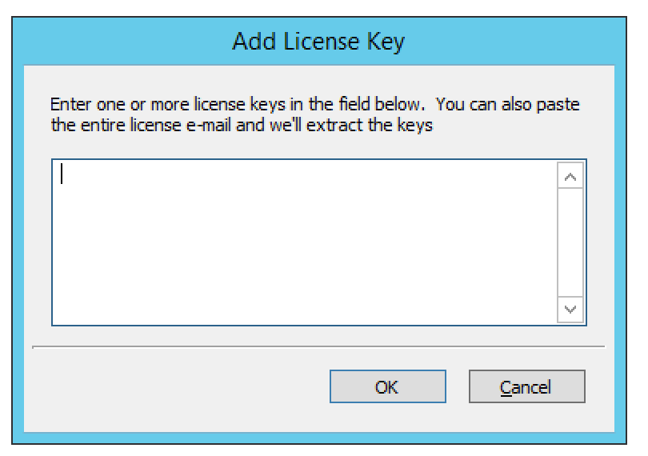

.. _console-admin-license:

License Management (Management Console, deprecated)
===================================================

.. important::
  This page describes the deprecated method of license management in the Management Console.

  From version 10.1, license management has been migrated to the web application: see :ref:`admin-license`.

There are five different keys, one each for:

* the DNS module

* the IPAM and DHCP modules

* enabling management of Men&Mice Virtual Appliances

* the Workflow module

* the Reporting module

The *License Management* dialog box in the Management Console shows detailed information about every key entered. It also contains information about license utilization by showing the number of DNS zones and IP Addresses in use.

.. note::
  The IPAM license key unlocks **both** the DHCP and IPAM functionality of Micetro.

Adding a License Key
--------------------

1. From the menu bar, select :menuselection:`Tools --> License Management`. The *License Management* dialog box displays. All currently entered license keys are displayed.

.. image:: ../../../images/admin-license-empty.png
  :width: 80%
  :align: center

2. To add a key, click the :guilabel:`Add Key` button. The *Add License Key* dialog box displays.

3. In the *License Key* field, type or paste the license key. Then click :guilabel:`OK`.

Adding license keys for the first time
^^^^^^^^^^^^^^^^^^^^^^^^^^^^^^^^^^^^^^

.. note::
  When logging in to the Web Application for the first time, and no license keys have been configured, administrators will be prompted and able to paste their license keys through the Web Application as well.

The Management Console will prompt for license keys on the first login.

Removing a License Key
----------------------

1. From the menu bar, select :menuselection:`Tools --> License Management`. *The License Management* dialog box displays. All currently entered license keys are displayed.

2. Highlight the key you want to remove.

3. Click the :guilabel:`Remove Key` button.
