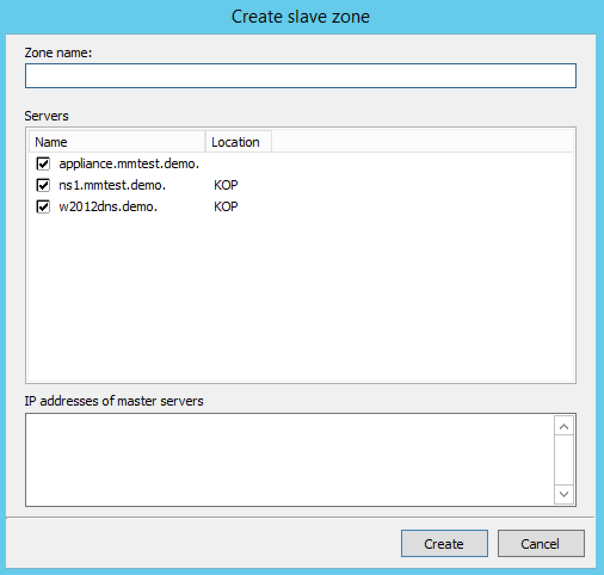

.. _console-create-slave-zone:

Slave Zone (Management Console)
-------------------------------

Through this function, you create a slave zone.

1. In the Object List, right-click on :guilabel:`DNS Zones` and, from the shortcut menu, select :guilabel:`New Slave Zone`. The *Create slave zone* dialog box displays.

2. In the **Zone name** field, type the name for this slave zone.

3. In the **Servers** list, click all the servers to which this slave applies.

4. In the **IP Addresses of master servers**, click in the field, and type the IP Address of any master servers for this zone.

5. When all selections/entries are made, click :guilabel:`Create`. The new slave zone is created and displays in the Detail View of the main window.

Slave Server Assignments
^^^^^^^^^^^^^^^^^^^^^^^^

Use the following procedure to assign a slave server to a particular zone so it will always work from the context of the zone.

1. In the Object Section, under :guilabel:`DNS Servers`, select the name server containing the zone to which you want to assign a slave server.

2. In the Object List, right-click on the zone to which you want to assign the slave server.

3. From the shortcut menu, select :guilabel:`Add slave server`.

4. Choose the desired slave server from the submenu that displays. That zone now displays as a slave on the server that was specified.

.. image:: ../../../images/console-dns-zones-slave-assignments.png
  :width: 50%
  :align: center
