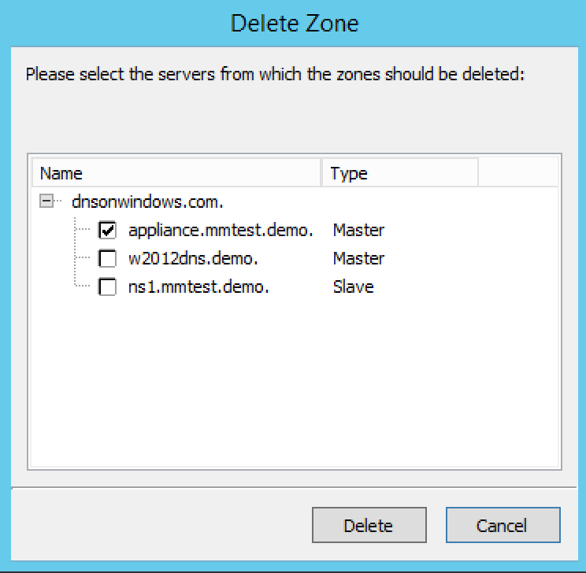

.. meta::
   :description: The command to delete a zone from one or more servers in Micetro by Men&Mice
   :keywords: DNS zones, Men&Mice

.. _console-delete-dns-zone:

Delete zone (Management Console, deprecated)
--------------------------------------------

Use this command to delete a zone from one or more servers. Before using this command, select the zone you want to delete from the Management Console; the Delete Zone dialog box displays and shows a list of servers on which that zone resides. By default, the zone will be removed from all servers (i.e., all servers are checked). If you want to keep it on one or more servers, clear the checkbox next to that server. Click the Delete button to remove the zone from the selected servers.

1. In the Object Section, select :guilabel:`DNS Zones` to view all zones.

2. Select the zone(s) that you want to delete. To select more than one zone, hold down the Ctrl key while making your selections.

3. Right-click on any selected zone and, from the shortcut menu, select :guilabel:`Delete`. The *Delete Zone* dialog box displays, showing each zone you selected and a list of servers that currently serve that zone. The zone(s) you selected will be deleted from every server that is checked on this list. To keep the zone on a particular server, clear the checkbox next to that server.

4. To remove the zone(s) from the selected servers, click the :guilabel:`Delete` button. The zone is removed from the servers.

