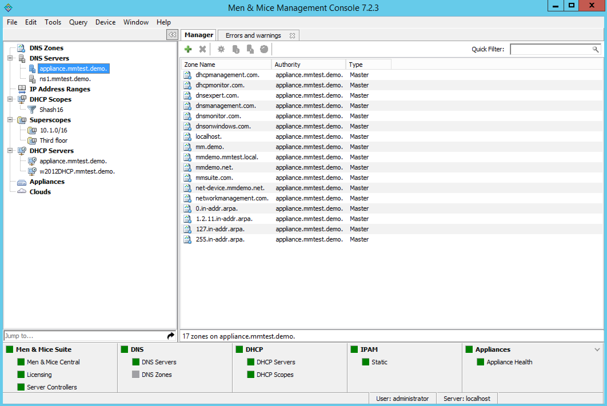

.. meta::
   :description: You can use the Management Console in Micetro to view all of the existing DNS zones at once, regardless of the server to which they belong.
   :keywords: DNS zones, DDI Solution

.. _console-dns-zone-viewing:

Zone Viewing (Management Console, obsolete)
---------------------------------------------

All Zones on All Servers
^^^^^^^^^^^^^^^^^^^^^^^^

You can use the Management Console to view all of the existing DNS zones at once, regardless of the server to which they belong.

In the Object Section of the Management Console, click the :guilabel:`DNS Zones` object. This causes all existing zones (to which you have access) to appear in the Object List.

Single Name Server Zones
^^^^^^^^^^^^^^^^^^^^^^^^

In the Object Section of the Management Console, locate the DNS server that owns the zones you want to view and click on it. (The DNS server(s) will be listed under the DNS Servers object. You may need to click the :guilabel:`+` sign in order to see it.) When a server is selected, the zone information for that server displays in the Objects List.

Zone Contents
^^^^^^^^^^^^^

The :guilabel:`Zone` tab provides a detailed look at the data inside of a zone, including its resource records. The name of the zone always displays in the title bar. The header record (a.k.a. Start of Authority or SOA record) displays as a collection of fields above the resource records.

To view the contents of a particular zone, double-click on it. This opens the Zone tab.

.. image:: ../../../images/console-dns-zones-zone-contents.png
  :width: 80%
  :align: center

SOA Panel
"""""""""

Since the SOA record is seldom modified after it is created, the Zone tab has a built-in control to allow you to conceal the *SOA panel* from view. This allows you to view more of the resource record area below. If you look at the left edge of the Zone tab, just above the record table, you will notice three short horizontal lines, stacked vertically. This is the :guilabel:`Hide/Show SOA panel` control. Click on this control once to hide the SOA panel. Click on it again to make it re-appear.

SOA Fields
""""""""""

.. csv-table::
  :header: "Field", "Description"
  :widths: 15, 75

  "Master", "This field gives the name of the server that acts as master server for the zone."
  "Hostmaster", "This field is properly formatted by giving the e-mail address of the person responsible for zone with the @ symbol replaced with a period (.). For example, instead of hostmaster@example.com type hostmaster.example.com. The username part of the e-mail address cannot contain a (verbatim) dot (.). See RFC 1912 'Common DNS Operational and Configuration Errors', Section 2.2 for additional information."
  "Serial Number", "The serial number is a ten-digit number consisting of the year, the month, the day, and a two-digit daily revision number. (Actually, it is any integer between 0 and ~ 4 billion, but the preceding is the standard convention.) To create a unique serial number, the Management Console adds 1 to the daily revision number every time the zone is saved."
  "Refresh", "This is the period (in seconds) that determines how often slave servers will check with the master server to determine if their zone files are up to date. This is done by checking the serial number. The default value for this field is 28800, which equates to once every 8 hours."
  "Retry", "This determines the period that a slave server will wait before trying to re-contact the master zone (in the event that an earlier contact attempt is unsuccessful). The default value is 7200 seconds, or once every 2 hours."
  "Expire", "This value determines how long a slave server will keep serving a zone after its last successful contact to the master name server. Once the zone has expired, the slave stops giving information about the zone because it is deemed unreliable. The default expiration period is 604800 seconds, or 1 week."
  "Neg. caching", "This field is only available when connected to a BIND server. This value specifies how long a server will retain (cache) the knowledge that something does not exist. The default value is 86400 seconds, 24 hours."
  "Default TTL", "This value serves as the default time-to-live for all records without an explicit TTL value. The default value is 86400 seconds, 24 hours."
  "TTL of SOA", "This TTL applies to the SOA record. It represents the maximum time in seconds any outside DNS server should cache this data. The default value is 86400 seconds, 24 hours."
