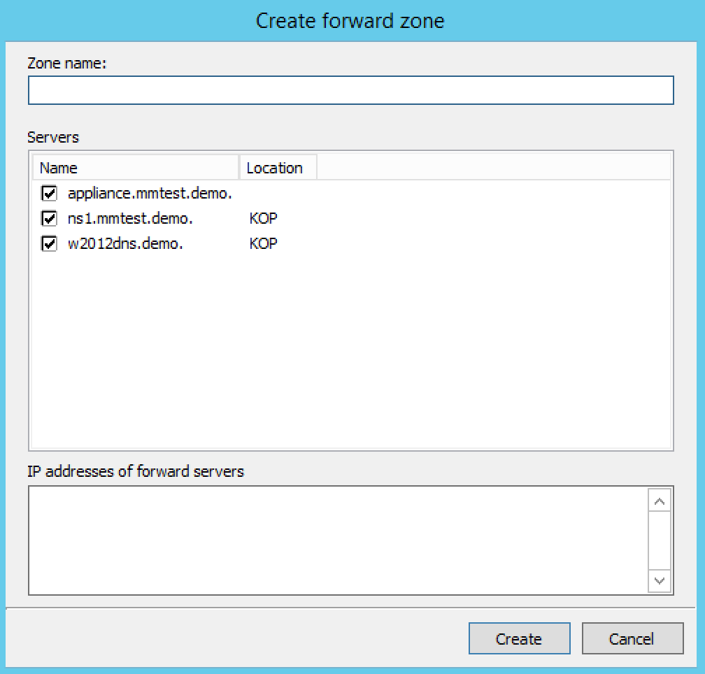

.. meta::
   :description: How to create a forward zone in the Micetro by Men&Mice Management Console
   :keywords: DNS zones, IP address management

.. _console-forward-zone:

Forward Zone (Management Console, deprecated)
------------

Through this function, you create a forward zone.

1. In the Object List, right-click on :guilabel:`DNS Zones` and, from the shortcut menu, select :guilabel:`New Forward Zone`. The *Create forward zone* dialog box displays.

Zone name
  Type the name for this forward zone. You cannot use spaces in the name.

Servers
  Select all the servers to which this forward zone applies by clicking in the checkbox.

IP Addresses of forward servers
  Type the IP Address of any master servers for this zone.

2. Click :guilabel:`Create`. The new forward zone is created and displays in the Detail View of the main window.
