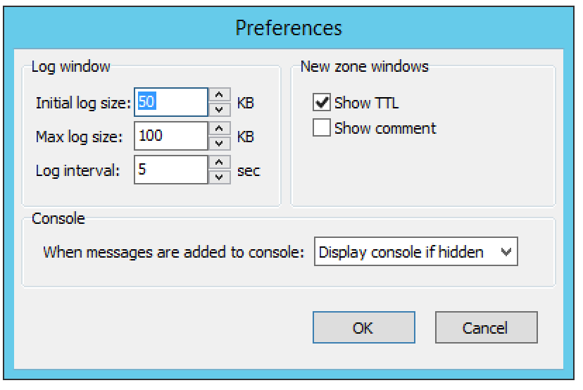
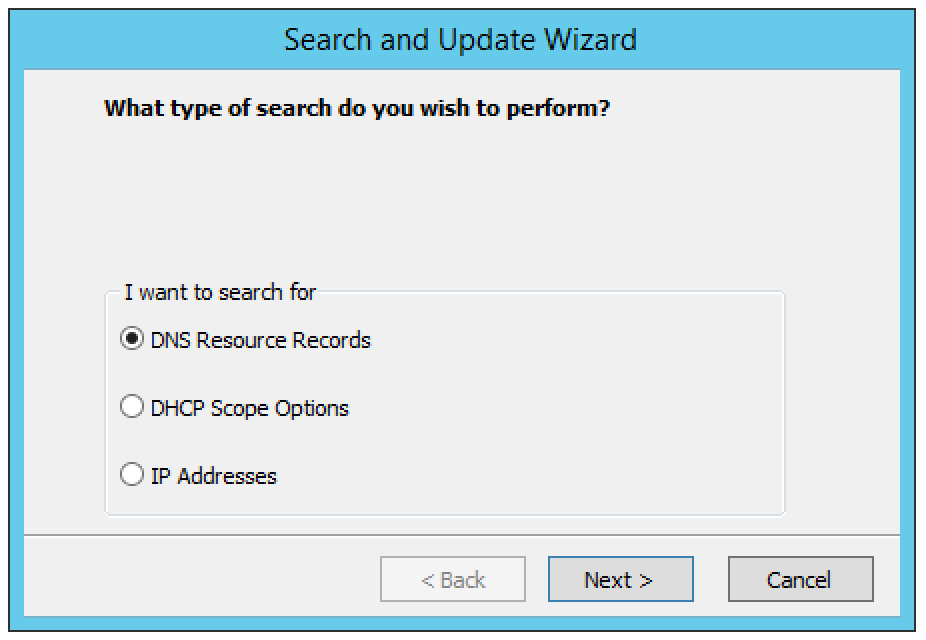
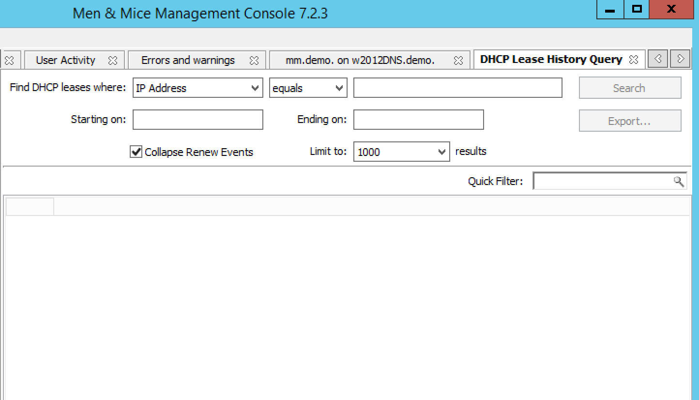
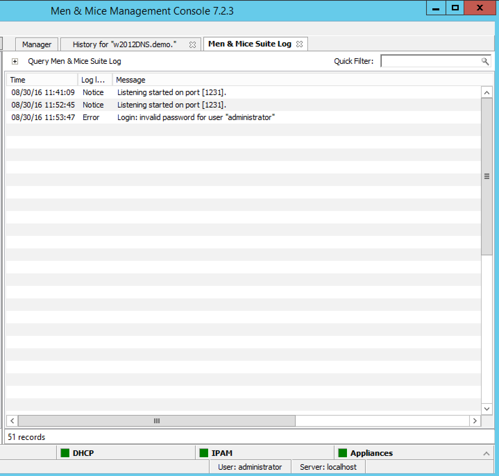
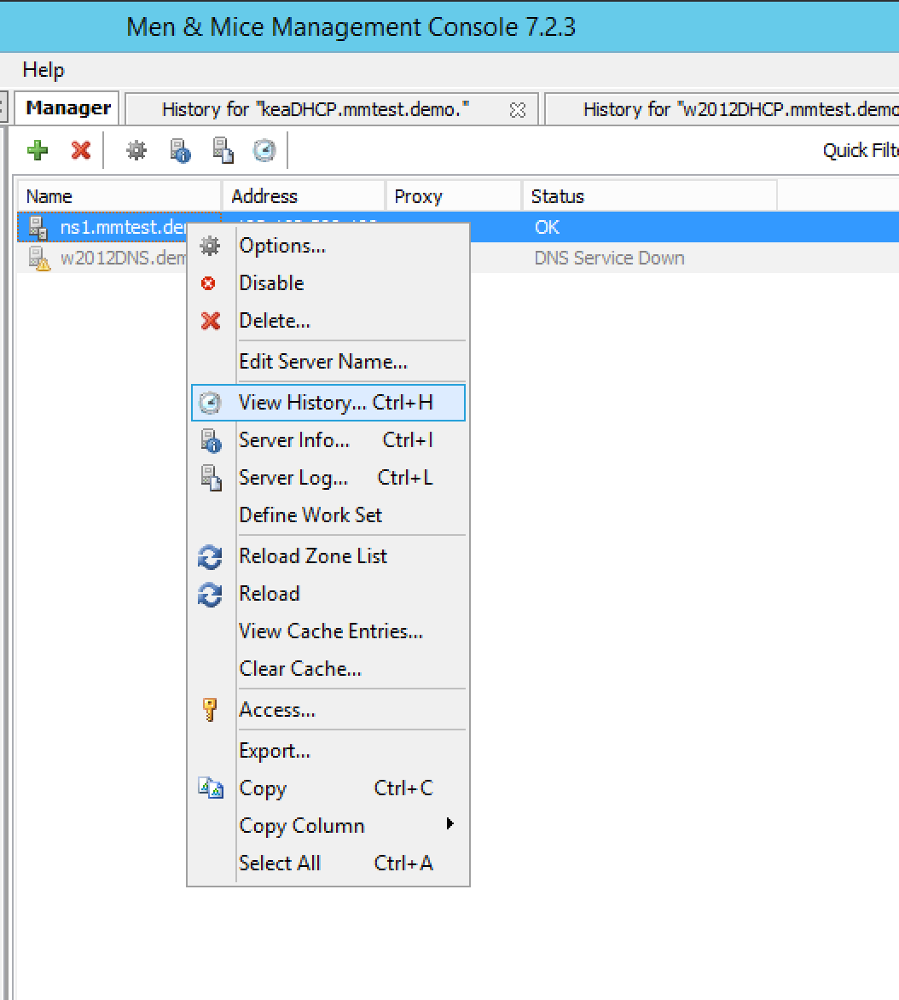
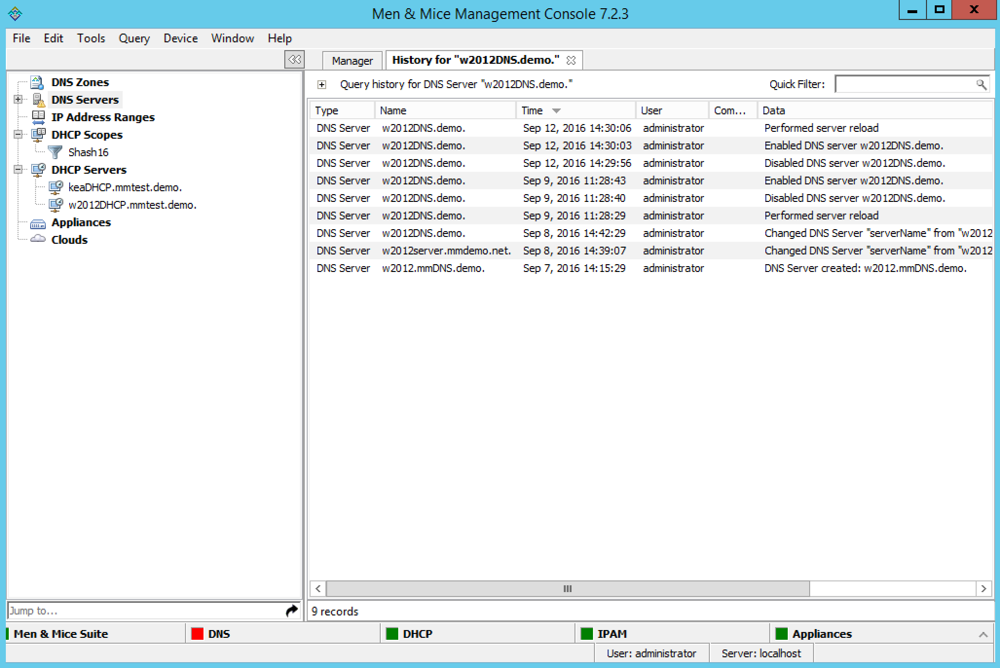

.. meta::
   :description: A list of actions in the Men&Mice Management Console includes DNS zone, DNS record, IP address range
   :keywords: DNS zone, DNS record, DNS management

.. _console-actions:

Other actions in the Management Console
---------------------------------------

Jump to Box
^^^^^^^^^^^

The **Jump to Box** is a field that can be used to quickly open a single object in Micetro by entering the object name. Using the 'Jump to Box' you can open the following object types:

* DNS Zone

* DNS Record

* IP Address Range

* DHCP Scope

* IP Address in an IP Address Range or a DHCP Scope

The 'Jump to Box' is located at the bottom of the sidebar on the left. Additionally the shortcut *Shift-J* can be used to move the focus to the 'Jump to Box'.

To use the 'Jump to Box', do the following:

1. Navigate to the **Jump to Box** or press *Ctrl+J*.

2. Enter the name of the object you want to open and click the :guilabel:`Jump to` icon to the right of the field (or press *Enter*). If more than one matching object is found, a dialog box displays in which you can select the object instance you want to open.

.. note::
  You must enter the exact name of the object you want to open. For example, if you want to open a zone by the name myzone.local, it is not sufficient to enter just 'myzone' or 'myzone.lo' – you must enter 'myzone.local'. The same applies for DNS records, IP Address Ranges, DHCP Scopes and IP Addresses.

Program Preferences
^^^^^^^^^^^^^^^^^^^

You can set some default behaviors for the Men&Mice Management Console using the *Options* dialog box.

On the menu bar, select :menuselection:`Edit --> Preferences`. The *Options* dialog box displays.

Log Window
""""""""""

Initial log size
  The server logs are kept by the servers. When the Management Console connects to a server and the log window is opened, the Manager downloads the most recent portions of the server's log. The amount downloaded (in kilobytes) will be equal to the value set in the Initial log size field.

Max log size
  The maximum log size determines how much of a server's log can be retained by the Management Console at any one time. Once the maximum size is reached, the Manager will discard old log entries as necessary to make room for the new ones. Log entries discarded by the Manager Console are retained on the log that the server maintains. The Max log size field can be set to any value between 1 and 1024 KBs. The default value is 100 KB.

Log interval
  Whenever the log window is open, it will continually update itself (the log) from the server. The interval between sequential updates can be set to any value between one and thirty seconds. The default value is every five seconds.

New Zone Window
"""""""""""""""

Show TTL
  This checkbox is enabled by default. If you clear this checkbox, the TTL column will not be included in any new zones that you create.

Show comment
  This checkbox is enabled by default. If you clear this checkbox, the Comment column will not be included in any new zones that you create.

Console
"""""""

You can configure how the Console Window behaves when new entries are added to the window.

Do nothing
  If this option is selected, entries are added 'silently' to the console window. If the window is hidden, it is not displayed when new entries are added.

Display Console if hidden
  If this option is selected, the console window will be displayed when new entries are added.

Bring Console to front
  If this option is selected, the console window will be displayed as the front-most window when new entries are added.

Search/Update Wizard
^^^^^^^^^^^^^^^^^^^^

This utility allows you to find, create, modify, or delete records in multiple zones and DHCP Scopes using a single action.

There are three search options available:

DNS Resource Records
  Refer to :ref:`dns-records` for further information.

DCHP Scope Options
  Through this function, you replace, delete or search for option values.

IP Addresses
  Through this function, you can find an IP Address in any IP Address range and display the results in the IP Address range window.

To launch the *Search and Update Wizard*, do the following:

1. From the menu bar, select :menuselection:`Query --> Search and Update Wizard`. The *Search and Update Wizard* dialog box displays.

2. Select the type of search you want to perform.

3. Complete each screen as you move through the wizard.

Lease History
^^^^^^^^^^^^^

Through this function, you view the lease history for your MS and ISC DHCP servers.

.. note::
  You must be a member of the DHCP Administrator group to view the DHCP lease history. Lease history collection must be enabled for this function to work.

To view the DHCP lease history:

1. From the menu bar, select :menuselection:`Query --> Lease History`. The *Lease History Query* tab displays.

Find DHCP leases where
  Select if you want to query by *IP Address*, *MAC Address*, *Server Address*, *Hostname* or *Description*.

Starting on/Ending on
  To query based upon a date range, type the starting and ending range dates. For example, to find all changes made in 2007, in the Starting on field type 1/1/2007 and in the Ending on field, type 12/31/07. For example, to find all changes made in 2007, in the Starting on field type 1/1/2007 and in the Ending on field, type 12/31/07.

2. Click :guilabel:`Search`. Any matching results are displayed in the lower portion of the window.

Exporting Search Results
""""""""""""""""""""""""

To export the results as a CSV file, do the following:

1. Display the lease history.

2. Search for the desired history.

3. When the applicable change history is shown, click the :guilabel:`Export` button. The *Export records to CSV file* dialog box displays.

4. Select the drive, directory, subdirectory, etc. into which you want to save the CSV file.

5. Click :guilabel:`Save`.

.. _console-object-change-history:

Object Change History
^^^^^^^^^^^^^^^^^^^^^

Through this function, you can display a log of all changes that have been made to any object such as the date and time of the change, the name of the user who made it, the actions performed, and any comments entered by the user.

There are two ways to search/view the object change history:

* From the *Menu Bar*. With this option, you select the type of object to search change history for.

* Through the *Object Browser*. With this option, you select the object first, and then search for the change history.

.. _history-menu:

Accessing via the Menu Bar
""""""""""""""""""""""""""

1. From the menu bar, select :menuselection:`Query --> Object History`. The *History Query* tab displays.

.. image:: ../../images/console-history-query.png
  :width: 90%
  :align: center

Where text contains
  Type any words that the text contains.

Made by
  Type the user login name.

Starting on/Ending on
  To query based upon a date range, type the starting and ending range dates. For example, to find all changes made in 2007, in the Starting on field type 1/1/2007 and in the Ending on field, type 12/31/07. For example, to find all changes made in 2007, in the Starting on field type 1/1/2007 and in the Ending on field, type 12/31/07.

Only show objects of type
  Click the drop-down list arrow, and select the type of object for which you want to find change history.

Limit to ____ Results
  Enter the maximum number of results to display.

2. Click :guilabel:`Search`. Any matching results are displayed in the lower portion of the tab.

Accessing via the Object Browser
""""""""""""""""""""""""""""""""

1. In the *Object Browser*, open the desired object category (e.g., DNS Zones, DNS Servers, etc.).

2. Locate the object for which you want to view the history.

3. Right-click and, from the shortcut menu, select :guilabel:`View History`.

The *History* window displays showing all the history for the selected object.

4. If you wish to query the results, click the :guilabel:`+` in the upper left corner of the dialog box.

5. Following the directions under :ref:`history-menu` to enter the query information.

Exporting Search Results
""""""""""""""""""""""""

To export the results as a CSV file, do the following:

1. Display the object change history.

2. Display the *Query Change History* search criteria fields.

3. Search for the desired change history.

4. When the applicable change history is shown, click the :guilabel:`Export` button. The *Export records to CSV file* dialog box displays.

5. Select the drive, directory, subdirectory, etc. into which you want to save the CSV file.

6. Click :guilabel:`Save`.

Micetro Log
^^^^^^^^^^^

Through this function, you can display log messages generated by Micetro.

.. note::
  You must be a member of an Administrator group to view the log messages.

To view the log messages, do the following:

1. In the main Men&Mice window, move to the menu bar and select :menuselection:`Query --> Men&Mice Suite Log`. The *Men&Mice Suite Log* tab displays.

.. image:: ../../images/console-log.png
  :width: 70%
  :align: center

Search For
  Type the information to query.

Starting on/Ending on
  To query based upon a date range, type the starting and ending range dates. For example, to find all changes made in 2007, in the Starting on field type 1/1/2007 and in the Ending on field, type 12/31/07.

Log level
  Click the drop-down list, and select the desired level – e.g., Error, Notice or Warning.

2. When all selections/entries are made, click :guilabel:`Search`. Any matching results are displayed in the lower portion of the window.

3. The Quick Filter allows you to further refine the search results. As you type in the field, results that are not applicable are removed. To export the results as a CSV file, do the following:

    * Click the :guilabel:`Export` button. The *Export records to CSV file* dialog box displays.

    * Select the drive, directory, subdirectory, etc. into which you want to save the CSV file.

    * Click *Save*.

