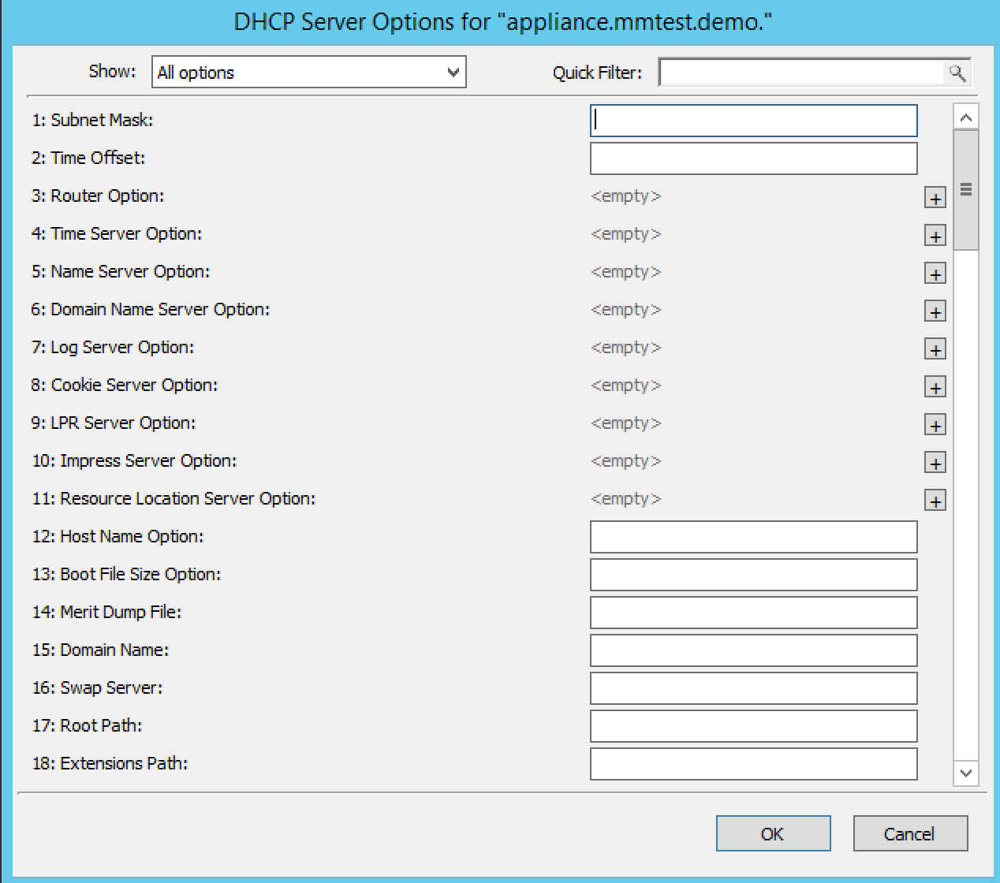
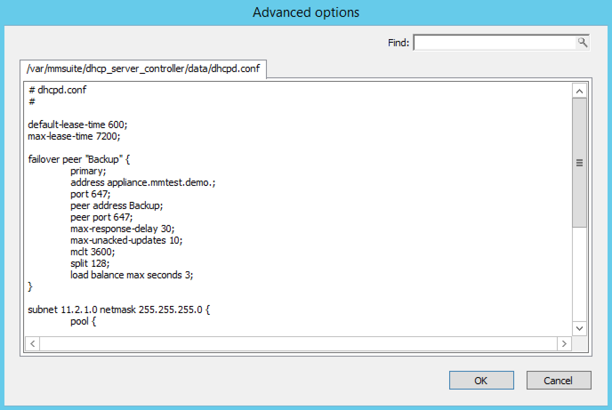

.. _console-dhcp-options:

Options
-------

The ISC DHCP, Kea DHCP, Cisco and MS DHCP servers offer different types of options: the MS DHCP server allows the user to choose between different option types (Standard, Microsoft Options and Microsoft Windows 2000 options). This drop-down list is only displayed if there are non-standard options defined on the ISC DHCP server.

You can set options for multiple servers by selecting all of the servers for which you want to set options. When setting options for multiple servers all of the servers must be of the same type.

1. In the *Object List*, right-click on the applicable DHCP Server and, from the shortcut menu, select :guilabel:`Options`. The *DHCP Server Options* window displays.

2. In the selection field in the upper left corner, click the drop-down list to select which options you want to display. Based upon your selection, the dialog box changes.

3. To :guilabel:`Show only options with non-default values`, click this checkbox. The Quick Filter field supports the following keywords: name, value, and option. For example, if you want to quickly find option 51, you could enter the following: option51.

4. To add a value to an option, locate the option item, and click the plus sign at the end of the field. A blank field displays into which you can enter the applicable information. If you enter multiple fields for an option, they are numbered consecutively (e.g., Time Server as two fields.)

5. If applicable, use the scroll bar along the right-hand side of the page to move up/down the option list.

6. When all selections/entries are made, click :guilabel:`OK` to save your changes.

Defining DHCP Server Options
----------------------------

You can define your own options on :ref:`dhcp-isc` and :ref:`dhcp-windows` servers.

Properties
----------

1. From the Object list, expand the DHCP Servers list.

2. Right-click on the server for which you want to manage properties and, from the shortcut menu, select :guilabel:`Properties`. The *Properties* dialog box for the selected server displays. Refer to the applicable section based upon the server type: :ref:`console-ms-dhcp-properties`, :ref:`console-isc-dhcp-properties`, :ref:`console-kea-dhcp-properties` or :ref:`console-cisco-dhcp-properties`.

.. _console-dhcp-advanced-options:

Advanced ISC DHCP and ISC Kea Server Properties
-----------------------------------------------

DHCP Administrators can access the ISC DHCP and ISC Kea DHCP server configuration files directly to edit DHCP server properties that are not available in the GUI.

To access the advanced options, do the following:

1. Log in to Men&Mice as the DHCP administrator.

2. Select an ISC DHCP or Kea DHCP server, right-click and select :guilabel:`Properties` from the shortcut menu.

3. When the *Properties* dialog displays, click the :guilabel:`Advanced` button.

4. When the *Advanced Options* dialog box displays, you can edit the properties for the server in a text document. If the DHCP server contains multiple configuration files, each file displays in a separate tab.

5. Click :guilabel:`OK`. The contents of the files are verified for correctness. If an error is found during verification, an error message displays and the changes are not saved.
