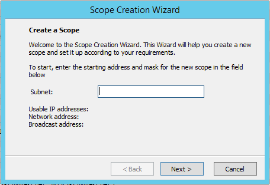

.. _dhcp-scopes:

DHCP Scopes
===========

Overview
--------

This section shows you how to perform specific actions in Micetro associated with maintaining your DHCP scopes, such as creating and modifying reservations, setting scope options and working with split scopes.

Viewing Scopes
--------------

All DHCP Scopes on All Servers
^^^^^^^^^^^^^^^^^^^^^^^^^^^^^^

You can use the Web Application to view all of the existing DHCP scopes at once, regardless of the server to which they belong. In ::menuselection:`Networks` select :guilabel:`DHCP scopes` from the filtering sidebar on the left.

.. image:: ../../images/dhcp-scopes-Micetro.png
  :width: 80%
  :align: center

The :guilabel:`Utilization` column in the scope list displays the utilization of available addresses within the address pool(s) of each scope.

.. Disabled scopes are shown as gray. The number of unassigned addresses is always shown as zero for disabled scopes.

Scopes on a Specific DHCP Server
^^^^^^^^^^^^^^^^^^^^^^^^^^^^^^^^

It is easy to view the DHCP scopes that reside on individual DHCP Servers that are being managed by the Management Console. Simply click on the plus :guilabel:`+` sign next to the DHCP Servers object in the *Object Section*, and select the DHCP server containing the scopes you want to view.

Selected Scope Menus
^^^^^^^^^^^^^^^^^^^^

When working with scopes, a right-click, shortcut menu is offered. The menu options change, based upon the type of DHCP server the scope is hosted on: MS, ISC or Cisco.

MS Shortcut Menu
""""""""""""""""

Open
  Opens the currently selected IP Address.

Delete
  This option is enabled when there is an existing DNS entry for the IP Address or there is custom property data for the IP Address. When Delete is selected, the additional data is removed; however, the IP Address itself remains intact.

History
  Shows any changes made to the selected item. These changes are displayed in a new window.

Ping
  Allows you to ping the selected server. If the ping is successful, a green dot displays; if unsuccessful, a red dot displays.

Claim
  Allows you to "claim" an address to prevent accidental assignment but without creating a DNS entry for it.

Create Address Pool
  Creates an address pool for the selected scope. Complete the From and To fields in the DHCP Address Pool dialog box, typing the range of addresses to be included in the pool. Both of these fields default to the first available address in the range. If this is a split scope (a scope that exists on more than one server) and the address pool overlaps a warning message displays.

Edit Address Pool
  To edit an existing pool, click anywhere in the applicable address pool, right-click, select :guilabel:`Edit Address Pool` and, in the dialog box, make the desired edits.

Options for Pool
  *ISC DHCP only.* To set options for a pool, click anywhere in the applicable address pool, right-click, select Options for Pool and, in the Options dialog box, make the desired changes.

Permits for Pool
  *ISC DHCP only.* Allows you to specify permits for an address pool. To set access pool permits, do the following:

    1. Click anywhere in the applicable address pool, right-click and select :guilabel:`Permits for Pool`. The *Pool Permits* dialog box displays.

    2. Click :guilabel:`Add` to create a new access pool permit.

    3. Enter the permit settings and click :guilabel:`OK` to save the changes and close the dialog box.

    4. Use the :guilabel:`Edit` and :guilabel:`Delete` buttons to modify or delete existing permits.

Delete Address Pool(s)
  To delete an existing pool, click anywhere in the applicable assigned range, right-click and select :guilabel:`Delete Address Pool(s)`.

Create Excluded Range
  *MS DHCP only*. Allows you to exclude a single IP Address or an entire range of addresses from being used. You can only exclude addresses that are already part of an address pool. To create an excluded range, specify the From and To IP Addresses. All the addresses between and including the ones entered will be excluded.

Edit Excluded Range
  *MS DHCP only.* To edit an existing range, click anywhere in the applicable excluded range, right-click, select :guilabel:`Edit Excluded Range` and, in the dialog box, make the desired edits.

Delete Excluded Range(s)
  *MS DHCP only.* To delete an existing range, click anywhere in the applicable excluded range, right-click and select :guilabel:`Delete Excluded Range(s)`. The entire excluded range is removed.

Create Reservation
  Reservations can be created in unassigned address space, address pools, and excluded addresses. It is possible to set options for reserved IP Addresses. To create a reservation, do the following:

  1. Locate the IP Address you want to reserve, right-click on it, and select :guilabel:`Create Reservation` from the pop-up menu. The *DHCP Reservation* dialog box displays.

    Name
      Assign a name to identify the reserved address.

    MAC Address
      Enter the MAC Address (i.e., Media Access Control Address) of the network node for which this address is being reserved.

    Description
      (Optional) User defined description.

    Supported Types
      Select whether this reservation should support DHCP, BOOTP (i.e., Bootstrap Protocol), or Both (default).

  2. To specify whether the DHCP server automatically updates record in the DNS server or not, click the :guilabel:`DNS` tab.

  3. Enable DNS dynamic updates according to the settings below. Specifies whether the DHCP server sends DNS dynamic record updates to the DNS server. Updates are sent to DNS servers configured in TCP/IP client properties for any active network connections at the DHCP server.

    Dynamically update DNS A and PTR records
      Specifies that the DHCP server update forward and reverse lookups be based on the type of request made by the client during the lease process.

    Always dynamically update DNS A and PTR records
      Specifies that the DHCP server update forward and reverse DNS lookups when a client acquires a lease, regardless of the type of request used to acquire it.

    Discard A and PTR records when lease is deleted
      Specifies whether the DHCP server discards forward DNS lookups for clients when a lease expires.

    Dynamically update DNS A and PTR records for DHCP clients that do not request updates
      Specifies whether the DHCP server sends dynamic updates to the DNS server for DHCP clients that do not support performing these updates. If selected, clients running earlier versions of Windows are updated by the DHCP server for both their host (A) and pointer (PTR) resource records.

  3. Click :guilabel:`OK`. The address is now listed as reserved in the DHCP Scope dialog box.

Edit a Reservation
  To edit an existing reservation, right-click on the reservation you want to change and select :guilabel:`Edit a Reservation`. Then, make the necessary edits.

Options for a Reservation
  To select options for a reservation, right-click on the reservation and select :guilabel:`Options for a Reservation`. The DHCP Reservations dialog box displays. Refer to :ref:`dhcp-options` for details on this dialog box.

Delete Reservation(s)
  To delete an existing reservation, right-click on the reservation you want to remove and select :guilabel:`Delete Reservation(s)`.

ISC Shortcut Menu
"""""""""""""""""

Open
  Opens the currently selected IP Address.

Delete
  This option is enabled when there is an existing DNS entry for the IP Address or there is custom property data for the IP Address. When Delete is selected, the additional data is removed; however, the IP Address itself remains intact.

History
  Shows any changes made to the selected item. These changes are displayed in a new window.

Ping
  Allows you to ping the selected server. If the ping is successful, a green dot displays; if unsuccessful, a red dot displays.

Claim
  Allows you to "claim" an address to prevent accidental assignment but without creating a DNS entry for it.

Create Address Pool
  Creates an address pool for the selected scope. Complete the From and To fields in the DHCP Address Pool dialog box, typing the range of addresses to be included in the pool. Both of these fields default to the first available address in the range. If this is a split scope (a scope that exists on more than one server) and the address pool overlaps a warning message displays.

Edit Address Pool
  To edit an existing pool, click anywhere in the applicable assigned range, right-click, select :guilabel:`Edit Address Pool` and, in the dialog box, make the desired edits.

Options for Pool
  When selected, the *DHCP Options* dialog box displays. Refer to :ref:`dhcp-options` for details on this dialog box.

Delete Address Pool(s)
  To delete an existing pool, click anywhere in the applicable assigned range, right-click and select :guilabel:`Delete Address Pool(s)`.

Create Reservation
  Reservations can be created in unassigned address space, address pools, and excluded addresses. It is possible to set options for reserved IP Addresses. To create an address, do the following:

    1. Locate the IP Address you want to reserve, right-click on it, and select :guilabel:`Create Reservation`. The *DHCP Reservation* dialog box displays.

      Name
        Assign a name to identify the reserved address.

      MAC Address
        Enter the MAC Address (i.e., Media Access Control Address) of the network node for which this address is being reserved.

      DDNS hostname
        Specifies the DNS domain name to use to store the A record for a DHCP client.

      IP Address
        Enter an IP Address for the reservation. You can add additional IP Addresses by clicking the plus sign and enter an IP Address in the field that displays.

    2. Click :guilabel:`OK`.

Edit a Reservation
  To edit an existing reservation, right-click on the reservation you want to change and select :guilabel:`Edit a Reservation`. Then, make the necessary edits.

Options for a Reservation
  To select options for a reservation, right-click on the reservation and select :guilabel:`Options for a Reservation`. The *DHCP Reservations Options* dialog box displays. Refer to :ref:`dhcp-options` for details on this dialog box.

Delete Reservation(s)
  To delete an existing reservation, right-click on the reservation you want to remove and select :guilabel:`Delete Reservation(s)`.

ISC Kea Shortcut Menu
"""""""""""""""""""""

Open
  Opens the currently selected IP Address.

Delete
  This option is enabled when there is an existing DNS entry for the IP Address or there is custom property data for the IP Address. When Delete is selected, the additional data is removed; however, the IP Address itself remains intact.

History
  Shows any changes made to the selected item. These changes are displayed in a new window.

Ping
  Allows you to ping the selected server. If the ping is successful, a green dot displays; if unsuccessful, a red dot displays.

Claim
  Allows you to "claim" an address to prevent accidental assignment but without creating a DNS entry for it.

Create Address Pool
  Creates an address pool for the selected scope. Complete the From and To fields in the DHCP Address Pool dialog box, typing the range of addresses to be included in the pool. Both of these fields default to the first available address in the range. If this is a split scope (a scope that exists on more than one server) and the address pool overlaps a warning message displays.

Edit Address Pool
  To edit an existing pool, click anywhere in the applicable assigned range, right-click, select :guilabel:`Edit Address Pool` and, in the dialog box, make the desired edits.

Options for Pool
  When selected, the DHCP Options dialog box displays. Refer to :ref:`dhcp-options` for details on this dialog box.

Delete Address Pool(s)
  To delete an existing pool, click anywhere in the applicable assigned range, right-click and select :guilabel:`Delete Address Pool(s)`.

Create Reservation
  Reservations can be created in unassigned address space, address pools, and excluded addresses. It is possible to set options for reserved IP Addresses. To create an address, do the following:

    3. Locate the IP Address you want to reserve, right-click on it, and select :guilabel:`Create Reservation`. The *DHCP Reservation* dialog box displays.

      MAC Address
        Enter the MAC Address (i.e., Media Access Control Address) of the network node for which this address is being reserved.

      DDNS hostname
        Specifies the DNS domain name to use to store the A record for a DHCP client.

    2. Click :guilabel:`OK`.

Edit a Reservation
  To edit an existing reservation, right-click on the reservation you want to change and select :guilabel:`Edit a Reservation`. Then, make the necessary edits.

Options for a Reservation
  To select options for a reservation, right-click on the reservation and select :guilabel:`Options for a Reservation`. The *DHCP Reservations Options* dialog box displays. Refer to :ref:`dhcp-options` for details on this dialog box.

Delete Reservation(s)
  To delete an existing reservation, right-click on the reservation you want to remove and select :guilabel:`Delete Reservation(s)`.

Cisco Shortcut Menu
"""""""""""""""""""

Open
  Opens the currently selected IP Address.

Delete
  This option is enabled when there is an existing DNS entry for the IP Address or there is custom property data for the IP Address. When Delete is selected, the additional data is removed; however, the IP Address itself remains intact.

History
  Shows any changes made to the selected item. These changes are displayed in a new window.

Ping
  Allows you to ping the selected server. If the ping is successful, a green dot displays; if unsuccessful, a red dot displays.

Claim
  Allows you to "claim" an address to prevent accidental assignment but without creating a DNS entry for it.

Create Excluded Range
  Allows you to exclude a single IP Address or an entire range of addresses from being used. You can only exclude addresses that are already part of an address pool. To create an excluded range, specify the From and To IP Addresses. All the addresses between and including the ones entered will be excluded.

Edit Excluded Range
  To edit an existing range, click anywhere in the applicable excluded range, right-click, select :guilabel:`Edit Excluded Range` and, in the dialog box, make the desired edits.

Delete Excluded Range(s)
  To delete an existing range, click anywhere in the applicable excluded range, right-click and select :guilabel:`Delete Excluded Range(s)`. The entire excluded range is removed.

Create Reservation
  Reservations can be created in address pools, and excluded addresses. It is possible to set options for reserved IP Addresses. To create an address, do the following:

  1. Locate the IP Address you want to reserve, right-click on it, and select :guilabel:`Create Reservation`. The *DHCP Reservation* dialog box displays.

    Name
      Assign a name to identify the reserved address.

    Reservation Method
      Choose the reservation method for this reservation. You can choose either Client Identifier or Hardware Address.

    Client Identifier / MAC Address
      Depending on your choice for Reservation Method, enter the Client Identifier or MAC Address (i.e., Media Access Control Address) of the network node for which this address is being reserved.

    DDNS hostname
      Specifies the DNS domain name to use to store the A record for a DHCP client.

  2. Click :guilabel:`OK`.

Edit a Reservation
  To edit an existing reservation, right-click on the reservation you want to change and select :guilabel:`Edit a Reservation`. Then, make the necessary edits.

Options for a Reservation
  To select options for a reservation, right-click on the reservation and select :guilabel:`Options for a Reservation`. The *DHCP Reservations* dialog box displays. Refer to :ref:`dhcp-options` for details on this dialog box.

Delete Reservation(s)
  To delete an existing reservation, right-click on the reservation you want to remove and select :guilabel:`Delete Reservation(s)`.

Scope Creation Wizard
---------------------

This section describes how to create and edit DHCP scopes with the new *DHCP Scope Creation Wizard*.

Whenever you create a new scope, Micetro automatically checks whether the new scope conflicts with an existing scope or an IPAM range.

The Wizard has additional steps, or skips over some steps, depending on the type of DHCP server the scope is being created on, and whether the :ref:`active-directory` integration has been enabled.

To create a new scope on the MS DHCP server, do the following:

1. In the object list, right-click on :guilabel:`DHCP Scopes` and, from the shortcut menu, select :guilabel:`New Scope`. Alternatively, right click on an existing IP address range, and select :guilabel:`Convert To DHCP Scope`.

2. The *Scope Creation Wizard* dialog appears.

Subnet
  Enter the subnet in CIDR notation, e.g. 5.5.5.0/24, and click :guilabel:`Next`.

Server and scope type
  Select the type, either Single scope, Split scope, or Failover scope (only on Windows 2012 and newer DHCP servers) and the DHCP server to create the scope on.

  .. note::
    When you change the type to Failover scope, only Windows 2012 and newer servers are shown.

3. Select second server (Split scope) or Failover Relationship (Failover Scope).

  .. note::
    This step is skipped if Single scope was selected, or if Failover Scope is selected and there is only one Failover Relationship on the selected DHCP server.

4. Address pool. Enter the address range for the address pool. By default, it is set to cover the entire scope.

5. Range properties. Enter the custom properties for the IP address range.

6. Enabled or Disabled.

7. Active Directory Site selection. If you have enabled :ref:`active-directory`, the Wizard will ask you which AD site the new DHCP Scope should be associated to.

8. Scope properties.

  .. note::
    On Microsoft DHCP servers, if the scope is a part of a MS DHCP Superscope, enter the name of the Superscope here, or leave empty.

  .. note::
    On Cisco DHCP Servers the only configurable scope property is "Import All". When checked, it imports Dynamic Host Configuration Protocol (DHCP) option parameters into the DHCP server database. Refer to the Cisco IOS IP Addressing Command Reference document for more information.

9. DNS Update Settings (only Microsoft DHCP servers)

10. Save Comment

11. Summary: The changes the Wizard will perform are summarized here and applied once the user clicks "Finish".

.. warning::
  Once the scope has been created, you must set access privileges for the scope if you want to allow users to make any changes to it, assuming the initial access for Ranges/Scopes has not been set appropriately.

Access
------

For complete details on this function, refer to :ref:`global-access`.

Delete
------

Use the following procedure to remove a scope definition from the Management Console.

1. Locate the DHCP Scope you want to remove and right-click on it.

2. From the pop-up menu, select :guilabel:`Delete`. A dialog prompts you to confirm your decision to delete this scope.

3. Click :guilabel:`OK` to delete the scope, or :guilabel:`Cancel` to leave it.

Disable/Enable
--------------

If you are no longer using a particular scope, but do not want to delete it completely because you may need it in the future, you can disable the scope instead. A scope that is disabled will be ignored by the DHCP server until it is re-enabled. Use the following procedure to disable/enable a scope.

1. Locate the DHCP Scope you want to disable/enable and right-click on it. Scopes that are currently disabled have faded icons next to them.

2. From the pop-up menu, select :guilabel:`Disable` to disable this scope, or if the scope is already disabled, select :guilabel:`Enable` to reactivate it.

.. note::
  New scopes are always disabled by default so you can configure the properties before the DHCP server begins using it.

Scope Migration Wizard
----------------------

The *Scope Migration Wizard* allows users to migrate one or more scopes from one server to another, including all data in the scope.

To migrate a scope, do the following:

1. In the Manager window, select one or more scopes.

2. Right-click and, from the shortcut menu, select :guilabel:`Migrate Scope`. The *Migrate Scope(s) Wizard* dialog box displays.

Server
  Click the drop-down list and select onto which you want to migrate this scope(s).

4. Click :guilabel:`Next`. The *Migration Options* dialog box displays.

5. For each of the resulting screens, make a selection/entry and move through the wizard.

Duplication Wizard
------------------

To duplicate a DHCP scope you should use the Duplicate Scope wizard. The duplicate will initially have the exact same properties as the original, but you will have the option to assign the duplicate to a different DHCP server and modify the duplicated values.

Within this wizard, you can do the following:

* Create a new scope

* Create a split scope interface

To launch the wizard, do the following:

1. In the *Object Section*, click on :guilabel:`DHCP Scopes`.

2. In the *Object List*, right-click on the DHCP Scope you want to duplicate and, from the shortcut menu, select :guilabel:`Duplicate`. The *Duplicate scope wizard* launches.

3. For each of the resulting screens, make a selection/entry and move through the wizard.

Folders
-------

Refer to :ref:`object-folders` for details on this function.

Reconcile Scope
---------------

.. note::
  Applies to MS DHCP Servers only.

Use this function to fix inconsistencies between information in the registry and the DHCP database.

1. In the *Object List*, select :guilabel:`DHCP Scopes` and then select a scope.

2. Right-click the scope and select :guilabel:`Reconcile Scopes`.

3. Choose whether you want to verify only or fix any inconsistencies and click :guilabel:`OK` to complete the action.

Converting a Scope to a Range
-----------------------------

Use this function to convert an existing scope to an IP Address range, while keeping all the settings intact.

1. In the *Object List*, select :guilabel:`DHCP Scopes` and then select a scope.

2. From the menu bar, select :guilabel:`Range --> Convert to IP Address Range`.

3. When the Men&Mice Management Console confirmation dialog box appears, click :guilabel:`Yes` to convert the range.

Converting a Range to a Scope
-----------------------------

Use this function to convert an existing IP Address range to a scope, while keeping all the settings intact.

1. In the *Object List*, select :guilabel:`IP Address Ranges` and then select a range.

2. From the menu bar, select :guilabel:`Range --> Convert to DHCP Scope`, or right click and select :guilabel:`Convert to DHCP Scope`. The *Scope Creation Wizard* will appear, with the subnet field pre-populated for the selected range.

3. Clicking :guilabel:`Next` will continue with the *Scope Creation Wizard* as normal.

Scope Policies (Windows Server 2012 or newer)
---------------------------------------------

If you are managing DHCP servers on Windows Server 2012 or newer, you can use Micetro to set scope policies for individual scopes.

Activate/Deactivate a Scope Policy
^^^^^^^^^^^^^^^^^^^^^^^^^^^^^^^^^^

1. In the *Scope List*, right-click a scope that is stored on a Windows 2012 DHCP server.

2. From the shortcut menu, select :guilabel:`Manage Policies`. The *DHCP Scope Policy Management* dialog box displays.

3. The dialog box shows the current status of DHCP scope policies for the selected scope.

4. To activate DHCP scope polices, click the :guilabel:`Activate` button. If DHCP scope polices are active, the button text shows *Deactivate*. To deactivate the DHCP scope policies, click the :guilabel:`Deactivate` button.

5. Click :guilabel:`Close`.

Add a New Scope Policy
^^^^^^^^^^^^^^^^^^^^^^

1. In the *Scope List*, right-click a scope that is stored on a Windows 2012 DHCP server and, from the shortcut menu, select :guilabel:`Manage Policies`. The *DHCP Scope Policy Management* dialog box displays.

2. Click the :guilabel:`Add` button. The *DHCP Policy* dialog box displays.

3. Enter a name and description for the DHCP policy in the corresponding fields.

4. Click the :guilabel:`Add` button in the *Conditions* section to add a new condition for the DHCP policy. The *DHCP Policy Condition* dialog box displays.

5. Specify the condition you want to use and click :guilabel:`OK` to save the condition and close the dialog box. Note that you can enter multiple conditions for a DHCP policy by clicking the :guilabel:`Add` button in the *DHCP Policy* dialog box.

6. To edit or delete an existing DHCP Policy condition, select the condition from the list of DHCP Policy conditions, and click the corresponding button.

7. If there is more than one condition, you need to specify whether to use the OR or AND operator when evaluating the conditions. Select the corresponding radio button in the DHCP Policy dialog box.

Ranges
""""""

1. Click the :guilabel:`Add` button in the ranges section to specify an IP Address range that should be affected by the policy. The *Range specification* dialog box displays.

2. Enter the range using the from and to addresses separated by a hyphen (for example, 192.168.1.10-192.168.1.20).

3. Click the :guilabel:`Add` button to add the range and close the dialog box. NOTE: You can enter multiple ranges by using the *Add Range* dialog box for each range you want to add.

4. To edit or delete an existing range, select the range from the list of ranges, and click the corresponding button.

5. When you have added all conditions and ranges, click the :guilabel:`OK` button to save the DHCP policy.

DNS Dynamic Updates
"""""""""""""""""""

Options specific to dynamic updates are in the field named **DNS Dynamic Updates**. It can be configured accordingly for the policy.

Lease duration
""""""""""""""

The lease duration can be specified per policy in those fields.

DHCP Options
""""""""""""

To specify DHCP options for this policy, click the :guilabel:`Options` button. That will open a dialog which will allow the user to specify the options.

.. note::
  If this is unconfigured, the options will be inherited from the scope or server.

Change an Existing Scope Policy
^^^^^^^^^^^^^^^^^^^^^^^^^^^^^^^

You can edit, delete or disable existing DHCP Scope Policies. You can also change the order of DHCP scope policies.

1. In the *Scope List*, right-click a scope that is stored on a Windows 2012 DHCP server and, from the shortcut menu, select :guilabel:`Manage Policies`. The *DHCP Scope Policy Management* dialog box displays.

2. Select the DHCP Policy you want to work with by clicking it in the list of DHCP Policies.

  * To edit the policy, click the :guilabel:`Edit` button.

  * To delete the policy, click the :guilabel:`Delete` button.

  * To disable the policy, click the :guilabel:`Disable` button. If the policy is already disabled, the button text shows Enable. To enable the policy, click the button.

  * To move the policy up or down in the list of DHCP Policies, click the :guilabel:`Move Up` or :guilabel:`Move Down` button.

3. When you have completed your changes, click the :guilabel:`Close` button.

Other Functions
---------------

At any time, you can modify the properties for a scope. Simply locate the item, right-click and from the shortcut menu select :guilabel:`Properties`. When a scope is opened, the system displays one tab for each server on which the scope is defined. For split scopes, the scope contents can be examined individually on each server.

In addition to the tabs displaying individual scope contents on each server, the DHCP scope dialog contains an *Overview* and *Statistics* tab, with a graphical overview of the scope contents, as well as statistics on pool utilization on all servers.

For each DHCP server containing the scope, there is a bar depicting the placement of reservations, pools, and exclude ranges in different colors.

* The top of the bar represents the IP Address at the start of the scope.

* The bottom of the bar represents the IP Address at the end of the scope.

This overview is useful in verifying that split scope configurations do not contain conflicts, such as overlapping pools or inconsistent reservations.

The table in the lower part of the window contains aggregate statistics for the scope, i.e., effective pool size, the number of pool clients, and the pool utilization, summed up over all servers containing the scope.

Deleting a Lease
^^^^^^^^^^^^^^^^

To delete a lease in a DHCP scope, do the following:

1. Open the scope containing the lease you want to delete.

2. Right-click on the lease and, from the shortcut menu, select :guilabel:`Release Lease`.

IP Address Details
^^^^^^^^^^^^^^^^^^

The IP Address details window contains all information pertaining to an IP Address in the application, including DNS records, DHCP reservations, and custom properties. To access the *IP Address details* window from the DHCP scope dialog you need to double click on an IP Address in the DHCP scope dialog, or right-click on an IP Address and select the Open menu item.

The IP Address details window is documented in :ref:`ip-address-dialog`. However, when the IP Address details window is opened from the DHCP scope dialog, information on any DHCP reservation associated with the IP Address displays as well. A reservation can be created by clicking the Create button on the DHCP Panel. You can also create and edit a reservation directly from the DHCP scope dialog by selecting the appropriate menu item when right-clicking on an IP Address. The IP Address dialog box is not available if only a DHCP license key has been entered. In this case, the reservation dialog box will be displayed when double clicking an entry in the DHCP scope.

Subranges of Scopes
^^^^^^^^^^^^^^^^^^^

It is possible to choose whether the contents of ranges that are created under scopes are displayed in a range view or a scope view. Use the Show DHCP data in subranges of scopes checkbox in the *System Settings* dialog box to choose the preferred display mode.

If the scope view is selected, a window similar to the scope window displays when you open a subrange of a scope. However, the only scope related action available in this window is reservation management. The access dialog box for these subranges will contain an additional access bit, Edit reservations.

If the range view is selected, the subranges are opened in the range view and no scope related actions are available.

Renaming a Scope
^^^^^^^^^^^^^^^^

It is very simple to change the name and/or description of a scope in the Management Console.

1. Locate the DHCP Scope you want to rename.

2. Right-click and, from the shortcut menu, select :guilabel:`Properties`. The *DHCP Scope Properties* dialog box displays. NOTE: The dialog box may look different depending on the DHCP server type.

3. Enter the **Title** and **Description**.

4. Click :guilabel:`OK`. The newly renamed scope now displays in the Object List.

Superscopes
^^^^^^^^^^^

.. note::
  Superscopes are only supported on MS DHCP servers on Windows server.

All MS Superscopes are listed in the object section under the heading :guilabel:`Superscopes`.

.. image:: ../../images/console-dhcp-superscopes.png
  :width: 70%
  :align: center

When you click on the Superscope, all scopes within that superscope display. In addition, a new column, Superscope, is shown in the scope list. It is possible to filter by this column.

To assign an existing scope to a superscope, do the following:

1. In the *Object list*, select a DHCP Scope for which you want to set a Superscope.

2. Right-click and, from the shortcut menu, select :guilabel:`Properties`. The scope dialog box displays.

3. Enter the name of the superscope in the **Superscope** field.

4. Click :guilabel:`OK`. The scope is placed in the superscope. If the superscope did not exist, the new superscope is created and now displays as a new item in the object list.

Moving IP Address Information
-----------------------------

IP Address information can be moved to a new IP Address. When the IP Address information is moved, all information about the IP Address is retained, and the associated DNS records are updated. If a reservation is associated with the IP Address, the reservation information is moved with the IP Address if the destination address is in a DHCP scope that is hosted on a DHCP server of the same type. If the destination address is in a scope hosted on a different type of a DHCP server or the destination is in an IP Address range, the reservation information is discarded.

To move IP Address information, do the following:

1. Locate the IP scope containing the IP Address.

2. Double-click on it to display the scope contents.

3. Find the applicable IP Address.

4. Right-click and, from the shortcut menu, select :guilabel:`Move`.

5. In the *Move IP Address Information* dialog box, type the new IP Address.

6. Click :guilabel:`OK`. The IP Address information is moved to the new IP Address.

Host Discovery
--------------

With this feature, you can see when hosts were last seen on your network. There are two methods you can use for host discovery – using ping or querying routers for host information.

When host discovery is enabled, two columns are added to the range or scope view.

Last Seen
  This column identifies when a host was last seen on the network and which method was used to discover the host.

Last Known MAC Address
  This column shows the MAC address used by the host the last time it was seen on the network. This column is only populated if the host was seen using a router query.

Configuring Host Discovery Using Ping
^^^^^^^^^^^^^^^^^^^^^^^^^^^^^^^^^^^^^

1. Select one or more scopes.

2. Right-click and, from the shortcut menu, select Set :guilabel:`Discovery Schedule`. The *Schedule* dialog box displays.

3. Select the :guilabel:`Enable discovery schedule` option.

  Schedule ____ every ___ day(s)/week(s)/month(s).
    Click the drop-down list and select the frequency (e.g., Daily, Weekly, etc.) and the occurrences (e.g., 1 day, 2 weeks, etc.).

  At ____.
    Enter the time at which discovery should take place.

  Starting ____.
    Click the drop-down list and select the start date.

4. Click :guilabel:`OK`.

Once the schedule options have been set and saved, two columns - Last Seen and Last Known MAC Address - are added to the range or scope view. The Last Seen column identifies when a host was last seen on the network.

..

Green
  Host responded to the last PING request. The date and time are shown.

Orange
  Host has responded in the past, but did not respond to the last PING request. The date and time of last response is shown.

Red
  Host has never responded to a PING request. The text Never is shown.

The list of ranges contains a column that shows if a discovery schedule has been set for a range. The name of this column is Schedule. To quickly see all ranges that have a schedule set, you can use the Quick Filter and filter by this column by entering ``Schedule:Yes`` in the Quick Filter search field.

At any time if you wish to disable host discovery, do the following:

1. Select the object(s) for which you want to disable discovery.

2. Right-click and, from the shortcut menu, select :guilabel:`Set Discovery Schedule`. The *Schedule* dialog box displays.

3. Uncheck the :guilabel:`Enable discovery schedule` option.

4. Click :guilabel:`OK`.

Configuring Host Discovery by Querying Routers
^^^^^^^^^^^^^^^^^^^^^^^^^^^^^^^^^^^^^^^^^^^^^^

To collect information about hosts by querying routers, you must first enable collection of IP information from routers.

To configure host discovery:

1. Select an IP Address Range.

2. Right-click and, from the shortcut menu, select :guilabel:`Configure IP Address Collection`. The *IP Address Collection* dialog box displays

3. Enter the IP Address of the router(s) that you want to use to collect information about hosts in the range.

4. Click :guilabel:`OK`.

Failover Configurations and Split Scopes
----------------------------------------

Managing Failover Configurations (ISC DHCP)
^^^^^^^^^^^^^^^^^^^^^^^^^^^^^^^^^^^^^^^^^^^

This function allows you to manage DHCP failover peers on ISC DHCP servers.

.. note::
  When adding a server's first failover peer, all other address pools on the server will be updated to refer to this failover peer.

1. On the object menu, select the DHCP Server that contains the scope for which you want to setup failover configuration.

2. From the list of scopes, double-click on the applicable one.

3. From the list of IP Addresses, right-click on the applicable one, and select :guilabel:`Create Address Pool` from the shortcut menu. The *DHCP Address Pool* dialog box displays.

4. Move to the **Failover Peer** field, and click the drop-down list arrow.

5. Select *Add new failover peer*.

6. Click :guilabel:`OK`. The *New Failover Peer* dialog box displays.

  Name
    Specifies the name of the failover peer.

  Role
    Specifies the role of the failover peer. The available roles are Primary and Secondary.

  Address
    Specifies the IP Address or DNS name on which the server should listen for connections from its failover peer.

  Port
    Specifies the port number on which the server should listen for connections from its failover peer.

  Peer Address
    Specifies the IP Address or DNS name to which the server should connect to reach its failover peer for failover messages.

  Peer Port
    Specifies the port number to which the server should connect to reach its failover peer for failover messages.

  Max Response Delay
    Specifies the number of seconds that may pass without the server receiving a message from its failover peer before it assumes that the connection has failed.

  Max Unacked Updates
    Specifies the number of messages the server can send before receiving an acknowledgement from its failover peer. According to ISC documentation, 10 seems to be a good value.

  Max Client Lead Time
    Specifies the number of seconds for which a lease can be renewed by either server without contacting the other. Only specified on the primary failover peer.

  Split Index
    Specifies the split between the primary and secondary failover peer for the purposes of load balancing. According to ISC documentation, 128 is really the only meaningful value. Only specified on the primary failover peer.

  Load Balance Max Seconds
    Specifies the cutoff in seconds after which load balancing is disabled. According to ISC documentation, a value of 3 or 5 is recommended.

7. Click :guilabel:`OK`. The DHCP Address Pool dialog box displays and shows the updated information.

8. Click :guilabel:`OK`.

If you need to EDIT or DELETE an existing failover peer, do the following:

1. Locate the relevant ISC DHCP server.

2. Right-click and, from the shortcut menu, select :guilabel:`Manage Failover Peers`. The *Failover Peers for …* dialog box displays. All failover peers are shown.

3. To EDIT a failover peer, select it and click the :guilabel:`Edit` button. Then modify the *Failover Peers … properties* dialog box, as needed.

4. To DELETE a failover peer, select it and click the :guilabel:`Delete` button.

.. note:: In order to finalize the setup of the failover relationship, the scope needs to be migrated to the failover peer.

.. note::
  When deleting a failover peer through this dialog, if it is the last failover peer defined on the server, any references to it will be removed from existing address pools on the server. If there is one other failover peer left on the server, references to the failover peer being deleted will be changed to refer to the remaining failover peer. If, however, there are two or more other failover peers left on the server, the user will be prompted with a list of the remaining failover peers where he will have to choose which failover peer should be referenced by address pools currently referring to the failover peer being deleted.

.. note::
  When changing from one failover peer to another for some specific address pool, if the address pool is the last one referring to the (old) failover peer, the user will be warned that performing the action will result in the deletion of the failover peer.

Managing Failover Configurations (Windows Server 2012)
^^^^^^^^^^^^^^^^^^^^^^^^^^^^^^^^^^^^^^^^^^^^^^^^^^^^^^

DHCP failover on Windows Server 2012 enables high availability of DHCP services by synchronizing IP Address lease information between two DHCP servers. It is also possible to use DHCP failover to provide load balancing of DHCP requests.

You can configure failover for a single scope or for multiple scopes on the same server.

.. note::
  To manage failover between two Windows 2012 Servers, the DHCP Server Controller must be running as a service account with enough privileges to manage the DHCP service. For more information, refer to the Men&Mice DHCP Server Controller section in the Installation Guide.

Setting up a Scope Failover
"""""""""""""""""""""""""""

To setup failover for a scope, do the following:

1. On the object menu, select the DHCP Server that contains the scope(s) for which you want to setup failover configuration.

2. You have two ways to choose the scopes you want to configure.

  * From the list of scopes, select one or more scopes, right-click and select :guilabel:`Configure Failover`.

  * Right-click the DHCP server and select :guilabel:`Configure Failover`. A dialog box listing all configurable scopes displays. Select the scopes you want to configure and click :guilabel:`Next`. The failover configuration dialog box displays.

  Relationship Name
    Select the relationship you want to use for the failover configuration or enter a name if you want to create a new relationship. If you choose an existing relationship, you will not be able to change any of the relationship properties and you can simply click OK to complete the failover configuration for the scope.

  Partner Server
    Enter the name or IP Address of the partner DHCP server with which failover should be configured. You can select from the list of Windows Server 2012 machines or you can type the host name or IP Address of the partner server.

  Mode
    Select the failover mode you want to use. You can choose between Hot standby and Load balance.

  Role of Partner Server
    If you chose the Hot standby mode, you must choose the role of the partner server. You can choose between Standby and Active. If you choose Standby the current server will be Active and vice versa.

  Maximum Client Lead Time
    If you don't want to use the default values, enter the new values in the hours and minutes edit fields.

  Addresses reserved for standby server
    If you chose the Hot standby mode, you must enter the percentage of addresses that should be reserved to the standby server.

  Local server load balance percentage
    If you chose the Load balance mode, you need to specify the load balance percentage to use on the local server. The remaining percentage will be used on the partner server.

  State Switchover Interval
    Select this checkbox if you want to use Automatic State Switchover and specify the interval to use.

  Enable Message Authentication
    Select this checkbox if you want to use message authentication between the DHCP servers. If the message authentication is enabled, you must provide a shared secret for the message authentication.

Removing a Failover Configuration
"""""""""""""""""""""""""""""""""

1. On the object menu, select the DHCP Server that contains the scope(s) for which you want to remove the failover configuration.

2. Select one or more scopes, right-click the selection and select :guilabel:`Deconfigure Failover`. A confirmation dialog box displays.

3. Click :guilabel:`Yes` to confirm the action. The failover configuration for the selected scope(s) is removed.

Replicating Failover Scopes
"""""""""""""""""""""""""""

When using a failover configuration, it is possible to replicate scope information between servers. This is possible for individual scopes, all scopes that share a failover relationship or all scopes on a particular DHCP server. When a scope replication takes place, the scopes on the selected DHCP are considered the source scopes and the entire scope contents are replaced on the destination server.

**To replicate individual scopes:**

1. On the object menu, select the DHCP Server that contains the scope(s) you want to replicate.

2. Select one or more scopes, right-click the selection and select :guilabel:`Replicate Scope`. A confirmation dialog box displays.

3. Click :guilabel:`OK` to confirm the action. The selected scope is replicated.

**To replicate all scopes that share a failover relationship:**

1. On the object menu, select the DHCP Server that contains the scopes you want to replicate.

2. Right-click a scope using the desired relationship, and select :guilabel:`Replicate Relationship`. A confirmation dialog box displays.

3. Click :guilabel:`OK` to confirm the action. The scopes that use the same relationship as the selected scope are replicated. Note that this action may take some time if multiple scopes use the relationship.

**To replicate all failover scopes on a DHCP server:**

1. On the object menu, right-click the DHCP Server that contains the scopes you want to replicate and select :guilabel:`Replicate Failover Scopes` from the menu. A confirmation dialog box displays.

2. Click :guilabel:`OK` to confirm the action. All failover scopes on the selected server are replicated. Note that this action may take some time if the server contains multiple failover scopes.

Managing Failover Relationships
"""""""""""""""""""""""""""""""

You can view, create, edit and delete existing failover relationships.

**Adding a Failover Relationship**

1. On the object menu, right-click the DHCP Server and select :guilabel:`Manage Failover Relationships` from the menu. A dialog box listing the current failover relationships displays.

2. Click the :guilabel:`Add` button. A dialog box displays, listing all scopes that are available to be configured for high availability.

3. Select the scope(s) you want to configure. To select all scopes, click the :guilabel:`Select all` checkbox. Click :guilabel:`Next`. The failover configuration dialog box displays.

4. Setup the failover configuration for the selected scopes.

**Editing an Existing Failover Relationship**

1. On the object menu, right-click the DHCP Server and select :guilabel:`Manage Failover Relationships` from the menu. A dialog box listing the current failover relationships displays.

2. Click the :guilabel:`Edit` button. The failover configuration dialog box displays. Note that some properties are disabled and cannot be changed.

3. Edit the failover configuration and click :guilabel:`OK` to save the settings.

You can delete existing failover relationships. When a failover relationship is deleted, the scopes are not removed from the DHCP server, but they are no longer in a failover configuration. After removing the failover relationship Micetro will handle the affected scopes as split scopes.

**Deleting a Failover Relationship**

1. On the object menu, right-click on the DHCP Server, and select :guilabel:`Manage Failover Relationships` from the menu. A dialog box listing the current failover relationships displays.

2. Click the :guilabel:`Delete` button and click :guilabel:`Yes` in the confirmation dialog box.

Managing Split Scopes
^^^^^^^^^^^^^^^^^^^^^

When a scope is hosted on multiple servers, the scope view lists all the servers that contain a copy of the scope. For scopes on MS servers, the line says 'Split Scope' and then lists the servers. For the ISC DHCP server, the line says 'Multiple Instances' and then lists the servers:

.. image:: ../../images/console-dhcp-split-scopes.png
  :width: 50%
  :align: center

Micetro detects when a split scope configuration is in place. Split scopes are handled as follows:

* In the scope list, split scopes are shown with a different icon and in the server column, the text "split scope" displays

* When performing various actions on scopes (for example enable/disable, scope option changes, scope deletion), a dialog box displays where the user is asked to specify to which instances of the split scope the action should be applied.

* The DHCP scope window will show every instance of the split scope in a separate tab, making it possible to work with all instances of the split scope in a single window.

* The Overview and Statistics tab in the DHCP scope window will show a graphical overview for all of the split scope instances.

* Reservations are managed automatically. All changes to reservations (creation, modification, and deletion) are applied to all instances of the split scope.

The servers listed in this dialog box all contain the scope to which the user was applying the change. By pressing the Enable button, all instances of the scope would be enabled.

.. note::
  Split scopes are only supported on MS DHCP servers.
