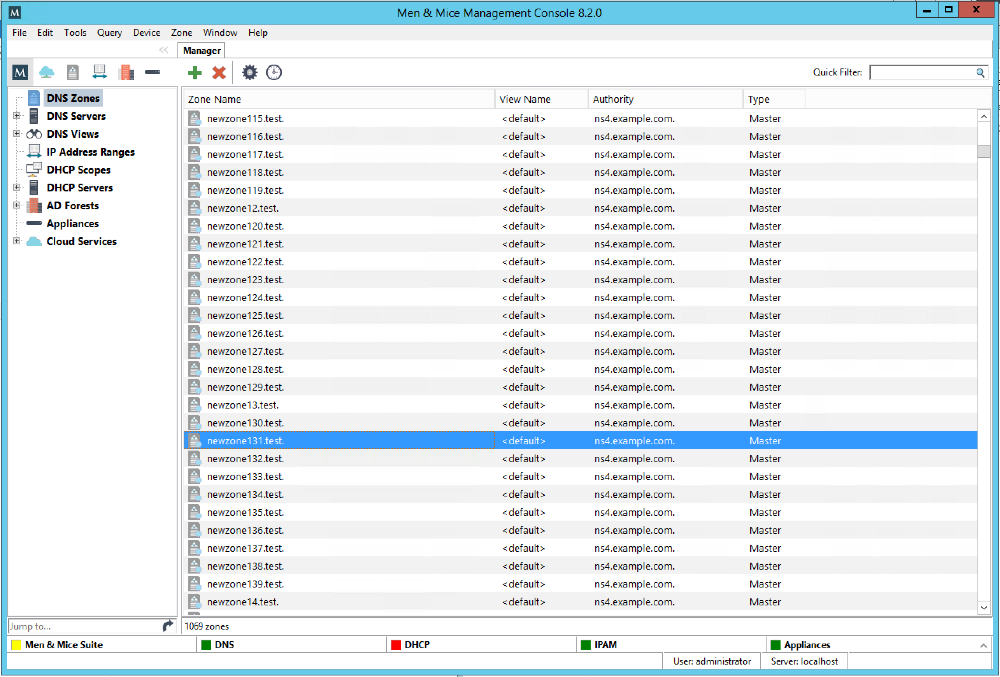
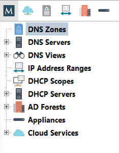

.. _console-gui:

GUI Interface
=============

When the Management Console is started up, the Manager Window displays in the center. This window is the heart of the Men&Mice Management Console, providing a single interface with nearly every feature in the Men&Mice Suite.

This window consists of two main areas: the Object Browser and the Detail View.

Object Browser
--------------

The Object Browser displays on the left side of the Manager window and contains categories of objects that can be created, modified, and deleted.

A new feature in version 8.2 is the ability to filter by the type of object in the Object Browser. By clicking on the respective icon at the top of the Object Browser, the Object Browser will show only that type of object. Clicking on the "M" icon to the left will show all types of objects. Note that this applies only to Clouds, DNS, IPAM (Subnets and DHCP), AD Forests and Appliances.

DNS Zones
  Selecting the DNS Zones object will cause the Detail View to display all DNS zones configured in the system and accessible to the current user. This category is accessible with a valid DNS Module License Key.

DNS Servers
  Selecting the DNS Servers category will cause the Detail View to display all DNS servers managed by the system and accessible to the current user. If a DNS server is not reachable, its icon is shown with an exclamation mark. If the DNS Servers category is expanded, the same list of servers will show as sub-categories to the DNS Servers category. Selecting a server subcategory will cause the Detail View to display the zones managed by that server and accessible to the current user. This category is accessible with a valid DNS Module License Key.

DNS Views
  The DNS Views category allows you to see zones on DNS servers that are configured with multiple views. If no views are configured on any server, this category will not appear. The Views feature of the BIND name server allows one server to return different data to different clients; each view has its own separate list of zones, often with the same names. This category behaves similarly to the DNS Servers category.

IP Address Ranges
  Selecting the IP Address Ranges category will cause the Detail View to display all IP Address Ranges configured in the system and accessible to the current user. This category is accessible with a valid IP Address Management Module License Key.

DHCP Scopes
  Selecting the DHCP Scopes category will cause the Detail View to display all DHCP scopes configured in the system and accessible to the current user. This category is accessible with a valid DHCP Module License Key.

DHCP Servers
  Selecting the DHCP Servers category causes the Detail View to display all DHCP servers managed by the system and accessible to the current user. If a DHCP server is not reachable, its icon is shown with an exclamation mark. If the DHCP Servers category is expanded, the same list of servers will show as sub-categories to the DHCP Servers category. Selecting a server subcategory causes the Detail View to display the scopes managed by that server and accessible to the current user. This category is accessible with a valid DHCP Module License Key.

AD Sites
  This category is only displayed if you have enabled AD Sites and Subnets integration. Selecting this category will show all AD sites that have been selected for integration in the Men&Mice Suite.

Detail View
-----------

Note that a new feature in version 7.2 is that the windows are now 'docked' and therefore they open up in a tab instead of a window.

The Detail View displays on the right side of the Manager window and displays the contents of the selected category in the Object Browser. While in this view, you can do the following:

  * Sort and filter to allow a more concise view of the contents. Refer to  Quick Filter .

  * Display a shortcut or "context" menu that gives access to other options. Right-click to view this shortcut menu.

  * Open an object by simply double-clicking. This opens either a property window (such as in the case of DNS/DHCP Servers), or brings you to a new view of the data contained within the object (such as in the case of DNS Zones, DHCP Zones, and IP Address Ranges).

  * Reorder the columns. Click on the column you want to move and, while holding down the mouse key, drag the column to the new position.

  * Display or hide columns. Right-click on a column header. All the column names shown with a checkmark are currently displayed. To hide a column, click on the name to remove the checkmark. To display a hidden column, repeat the process. Reset all makes all columns display without having to unhide them individually.

Sorting Records
---------------

When viewing information in the Object List – be it DNS zones, Servers, Views, IP Address Ranges, or Scopes – you can instantly sort the displayed information by clicking on the header of any column shown in that view. For instance, click on the Name header once to sort the displayed objects alphabetically (A-Z) by name. Clicking on the Name header again will resort the list in reverse alphabetic order (Z-A). This can be done with any column of data, including Servers, Addresses, Utilization percentages, etc.

When sorting zone names alphabetically, reverse zones will appear at the bottom of the list (after Z), or at the top of the list when sorted in reverse alphabetic order.
