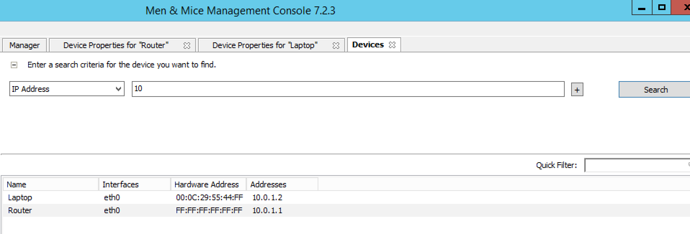
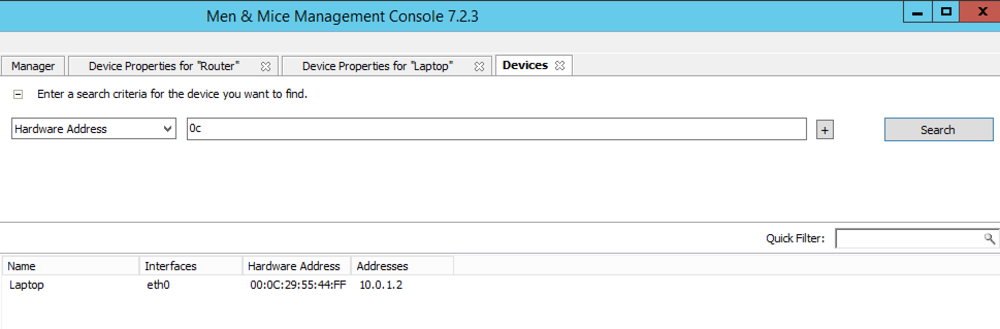

.. _devices:

Devices
=======

Overview
--------

Using the Devices feature, you can create devices, assign interfaces to each device and attach IP addresses to the interfaces.

What is a Device?
-----------------

A Device is any item that can have an IP address linked to it. A device can, for example, be a computer, a router, a firewall, a phone or a virtual machine. A device has one or more interfaces and each device can have any number of IP addresses linked to it.

It is common to assign multiple properties to devices. As a default, a device in the Men&Mice Suite only has one property - the device name. However, you can create any number of properties for the devices. To create a property for a device, use the Define Custom Properties feature. For more information on this feature, refer to :ref:`admin-custom-properties`.

Adding a Device
---------------

When you add a Device, you start by entering the basic Device information and then you create the relevant interface(s) and optionally link one or more IP Addresses to each interface.

To add a new device:

1. From the menu bar, select Device, New Device. A dialog box is displayed where you enter the name of the device. The information you enter is based on the properties that have been defined for the device.

2. Enter the name and click Add to create the device.

3. Once the device has been created, the Device Properties tab displays. Use this tab to manage interfaces for the device and link IP addresses to the device.

.. image:: ../../images/console-devices-properties.png
  :width: 80%
  :align: center

  * To Add an interface, click the Add button in the Interfaces section and enter the required information for the interface.
  * The Name field is mandatory.
  * The Hardware Address field contains the MAC address for the interface. This field is not required. However, if you enter a Hardware Address it must be a valid MAC address and it must be unique – no other device can have an interface with the same Hardware Address.
  * To Add an IP Address to the device, you must first create an interface as the IP Address is attached to an interface on the device. Once an interface has been created, click the Add button in the IP Address section and enter the required information for the IP Address.

Deleting a Device
-----------------

When you delete a Device, all information about the device is deleted, including the interfaces defined for the device, and all IP addresses linked to the device are unlinked from the device.

To remove a Device:

1. Locate the device you want to remove and open the Device Properties window.

2. Click the Delete button in the Device Details section.

3. Click OK in the confirmation box that appears. The device and its associated data is removed.

----

Linking/Unlinking IP Addresses
------------------------------

Linking an IP Address
^^^^^^^^^^^^^^^^^^^^^

You can link an IP Address to a device using two different methods.

Linking an IP Address using the Device Properties window:
"""""""""""""""""""""""""""""""""""""""""""""""""""""""""

1. Locate the device you want to link the address to and open the Device Properties window.

2. Click the Add button in the IP Address section. Note that before you can link and IP Address to a device, you must first create an interface for the device.

3. Enter the required information and click OK

Linking an IP address using the IP Address List window
""""""""""""""""""""""""""""""""""""""""""""""""""""""

1. Locate the IP Address Range containing the IP Address you want to link.

2. Double-click on it to display the list window.

3. Find the applicable IP Address.

4. Right-click and, from the shortcut menu, select Link to Device. The Device Linking Wizard displays

5. For each of the resulting screens, make a selection/entry and move through the wizard.

Unlinking an IP Address
^^^^^^^^^^^^^^^^^^^^^^^

You can unlink an IP Address from a device using two different methods.

Unlinking an IP Address using the Device Properties window:
"""""""""""""""""""""""""""""""""""""""""""""""""""""""""""

1. Locate the device you want to unlink the address from and open the Device Properties window.

2. Select the IP Address you want to unlink and click  Delete  in the IP Address section. The Unlink IP Address confirmation dialog box displays.

3. Select whether you want to only unlink the IP Address or whether you want to delete all data associated with the IP Address.

Unlinking an IP address using the IP Address List window
""""""""""""""""""""""""""""""""""""""""""""""""""""""""

1. Locate the IP Address Range containing the IP Address you wan to unlink.

2. Double-click on it to display the list window.

3. Find the applicable IP Address.

4. Right-click and, from the shortcut menu, select Unlink from Device.

5.Click OK in the confirmation dialog box.

Searching for Devices
---------------------

You can quickly find the device you want to work with using the Find Device command.

To search for a device:

1. From the menu bar, select  Device, Find Device . The Device Search dialog box displays.

2. Enter the search criteria for the device you want to find.

3. To add a new search criterion, click the button with the plus sign next to the search entry field

4. To remove a search criterion, click the button with the minus sign next to the criterion you want to remove

5. Click  OK  to start the search. If the search result only contains one device, the Device Properties window displays. If multiple devices are found, the search result is displayed in the Device List window.

Device List tab
---------------

The Device List tab is displayed when you choose Device, Show All Devices from the menu bar. The tab is also used to display search results when there is more than one device that matches the search criteria.

The Device List tab shows all relevant info for the Devices found.

The tab contains a Quick Filter entry field that allows you to refine the search results. As you type in the field, results that are not applicable are removed. The Quick Filter searches within the entries that are displayed in the Device List tab.

Clicking the button with the plus sign in the top left of the tab will expand the search panel. Using the search panel, you can search for devices based on multiple criteria. A search performed using the search panel will search the entire device list.

* To add a new search criterion, click the button with the plus sign next to the search entry field.

* To remove a search criterion, click the button with the minus sign next to the criterion you want to remove.

