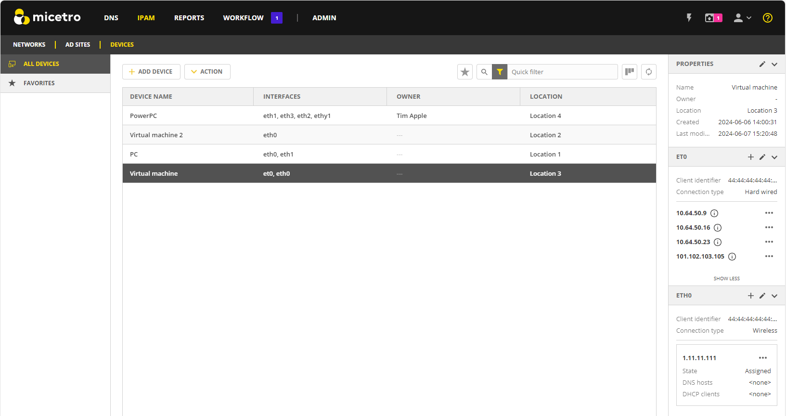

.. meta::
   :description: The Devices feature in the Micetro - definition and usage
   :keywords: IP address device, IP address, device scan, interfaces

.. _devices:

Devices and Interfaces
=======================

A Device is any item that can be linked to an IP address, such as a computer, router, firewall, phone, or virtual machine. Each device can have one or more interfaces and any number of IP addresses can be linked to it.
By default, a device is identified by its name. However, you can create custom properties to better describe and manage your devices. For more information about how to create custom properties, see Custom Properties.

**To access devices**:

* Go to the **IPAM** page and select the :guilabel:`Devices` tab.

 
Adding Devices
--------------
You can create devices, assign interfaces to each device, and link IP addresses to the interfaces. When adding a device, start by entering its basic information. Next, create the relevant interface(s) and optionally link one or more IP addresses to each interface.

**To add a device**:

1.	Click :guilabel:`Add Device`.
2.	Enter the name of the device. Additional information required will be based on the properties defined for the device.
3.	Click :guilabel:`Save` to create the device.

Assigning Interfaces
--------------------
Once the device is created, you can manage interfaces and link IP addresses to the device.

**To add an interface to a device**:

1.	Select the device.
2.	Select Add Interface on either the Action or row … menu. 
3.	Enter the name of the interface.
 
4.	MAC address (optional). It must be a valid MAC address and unique. No other device can have an interface with the same MAC ID.
5.	Enter the IP address(es) you want to link to the device. 
6.	Select or enter any custom properties defined for the interface.
7.	Select Save.

Locating Devices
----------------
To locate devices quickly, use the Quick Filter search box at the top of the Devices view. You can filter by device name, IP address, interface, and other properties.

Creating a list of favorite devices allows for fast access to the devices you use most frequently. Use the star icon next to the search box to add a selected device to favorites and access your favorites in the left-hand filtering sidebar.

Viewing IP Address Details
---------------------------
The inspector on the right-hand side of the device list provides detailed information about the IP addresses linked to the selected device. 
If an interface has multiple IP addresses associated with it, the address list will be collapsed. In that case, you can hover over the information icon for an IP address to view details for that address. 
 
Locating IP Addresses
^^^^^^^^^^^^^^^^^^^^^
To quickly locate and view a specific IP address within the IPAM view:
1.	Select the address.
2.	On the row … menu, select Reveal. The system takes you to the IPAM view where the selected IP address will be highlighted.

Linking IP Addresses to Devices
-------------------------------
You can link and unlink IP addresses from devices to manage their network connectivity.

**To link an IP address**:

1.	Select the device to which you want to link an IP address.
2.	Do one of the following:

  * Locate the appropriate interface in the inspector on the right. Click the click the plus (+) icon next to the interface.
 
  -	OR –

    * On the Action or the row … menu, select Configure interfaces. Find the appropriate interface and click the row … menu.
 
3.	Select Link IP address and enter the IP address in the pop-up window.

Unlinking IP Addresses
^^^^^^^^^^^^^^^^^^^^^^
Unlinking an IP address from a device interface removes the association between the IP address and the interface, but retains the address’s metadata, such as custom properties. 
You can also clear an address, which will remove the association and delete all related metadata.

**To unlink an IP address**:

1.	Select the IP address you want to unlink in either the inspector or the Edit interfaces dialog box.
2.	On the row … menu, select Unlink to remove the association but retain the metadata. Select Clear to unlink the address and delete all associated data, such as custom properties.

Configuring Device Interfaces
-----------------------------
When dealing with multiple interfaces and IP addresses, the inspector can become crowded, making it difficult to locate the specific item you want to view or modify. To streamline this process, you use the Edit interfaces dialog box that allows for easier searching and configuration. In this dialog box, you can add new interfaces, link and unlink IP addresses, edit device properties, and delete interfaces.

**To edit a device interface**:

1.	Select the device.
2.	Select Configure interfaces on either the Action or the row … menu.
3.	Use the search box to filter the information by connection type, interface, IP address, or other properties.
 
4.	Select the item you want to configure. Select a configuration option on the item’s row … menu.

Editing Device Properties
-------------------------
You can change the name of your devices and edit any custom properties that have been defined for them.

**To edit device properties**:

1.	Select the device you want to edit.
2.	Select Edit properties on either the Action or the row … menu.
3.	In the Edit Properties dialog box, make the desired changes

.. tip::
  
    You can also access the Properties dialog box from the Properties section in the inspector.

Removing Devices
----------------
When you delete a device, all information related to it is removed. This includes the defined interfaces and the unlinking of all associated IP addresses.

**To delete a device**
:
1.	Select the device you wish to remove, then select Delete device on the row … menu.
2.	Click Yes to confirm. The device and its associated data is removed.

Related Resources/Links
•	[Related topics/documents that might help the user.]

