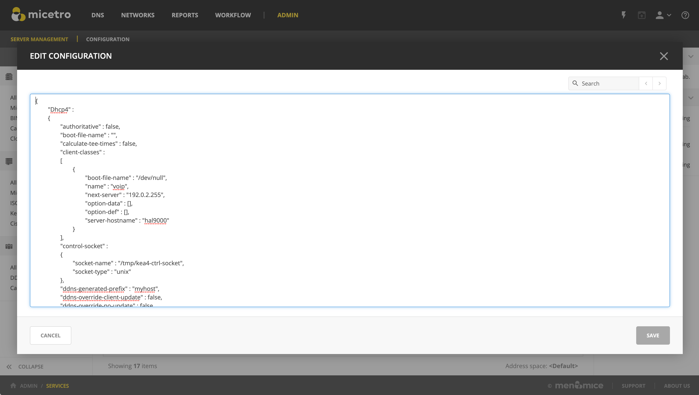

.. _dhcp-kea-external-changes:

Handling external changes with Kea
==================================

.. warning::
  You should always edit the Kea DHCP server's configuration file through Micetro to ensure that the synchronization between Micetro and the Kea DHCP server is instant and all changes will immediately updated in the database and reflected in the user interface.

.. note::
  All changes made to the configuration file through Micetro will automatically and instantly be propagated to the secondary/backup servers in a :ref:`dhcp-kea-ha` setup.

Micetro uses the in-memory configuration of the Kea server. If external changes must be made to a Kea DHCP server’s configuration file, the changes to the configuration file aren't processed by the server until forced to parse the file to its *in-memory* structure, so Micetro can be made aware of these changes.

To make the Kea DHCP server process changes to its configuration file a call has to be made to either the :ref:`kea-control-agent` or the socket that Kea uses.

An example of the call to the control-agent:

.. code-block:: bash

  curl -X POST -H "Content-Type: application/json" -d '{ "command": "config-reload", "service": [ "dhcp4" ] }' localhost:8000

If successful, the result looks like this:

.. code-block::
  :linenos:

  [ { "result": 0, "text": "Configuration successful." } ]

After the changes to the configuration file have been accepted and parsed into the Kea DHCP servers memory structure, users can display them in Micetro through the :guilabel:`Edit Configuration` action for the server.

Resolving conflicts
-------------------

Micetro synchronizes all data between the Kea DHCP servers and its database regularly. Setting the ``DHCPSyncInterval`` variable in Central's ``preferences.cfg`` overwrites the default value of 15 minutes.

.. note::
  The values set for ``DHCPSyncInterval`` are in seconds.

Synchronization occurs based on the configuration to update the database and the user interface, but to prevent overwriting external changes before synchronization is complete, Micetro will check for conflicts with the Kea server's in-memory configuration before writing the changes to the server.

For example, if a scope with subnet 1.3.3.0/29 is manually added to the Kea DHCP servers configuration file, and ``config-reload`` is successfully called, the Kea server will have parsed the change and added the scope to its in-memory data structure. Synchronization with Micetro may not have been executed yet, and the externally added scope is not yet visible in the user interface. However, if another user would try to  add the same or otherwise conflicting scope through Micetro, they will receive a message stating "*A scope with address "1.3.3.0" already exists on the server*" as the configuration file is validated against the Kea DHCP servers in-memory config before each change is applied.

External changes and Kea high availability
------------------------------------------

See :ref:`dhcp-kea-ha-external-changes`.
