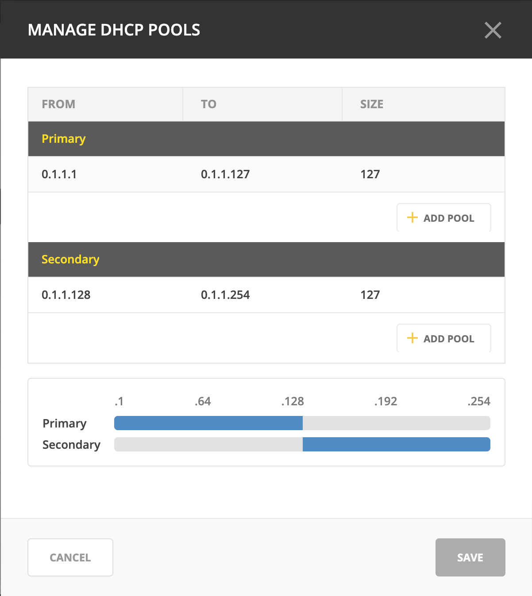
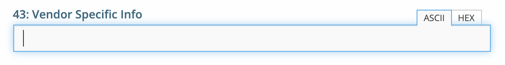

.. meta::
   :description: DHCP management in Micetro 
   :keywords: DHCP, scopes, reservations 

.. _dhcp_management:

DHCP
====

Managing DHCP Pools
--------------------

A DHCP pool is a range of IP addresses that the DHCP server can assign to clients. Each pool is defined within a specific subnet. You can configure the IP address ranges that a DHCP server can assign to clients on a network.

Adding an Address Pool
^^^^^^^^^^^^^^^^^^^^^^^

1.	Select the relevant scope for which you want to create an address pool.
2.	On the :guilabel:`Action` or the row :guilabel:`...` menu, select :guilabel:`Manage DHCP pools`.
3.	Click :guilabel:`Add pool`.
 
  .. image:: ../../images/add-dhcp-pool.png
    :width: 50%

4.	In the **Add pool** dialog box, enter the range of addresses to be included in the pool in the :guilabel:`From`` and :guilabel:`To` fields. These fields default to the first available address in the range. If this scope is shared across multiple servers (a split scope) and there is an overlap in the address pool, a warning message will appear.
5.	Click :guilabel:`Add`.

Editing and Removing Address Pools
^^^^^^^^^^^^^^^^^^^^^^^^^^^^^^^^^^

**To edit or remove an existing address pool**:

1.	In the **Manage DHCP pools** dialog box, select the relevant pool.
2.	On the pool's row :guilabel:`...` menu, select :guilabel:`Edit` to modify the pool or :guilabel:`Remove` to delete it.

Adding Exclusions (MS DHCP only)
^^^^^^^^^^^^^^^^^^^^^^^^^^^^^^^^

You can exclude a single IP Address or an entire range of addresses from being used. Exclusions can only be made for addresses that are already part of an existing address pool.

**To create an exclusion**:

1.	Select the relevant scope.
2.	On the :guilabel:`Action` or the row :guilabel:`...` menu, select :guilabel:`Manage DHCP pools` .
3.	Click :guilabel:`Add exclusion`.

  .. image:: ../../images/add-exclusion.png
    :width: 50%

4.	In the **Add exclusion** dialog box, enter the range of addresses to be excluded in the :guilabel:`From` and :guilabel:`To` fields. All addresses within this range, including the start and end addresses, will be excluded.

Editing and Removing Exclusions
^^^^^^^^^^^^^^^^^^^^^^^^^^^^^^^

**To edit or remove an existing exclusion**:

1.	In the **Manage DHCP pools** dialog box, select the exclusion you want to edit or remove.
2.	On the exclusion's row :guilabel:`...` menu, select :guilabel:`Edit` to modify the exclusion or :guilabel:`Remove` to delete it.

Creating DHCP Reservations
--------------------------

DHCP reservations can be created in unassigned address spaces, address pools, and excluded addresses. You can also set specific options for reserved IP addresses. 

**To create a reservation**:

1.	On the **Networks** tab within the **IPAM** page, select the relevant scope. 
2.	Open the scope by clicking :guilabel:`Open` on the top toolbar or by double-clicking it. 
3.	Select the relevant IP address and click :guilabel:`Reserve` on the top toolbar.
4.	Fill in the necessary information.

  .. image:: ../../images/create-dhcp-reservation.png
    :width: 50%

  * **Name**: Assign a name to identify the reserved address.

  * **Reservation method**: Choose between :guilabel:`Hardware address` or :guilabl:`Client identifier`.

       * **Hardware address**: Enter the MAC Address (Media Access Control Address) of the network node for which this address is being reserved.

       * **Client identifier**: Use the Ascii and Hex switch on the right to change the input type.

  * **Reservation type**: Select whether this reservation should support **DHCP**, **BOOTP** (Bootstrap Protocol), or **both** (default).

  * **Description**: (Optional) Provide a description.

5.	Click :guilabel:`Create` to finalize the reservation. The IP address will receive the status **Reserved**.

Editing and Deleting Reservations
^^^^^^^^^^^^^^^^^^^^^^^^^^^^^^^^^^

**To edit or delete a reservation**:

1.	Select the reserved IP address.
2.	On the :guilabel:`Action` or the row :guilabel:`...` menu, select :guilabel:`Edit DHCP reservation` to modify the reversion or :guilabel:`Delete Reservation(s)` to delete it.

Editing Reservation Options
^^^^^^^^^^^^^^^^^^^^^^^^^^^^

**To edit reservation options**:

1.	Select the reserved IP address.
2.	On the :guilabel:`Action` or the row :guilabel:`...` menu, select :guilabel:`Edit reservation options`. For more information about DHCP options, see http://127.0.0.1:8000/guides/user-manual/dhcp_scopes.html#editing-dhcp-options.

Managing DHCPv6 Exclusions
--------------------------
You can create an exclusion range within a DHCPv6 scope to prevent the DHCP server from assigning IP addresses within that range. This allows you to manually assign those addresses without conflicts. 
When managing exclusions within a DHCPv6 pool, you have the option to specify a percentage of the DHCPv6 scope instead of manually entering the :guilabel:`From address` and :guilabel:`From address`. 

**To add an exclusion**:

1.	Select the desired DHCP scope.
2.	On the :guilabel:`Action` or the row :guilabel:`...` menu, select :guilabel:`Manage DHCP Exclusions`.
3.	Click :guilabel:`Add Exclusion`.
4.	In the **Add exclusion** dialog box, choose to create the exclusion range by either :guilabel:`Percentage` or :guilabel:`Manual entry`:

  * **Percentage**: Drag the percentage bar to the correct percentage of addresses you'd like to exclude and enter a :guilabel:`From address` only.
  * **Manual entry**: Enter the :guilabel:`From address` and :guilabel:`From address` for the range you'd like to exclude from the DHCP scope.
 
  .. image:: ../../images/add-exclusion-percentage.png
    :width: 50%

  .. note::

    If the exclusion range doesn't have the space to accommodate the specified percentage of IP addresses, it will not allow you to add this exclusion range. Adjust the :guilabel:`From address` or lower the percentage as needed.

5.	Click :guilabel:`Add`.

  * **Red bar**: Represents the exclusion range.
  * **Blue bar**: Represents the address pool of dynamic allocation addresses.
 
   .. image:: ../../images/dhcp-exclusions.png
     :width: 65%

Reconciling Scopes
------------------

.. note::
  Applies to Microsoft DHCP servers only.

Reconciling scopes is a crucial task to ensure the consistency and reliability of your DHCP configuration. This function is specifically applicable to Microsoft DHCP servers and is used to address inconsistencies between the information stored in the Windows registry and the DHCP database. Such inconsistencies can cause issues with IP address allocation and network stability.
Use this function to fix inconsistencies between information in the registry and the DHCP database.

**To reconcile DHCP scopes**:

1. On the **Networks** tab on the **IPAM** page, select one or multiple DHCP Scopes from Microsoft servers.
2. On the :guilabel:`Action` or the row :guilabel:`...` menu, select :guilabel:`Reconcile DHCP Scopes`.
3. If any inconsistencies are found, a list will be presented. Click :guilabel:`Fix` to resolve the inconsistencies.

  .. image:: ../../images/reconciling-scopes.png
    :width: 65%

For more detailed information, see the `Microsoft documentation <https://docs.microsoft.com/en-us/previous-versions/windows/it-pro/windows-server-2008-R2-and-2008/dd145311(v=ws.10)?redirectedfrom=MSDN>`_.

Deleting a Lease
----------------
You may need to delete a lease from a DHCP scope, such as when a device is no longer in use or needs to be reconfigured. When a lease is deleted, the IP address associated with that lease becomes available for reassignment by the DHCP server.

**To delete a lease in a DHCP scope**:

1. Open the scope containing the lease you want to delete.

2. Select the lease and select :guilabel:`Release DHCP lease` on either the :guilabel:`Action` or the row :guilabel:`...` menu.

Split Scopes
------------

.. note:: 
  Split scopes are only supported on MS DHCP and ISC Kea servers.

Split Scopes in Load Balancing Mode
^^^^^^^^^^^^^^^^^^^^^^^^^^^^^^^^^^^^
When creating scopes on Kea servers configured in load balancing mode for high availability, Micetro will evenly split the available pool between primary and secondary servers. This ensures efficient distribution of IP addresses and enhances network reliability by balancing the load and providing redundancy.

Managing Split Scopes for DHCPv6
^^^^^^^^^^^^^^^^^^^^^^^^^^^^^^^^^

A split scope divides the DHCP address range into two or more segments, with each segment being assigned to a different DHCP server. This ensures that if one server fails, another server can continue providing IP addresses to clients.

**To manage DHCPv6 split scopes**:

1.	On the **Networks** tab on the **IPAM** page, select the relevant DHCPv6 scope.
2.	On the :guilabel:`Action` or the row :guilabel:`...` menu, select :guilabel:`Manage scope instances`.
3.	Select a second server to manage the DHCP scope, and then click :guilabel:`Add`. Enable the servers on which the split scope should reside.
 
  .. image:: ../../images/split-scopes-instances.png
    :width: 65%

  .. note::
    You can change the server preferences by clicking and dragging the hamburger icon (the three lines to the left of the server) to change the server order. The preference for the second server will always be the **First Server Preference + 1**, and each additional server will increment by 1.

4.	Click :guilabel:`Save`.
5.	On the same scope, select :guilabel:`Manage DHCP Exclusions`` on either the :guilabel:`Action` or the row :guilabel:`...` menu.
6.	Click :guilabel:`Add Exclusion` for the first server. Select the percentage of the address range you want to exclude from the first server and click :guilabel:`Add`.`
7.	Click :guilabel:`Add Exclusion` for the second server. Select the address range you want to exclude from the second server and click :guilabel:`Add`.

  .. image:: ../../images/split-scope-exclusions.png
    :width: 65%

8.	Click :guilabel:`Save`.

.. _edit-dhcp-options:

Editing DHCP Options
--------------------

.. note::
  DHCPv4 and DHCPv6 scopes inherit DHCP and DDNS Options from the parent DHCP server. DHCPv4 and DHCPv6 reservation inherit DHCP and DDNS options from the DHCP scope. However, these options may be changed by editing the options for the specific scope or reservation.

**Viewing the configured DHCP options for a DHCP scope**:

1.	Select the DHCP scope in the networks list.
2.	On the :guilabel:`Action` or the row :guilabel:`...` menu, select :guilabel:`Edit scope options`.
3.	A dialog box is displayed. Note that in order to see the options that have inherited values, you need to select the :guilabel:`Show inherited options` checkbox.

  .. image:: ../../images/edit-dhcp-options.png
    :width: 65%

Adding a New DHCP Option
^^^^^^^^^^^^^^^^^^^^^^^^

**To add a new DHCP option**:

1.	Start typing into the :guilabel:`Add an option`` field. Either type in the name of the option or the option number.
2.	A list of available options will be displayed as you type.

  .. image:: ../../images/edit-scope-autocomplete.png
    :width: 65%
 
3.	Select the option you want to add.
4.	The option is now shown in the list and you can add values to the option.

Removing a DHCP Option
^^^^^^^^^^^^^^^^^^^^^^^

Hovering over an option in the **Edit Scope** dialog box will display a trash can icon to the right of the option.
Click the trash can to remove the option.

HEX and ASCII Representation
^^^^^^^^^^^^^^^^^^^^^^^^^^^^
Some DHCP options, such as DHCP option 43 (Vendor specific info) require the value to be in HEX format. In this case the UI offers the value to be viewed both as HEX and ASCII by selecting each option in tabs above the field, as seen in the figure below.
 

