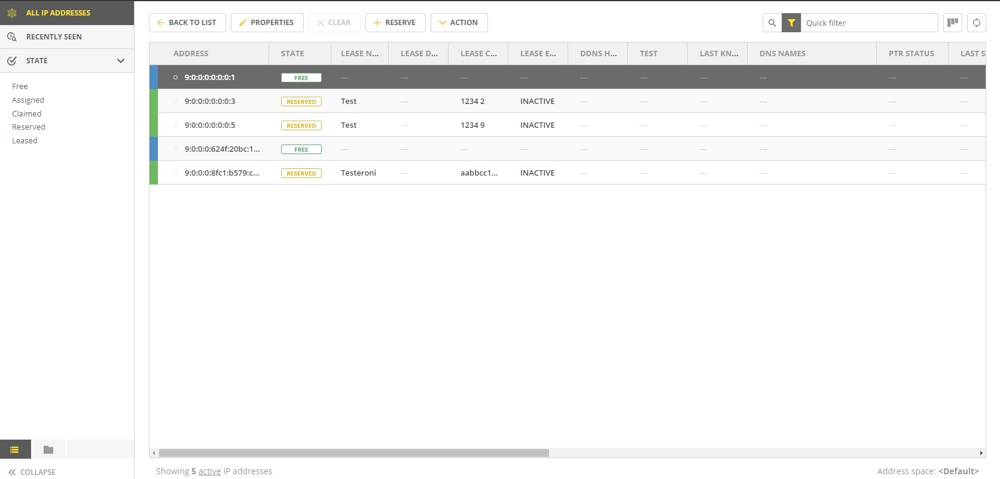
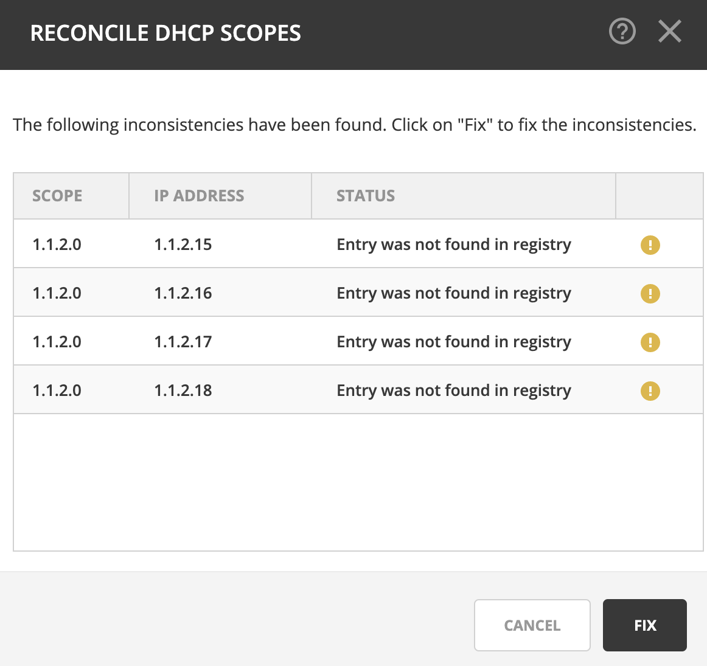

.. meta::
   :description: How to manage DHCP scopes in the Micetro by Men&Mice Management Console
   :keywords: DHCP management, DHCP scopes

.. _dhcp-scopes:

DHCP
=====

.. note::
  To manage DHCP scopes in the Management console, see :ref:`console-dhcp-scopes`.

Overview
--------

This section shows you how to perform specific actions in Micetro associated with maintaining your DHCP scopes, such as creating and modifying reservations, setting scope options and working with split scopes.

Viewing DHCP Scopes
-------------------

All DHCP Scopes on All Servers
^^^^^^^^^^^^^^^^^^^^^^^^^^^^^^

You can view all of the existing DHCP scopes at once, regardless of the server to which they belong. On the :guilabel:`IPAM` page, select :guilabel:`DHCP scopes` in the filtering sidebar on the left.

.. image:: ../../images/dhcp-scopes-Micetro-10.5.png
  :width: 80%
|
The :guilabel:`Utilization` column in the scope list shows the utilization of available addresses within the address pool(s) of each scope.

Disabled scopes appear dimmed. The number of unassigned addresses is always shown as zero for disabled scopes.

Scopes on a Specific DHCP Server
^^^^^^^^^^^^^^^^^^^^^^^^^^^^^^^^

Adiministrators can view DHCP scopes that reside on individual DHCP Servers that are being managed by Micetro. On the :guilabel:`Admin` page, select the relevant DHCP server in the filtering sidebar under :guilabel:`DHCP Services`. On the :guilabel:`Action` menu, select :guilabel:`View scopes`. You can also select this option on the **Row menu (...)**.

Selected Scope Menus
^^^^^^^^^^^^^^^^^^^^

When working with scopes, selecting one or more scopes enables a row menu (...) and relevant actions from the :guilabel:`Actions` menu on the top toolbar. The available actions change based upon the type of the DHCP server the scope is hosted on.

DHCP Scope Actions
""""""""""""""""""

* **Open network**: Opens the selected scope.

* **Edit network properties**: Change the title, description, and vlan id of the selected network.

* **Enable/disable scope**: If you are no longer using a particular scope, but do not want to delete it completely because you may need it in the future, you can disable the scope instead. A scope that is disabled will be ignored by the DHCP server until it is re-enabled.

* **Convert to network**: Converts the DHCP scope to a network.

* **Add to folder**: Adds the scope to a folder for easier access. See :ref:`object-folders`.

* **Set discovery schedule**: Sets discovery schedule for the scope.

* **Set subnet monitoring**: Configures subnet monitoring for the scope. 
.. _dhcp-pools:
* **Manage DHCP pools**: View and manage DHCP pools.

  * **Add Pool** : Creates an address pool for the selected scope. Fill in the :guilabel:`From` and :guilabel:`To` fields in the dialog box, typing the range of addresses to be included in the pool. Both of these fields default to the first available address in the range. If this is a split scope (a scope that exists on more than one server) and the address pool overlaps a warning message displays.

  * **Edit Address Pool**: To edit an existing pool, select it, and then select :guilabel:`Edit` on the **Row menu (...)** .

  * **Delete Address Pool(s)**: To delete an existing pool, select it, and then select :guilabel:`Delete` on the **Row menu (...)**.

  * **Create Exclusion**:  *MS DHCP only*. Allows you to exclude a single IP Address or an entire range of addresses from being used. You can only exclude addresses that are already part of an address pool. To create an exclusion, specify the From and To IP Addresses. All the addresses between and including the ones entered will be excluded.

  * **Edit Exclusion**: *MS DHCP only.* To edit an exclusion, select it, and then select :guilabel:`Edit` on the **Row menu (...)**.

  * **Delete Excluded Range(s)**: *MS DHCP only.* To delete an exclusion, select it, and then select :guilabel:`Delete` on the **Row menu (...)**.

DHCP Actions for IP Addresses
"""""""""""""""""""""""""""""

To view the IP addresses a DHCP scope contains, double click the scope the grid, select :guilabel:`Open network` on the **Row menu (...)**, or the :guilabel:`Action` menu.

* **Create DNS record**: Creates an A record from the selected IP address. See :ref:`webapp-create-dns-record`.

* **Edit IP address properties**: Define values for any custom properties configured in the system.

* **Claim/release IP address**: Claims and releases the IP address(es).

* **Ping IP address**: Performs a ping on the selected IP address(es).

* **Create DHCP reservation**: Reservations can be created in unassigned address space, address pools, and excluded addresses. It is possible to set options for reserved IP Addresses. To create a reservation, do the following:

  * **Name**: Assign a name to identify the reserved address.

    * **Description**: (Optional) User defined description.

    * **Reservation method**: Hardware address or Client identifier

      * **Hardware address**: Enter the MAC Address (i.e., Media Access Control Address) of the network node for which this address is being reserved.

      * **Client identifier**: Use the *Ascii* and *Hex* switch on the right to change input type.

    * **Reservation type**: Select whether this reservation should support DHCP, BOOTP (i.e., Bootstrap Protocol), or both (default).

* **Edit DHCP reservation**: Edit an existing reservation.

* **Edit reservation options**: Edit options for a reservation. Refer to :ref:`dhcp-options` for details on this dialog box.

* **Delete DHCP reservation**: To delete an existing reservation, right-click on the reservation you want to remove and select :guilabel:`Delete Reservation(s)`.

* **View history**: Displays the object history for the selected IP address.
  
  
Viewing DHCPv6 Scopes
---------------------
Unlike DHCPv4 scopes which display all the addresses within a scope, a DHCPv6 scope will only display addresses in use or which have been recently used. At the bottom of the view, you will see how many active IP addresses are being shown. If there is an IP address with the status of **free**, that IP address has recently been used. To see more information, select :guilabel:`View History` for that address.

|
.. _new-dhcp-scope:

New DHCP Scope
--------------

.. note::
  Creating a scope on a Kea server configured for load balancing high availability, Micetro will automatically split the scope evenly between primary and secondary servers. See :ref:`dhcp-kea-ha`.

This section describes how to create and edit DHCP scopes with the new *DHCP Scope Creation Wizard*.

Whenever you create a new scope, Micetro automatically checks whether the new scope conflicts with an existing scope or an IPAM range.

The Wizard has additional steps, or skips over some steps, depending on the type of DHCP server the scope is being created on, and whether the :ref:`active-directory` integration has been enabled.

To create a new scope on the MS DHCP server, do the following:

1. In :menuselection:`Networks` use the :guilabel:`Create` action and select :guilabel:`DHCP scope` from the dropdown.

.. image:: ../../images/create-dhcp-scope-Micetro.png
  :width: 70%
  :align: center

2. Click :guilabel:`Next`.

3. Edit the options for the DHCP scope.

   * **DHCP server**: The DHCP server for the scope.

   * **Enabled**: If selected, the DHCP scope will start allocating IP addresses immediately. Clear this option if you want to configure the scope further.

   * **Start/end of address pool**: Adjust the first and last IP address in the pool.

4. Active Directory Site selection. If you have enabled :ref:`active-directory`, the Wizard will ask you which AD site the new DHCP Scope should be associated to.

  .. note::
    Leave it empty for no AD site.

5. Scope properties.

6. Summary. The changes the Wizard will perform are summarized here and applied once the user clicks "Finish".

7. Save comment.

New DHCPv6 Scope
----------------

.. note::
Micetro supports DHCPv6 for Microsoft and Kea DHCP

1. Under :guilabel:`IPAM` click on :guilabel:`Create` and select :guilabel:`DHCP Scope`..

2. Enter the network information and click :guilabel:`Next`.

3. Enter the DHCP Server name and the preference, and put a check next to :guilabel:`Enabled` if you'd like to enable this scope on this server. Click :guilabel:`Next`.

   .. Note::
      The preference value is a new parameter required by Microsoft for DHCPv6 scopes. If the scope is assigned to multiple servers, the lowest preference assignment will be selected by the DHCP client
   
4. Enter the title as an identifier for this scope as well as the description and click :guilabel:`Next`.

5. Verify the information is correct and click :guilabel:`Finish`.

Manage DHCPv6 Exclusions
------------------------
When managing exclusions within a DHCPv6 pool it is possible to specify a percentage of a DHCPv6 scope rather than specifying a **From address** and **To address**

1. Select a DHCP scope while under :guilabel:`IPAM` >> :guilabel:`DHCP scopes`.

2. Click :guilabel:`Action`, and then select :guilabel:`Manage DHCP Exclusions`.

3. Click :guilabel:`Add Exclusion`.

4. A new pop up will appear. Choose to either create the exclusion range by :guilabel:`Manual Entry` or :guilabel:`Percentage`.

5. If you choose manual entry, enter the **From address** and **To address** for the range you'd like to exclude from the DHCP scope.

   If you choose percentage, drag the percentage bar to the correct percentage of addresses you'd like to exclude, and enter a **From address** only.

.. image:: ../../images/add-exclusion-percentage.png
   :width: 50%
   :align: center
   
.. Note::
   If the exclusion range doesn't have the space to accomodate the percentage of IP addresses specified, it will not allow you to add this exclusion range until you pick an appropriate **From address** or lower the percentage.

6. Click :guilabel:`Add`.

   **Red bar**: The exclusion range
   
   **Blue bar**: Address Pool of dynamic allocation addresses
   
   .. image:: ../../images/dhcp-exclusions.png
      :width: 50%
      :align: center

7. Click :guilabel:`Save`

Access
------

For complete details on this function, refer to :ref:`access-control`.

Folders
-------

Refer to :ref:`object-folders` for details on this function.

.. _reconcile-scopes:

Reconcile Scopes
----------------

.. note::
  Applies to MS DHCP Servers only.

Use this function to fix inconsistencies between information in the registry and the DHCP database.

1. Go to the :guilabel:`IPAM` page.

2. Select :guilabel:`DHCP Scopes`

3. Select one or multiple DHCP Scopes from :guilabel:`Microsoft Servers`

4. Click on the ellipsis (or meatball) menu on the scope(s).

5. Click on :guilabel:`Reconcile DHCP Scopes`

6. If there are inconsistencies, a list will be presented. Click :guilabel:`Fix` to fix the inconsistincies.

For more information see `the Microsoft documentation <https://docs.microsoft.com/en-us/previous-versions/windows/it-pro/windows-server-2008-R2-and-2008/dd145311(v=ws.10)?redirectedfrom=MSDN>`_.

Other Functions
---------------

At any time, you can modify the properties for a scope. Simply locate the item, and from the **Row menu (...)** select :guilabel:`Edit network properties`. For split scopes, the scope contents can be examined individually on each server.

Deleting a Lease
^^^^^^^^^^^^^^^^

To delete a lease in a DHCP scope, do the following:

1. Open the scope containing the lease you want to delete.

2. Select the lease and on the **Row menu (...)**  select :guilabel:`Release DHCP lease` or use :menuselection:`Action --> Release DHCP lease`.

IP Address Details
^^^^^^^^^^^^^^^^^^

The IP Address details window contains all information pertaining to an IP Address in Micetro, including DNS records, DHCP reservations, and custom properties. To access the IP address details select an IP address in the DHCP scope dialog, and all information is displayed in the Inspector, including information on any DNS and DHCP data associated with the IP address. A reservation can be created by clicking the :guilabel:`+` button in the *Related DHCP data* section of the Inspector.

Renaming a Scope
^^^^^^^^^^^^^^^^

You can change the name and/or description of a scope in Micetro.

1. Locate and select the DHCP Scope you want to rename.

2. On the **Row menu (...)**, select :guilabel:`Edit network properties`.

3. Enter the **Title**, and any other value you wish to change.

4. Click :guilabel:`Save`.

Host Discovery
--------------

With this feature, you can see when hosts were last seen on your network. There are two methods you can use for host discovery – using ping or querying routers for host information.

When host discovery is enabled, two columns are added to the range or scope view.

Last Seen
  This column identifies when a host was last seen on the network and which method was used to discover the host.

Last Known MAC Address
  This column shows the MAC address used by the host the last time it was seen on the network. This column is only populated if the host was seen using a router query.

Configuring Host Discovery Using Ping
^^^^^^^^^^^^^^^^^^^^^^^^^^^^^^^^^^^^^

1. Select one or more scopes.

2. on the **Row menu (...)**, select :guilabel:`Set discovery Schedule`.

3. Select the :guilabel:`Enable` option.

  * **Frequency**: Click the drop-down list and select the frequency (e.g., 1, 2, etc.).

  * **Every**: Enter the frequency unit for discovery (e.g. days, weeks, etc.).

  * **Next run**: Select the start date and time.

4. Click :guilabel:`Save`.

Once the schedule options have been set and saved, two columns - Last Seen and Last Known MAC Address - are added to the range or scope grid. The Last Seen column identifies when a host was last seen on the network.

Green
  Host responded to the last PING request. The date and time are shown.

Orange
  Host has responded in the past, but did not respond to the last PING request. The date and time of last response is shown.

Red
  Host has never responded to a PING request. The text Never is shown.

At any time if you wish to disable host discovery, do the following:

1. Select the object(s) for which you want to disable discovery.

2. On the **Row menu (...)** , select :guilabel:`Set discovery schedule`.

3. Clear the :guilabel:`Enable` option.

4. Click :guilabel:`Save`.

* The DHCP scope window will show every instance of the split scope in a separate tab, making it possible to work with all instances of the split scope in a single window.

* The Overview and Statistics tab in the DHCP scope window will show a graphical overview for all of the split scope instances.

* Reservations are managed automatically. All changes to reservations (creation, modification, and deletion) are applied to all instances of the split scope.

The servers listed in this dialog box all contain the scope to which the user was applying the change. By pressing the Enable button, all instances of the scope would be enabled.

.. note::
  Split scopes are only supported on MS DHCP and ISC Kea servers.
  
Split Scopes in Load Balancing Mode
-----------------------------------

When creating scopes on Kea servers configured in load balancing mode for high availability, Micetro will split the available pool evenly between primary and secondary servers.

.. image:: ../../images/kea-ha-lb-split-scopes-Micetro.png
  :width: 50%
  :align: center

Managing Split Scopes for DHCPv6
--------------------------------
  
1. Select a DHCPv6 scope under :guilabel:`IPAM` >> :guilabel:`DHCP Scopes`
  
2. Click :guilabel:`Action`, and then :guilabel:`Manage Scope Instances`
  
3. In the drop-down menu select a second server to manage the DHCP scope, and then click :guilabel:`Add`. Enable the servers on which the split-scope should reside.
  
   .. note::
      You can change the preference of the servers by clicking and dragging on the hamburger icon (three lines to the left of the server) to change the order of the servers. The second server will always have a preference of the **First Server Preference + 1** and each additional server will increment by 1.
   
4. Click :guilabel:`Save`
  
   .. image:: ../../images/split-scopes-instances.png
    :width: 60%
    :align: center
   
5. On the same scope, click the :guilabel:`Action` menu and then select :guilabel:`Manage DHCP Exclusions`
  
6. Click on :guilabel:`Add Exclusion` for the first server and select the percentage for which you'd like to exclude from the first server and click :guilabel:`Add`
  
7. Click on :guilabel:`Add Exclusion` for the second server and select the percentage for which you'd like to exclude from the second server and click :guilabel:`Add`
  
   .. image:: ../../images/split-scope-exclusions.png
    :width: 60%
    :align: center
   
8. Click :guilabel:`Save`
 
  
.. _webapp-edit-dhcp:

Editing DHCP Options
---------------------- 

.. Note::
   DHCPv4 and DHCPv6 scopes inherit DHCP and DDNS Options from the parent DHCP server. DHCPv4 and DHCPv6 reservation inherit DHCP and DDNS options from the DHCP scope. However these options may be changed by editing the options for the specific scope or reservation.

Viewing the configured DHCP options for a DHCP scope
^^^^^^^^^^^^^^^^^^^^^^^^^^^^^^^^^^^^^^^^^^^^^^^^^^^^^^

1. Select the DHCP scope in the networks list.

2. On the :guilabel:`Action` menu, select :guilabel:`Edit scope options`. You can also select this option on the **Row menu (...)**.

3. A dialog box is displayed. Note that in order to see the options that have inherited values, you need to select the :guilabel:`Show inherited options` checkbox.

   .. image:: ../../images/edit-dhcp-options.png
    :width: 70%

Adding a New DHCP Option
""""""""""""""""""""""""""

1. Start typing into the :guilabel:`Add an option` field. Either type in the name of the option or the option number.

2. A list of available options will be displayed as you type.

   .. image:: ../../images/edit-scope-autocomplete.png
      :width: 70%

3. Select the option you want to add.

4. The option is now shown in the list and you can add values to the option.

      
Removing a DHCP Option
^^^^^^^^^^^^^^^^^^^^^^

Hovering over an option in the Edit Scope dialog box will display a trash can icon to the right of the option.

Clicking the trash can will remove the option.

HEX and ASCII Representation
^^^^^^^^^^^^^^^^^^^^^^^^^^^^^

Some DHCP options, such as DHCP option 43 (Vendor specific info) require the value to be in HEX format. In this case the UI offers the value to be viewed both as HEX and ASCII by selecting each option in tabs above the field, as seen in the figure below.

.. image:: ../../images/blackstar-edit-dhcp-ascii-hex.png
  :width: 70%
  :align: center
