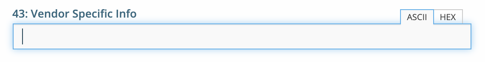
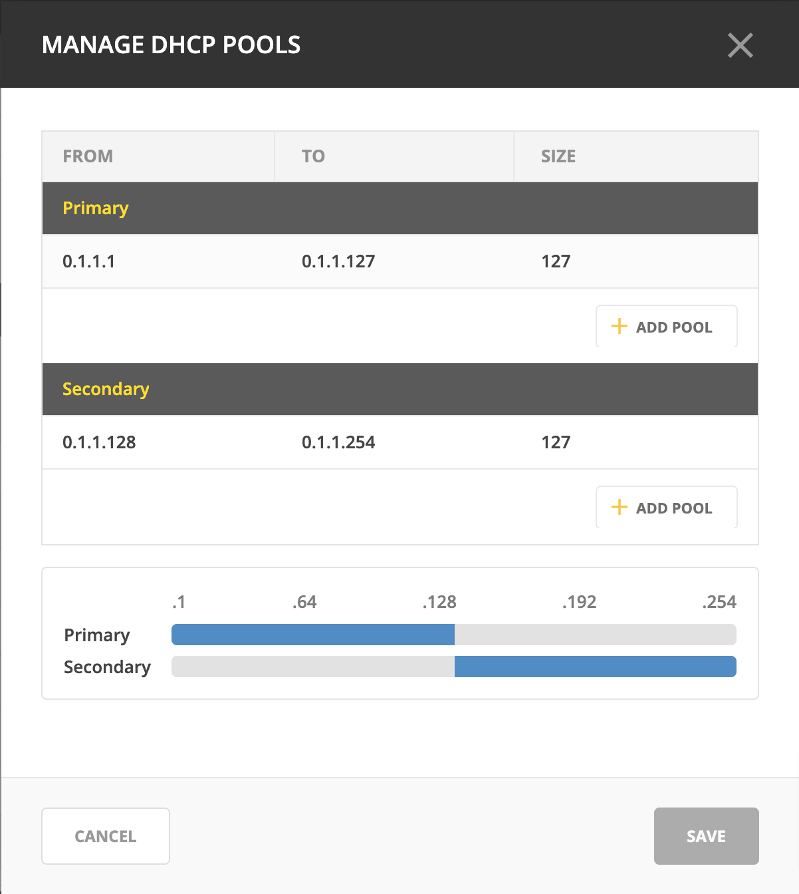

.. meta::
   :description: How to manage DHCP scopes in Micetro
   :keywords: DHCP management, DHCP scopes

.. _configuring-dhcp-scopes:

DHCP Scopes
============

This section shows you how to perform specific actions in Micetro associated with maintaining your DHCP scopes, such as creating and modifying reservations, setting scope options, and working with split scopes.

.. note::
  For informatin about how to create scopes, see :ref:`networks`.

Managing DHCP Pools
--------------------

A DHCP pool is a range of IP addresses that the DHCP server can assign to clients. Each pool is defined within a specific subnet. You can configure the IP address ranges that a DHCP server can assign to clients on a network.

Adding an Address Pool
^^^^^^^^^^^^^^^^^^^^^^^

1.	Select the relevant scope for which you want to create an address pool.
2.	On the :guilabel:`Action` or the Row :guilabel:`...` menu, select :guilabel:`Manage DHCP pools`.
3.	Click :guilabel:`Add pool`.
 
  .. image:: ../../images/add-dhcp-pool.png
    :width: 50%

4.	In the **Add pool** dialog box, enter the range of addresses to be included in the pool in the :guilabel:`From` and :guilabel:`To` fields. These fields default to the first available address in the range. If this scope is shared across multiple servers (a split scope) and there is an overlap in the address pool, a warning message will appear.
5.	Click :guilabel:`Add`.

Editing and Removing Address Pools
^^^^^^^^^^^^^^^^^^^^^^^^^^^^^^^^^^

**To edit or remove an existing address pool**:

1.	In the **Manage DHCP pools** dialog box, select the relevant pool.
2.	On the pool's row :guilabel:`...` menu, select :guilabel:`Edit` to modify the pool or :guilabel:`Remove` to delete it.

.. _edit-dhcp-options:

Editing DHCP Options
--------------------

.. note::
  DHCPv4 and DHCPv6 scopes inherit DHCP and DDNS Options from the parent DHCP server. DHCPv4 and DHCPv6 reservation inherit DHCP and DDNS options from the DHCP scope. However, these options may be changed by editing the options for the specific scope or reservation.

**Viewing the configured DHCP options for a DHCP scope**:

1.	Select the DHCP scope in the networks list.
2.	On the :guilabel:`Action` or the Row :guilabel:`...` menu, select :guilabel:`Edit scope options`.
3.	A dialog box is displayed. Note that in order to see the options that have inherited values, you need to select the :guilabel:`Show inherited options` checkbox.

  .. image:: ../../images/edit-dhcp-options.png
    :width: 65%

Adding a New DHCP Option
^^^^^^^^^^^^^^^^^^^^^^^^

**To add a new DHCP option**:

1.	Start typing into the :guilabel:`Add an option` field. You can enter either the name of the option or the its number.
2.	As you type, a list of available options will appear.

  .. image:: ../../images/edit-scope-autocomplete.png
    :width: 65%
 
3.	Select the option you want to add.
4.	The selected option now appears in the list and you can assign values to it.

HEX and ASCII Representation
""""""""""""""""""""""""""""
Certain DHCP options, such as DHCP option 43 (Vendor Specific Info), require the value to be in HEX format. In such cases, the user interface allows the value to be displayed in both HEX and ASCII format by selecting the appropriate tabs above the input field.
 

  
Removing a DHCP Option
^^^^^^^^^^^^^^^^^^^^^^^

To remove a DHCP option, hovering over the desired option in the **Edit Scope Options** dialog box. A trash can icon will appear to the right of the option. Click this icon to remove the option.

Deleting a Lease
----------------
You may need to delete a lease from a DHCP scope, such as when a device is no longer in use or needs to be reconfigured. When a lease is deleted, the IP address associated with that lease becomes available for reassignment by the DHCP server.

**To delete a lease in a DHCP scope**:

1. Open the scope containing the lease you want to delete.

2. Select the lease and select :guilabel:`Release DHCP lease` on either the :guilabel:`Action` or the Row :guilabel:`...` menu.

Creating DHCP Reservations
--------------------------

DHCP reservations can be created in unassigned address spaces, address pools, and excluded addresses. You can also set specific options for reserved IP addresses. 

**To create a reservation**:

1.	On the **Networks** tab within the **IPAM** page, select the relevant scope. 
2.	Open the scope by clicking :guilabel:`Open` on the top toolbar or by double-clicking it. 
3.	Select the relevant IP address and click :guilabel:`Reserve` on the top toolbar.
4.	Fill in the necessary information.

  .. image:: ../../images/create-dhcp-reservation.png
    :width: 50%

  * **Name**: Assign a name to identify the reserved address.

  * **Reservation method**: Choose between :guilabel:`Hardware address` or :guilabl:`Client identifier`.

       * **Hardware address**: Enter the MAC Address (Media Access Control Address) of the network node for which this address is being reserved.

       * **Client identifier**: Use the Ascii and Hex switch on the right to change the input type.

  * **Reservation type**: Select whether this reservation should support **DHCP**, **BOOTP** (Bootstrap Protocol), or **both** (default).

  * **Description**: (Optional) Provide a description.

5.	Click :guilabel:`Create` to finalize the reservation. The IP address will receive the status **Reserved**.

Editing and Deleting Reservations
^^^^^^^^^^^^^^^^^^^^^^^^^^^^^^^^^^

**To edit or delete a reservation**:

1.	Select the reserved IP address.
2.	On the :guilabel:`Action` or the row :guilabel:`...` menu, select :guilabel:`Edit DHCP reservation` to modify the reversion or :guilabel:`Delete Reservation(s)` to delete it.

Editing Reservation Options
^^^^^^^^^^^^^^^^^^^^^^^^^^^^

**To edit reservation options**:

1.	Select the reserved IP address.
2.	On the :guilabel:`Action` or the row :guilabel:`...` menu, select :guilabel:`Edit reservation options`. For more information about DHCP options, see :ref:`edit-dhcp-options`.

Adding Exclusions (MS DHCP only)
--------------------------------

You can exclude a single IP Address or an entire range of addresses from being used. Exclusions can only be made for addresses that are already part of an existing address pool.

**To create an exclusion**:

1.	Select the relevant scope.
2.	On the :guilabel:`Action` or the Row :guilabel:`...` menu, select :guilabel:`Manage DHCP pools` .
3.	Click :guilabel:`Add exclusion`.

  .. image:: ../../images/add-exclusion.png
    :width: 50%

4.	In the **Add exclusion** dialog box, enter the range of addresses to be excluded in the :guilabel:`From` and :guilabel:`To` fields. All addresses within this range, including the start and end addresses, will be excluded.

Editing and Removing Exclusions
^^^^^^^^^^^^^^^^^^^^^^^^^^^^^^^

**To edit or remove an existing exclusion**:

1.	In the **Manage DHCP pools** dialog box, select the exclusion you want to edit or remove.
2.	On the exclusion's row :guilabel:`...` menu, select :guilabel:`Edit` to modify the exclusion or :guilabel:`Remove` to delete it.

Managing DHCPv6 Exclusions
--------------------------
You can create an exclusion range within a DHCPv6 scope to prevent the DHCP server from assigning IP addresses within that range. This allows you to manually assign those addresses without conflicts. 
When managing exclusions within a DHCPv6 pool, you have the option to specify a percentage of the DHCPv6 scope instead of manually entering the :guilabel:`From address` and :guilabel:`From address`. 

**To add an exclusion**:

1.	Select the desired DHCP scope.
2.	On the :guilabel:`Action` or the row :guilabel:`...` menu, select :guilabel:`Manage DHCP Exclusions`.
3.	Click :guilabel:`Add Exclusion`.
4.	In the **Add exclusion** dialog box, choose to create the exclusion range by either :guilabel:`Percentage` or :guilabel:`Manual entry`:

  * **Percentage**: Drag the percentage bar to the correct percentage of addresses you'd like to exclude and enter a :guilabel:`From address` only.
  * **Manual entry**: Enter the :guilabel:`From address` and :guilabel:`From address` for the range you'd like to exclude from the DHCP scope.
 
  .. image:: ../../images/add-exclusion-percentage.png
    :width: 50%

  .. note::

    If the exclusion range doesn't have the space to accommodate the specified percentage of IP addresses, it will not allow you to add this exclusion range. Adjust the :guilabel:`From address` or lower the percentage as needed.

5.	Click :guilabel:`Add`.

  * **Red bar**: Represents the exclusion range.
  * **Blue bar**: Represents the address pool of dynamic allocation addresses.
 
   .. image:: ../../images/dhcp-exclusions.png
     :width: 65%

Reconciling Scopes
------------------

.. note::
  Applies to Microsoft DHCP servers only.

Reconciling scopes is a crucial task to ensure the consistency and reliability of your DHCP configuration. This function is specifically applicable to Microsoft DHCP servers and is used to address inconsistencies between the information stored in the Windows registry and the DHCP database. Such inconsistencies can cause issues with IP address allocation and network stability.
Use this function to fix inconsistencies between information in the registry and the DHCP database.

**To reconcile DHCP scopes**:

1. On the **Networks** tab on the **IPAM** page, select one or multiple DHCP Scopes from Microsoft servers.
2. On the :guilabel:`Action` or the row :guilabel:`...` menu, select :guilabel:`Reconcile DHCP Scopes`.
3. If any inconsistencies are found, a list will be presented. Click :guilabel:`Fix` to resolve the inconsistencies.

  .. image:: ../../images/reconciling-scopes.png
    :width: 65%

For more detailed information, see the `Microsoft documentation <https://docs.microsoft.com/en-us/previous-versions/windows/it-pro/windows-server-2008-R2-and-2008/dd145311(v=ws.10)?redirectedfrom=MSDN>`_.

Split Scopes
------------

.. note:: 
  Split scopes are only supported on MS DHCP and ISC Kea servers.

Split Scopes in Load Balancing Mode
^^^^^^^^^^^^^^^^^^^^^^^^^^^^^^^^^^^^
When creating scopes on Kea servers configured in load balancing mode for high availability, Micetro will evenly split the available pool between primary and secondary servers. This ensures efficient distribution of IP addresses and enhances network reliability by balancing the load and providing redundancy.

Managing Split Scopes for DHCPv6
^^^^^^^^^^^^^^^^^^^^^^^^^^^^^^^^^

A split scope divides the DHCP address range into two or more segments, with each segment being assigned to a different DHCP server. This ensures that if one server fails, another server can continue providing IP addresses to clients.

**To manage DHCPv6 split scopes**:

1.	On the **Networks** tab on the **IPAM** page, select the relevant DHCPv6 scope.
2.	On the :guilabel:`Action` or the row :guilabel:`...` menu, select :guilabel:`Manage scope instances`.
3.	Select a second server to manage the DHCP scope, and then click :guilabel:`Add`. Enable the servers on which the split scope should reside.
 
  .. image:: ../../images/split-scopes-instances.png
    :width: 65%

  .. note::
    You can change the server preferences by clicking and dragging the hamburger icon (the three lines to the left of the server) to change the server order. The preference for the second server will always be the **First Server Preference + 1**, and each additional server will increment by 1.

4.	Click :guilabel:`Save`.
5.	On the same scope, select :guilabel:`Manage DHCP Exclusions`` on either the :guilabel:`Action` or the row :guilabel:`...` menu.
6.	Click :guilabel:`Add Exclusion` for the first server. Select the percentage of the address range you want to exclude from the first server and click :guilabel:`Add`.`
7.	Click :guilabel:`Add Exclusion` for the second server. Select the address range you want to exclude from the second server and click :guilabel:`Add`.

  .. image:: ../../images/split-scope-exclusions.png
    :width: 65%

8.	Click :guilabel:`Save`.

Enabling or Disabling Scopes
-----------------------------
If a scope is no longer needed but you want to keep it for potential future use, you can disable it instead of deleting it. When a scope is disabled, it will be ignored by the DHCP server until it is re-enabled.

**To enable or disable a scope**:

1.	Select the scope you want to enable or disable.
2.	Select :guilabel:`Disable scope` or :guilabel:`Enable scope` on either the :guilabel:`Action` or the Row :guilabel:`...` menu.
3.	Click :guilabel:`Yes` to confirm.

Migrating Scopes
----------------
In the case that you need to decommission a server or there has been an outage, you can migrate a DHCP scope to a new server to keep your network operational.

.. note::
  To migrate DHCP scopes, you must be a DHCP administrator with full read access to the source server(s) and scope(s), including reading options. You must also have permissions to create scopes on the destination server.

Micetro not only allows you to migrate scopes between servers of the same type, but also between different server types, i.e., from a Microsoft DHCP server to an ISC server. Additionally, it's possible to migrate scopes from servers that are dead or unreachable. Refer to :ref:`migrate-unreachable-limitations` below.

Limitations to Migrating Between Server Types
^^^^^^^^^^^^^^^^^^^^^^^^^^^^^^^^^^^^^^^^^^^^^
There are certain limitations to migrating scopes between servers of differing types:

* DHCP policies are MS-specific and are not migrated, i.e., by converting to client classes on Kea servers.
* DHCP exclusions on MS DHCP servers are converted to static address spaces on the destination server by splitting up the pool in which the exclusions were. As a result, a warning will be generated in the migration.
* Reservations inside pools on MS servers are not migrated unless the setting to **Allow reservations inside pools on ISC DHCP servers** is enabled.
* User class options are MS-specific and are not migrated.
* DDNS settings are MS-specific and are not migrated.

.. _migrate-unreachable-limitations:

Limitations to Migrating From Unreachable Servers
^^^^^^^^^^^^^^^^^^^^^^^^^^^^^^^^^^^^^^^^^^^^^^^^^^
There are certain limitations to migrating scopes from dead or unreachable servers:

* If the server is a MS DHCP server and a backup exists (the **Perform backup of MS and ISC DHCP servers** system setting is enabled), DHCP options are migrated from the backup for both scope and reservations.
* DHCP policies and their options are not migrated.
* Scope settings on ISC and Kea servers are not migrated.
* Leases are migrated, if requested, as long as Micetro has not been restarted since it last synchronized successfully with the server.
* The source scope is always left unchanged, since it isn't possible to remove or disable a scope on a dead server.

Migrating a DHCP Scope
^^^^^^^^^^^^^^^^^^^^^^

.. note::
  We recommend that you configure both definitions and server-level option values on the destination server to be the same as those on the source server **before** migrating a scope.

  If any options configured on the scope(s) are not defined on the destination server, you will receive a warning that these options will not be migrated. You will also receive a warning if the options defined on the source and destination servers differ such that the migrated scope has different effective options (due to the inheritance of option values).  

1. On the **IPAM** data grid, select the scope you want to migrate.

2. Use the :guilabel:`Action` or Row :guilabel:`...` menu to select :guilabel:`Migrate DHCP scope`.

3. In the **Migrate** dialog box, configure the scope migration:

    .. image:: ../../images/migrate-dhcp-scope.png
      :width: 80%

  * **Source server**: Use the dropdown to select the server from which you want to migrate the scope.
  * **Destination server**: Use the dropdown to select the server to which you want to migrate the scope.
  * **Destination failover relationship**: Use the dropdown to select a failover relationship for the destination server.
  * **Migrate leases**: Check this box if you also want to migrate the leases within the scope.
  * **Enable scope on destination server**: Check the box if you want to enable the scope on the destination server immediately.
  * **After migration, source scope is**: Select whether the source scope will be **Unchanged**, **Disabled**, or **Deleted** after the scope has been migrated.

    .. note::
      To delete the source scope after migration, you must have permissions to delete ranges.

      To disable the source scope after migration, you must have the "Access to enable/disable scopes" permission on the underlying range.

4. Select :guilabel:`Verify`.

   A pre-flight for the migration is then run, which returns a list of any problems, e.g., errors or warnings. If the pre-flight returns any errors, the migration cannot proceed. Warnings are returned for non-critical issues, which typically inform you that something cannot be migrated.

  .. image:: ../../images/scope-migration-error.png
    :width: 100%

5. If there are no errors or warnings---or you want to proceed despite a warning---select :guilabel:`Migrate`.

A progress bar is displayed in the dialog box, which shows you how much is left to migrate. When the progress bar reaches 100%, a ta-dah! sound indicates that the migration is complete.

Results of Migrating Scopes
^^^^^^^^^^^^^^^^^^^^^^^^^^^
The following options defined on the source server may have these results during a scope migration:

**Reservations**:

* Reservations in DHCP groups on ISC DHCP servers will be migrated to a group with a matching name or, if no matching group exists, it will not be migrated to a group. In the latter case, you will receive a warning upon verifying the migration.
* Reservations with multiple addresses that span different subnets on ISC DHCP will not be migrated.

**Superscopes**:

* If the scope to be migrated is part of a superscope, it will be migrated to a superscope with a matching name on the destination server. If no matching superscope is found, you will receive a warning upon verifying the migration and the scope will not be added to a superscope on the destination server.

**Client classifications**:

* Client class associations on a Kea server will be migrated to another Kea server as long as the matching client class (matched by name, expression, and BOOTP options) is found on the destination server. If no matching client class if found, you will receive a warning informing you that the client class association will not be migrated.

**Failover relationships**:

* It's possible to select a new failover relationship for a migrated scope. Once you've selected the new failover relationship, or the source scope is already in a failover relationship, you must **delete** the source scope. Otherwise, you will receive an error and cannot proceed with the migration.

  .. important::
    The scope being migrated cannot already exist on the primary or secondary server in the failover relationship. If it does, and only one server in the failover relationship should change, you should use Micetro's failover management features to deconfigure the old relationship and add the scope to a new failover relationship. For more information about managing failover, refer to :ref:`failover-management`.

Scope Migration Rollback
^^^^^^^^^^^^^^^^^^^^^^^^
If any of the following issues arise during migration and were not caught during the pre-flight, the migration will be rolled back:

* Options or scope properties could not be set.
* Address pools or exclusions could not be added.
* Reservations could not be added.
* Client classifications or policies could not be configured.
* Failover could not be configured.

If any of the following occur, the migration will not be rolled back:

* Leases are not successfully created.
* The source scope was not successfully disabled or removed.
* The scope could not be enabled on the destination server.
