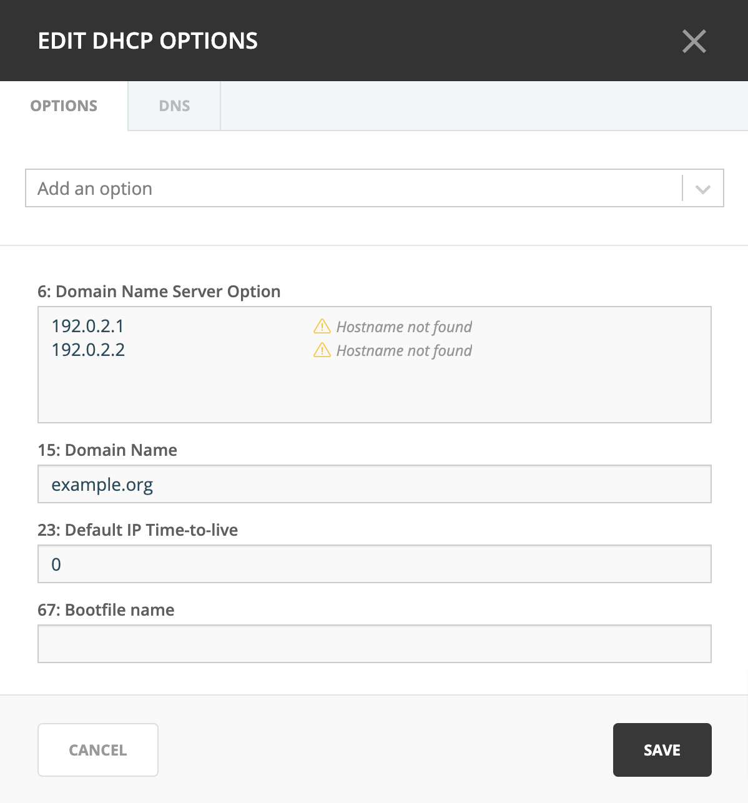

.. meta::
   :description: Maintaining DHCP servers in the Micetro by Men&Mice Management Console
   :keywords: DHCP servers, DHCP management console, DHCP Kea

.. _dhcp-servers:

DHCP servers
============

.. toctree::
  :maxdepth: 1

  dhcp_windows
  dhcp_kea
  dhcp_isc
  dhcp_cisco

Overview
--------

This section shows you how to perform specific actions in the Men&Mice Management Console associated with maintaining your DHCP servers, such as adding and deleting servers and setting DHCP server options. In order to use the DHCP functionality of Micetro you need to have a valid DHCP license key.

.. note::
  The functions for this menu option are listed alphabetically after the New DHCP Server section.

This page describes the process for adding new DHCP servers, and generic DHCP management information. For detailed information about the different DHCP platforms, refer to:

* :ref:`dhcp-windows`

* :ref:`dhcp-kea`

* :ref:`dhcp-isc`

* :ref:`dhcp-cisco`

New DHCP Server
---------------

.. note::
  When adding a DHCP server, the system automatically changes existing IP Address ranges to scopes if it finds IP Address ranges that contain the same start and end address as a scope on the DHCP server being added.

You must be logged in as a user with privileges to administer DHCP in order to add a DHCP server.

.. note::
  For information on adding a DHCP server on a Men&Mice Appliance, refer to :ref:`appliance-management`.

1. Navigate to :menuselection:`Admin --> Server Management` and select :guilabel:`Add DHCP server`. The *Add DHCP Server* dialog box is shown.

.. image:: ../../images/add-dhcp-server.png
  :width: 50%
  :align: center

Server Name
  Type either the (fully qualified) DNS name or the IP Address of the DHCP server.

Server address (optional)
  If desired, type the IPv4 or IPv6 address for the server. This is not required, but doing so allows the Management Console to connect to the server by IP Address instead of by name.

Server Type
  Click the drop-down list, and select the desired server type.

    Microsoft
      connects to a Microsoft DHCP server. If you want to gather the lease history from the DHCP server, you must install a DHCP Server Controller on the server. See :ref:`dhcp-windows`.

    ISC
      connects to an ISC DHCP server. See :ref:`dhcp-isc`.

    Cisco
      connects to a Cisco Router that is running DHCP server software. For more information, see :ref:`dhcp-cisco`.

    Kea
      connect to a ISC Kea DHCP server. See :ref:`dhcp-kea`.

Agent-free (Microsoft and ISC Kea only)
  When using the agent-free connection method for Windows DHCP, it is not possible to gather the lease history from the DHCP server. For further information regarding this connection method, refer to :ref:`dhcp-remote-access` and :ref:`dhcp-windows`.

Proxy
  If you are adding a Cisco DHCP or agent-free Microsoft or Kea server, you can specify the location of the DHCP Server Controller by entering the (fully qualified) DNS name or IP Address of the machine running the DHCP Server Controller. This option allows the system to connect to DHCP servers in different forests where a cross-forest trust does not exist. It also allows a non-Windows version of Men&Mice Central to manage Microsoft DHCP servers.

2. Click :guilabel:`Confirm`. Once connected, the name of the newly added server displays in the grid of the *Server Management* context.

.. note::
  To add a DHCP server in the Management Console, see :ref:`console-new-dhcp-server`.

.. _dhcp-remote-access:

Server Access on Remote Computers
^^^^^^^^^^^^^^^^^^^^^^^^^^^^^^^^^

To manage DHCP servers you must have the DHCP Server Controller installed.

* For the ISC DHCP server, a DHCP Server Controller must be installed on each DHCP server you want to manage.

* For Microsoft DHCP servers, install the DHCP Server Controller on a Windows machine that is a member of the same domain or workgroup as the DHCP servers. You may install multiple copies of the DHCP Server Controller, for example if you want to manage Microsoft DHCP Servers that reside in different forests. A single DHCP Server Controller for Microsoft DHCP Servers can manage multiple DHCP servers. The DHCP Server Controller must adhere to whatever restrictions and security standards are set forth in Microsoft Windows. See :ref:`dhcp-windows-remote-access`.

* For Kea DHCP servers, only one DHCP Server Controller needs to be installed, either on the same machine as the Kea service or on a machine that can access the :ref:`kea-control-agent` on the network.

.. _dhcp-windows-remote-access:

Server Access on Remote Computers (Microsoft DHCP)
^^^^^^^^^^^^^^^^^^^^^^^^^^^^^^^^^^^^^^^^^^^^^^^^^^

To configure the DHCP Server Controller to access DHCP servers on remote computers, do the following:

1. Before you can administer DHCP servers, verify that the DHCP Controller is running as a Windows User and has the necessary privileges.

2. To enable DHCP Management in Micetro, start the Windows Services program and open the properties dialog box for Men&Mice DHCP Server Controller.

3. Click the :guilabel:`Log On` tab. The :guilabel:`Local System account` radio button is most likely selected.

4. Click the :guilabel:`This account` radio button and enter the name and password of a Windows User that is a member of either the Administrators role or the DHCP Administrators role.

5. Close the dialog box and restart the Men&Mice DHCP Server Controller service.

.. warning::
  Lease history gathering is not possible if you are managing MS DHCP servers on remote computers using the DHCP Server Controller. To gather lease history for a MS DHCP server, you must install the DHCP Server Controller on the server and use the *Microsoft with Agent Installed* connection method when connecting to the server.

Edit DHCP Server Name
---------------------

This feature allows you to change the name or IP Address used to connect to a DHCP server. This is useful if you need to refer to the server by another name or if you are connecting to the server by an IP Address and the IP Address has changed. You can also use this feature to change the connection method for MS DHCP servers.

To access this feature, do the following:

1. Locate the DHCP server.

2. From the ellipsis menu select :guilabel:`Edit DHCP server` or use :menuselection:`Actions --> Edit DHCP server`. The *Edit DHCP server* dialog box displays.

3. Change the **Server name**, **Server address** (optional), and **Server Type**. If applicable, you can edit the **Proxy** server's information.

4. Click :guilabel:`Confirm`.

.. note::
  To edit a DHCP server's name in the Management Console, see :ref:`console-edit-dhcp-server`.

Inherited Access (Management Console)
-------------------------------------

You can manage access to scopes just as you can for other object types in Micetro, but there is one important distinction: you can set *Inherited Access* for scopes. When you open the *Access* dialog box for a scope, the dialog box has an extra section for inherited access.

Checking the :guilabel:`Inherit Access` checkbox will have the selected scope inherit all access bits from its parent range. This means that whenever the access privileges for the parent range are changed, they will be applied to the scope as well.

Clicking the :guilabel:`Apply access inheritance in child ranges` button will enable access inheritance for all descendants of the scope. This means that whenever the access privileges in the scope are changed, the changes will be applied of all descendants of the scope.

Regarding other access settings, refer to :ref:`access-control`.

Remove
------

.. note::
  For information on removing a DHCP server on a Men&Mice Appliance, refer to :ref:`appliance-management`.

To remove a DHCP server, do the following:

1. In :menuselection:`Admin --> Server Management` locate the DHCP server.

2. From the ellipsis menu select :guilabel:`Remove DHCP server`.

4. In the confirmation dialog box, click :guilabel:`Yes`.

.. note::
  To remove a DHCP server in the Management Console, see :ref:`console-delete-dhcp-server`.

.. _dhcp-server-options:

Options
-------

The ISC DHCP, Kea DHCP, Cisco, and MS DHCP servers offer different types of options.

  DHCP server options depend on the server type and previously configured options.

You can set options for multiple servers by selecting all of the servers for which you want to set options.

.. note::
  When setting options for multiple servers all of the servers must be of the same type.

1. In :menuselection:`Admin --> Server management` select the applicable DHCP server(s) and use :menuselection:`Actions --> Edit DHCP options`. (Or :guilabel:`Edit DHCP options` from the ellipsis menu.) The *DHCP Server Options* window displays.

2. Click the drop-down list to select which options you want to add. Upon selection, the setting is added to the dialog box for editing.

6. When all selections/entries are made, click :guilabel:`Save` to save your changes.

.. note::
  To manage DHCP server option in the Management Console, see :ref:`console-dhcp-options`.

Properties (Management Console)
-------------------------------

1. From the Object list, expand the DHCP Servers list.

2. Right-click on the server for which you want to manage properties and, from the shortcut menu, select :guilabel:`Properties`. The *Properties* dialog box for the selected server displays. Refer to the applicable section based upon the server type: :ref:`console-ms-dhcp-properties`, :ref:`console-isc-dhcp-properties`, :ref:`console-kea-dhcp-poperties` or :ref:`console-cisco-dhcp-properties`.

.. _dhcp-advanced-options:

Advanced ISC Kea Server Properties
----------------------------------

DHCP Administrators can access the ISC Kea DHCP server configuration files directly to edit properties that are not available in the user interface.

To access the advanced options, do the following:

1. Log in to Micetro as the DHCP administrator.

2. Select a Kea DHCP server, select :guilabel:`Edit configuration` from the ellipsis menu or use :menuselection:`Actions --> Edit configuration`.

3. When the *Edit configuration* box displays, you can edit the configuration file for the server.

.. image:: ../../images/edit-kea-config-Micetro.png
  :width: 80%
  :align: center

5. Click :guilabel:`Save`. The contents of the files are verified for correctness. If an error is found during verification, an error message displays and the changes are not saved.

.. note::
  To edit advanced DHCP configuration in the Management Console, see :ref:`console-dhcp-advanced-options`.

Reload Scope List (Management Console)
--------------------------------------

Reloads the list of scopes to view additions and/or deletions made by another user.
