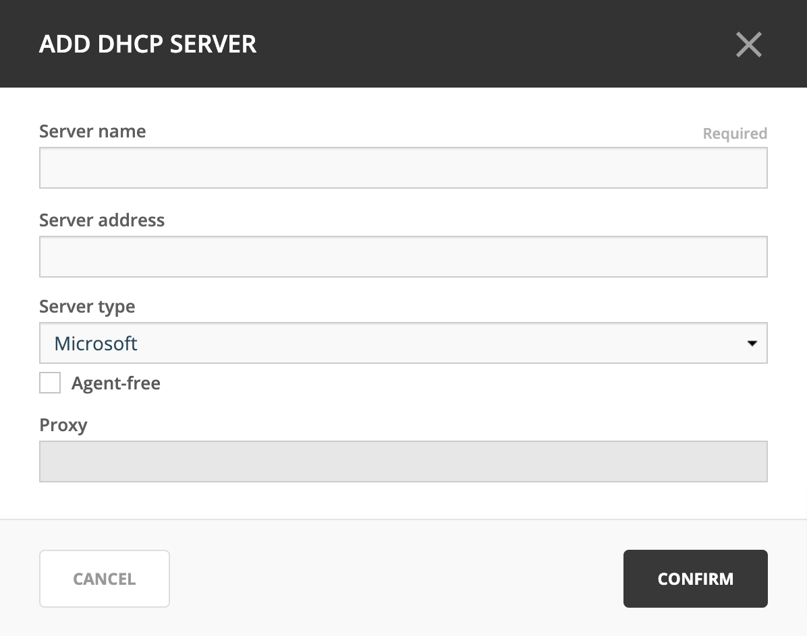

.. _dhcp-servers:

DHCP servers
============

.. toctree::
  :maxdepth: 1
  :hidden:

  dhcp_windows
  dhcp_kea
  dhcp_isc
  dhcp_cisco

Overview
--------

This section shows you how to perform specific actions in the Men&Mice Management Console associated with maintaining your DHCP servers, such as adding and deleting servers and setting DHCP server options. In order to use the DHCP functionality of Micetro you need to have a valid DHCP license key.

.. note::
  The functions for this menu option are listed alphabetically after the New DHCP Server section.

This page describes the process for adding new DHCP servers, and generic DHCP management information. For detailed information about the different DHCP platforms, refer to:

* :ref:`dhcp-windows`

* :ref:`dhcp-kea`

* :ref:`dhcp-isc`

* :ref:`dhcp-cisco`

New DHCP Server
---------------

.. note::
  When adding a DHCP server, the system automatically changes existing IP Address ranges to scopes if it finds IP Address ranges that contain the same start and end address as a scope on the DHCP server being added.

You must be logged in as a user with privileges to administer DHCP in order to add a DHCP server.

.. note::
  For information on adding a DHCP server on a Men&Mice Appliance, refer to :ref:`appliance-management`.

1. From the menu bar, select :guilabel:`File --> New --> DHCP Server`. The *Add DHCP Server* dialog box is shown.

Server Name
  Type either the DNS name or the IP Address of the DHCP server.

Server address (optional)
  If desired, type the IPv4 or IPv6 address for the server. This is not required, but doing so allows the Management Console to connect to the server by IP Address instead of by name.

Server Type
  Click the drop-down list, and select the desired server type.

    Microsoft
      connects to a Microsoft DHCP server. If you want to gather the lease history from the DHCP server, you must install a DHCP Server Controller on the server. See :ref:`dhcp-windows`.

    ISC
      connects to an ISC DHCP server. See :ref:`dhcp-isc`.

    Cisco
      connects to a Cisco Router that is running DHCP server software. For more information, see :ref:`dhcp-cisco`.

    Kea
      connect to a ISC Kea DHCP server. See :ref:`dhcp-kea`.

Agent-free (Microsoft and ISC Kea only)
  When using the agent-free connection method, it is not possible to gather the lease history from the DHCP server. For further information regarding this connection method, refer to :ref:`dhcp-remote-access`. See :ref:`dhcp-windows`.

Proxy
  If you are adding a Microsoft or a Cisco DHCP server you can specify the location of the DHCP Server Controller by entering the DNS name or IP Address of the machine running the DHCP Server Controller. This option allows the system to connect to DHCP servers in different forests where a cross-forest trust does not exist. It also allows a non-Windows version of Men&Mice Central to manage Microsoft DHCP servers.

2. Click :guilabel:`Confirm`. You are connected to the server. Once connected, the name of the newly added server displays in the grid of the *Server Management* context.

.. note::
  To add a DHCP server in the Management Console, see :ref:`console-new-dhcp-server`.

.. _dhcp-remote-access:

Server Access on Remote Computers
^^^^^^^^^^^^^^^^^^^^^^^^^^^^^^^^^

To manage DHCP servers you must have the DHCP Server Controller installed.

* For the ISC DHCP server, a DHCP Server Controller must be installed on each DHCP server you want to manage.

* For Microsoft DHCP servers, install the DHCP Server Controller on a Windows machine that is a member of the same domain or workgroup as the DHCP servers. You may install multiple copies of the DHCP Server Controller, for example if you want to manage Microsoft DHCP Servers that reside in different forests. A single DHCP Server Controller for Microsoft DHCP Servers can manage multiple DHCP servers. The DHCP Server Controller must adhere to whatever restrictions and security standards are set forth in Microsoft Windows. See :ref:`dhcp-windows-remote-access`.

* For Kea DHCP servers, only one DHCP Server Controller needs to be installed, either on the same machine as the Kea service or on a machine that can access the :ref:`kea-control-agent` on the network.

Edit DHCP Server Name
---------------------

This feature allows you to change the name or IP Address used to connect to a DHCP server. This is useful if you need to refer to the server by another name or if you are connecting to the server by an IP Address and the IP Address has changed. You can also use this feature to change the connection method for MS DHCP servers.

To access this feature, do the following:

1. Locate the DHCP server.

2. From the ellipsis menu select :guilabel:`Edit DHCP server` or use ::menuselection:`Actions --> Edit DHCP server`. The *Edit DHCP server* dialog box displays.

3. Change the **Server name**, **Server address** (optional), and **Server Type**. If applicable, you can edit the **Proxy** server's information.

4. Click :guilabel:`Confirm`.

.. note::
  To edit a DHCP server's name in the Management Console, see :ref:`console-edit-dhcp-server`.

Inherited Access (Management Console)
-------------------------------------

You can manage access to scopes just as you can for other object types in Micetro, but there is one important distinction: you can set *Inherited Access* for scopes. When you open the Access dialog box for a scope, the dialog box has an extra section for inherited access.

Checking the :guilabel:`Inherit Access` checkbox will have the selected scope inherit all access bits from its parent range. This means that whenever the access privileges for the parent range are changed, they will be applied to the scope as well.

Clicking the :guilabel:`Apply access inheritance in child ranges` button will enable access inheritance for all descendants of the scope. This means that whenever the access privileges in the scope are changed, the changes will be applied of all descendants of the scope.

Regarding other access settings, refer to :ref:`global-access`.

Remove
------

.. note::
  For information on removing a DHCP server on a Men&Mice Appliance, refer to :ref:`appliance-management`.

To remove a DHCP server, do the following:

1. In ::menuselection:`Admin --> Server Management` locate the DHCP server.

2. From the ellipsis menu select :guilabel:`Remove DHCP server`.

4. In the confirmation dialog box, click :guilabel:`Yes`.

.. note::
  To remove a DHCP server in the Management Console, see :ref:`console-delete-dhcp-server`.

.. _dhcp-options:

Options
-------

The ISC DHCP, Kea DHCP, Cisco and MS DHCP servers offer different types of options: the MS DHCP server allows the user to choose between different option types (Standard, Microsoft Options and Microsoft Windows 2000 options). This drop-down list is only displayed if there are non-standard options defined on the ISC DHCP server.

.. image:: ../../images/console-dhcp-server-options.png
  :width: 40%
  :align: center

You can set options for multiple servers by selecting all of the servers for which you want to set options. When setting options for multiple servers all of the servers must be of the same type.

1. In the *Object List*, right-click on the applicable DHCP Server and, from the shortcut menu, select :guilabel:`Options`. The *DHCP Server Options* window displays.

2. In the selection field in the upper left corner, click the drop-down list to select which options you want to display. Based upon your selection, the dialog box changes.

3. To :guilabel:`Show only options with non-default values`, click this checkbox. The Quick Filter field supports the following keywords: name, value, and option. For example, if you want to quickly find option 51, you could enter the following: option51.

4. To add a value to an option, locate the option item, and click the plus sign at the end of the field. A blank field displays into which you can enter the applicable information. If you enter multiple fields for an option, they are numbered consecutively (e.g., Time Server as two fields.)

5. If applicable, use the scroll bar along the right-hand side of the page to move up/down the option list.

6. When all selections/entries are made, click :guilabel:`OK` to save your changes.

Defining DHCP Server Options
----------------------------

You can define your own options on :ref:`dhcp-isc` and :ref:`dhcp-windows` servers.

Properties
----------

1. From the Object list, expand the DHCP Servers list.

2. Right-click on the server for which you want to manage properties and, from the shortcut menu, select :guilabel:`Properties`. The *Properties* dialog box for the selected server displays. Refer to the applicable section based upon the server type: :ref:`ms-dhcp-properties`, :ref:`isc-dhcp-properties`, :ref:`kea-dhcp-properties` or :ref:`cisco-dhcp-properties`.

.. _dhcp-advanced-options:

Advanced ISC DHCP and ISC Kea Server Properties
-----------------------------------------------

DHCP Administrators can access the ISC DHCP and ISC Kea DHCP server configuration files directly to edit DHCP server properties that are not available in the GUI.

To access the advanced options, do the following:

1. Log in to Men&Mice as the DHCP administrator.

2. Select an ISC DHCP or Kea DHCP server, right-click and select :guilabel:`Properties` from the shortcut menu.

3. When the *Properties* dialog displays, click the :guilabel:`Advanced` button.

4. When the *Advanced Options* dialog box displays, you can edit the properties for the server in a text document. If the DHCP server contains multiple configuration files, each file displays in a separate tab.

.. image:: ../../images/console-dhcp-isc-advanced-options.png
  :width: 70%
  :align: center

5. Click :guilabel:`OK`. The contents of the files are verified for correctness. If an error is found during verification, an error message displays and the changes are not saved.

Reload Scope List
-----------------

Reloads the list of scopes to view additions and/or deletions made by another user.
