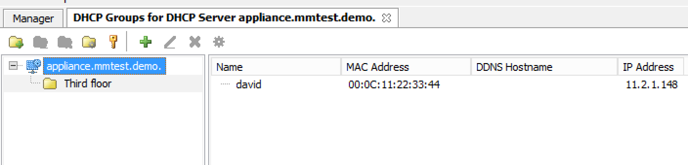
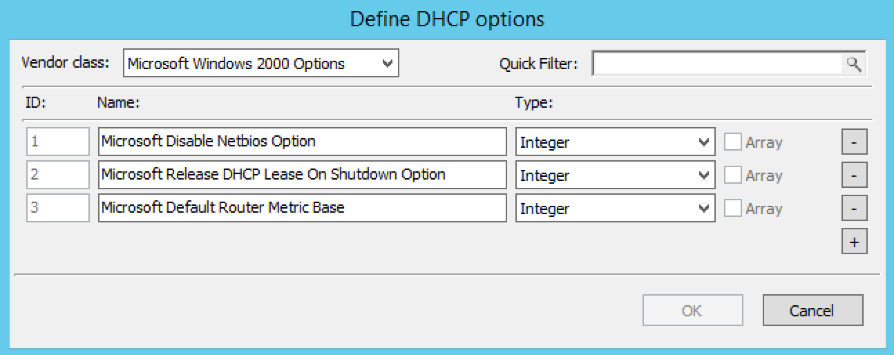

.. _dhcp-servers:

.. |delete-dhcp| image:: ../../images/console-dhcp-delete-icon.png

.. |access-dhcp| image:: ../../images/console-dhcp-access-icon.png

.. |edit-reservation-dhcp| image:: ../../images/console-dhcp-edit-reservation-icon.png

DHCP servers
============

Overview
--------

This section shows you how to perform specific actions in the Men&Mice Management Console associated with maintaining your DHCP servers, such as adding and deleting servers and setting DHCP server options. In order to use the DHCP functionality of the Men&Mice Suite you need to have a valid DHCP license key.

.. note::
  The functions for this menu option are listed alphabetically after the New DHCP Server section.

New DHCP Server
---------------

When adding a DHCP server, the system automatically changes existing IP Address ranges to scopes if it finds IP Address ranges that contain the same start and end address as a scope on the DHCP server being added.

You must be logged in as a user with privileges to administer DHCP in order to add a DHCP server.

.. note::
  For information on adding a DHCP server on a Men&Mice Appliance, refer to Appliance Management.

1. From the menu bar, select :guilabel:`File --> New --> DHCP Server`. The *Add DHCP Server* dialog box is shown.

..

Server Name
  Type either the DNS name or the IP Address of the DHCP server.

Server address (optional)
  If desired, type the IPv4 or IPv6 address for the server. This is not required, but doing so allows the Management Console to connect to the server by IP Address instead of by name.

Server Type
  Click the drop-down list, and select the desired server type.

    Microsoft with Agent Installed
      connects to a Microsoft DHCP server that has a DHCP Server Controller installed. If you want to gather the lease history from the DHCP server, you must use this connection method.

    Microsoft Agent-Free
      connects to a Microsoft DHCP server that does not have a DHCP Server Controller installed. When using this connection method, it is not possible to gather the lease history from the DHCP server. For further information regarding this connection method, refer to DHCP Servers--Server Access on Remote Computers.

    ISC
      connects to an ISC DHCP server.

    Cisco
      connects to a Cisco Router that is running DHCP server software. For more information, see Adding a Cisco DHCP server.

    Kea
      connect to a ISC Kea DHCP server.

Use proxy server
  If you are adding a Microsoft or a Cisco DHCP server you can specify the location of the DHCP Server Controller by clicking the Use proxy server checkbox and entering the DNS name or IP Address of the machine running the DHCP Server controller. This option allows the system to connect to DHCP servers in different forests where a cross-forest trust does not exist. It also allows a non-Windows version of Men&Mice Central to manage Microsoft DHCP servers.

2. Click :guilabel:`OK`. You are connected to the server. Once connected, the name of the newly added server displays under DHCP Servers in the Object Section. (You may need to click the :guilabel:`+` sign next to DHCP Servers to see it.)

Server Access on Remote Computers
^^^^^^^^^^^^^^^^^^^^^^^^^^^^^^^^^

To manage DHCP servers you must have the DHCP Server Controller installed. For the ISC DHCP server and the Kea DHCP server, a DHCP Server Controller must be installed on each DHCP server you want to manage.

If you plan to use Men&Mice Suite to manage any Microsoft DHCP servers, install the DHCP Server Controller on a Windows machine that is a member of the same domain or workgroup as the DHCP servers. You may install multiple copies of the DHCP Server Controller, for example if you want to manage Microsoft DHCP Servers that reside in different forests. A single DHCP Server Controller for Microsoft DHCP Servers can manage multiple DHCP servers. The DHCP Server Controller must adhere to whatever restrictions and security standards are set forth in Microsoft Windows.

To configure the DHCP Server Controller to access DHCP servers on remote computers, do the following:

1. Before you can administer DHCP servers, verify that the DHCP Controller is running as a Windows User and has the necessary privileges.

2. To enable DHCP Management in the Men&Mice Suite, start the Windows Services program and open the properties dialog box for Men&Mice DHCP Server Controller.

3. Click the :guilabel:`Log On` tab. The :guilabel:`Local System account` radio button is most likely selected.

4. Click the :guilabel:`This account` radio button and enter the name and password of a Windows User that is a member of either the Administrators role or the DHCP Administrators role.

5. Close the dialog box and restart the Men&Mice DHCP Server Controller service.

.. warning::
  Lease history gathering is not possible if you are managing MS DHCP servers on remote computers using the DHCP Server Controller. To gather lease history for a MS DHCP server, you must install the DHCP Server Controller on the server and use the Microsoft with Agent Installed connection method when connecting to the server.

Edit DHCP Server Name
---------------------

This feature allows you to change the name or IP Address used to connect to a DHCP server. This is useful if you need to refer to the server by another name or if you are connecting to the server by an IP Address and the IP Address has changed. You can also use this feature to change the connection method for MS DHCP servers.

To access this feature, do the following:

1. Locate the applicable server.

2. Right-click and, from the shortcut menu, select :guilabel:`Edit Server Name`. The *Edit Server* name dialog box displays.

..

3. Change the **Server name**, **Server address** (optional), and **Server Type**. If applicable, you can select :guilabel:`Use proxy server` and enter the relevant information.

4. Click :guilabel:`OK`.

Inherited Access
----------------

You can manage access to scopes just as you can for other object types in the Men&Mice Suite, but there is one important distinction: you can set Inherited Access for scopes. When you open the Access dialog box for a scope, the dialog box has an extra section for inherited access.

Checking the :guilabel:`Inherit Access` checkbox will have the selected scope inherit all access bits from its parent range. This means that whenever the access privileges for the parent range are changed, they will be applied to the scope as well.

Clicking the :guilabel:`Apply access inheritance in child ranges` button will enable access inheritance for all descendants of the scope. This means that whenever the access privileges in the scope are changed, the changes will be applied of all descendants of the scope.

Regarding other access settings, refer to :ref:`global-access`.

Delete
------

.. note::
  For information on removing a DHCP server on a Men&Mice Appliance, refer to :ref:`appliance-management`.

To remove a DHCP server, do the following:

1. In the *Object Section* of the Management Console, click on :guilabel:`DHCP Servers`.

2. In the Object List, right-click on the DHCP Server you want to remove.

3. From the shortcut menu, select :guilabel:`Delete`.

4. In the confirmation dialog box, click :guilabel:`Yes`.

Managing Groups/Hosts
---------------------

.. note::
  Applies to ISC DHCP Servers only.

Allows you to manage groups and hosts within groups on an ISC DHCP server. You can also manage host entries that are defined in the global scope.

To manage groups and hosts, do the following:

1. Select the ISC DHCP server for which you want to manage groups and/or hosts.

2. Right-click on the server and, from the shortcut menu, select :guilabel:`Manage Groups and Hosts`. A new menu displays in the menu bar and the *DHCP Groups* dialog box displays.

Groups/Hosts Toolbar
^^^^^^^^^^^^^^^^^^^^

The toolbar that displays in the Groups for DHCP Server contains the following:

.. csv-table::
  :header: "Button", "Operation", "Function"
  :widths: 5, 15, 80

  |add-dhcp|, "Add", "Displays the Add Group dialog box. Enter the name for the new group, and click Add."
  |rename-dhcp| , "Rename", "Displays the Edit Group dialog box. Make the desired changes to the name for the selected group, and click Save."
  |delete-dhcp| , "Delete", "When selected, displays a confirmation message asking if you want to delete the selected group."
  |options-dhcp| , "Options", "When selected, displays the DHCP Group Options dialog box. Refer to :ref:`dhcp-options` for details on this dialog box."
  |access-dhcp| , "Access", "When selected, displays the Access Control dialog box. Refer to :ref:`global-access` for details on this dialog box."
  |add-reservation-dhcp| , "Add reservation", "Displays the Add Reservation dialog box. Enter the applicable information, and click OK."
  |edit-reservation-dhcp| , "Edit reservation", "Displays the Edit Reservation dialog box. Make the desired and click OK."
  |delete-reservation-dhcp| , "Delete reservation", "When selected, displays a confirmation message asking if you want to delete the selected reservation."
  |reservation-options-dhcp| , "Reservation options", "When selected, displays the Reservation Options dialog. Refer to :ref:`dhcp-options` for details on this dialog box."

Groups/Hosts Shortcut Menu
^^^^^^^^^^^^^^^^^^^^^^^^^^

Edit
  Displays the Edit Host dialog box. Make the desired changes to the name for the selected group, and click :guilabel:`Save`.

Add
  Displays the Add Host dialog box. Enter the applicable information, and click :guilabel:`Add`.

Delete
  When selected, displays a confirmation message asking if you want to delete the selected host.

Options
  When selected, displays the Host Options dialog. Refer to :ref:`dhcp-options` for details on this dialog box.

Copy
  Copies information about the selected host into the clipboard.

Select All
  Selects all groups/hosts. You can then right-click and use the shortcut menu options to manage all the selected items.

Editing Subclasses
------------------

.. note::
  Applies to ISC DHCP Servers only.

Allows you to edit subclasses on an ISC DHCP server.

.. note::
  You cannot manage DHCP classes – only subclasses of existing DHCP classes.

To edit subclasses, do the following:

1. Select the ISC DHCP server for which you want to edit subclasses.

2. Right-click on the server and, from the shortcut menu, select :guilabel:`Edit Subclasses`. The *DHCP class* dialog box displays.

3. Choose a class to edit and click the :guilabel:`Select` button. A new dialog box displays where you can enter the client identifiers or MAC addresses of the hosts that should belong to the selected class.

4. The dialog box contains a multi-line edit field where you can quickly add multiple entries. NOTE: When entering MAC addresses you **must** use a *colon* (,) as a separator. Each line in the dialog box should contain one entry. To delete an entry, simply remove the corresponding line in the dialog box.

5. Click :guilabel:`OK` to confirm your changes and close the dialog box.

.. _dhcp-options:

Options
-------

The ISC DHCP, Kea DHCP, Cisco and MS DHCP servers offer different types of options: the MS DHCP server allows the user to choose between different option types (Standard, Microsoft Options and Microsoft Windows 2000 options). This drop-down list is only displayed if there are non-standard options defined on the ISC DHCP server.

.. image:: ../../images/console-dhcp-server-options.png
  :width: 40%
  :align: center

You can set options for multiple servers by selecting all of the servers for which you want to set options. When setting options for multiple servers all of the servers must be of the same type.

1. In the *Object List*, right-click on the applicable DHCP Server and, from the shortcut menu, select :guilabel:`Options`. The *DHCP Server Options* window displays.

2. In the selection field in the upper left corner, click the drop-down list to select which options you want to display. Based upon your selection, the dialog box changes.

3. To :guilabel:`Show only options with non-default values`, click this checkbox. The Quick Filter field supports the following keywords: name, value, and option. For example, if you want to quickly find option 51, you could enter the following: option51.

4. To add a value to an option, locate the option item, and click the plus sign at the end of the field. A blank field displays into which you can enter the applicable information. If you enter multiple fields for an option, they are numbered consecutively (e.g., Time Server as two fields.)

5. If applicable, use the scroll bar along the right-hand side of the page to move up/down the option list.

6. When all selections/entries are made, click :guilabel:`OK` to save your changes.

Defining DHCP Server Options
----------------------------

You can define your own options on ISC and MS DHCP servers.

Defining Options on MS DHCP Servers
^^^^^^^^^^^^^^^^^^^^^^^^^^^^^^^^^^^

1. In the *Object List*, right-click on the applicable DHCP Server and, from the shortcut menu, select :guilabel:`Define Options`. The *DHCP Server Option definition* dialog box displays. The dialog box shows all options defined on the DHCP server.

2. Use the **Vendor class** drop-down list to select the vendor class for which you want to define options.

3. To add an option, click the :guilabel:`+` button at the end of the option list. Enter the ID, name and type of data to use for the option. The IP Address and Integer data types can be specified as arrays. To specify an array, click the :guilabel:`Array` checkbox.

4. To delete an option, click the :guilabel:`-` button next to the option you want to delete.

5. Click :guilabel:`OK` to save the option definition.

.. note::
  You can only add or delete option definitions. You cannot change the properties of an existing option definition.

Defining Options on ISC DHCP Servers
^^^^^^^^^^^^^^^^^^^^^^^^^^^^^^^^^^^^

1. In the Object List, right-click on the applicable DHCP Server and, from the shortcut menu, select :guilabel:`Define Options`. The *DHCP Server Option* definition dialog box displays. The dialog box shows all custom options defined on the DHCP server. The standard ISC DHCP options will reside in the Standard Vendor class. Other custom class that have been added will be available in the Vendor class drop down field.

..

2. To Add an option, click the :guilabel:`+` button at the end of the option list. Enter the ID, name and type of data to use for the option. The several data types can be specified as arrays and the Array checkbox is enabled when a supported data type is selected. To specify an array, click the Array checkbox.

3. To Delete an option, click the :guilabel:`-` button next to the option you want to delete.

4. To change the ID for an option, enter the new ID in the **ID** field.

.. note::
  You can only edit the ID property for existing options.

5. Click :guilabel:`OK` to save the option definition.

Properties
----------

1. From the Object list, expand the DHCP Servers list.

2. Right-click on the server for which you want to manage properties and, from the shortcut menu, select :guilabel:`Properties`. The *Properties* dialog box for the selected server displays. Refer to the applicable section based upon the server type: :ref:`ms-dhcp-properties`, :ref:`isc-dhcp-properties`, :ref:`kea-dhcp-properties` or :ref:`cisco-dhcp-properties`.

.. _ms-dhcp-properties:

MS Server Properties
^^^^^^^^^^^^^^^^^^^^

1. Complete the :guilabel:`General` tab using the guidelines below.

Conflict detection attempts
  Specifies the number of conflict detection attempts you want the DHCP server to make before it leases an address to a client.

Audit log file path
  Specifies the location of the DHCP server audit log files.

Database path
  Specifies the location of the DHCP server database.

Backup path
  Specifies the location for the database backup.

2. Click the :guilabel:`DNS` tab, and complete the fields according to the guidelines below:

Enable DNS dynamic updates according to the settings below.
  Specifies whether the DHCP server sends DNS dynamic record updates to the DNS server. Updates are sent to DNS servers configured in TCP/IP client properties for any active network connections at the DHCP server.

Dynamically update DNS A and PTR records.
  Specifies that the DHCP server update forward and reverse lookups are based on the type of request made by the client during the lease process.

Always dynamically update DNS A and PTR records.
  Specifies that the DHCP server update forward and reverse DNS lookups when a client acquires a lease, regardless of the type of request used to acquire it.

Discard A and PTR records when lease is deleted.
  Specifies whether the DHCP server discards forward DNS lookups for clients when a lease expires.

Dynamically update DNS A and PTR records for DHCP clients.
  Specifies whether the DHCP server sends dynamic updates to the DNS server for DHCP clients that do not support performing these updates. If selected, clients running earlier versions of Windows are updated by the DHCP server for both their host (A) and pointer (PTR) resource records.

3. When all selections/entries are made, click :guilabel:`OK`.

.. _isc-dhcp-properties:

ISC Server Properties
^^^^^^^^^^^^^^^^^^^^^

Authoritative
  Specifies whether the server is authoritative to determine if a DHCP request from a client is valid

DDNS Domain Name
  Specifies the DNS domain name to use to store the A record for a DHCP client.

DDNS Reverse Domain Name
  Specifies the DNS reverse domain name to use to store the PTR record for a DHCP client.

DDNS Update Style
  Specifies how the DHCP server does DNS updates. The available styles are:

  None
    Dynamic DNS updates are not performed

  Ad-hoc
    This update scheme is depreciated

  Interim
    This is the recommended scheme for dynamic DNS updates

DDNS Updates
  Specifies whether to perform DNS updates. This setting has no effect unless DNS updates are enabled globally with the DDNS Update Style setting.

DDNS TTL
  Specifies (in seconds) the TTL value to use when performing a DNS update.

Default Lease Time
  Specifies (in seconds) the default lease time to use for DHCP leases.

Log Facility
  Specifies which syslog facility to use when logging DHCP server messages. All possible facilities are listed; however, not all of these facilities are available on all system.

Max/Min Lease Time
  Specifies (in seconds) the maximum/minimum lease time to use for DHCP leases.

Get Lease Hostnames
  Specifies whether the DHCP server should perform a reverse DNS lookup for each address assigned to a client and send the result to the client in the hostname option.

One Lease per Client
  Specifies whether the DHCP server should free any existing leases held by a client when the client requests a new lease.

Ping Check
  Specifies whether the DHCP server should send an ICMP echo message to probe an IP Address before offering it to a DHCP client.

Ping Timeout
  Specifies for how many seconds the DHCP server should wait for an ICMP echo response when Ping Check is active.

Filename
  Specifies the name of the initial boot file to be used by a client.

Server Name
  Specifies the name of the server from which the client should load its boot file.

Next Server
  Specifies the host address of the server from which the initial boot file (that is specified by Filename) is to be loaded.

Advanced ISC DHCP Server Properties
"""""""""""""""""""""""""""""""""""

DHCP Administrators can access the ISC DHCP server configuration files directly to edit DHCP server properties that are not available in the GUI.

To access the advanced options, do the following:

1. Log in to Men&Mice as the DHCP administrator.

2. Select an ISC DHCP server, right-click and select :guilabel:`Properties` from the shortcut menu.

3. When the *Properties* dialog displays, click the :guilabel:`Advanced` button.

4. When the *Advanced Options* dialog box displays, you can edit the properties for the server in a text document. If the DHCP server contains multiple configuration files, each file displays in a separate tab.

.. image:: ../../images/console-dhcp-isc-advanced-options.png
  :width: 70%
  :align: center

5. Click :guilabel:`OK`. The contents of the files are verified for correctness. If an error is found during verification, an error message displays and the changes are not saved.

.. _kea-dhcp-poperties:

Kea DHCP Server Properties
^^^^^^^^^^^^^^^^^^^^^^^^^^

Interfaces
  Specifies the interfaces the server listens on. An asterix ``*`` specifies that the server should listen on all interfaces.

DHCP Socket Type
  Specifies the type of sockets used. Available options are raw and UDP.

Valid Lifetime
  Specifies the time after which a lease will expire if not renewed.

Renew Timer
  Specifies the time when a client will begin a renewal procedure.

Rebind Timer
  Specifies the time when a client will begin a rebind procedure.

Match Client ID
  Specifies if the server should ignore the client identifier during lease lookups and allocations for a particular subnet.

Echo Client ID
  Specifies if the server should send back client-id options when responding to clients.

LFC Interval
  Specifies the interval in seconds, at which the server  will perform a lease file cleanup (LFC)

Lease Database Type
  Specifies the lease database. Only the memfile option is supported.

Lease Database File
  A full path to the lease database file.

Persist Lease Database
  Specifies whether the new leases and updates to existing leases are written to the file.

Decline Probation Period
  Specifies a probation time that will be set on addresses that are in use by some unknown entity.

Next Server
  Specifies the server address to use when clients want to obtain configuration from a TFTP server.

Control Socket

  Control Socket Name.
    The path to the UNIX socket.

Loggers.
  Click :guilabel:`Add` to add a new logger.

.. _cisco-dhcp-properties:

Cisco Server Properties
^^^^^^^^^^^^^^^^^^^^^^^

Hostname
  Specifies the name of the Cisco router. Refer to Cisco IOS IP Addressing Command Reference document for more information.

Domain Name
  Specifies the default domain name that the Cisco IOS software uses to complete unqualified host names. Refer to *Cisco IOS IP Addressing Command Reference document* for more information.

Name Server
  Specifies the address of a name server to use for name and address resolution. Refer to *Cisco IOS IP Addressing Command Reference document* for more information.

Reconcile Scopes
----------------

.. note::
  Applies to MS DHCP Servers only.

Use this function to fix inconsistencies between information in the registry and the DHCP database.

1. In the Object List, select DHCP Servers and then select an MS DHCP server.

2. Right-click the server, and select :guilabel:`Reconcile Scopes`.

3. Choose the action to perform: **Verify** (only) or **Fix** (any inconsistencies).

4. Click :guilabel:`OK` to complete the action.

Reload Scope List
-----------------

Reloads the list of scopes to view additions and/or deletions made by another user.

Restart
-------

.. note::
  Applies to ISC DHCP and Kea DHCP Servers only.

This menu item is only displayed when a user with DHCP administration privileges is logged in. This command restarts the DHCP server.

Set User Name and Password
--------------------------

This menu item is only displayed when a user with DHCP administration privileges is logged in. This command updates the user name and password that should be used to access the Cisco DHCP server. Use this command if the user name or password on the Cisco DHCP server has changed.
