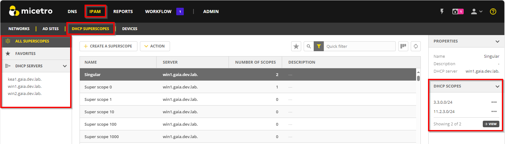
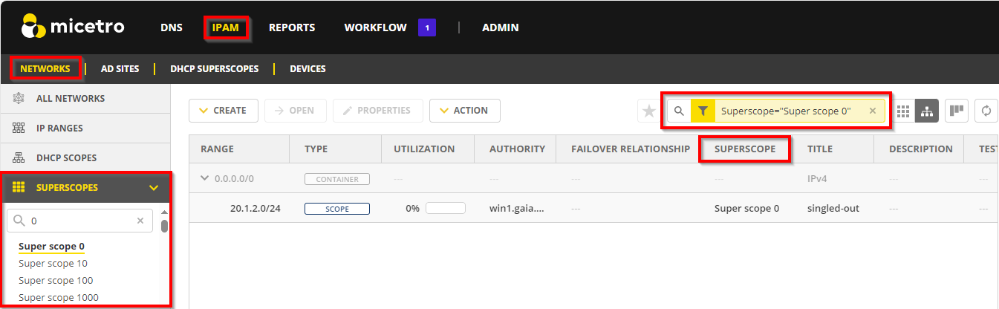
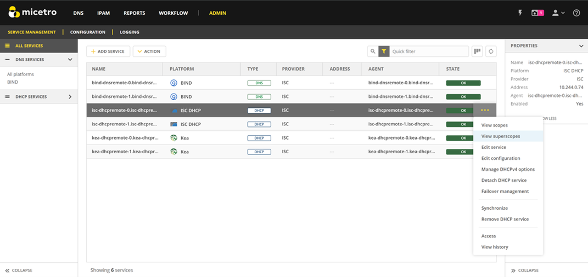

.. meta::
   :description: How to manage DHCP superscopes in Micetro
   :keywords: DHCP management, DHCP superscopes

.. _dhcp-superscopes:

DHCP Superscopes
================

**Permissions required**: 

* To create and manage superscopes, you need administrative privileges on the DHCP service (``DHCP Administrator``). Specifically, you should have permission (access) to ``Add a scope``.

.. note:: 
    
  * For DHCPv4, superscopes are supported by Microsoft DHCP (MS), Internet Systems Consortium DHCP (ISC), and Kea.
  * For DHCPv6, superscopes are only supported by the Kea service.

A superscope, known as a shared network for ISC and Kea, groups individual DHCP scopes to streamline network management, simplifying the handling of complex networks through logical organization.

Superscopes support network segmentation, assist with migration and transition processes, provide temporary IP address assignments, and enable redundancy and load balancing across DHCP servers. The use of superscopes results in more streamlined and proficient DHCP management.

Viewing Superscopes
-------------------
The **DHCP Superscopes** tab on the **IPAM** page provides an overview of all superscopes. It displays information about each superscope, including its associated DHCP server and the number of scopes it contains. The sidebar allows you to filter the view for **all superscopes**, **favorites**, or specific **DHCP servers**. Additionally, the quick filter search box helps you to quickly find a particular superscope.

* The inspector panel on the right-hand side displays the scopes assicuated with the selected superscope. To view the scopes, click :guilabel:`View` in the inspector or select :guilabel:`View scopes` on the :guilabel:`Action` or the row :guilabel:`...` menu. This will take you to the **Networks** tab, where the quick filter search box will is automatically populated with the selected superscope.

The **Networks** list includes a column that indicates whether a scope belongs to a superscope. The filtering sidebar provides an option to filter by a superscope. You can also use the quick filter search box to find a specific superscope.

* Superscopes that include scopes existing on multiple servers (split scopes) are indicated as <multiple values> if the superscope name is not the same on both servers. Although this configuration is valid, it is recommend to use the same superscope name across servers in a split scope setup.

If you have administrative privileges, you can view the defined superscopes on a DHCP server. Go to the **Admin** page and select the desired DHCP server. Then select :guilabel:`View superscopes` on the :guilabel:`Action` or the row :guilabel:`...` menu.

Creating Superscopes
--------------------

To simplify scope management, you can group related scopes together in a superscope based on criteria such as geographic location, department, or subnet range. Creating a superscope allows for the assignment of IP addresses from various scopes to clients on the same network.

Each superscope is linked to a designated DHCP server and applied per server. There can only be one unique superscope per network (IP range). 

**To create a superscope**:

1. On the **DHCP Superscopes** tab, click :guilabel:`Create superscope`.

2. Enter an identifying name for the superscope and select the DHCP server where it will be hosted. Optionally, add a description. 

3. Click :guilabel:`Next` to proceed.

4. From a list of server-defined scopes, select one or more to add to the superscope. If you want to add scopes later, click :guilabel:`Next`` without selecting anything.

  .. image:: ../../images/create-superscope.png
    :width: 70%

  * The list shows scopes that are not currently part of a superscope.
   
  * Use the quick filter search box to find and select the desired scopes.

5. In :guilabel:`Summary`, review the information you have enterd. Click :guilabel:`Add` go create the superscope.

.. note::
  If a superscope is created without any scopes assigned, it will not be activated on the server until at least one scope is added. Therefore, DHCP options cannot be configured for the superscope until it contains at least one scope.

Adding Scopes to a Superscopes
------------------------------
You can add scopes to a superscope when creating a new scope or editing an existing scope. You can also move scopes between superscopes.

Adding a Scope to a Superscope During Scope Creation
^^^^^^^^^^^^^^^^^^^^^^^^^^^^^^^^^^^^^^^^^^^^^^^^^^^^
If there is an existing superscope on the DHCP server, you can include the new scope within it during the creation process.

1.	On the **Networks** tab, click :menuselection:`Create --> DHCP Scope`. 
2. Specify a network address, server, and address pool. For more details about creating scopes, see :ref:`ipam-create-network`. 
3.	Select the superscope to which you want to add the new scope.

   .. image:: ../../images/create-dhcp-scope-superscope.png
      :width: 75%

3.	Complete filling in the information and click :guilabel:`Finish` to create the scope.

Adding an Existing Scope to a Superscope
^^^^^^^^^^^^^^^^^^^^^^^^^^^^^^^^^^^^^^^^
You can add scopes to existing superscopes, and it is also possible to transfer scopes to a different superscope on the DHCP server.   

1.	Go to the **Networks** tab and find the scope you want to add to the superscope.
2.	Click :guilabel:`Properties` on the top toolbar or select :guilabel:`Edit network properties` on the row :guilabel:`...` menu.
3.	Select the desired superscope.

    .. image:: ../../images/edit-scope-prop-superscope.png
      :width: 70%
 
    * The list shows the superscopes that are on the same server as the scope.
    *	To remove a scope from a superscope, clear the :guilabel:`Superscope` field.
    * When a split-scope range is selected, only superscopes present on both servers are displayed. Upon selection, both scopes are placed within their respective superscopes.

4.	Click :guilabel:`Save` when you're done.

Removing Scopes from Superscopes
^^^^^^^^^^^^^^^^^^^^^^^^^^^^^^^^
You can remove one or more scopes from a superscope to reorganize the scopes on the server. This action will not delete or deactivate the scope. You can add it to another superscope on the server if necessary.

**To remove a scope from a superscope, do one of the following**:

* On the **DHCP Superscopes** tab, select the superscope containing the scope you want to remove. In the inspector panel, find the relevant scope and select :guilabel:`Remove from superscope` on the scope's action :guilabel:`...` menu.

   .. image:: ../../images/remove-from-superscope-inspector.png
      :width: 35%

 -OR-

* On the **Networks** tab, locate the scope you want to remove. You can use the **Superscopes** filters in the filtering sidebar to help you find it. Click :guilabel:`Properties` on the top toolbar or select :guilabel:`Edit network properties` on the row :guilabel:`...` menu. Delete the scope from the **Superscope** field.

   .. image:: ../../images/edit-network-properties-superscope.png
      :width: 65%
      
      

Configuring DHCP Supersope Options
----------------------------------
You can configure DHCPv4 and DHCPv6 options for superscopes on Kea DHCP servers and DHCPv4 options on ISC DHCP servers. Scopes within a superscope inherit the options of the superscope, while the superscope inherits the options from the server.

When a superscope is created without a scope assigned, it will not be created on the server until a scope is added. Therefore, DHCP options cannot be configured until a scope has been added first.

For Kea, it is possible to remove scopes from the superscope and still add options via the API, because the superscope still exists in the Kea configuration if a scope was added to it first.

For more details on how to edit scope options, see :ref:`edit-dhcp-options`.

Editing Superscopes
-------------------
Superscope descriptions serve as a helpful tool for categorizing and easily locating scopes. You can edit this description.

**To edit a superscope**:

1.	On the **DHCP Superscopes** tab, locate the superscope  and double-click it, or select :guilabel:`Edit superscope` on either the :guilabel:`Action` or the row :guilabel:`...` menu.
2.	Make the desired changes to the description and click :guilabel:`Save`.

Deleting Superscopes
--------------------
When a superscope is deleted from Micetro, it will be removed from the database and the server. Individual scopes within the superscope are not deleted. If a Kea superscope is defined for both DHCPv4 and DHCPv6, deleting it will remove the superscope from both protocols.

**To delete a superscope**:

1.	On the **Superscopes** tab, select the superscope you want to delete.
2.	On either the :guilabel:`Action` or row :guilabel:`...` menu, select :guilabel:`Delete superscope`. This will delete the superscope and remove all associated scopes from it.
