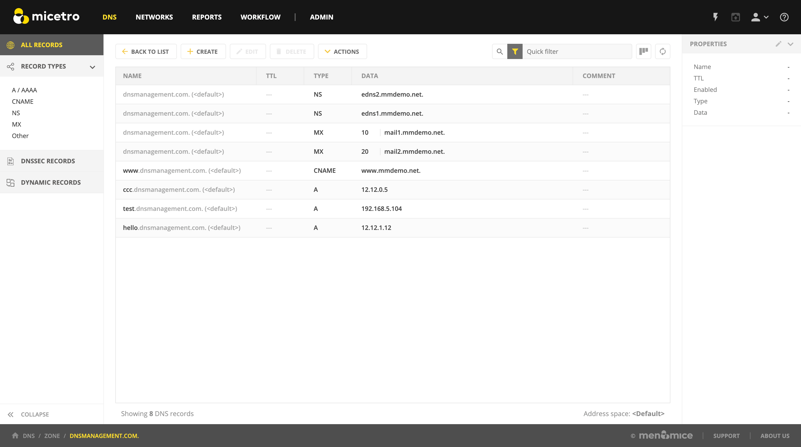
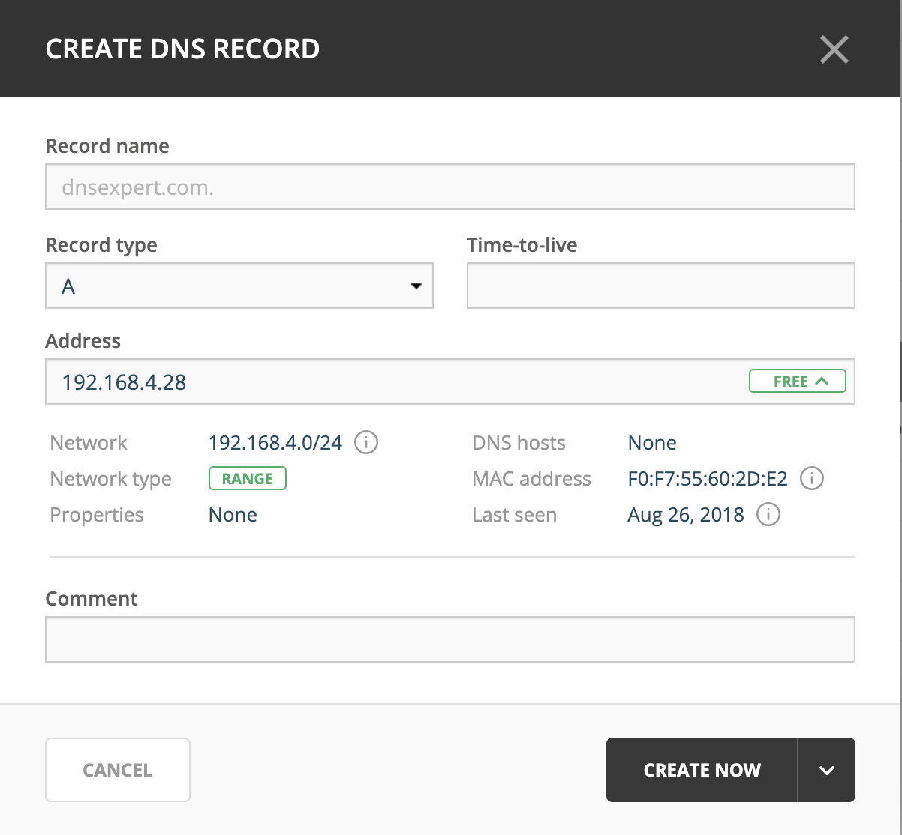

.. meta::
   :description: DNS resource records in the Micetro Web Application 
   :keywords: DNS records, DNS management, DNS

.. _dns-records:

DNS Resource Records
====================

Overview
--------

Each zone in the Domain Name System (DNS) contains a set of resource records that define how requests are processed or delegated within that zone. To view the resource records for a particular zone, you can double-click the zone, or select the zone and then click :guilabel:`Open` on the task bar at the top or on the row menu (...). Once you have opened the zone, you can view, edit, and manipulate the resource records.

|
Types of Resource Records
-------------------------

There are varieties of resource records that actively affect zones, as well as several informational records that can be used to provide supporting data about a zone. The primary record types are described below.

NS
  The Name Server record is used to list a name server for this zone. NS records state the domain name of the zone's name servers. The name of an NS record is the fully qualified domain name of a zone. Every zone must have at least one NS record with the same name as the zone itself.

  Example:

  .. csv-table::
    :header: "Name", "Type", "Data"
    :widths: 15, 5, 35

    "example.com.",	"NS",	"ns1.example.com."

A
  Also known as an Address record, an A record declares the IP Address of a domain name. Defines a Hostname-to-IP Address mapping, or a forward mapping.

  Example:

  .. csv-table::
    :header: "Name", "Type", "Data"
    :widths: 15, 5, 35

    "example.com.",	"A", "192.168.0.1"

PTR
  Also known as Pointer records, PTR records define an IP Address-to-Hostname mapping, known as a reverse mapping. A properly configured reverse zone has one PTR record providing the reverse lookup for each IP Address. All reverse zones are traditionally part of the ``.in-addr.arpa.`` zone. The proper formatting for a PTR record is the 4 octets of the IP Address in reverse order, followed by ``.in-addr.arpa.`` A properly formatted PTR record for the A record (above) is shown in the following example.

  In the event that you have multiple A records concerning the same IP Address, choose one for the PTR record. If one of the host names is used for a mail server, give that hostname preference because a common use of reverse lookup is to check the source of e-mail.

  Example:

  .. csv-table::
    :header: "Name", "Type", "Data"
    :widths: 15, 5, 35

    "1.0.168.192.in-addr.arpa.", "PTR", "example.com."

CNAME
  Canonical Name records are used to define an alias. The canonical or primary DNS domain name used in the data is required and must resolve to a valid DNS domain name in the namespace. The name of the record is the name of the alias. Thus, if you want www.example.com to bring visitors to example.com, you'd need to add the line shown in following example:

  Example:

  .. csv-table::
    :header: "Name", "Type", "Data"
    :widths: 15, 5, 35

    "www.example.com.",	"CNAME", "example.com."

MX
  Also known as Mail Exchange records, MX records create mail routes. Each exchanger host must have a corresponding host (A) address resource record in a valid zone. The first field in the record data is the preference number; this is the order in which mail hosts will be used by an outside mail server trying to send mail to a domain. Mail hosts will be contacted from the lowest preference number and work up to higher preference number. If two MX records have the same preference number, they will be used in random order. Mail servers with the same preference number will not forward to each other, nor will they forward to a mail server with a higher preference number.

  Example:

  .. csv-table::
    :header: "Name", "Type", "Data"
    :widths: 15, 5, 35

    "example.com.",	"MX",	"10 mail.example.com."

AAAA
  Maps a DNS domain name to an Internet Protocol (IP) version 6 128-bit address.

  Example:

  .. csv-table::
    :header: "Name", "Type", "Data"
    :widths: 15, 5, 35

    "host.example.com.", "AAAA", "4321:0:1:2:3:4:567:89ab"

WKS
  Similar in function to MX records, Well-Known Service (WKS) records describe the well-known IP services supported by a particular protocol on a specific IP Address. They provide TCP and UDP availability information for IP servers. Multiple WKS records should be used for servers that support both TCP and UDP for a well-known service or that have multiple IP Addresses that support a service.

  Three fields of data are required: IP Address, protocol, and a service list.

  Example:

  .. csv-table::
    :header: "Name", "Type", "Data"
    :widths: 15, 5, 35

    "host.example.com.", "WKS", "10.0.0.1 TCP (ftp smtp telnet)"

  .. warning::
    Please note that the record type WKS was deprecated by RFC1123 - please don't use this record type.

RP
  The Responsible Person record specifies the domain mailbox name for the person responsible for that domain. This name is then mapped to a domain name in for which (TXT) resource records exist in the same zone. When RP records are used in DNS queries, subsequent queries are used to retrieve associated text (TXT) resource record information. Two fields of data are required: the domain name you are searching, the domain where TXT resource records exist.

  Example:

  .. csv-table::
    :header: "Name", "Type", "Data"
    :widths: 15, 5, 35

    "my.example.com.", "RP", "who.example.com txtrec.example.com"

AFSDB
  The Andrew File System Database resource record maps a DNS domain name to the host name for a server computer of a server subtype. Two fields of data are required:

  The first is a subtype, which can have one of two supported numeric values:

    * A 1 indicates that the server is an AFS version 3.0 volume location server for the named AFS cell.

    * A 2 indicates that the server is an authenticated name server holding the cell-root directory node for the server that uses either Open Software Foundation's (OSF) DCE authenticated cell-naming system or HP/Apollo's Network Computing Architecture (NCA).

  The second field is the server's host name.

  Example:

  .. csv-table::
    :header: "Name", "Type", "Data"
    :widths: 15, 5, 35

    "abc.example.com.", "AFSDB", "1 afs-server.example.com."

SRV
  Service records are intended to provide information on available services. They allow multiple servers providing a similar TCP/IP-based service to be located using a single DNS query operation.

  An SRV record has four fields and a special system for naming. The naming system is an underscore followed by the name of the service, followed by a period, an underscore, and then the protocol (generally TCP or UDP), another dot, and then the name of the domain. The four fields are:

  Priority
    Used the same way as the preference number in MX records.

  Weight
    This determines the relative capacity between SRV fields with the same priority. Hits will be assigned proportionately by weight, allowing a powerful and a weak server to share appropriate loads.

  Port
    The port of the service offered.

  Hostname
    The name of the domain.

  Example:

  .. csv-table::
    :header: "Name", "Type", "Data"
    :widths: 15, 5, 35

    "_http._tcp.example.com.", "SRV", "10 5 80 www.example.com."

HINFO
  The Host information resource record specifies the type of CPU and operating system, respectively, for the host DNS domain name. This information is used by some application protocols, such as FTP, which use special procedures when communicating with computers of a known CPU and operating system type. Hardware information belongs in the first data field and OS information in the second field, as shown in the example below.

  Example:

  .. csv-table::
    :header: "Name", "Type", "Data"
    :widths: 15, 5, 35

    "compname.example.com.", "HINFO", "Intel-PIII WIN2K"

TXT
  A Text Record allows you to include up to 255 characters of free-form descriptive text in your zone file. The order of resource records in zone files is not preserved, so it is best to keep messages confined to one record.

  Example:

  .. csv-table::
    :header: "Name", "Type", "Data"
    :widths: 15, 5, 35

    "random.example.com.", "TXT", The quick brown fox jumped over the lazy dog."

LOC
  Geographic Location Records provide exact altitude, latitude, and longitude information. There is not much in the way of a practical application for this record, though some industries may find it to be of limited value. The LOC record can accept as few as three or as many as six fields of data:

  * Degrees latitude in degrees, minutes, seconds, N or S

  * Degrees longitude in degrees, minutes, seconds, E or W

  * Altitude in meters. This is single value, you may add an M.

  * Size of machine in terms of an enclosing sphere in meters radius. Expressed as a number, or a number immediately followed by an M. (Optional.)

  * Horizontal precision of the data in meters, with or without an M. (Optional, not available if 4 is blank.)

  * Vertical precision of data in meters, with or without an M. (Optional, not available if 5 is blank.)

  .. note::
    The Microsoft DNS server does not support LOC records.

  Example:

  .. csv-table::
    :header: "Name", "Type", "Data"
    :widths: 15, 5, 35

    "geo.example.com.", "LOC", "42 21 43.528 N 71 05 06.284 W 12m"

NAPTR
  NAPTR stands for Naming Authority Pointer and is a resource record type that supports regular expression based rewriting. The NAPTR record accepts six fields of data:

  Preference
    When there are multiple NAPTR records with the same name, the record with the lowest preference number is picked first.

  Weight (Order)
    This field specifies the order in which the NAPTR records MUST be processed to accurately represent the ordered list of Rules. This field is only used when there is more than one record with the same preference

  Flags
    This field contains flags to control aspects of the rewriting and interpretation of the fields in the record. Flags are single characters from the set A-Z and 0-9.

  Service
    This field contains a character-string that specifies the Service Parameters applicable to this delegation path.

  Regexp
    This field contains a character-string that contains a substitution expression that is applied to the original string held by the client in order to construct the next domain name to lookup.

  Replacement
    This field contains a domain name, which is the next domain name to query for, depending on the potential values found in the flags field.

  Example:

  .. csv-table::
    :header: "Name", "Type", "Data"
    :widths: 15, 5, 35

    "104", "NAPTR", "100 10 u sip+E2U !^.\*$!sip:info@info.example.test!i ."

SSHFP
  SSHFP stands for SSH Public Key Fingerprint. This resource record type is used for publishing SSH public host key fingerprints in the DNS System, in order to aid in verifying the authenticity of the host. The SSHFP record accepts 3 fields of data:

  Algorithm
    Specifies the algorithm number to use.

  Fingerprint type
    Specifies the fingerprint type to use.

  Fingerprint
    The fingerprint for the record.

  For further information on this record type, see RFC 4255.

  Example:

  .. csv-table::
    :header: "Name", "Type", "Data"
    :widths: 15, 5, 35

    "random.example.com", "SSHFP", "1 1 23D3C516AAF4C8E867D0A2968B2EB999B3168216"

SPF
  SPF stands for Sender Policy Framework. This record type is used in an e-mail validation system designed to prevent e-mail spam. The SPF record accepts a text string that contains the configuration info that should be used.

  For further information on this record type, see RFC 4408.

  Example:

  .. csv-table::
    :header: "Name", "Type", "Data"
    :widths: 15, 5, 35

    "example.com", "SPF",	"v=spf1 a mx -all"

TLSA
  The TLSA DNS record is used to associate a TLS server certificate with the domain name where the record resides.

  For further information on this record type, see RFC 6698

  A TLSA record has four fields, which are:

  Certificate usage
    Specifies the association that will be used to match the certificate.

  Selector
    Specifies which part of the TLS certificate will be matched against the certificate association data

  Matching type
    Specifies how the certificate association is presented

  Certificate associate data
    Specifies the certificate association data to be matched

  Example:

  .. csv-table::
    :header: "Name", "Type", "Data"
    :widths: 15, 5, 35

    "example.com", "TLSA", "3 1 1 d2abde240d7cd3ee6b4b28c54df034b9 7983a1d16e8a410e4561cb106618e971"

CAA
  The CAA (Certification Authority Authorization) DNS record is used to specify which Certification Authorities (CA) can issue certificates for the domain.

  Example:

  +--------------+------+---------------------------+
  | Name         | Type | Data                      |
  +==============+======+===========================+
  | example.com  | CAA  | 0 issue "letsencrypt.org" |
  +--------------+------+---------------------------+

In addition to the supported record types in the table, Micetro supports the following DNSSEC resource record types:

* DNSKEY (read-only)

* NSEC (read-only)

* NSEC3 (read-only)

* NSEC3PARAM

* RRSIG (read-only)

* DS

* DLV (read only)

.. note::
  All DNSSEC specific record types, with the exception of the DS and NSEC3PARAM record types, are read only.

It is beyond the scope of this documentation to discuss DNSSEC management so these record types are not explained in detail. For further information on these resource record types and DNSSEC in general, we recommend the DNS Extensions section on the IETF web site.

Creating New Records
--------------------

.. note::
  For importing DNS records in bulk, see :ref:`webapp-import-dns-records`.
  
To create a new DNS record:

1. Click :guilabel:`Create` in the main task bar. The Create DNS Record dialog box opens.

2. Enter a name and select the record type. After selecting the type, the relevant fields are automatically displayed.

  .. warning::
    If you save a new DNS record with the wrong type, you cannot change the type later. You have to delete the record and create a new one with the correct type.
    
3. Fill in all apprioriate data fields.

   * For A records, an autocomplete behavior helps finding a free IP address in a network.

   When you type in the first digits of a network, you'll see a list of networks to choose from.

   .. image:: ../../images/create-DNS-record-ip-Micetro.png
    :width: 75%
    
   When you select an item from the list, the **Address** field will be filled in with the next free IP address from that network, along with an indicator on the address state: ``Free``, ``Reserved``, ``Claimed`` or ``Assigned``. You'll also see insights for the selected IP address.

      .. image:: ../../images/create-DNS-record-ipam-Micetro.png
      :width: 75%
    
4. When you are finished, click :guilabel:`Create now` to save the new record to the zone, or :guilabel:`Add to request` to add it to the request queue. For more information about the request queue, see :ref:`webapp-workflows`.

IP Address Insights
^^^^^^^^^^^^^^^^^^^^
Once you have entered/selected the IP address in the **Address** field, you'll be able to see some insights about the address and related objects. These insights give you more information about the IP address and can help you understand its state better.

|
Hover over the :guilabel:`i` icon to see more information or a list of objects:

  * *Network* will show more details on the network.

  * *Properties* will show a list of all defined properties for the specified IP address.

  * *DNS hosts* will show a list of all defined DNS hosts for the specified IP address.

  * *MAC address* will show a list of additional MAC information for the specified IP address.

  * *Last seen* will show a list of additional information for the specified IP address.

.. csv-table:: IPAM Insights
  :widths: 15, 85

  "Network", "The network containing the specified IP address"
  "Network type", "Either an IP address range or a DHCP scope"
  "Properties", "Various properties including custom properties, if defined."
  "DHCP client",
  "DNS hosts", "Lists all DNS hosts that are set for the specified IP address"
  "MAC address", "The MAC address of the discovered device"
  "Last seen", "The date for which the IP address was last seen"

Time-to-live (TTL)
""""""""""""""""""

Throughout the system, the TTL value can either be specified in seconds or using the shorthand notation, such as:

   **1s**: 1 second

   **1m**: 1 minute

   **1h**: 1 hour

   **1d**: 1 day

   **1w**: 1 week

Editing a DNS record
--------------------

1. Select the DNS record in the DNS record list

2. Either click :guilabel:`Edit` in the main task bar, or click on :guilabel:`Edit DNS record` in the row menu (...).

3. A dialog box is displayed where you can modify the DNS record.

4. Click :guilabel:`Save`.

Deleting Records
----------------

Deleting a record removes both the data and the physical record from the grid. 

1. Select the record(s) that you want to delete. To select multiple records, hold down the Ctrl (or Cmd on Mac) key while making you selections.

2. Click :guilabel:`Delete` on the task bar. The record is immediately deleted from the zone.

