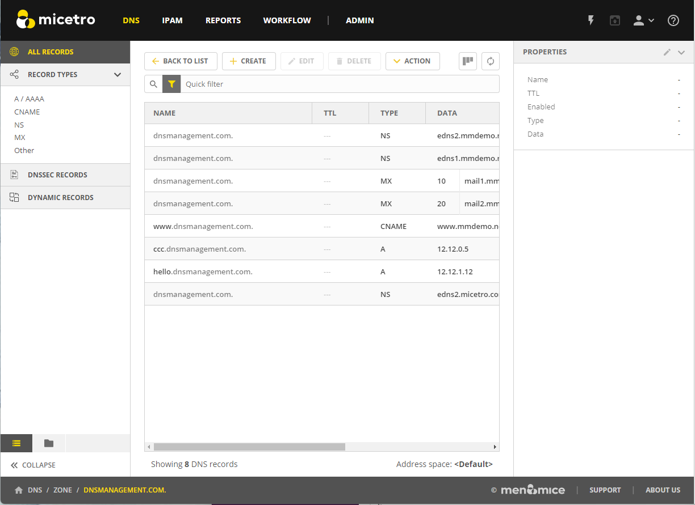

.. meta::
   :description: DNS resource records in the Micetro Web Application 
   :keywords: DNS records, DNS management, DNS

.. _dns-records:

DNS Resource Records
====================

Overview
--------

Each zone in the Domain Name System (DNS) contains a set of resource records that define how requests are processed or delegated within that zone. To view the resource records for a particular zone, you can double-click the zone, or select the zone and then click :guilabel:`Open` on the toolbar at the top or on the row menu (**...**). Once you have opened the zone, you can view, edit, and manipulate the resource records.

|
Selecting a DNS record in the list will display the following details and actions for the record in the :guilabel:`Inspector` pane on the right.

.. csv-table::
  :header: "Item", "Description"
  :widths: 15, 85

  "Actions", "Lists all available actions for the selected record."
  "Properties", "Lists the properties for the selected DNS record."
  "Related DNS Data", "Lists all related DNS records for the selected DNS record. Related DNS records all DNS records that are somehow associated with the specified record."
  "Related IP address", "Lists the related IP address in case of an A or AAAA DNS record."

Available Record Types
----------------------

* A / AAAA

* MX

* TXT

* NS

* SOA

* SRV

* HINFO

* CNAME

* TLSA

* CAA

* CERT

* WKS

* RP

* AFSDB

* LOC

* SSHFP

* SPF

* DNSKEY (read only)

* NSEC (read only)

* NSEC3 (read only)

* NSEC3PARAM (read only)

* RRSIG (read only)

* DS

* DLV (read only)

* HTTPS

* SVCB

* CDS

* CDNSKEY

* CSYNC

Creating New DNS Records
-------------------------

.. note::
  For importing DNS records in bulk, see :ref:`webapp-import-dns-records`.
  
To create a new DNS record:

1. Click :guilabel:`Create` in the main toolbar. The Create DNS Record dialog box opens.

2. Enter a name and select the record type. After selecting the type, the relevant fields are automatically displayed.

  .. warning::
    If you save a new DNS record with the wrong type, you cannot change the type later. You have to delete the record and create a new one with the correct type.
    
3. Fill in the required information and custom fields, if there are any.

   * For A records, an autocomplete behavior helps find a free IP address in a network.

   * When you enter the first digits of a network, you'll see a list of networks to choose from.

       .. image:: ../../images/create-DNS-record-ip-Micetro.png
          :width: 75%
    
  * Selecting an item from the list, will fill in the **Address** field with the next free IP address from that network, along with an indicator on the address state: ``Free``, ``Reserved``, ``Claimed`` or ``Assigned``. You'll also see insights for the selected IP address.

      .. image:: ../../images/create-DNS-record-ipam-Micetro.png
         :width: 75%
    
4. When you are finished, click :guilabel:`Create now` to save the new record to the zone, or :guilabel:`Add to request` to add it to the request queue. For more information about the request queue, see :ref:`webapp-workflows`.

IP Address Insights
^^^^^^^^^^^^^^^^^^^^
Once you have entered/selected the IP address in the **Address** field, you can see some insights about the address and related objects. These insights give you more information about the IP address and can help you understand its state better.

.. image:: ../../images/create-DNS-record-ipam-insights-Micetro.png
     :width: 75%
|
Hover over the :guilabel:`i` icon to see more information or a list of objects:

  * *Network* will show more details on the network.

  * *Properties* will show a list of all defined properties for the specified IP address.

  * *DNS hosts* will show a list of all defined DNS hosts for the specified IP address.

  * *MAC address* will show a list of additional MAC information for the specified IP address.

  * *Last seen* will show a list of additional information for the specified IP address.

.. csv-table:: IPAM Insights
  :widths: 15, 85

  "Network", "The network containing the specified IP address"
  "Network type", "Either an IP address range or a DHCP scope"
  "Properties", "Various properties including custom properties, if defined."
  "DHCP client",
  "DNS hosts", "Lists all DNS hosts that are set for the specified IP address"
  "MAC address", "The MAC address of the discovered device"
  "Last seen", "The date for which the IP address was last seen"

Time-to-live (TTL)
""""""""""""""""""

Throughout the system, the TTL value can either be specified in seconds or using the shorthand notation, such as:

   * **1s**: 1 second

   * **1m**: 1 minute

   * **1h**: 1 hour

   * **1d**: 1 day

   * **1w**: 1 week

Editing a DNS record
--------------------

1. Select the DNS record in the DNS record list

2. Either click :guilabel:`Edit` in the main task bar, or click on :guilabel:`Edit DNS record` in the row menu (...).

3. A dialog box is displayed where you can modify the DNS record.

4. Click :guilabel:`Save`.

Deleting Records
----------------

Deleting a record removes both the data and the physical record from the grid. 

1. Select the record(s) that you want to delete. To select multiple records, hold down the Ctrl (or Cmd on Mac) key while making your selections.

2. Click :guilabel:`Delete` on the task bar. The record is immediately deleted from the zone.

Undoing Changes to Records
--------------------------
If you need to revert or undo changes made to DNS records, Micetro provides a straightforward process through its history feature. It's essential to use this feature carefully, especially when dealing with critical DNS configurations.

**To undo changes**:

1.	Locate the zone where the changes were made, and click on the row menu (...) associated with it.

2. Select :guilabel:`View history`.

3.	Locate the specific action you want to undo within the history.

4.	Select :guilabel:`Undo` option on the Row menu (…). This action will roll back the selected change, restoring the DNS record to its previous state.

For more information about viewing object change history, see :ref:`view-change-history`.
