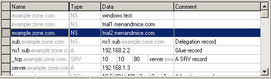
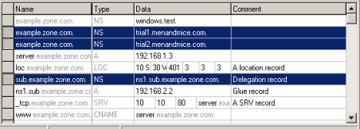

.. _dns-records:

DNS resource records
====================

Overview
--------

Each zone contains DNS resource records that define how requests are processed or delegated by the zone. The Zone tab provides a spreadsheet-like interface that makes it easy to view, edit, and manipulate information within a zone.

Types of Resource Records
-------------------------

There are varieties of resources records that actively affect zones, as well as several informational records that can be used to provide supporting data about a zone. The primary record types are described below.

NS
  The Name Server record is used to list a name server for this zone. NS records state the domain name of the zone's name servers. The name of an NS record is the fully qualified domain name of a zone. Every zone must have at least one NS record with the same name as the zone itself.

  Example:

  .. csv-table::
    :header: "Name", "Type", "Data"
    :widths: 15, 5, 35

    "example.com.",	"NS",	"ns1.example.com."

A
  Also known as an Address record, an A record declares the IP Address of a domain name. Defines a Hostname-to-IP Address mapping, or a forward mapping.

  Example

  .. csv-table::
    :header: "Name", "Type", "Data"
    :widths: 15, 5, 35

    "example.com.",	"A", "192.168.0.1"

PTR
  Also known as Pointer records, PTR records define an IP Address-to-Hostname mapping, known as a reverse mapping. A properly configured reverse zone has one PTR record providing the reverse lookup for each IP Address. All reverse zones are traditionally part of the .in-addr.arpa. zone. The proper formatting for a PTR record is the 4 octets of the IP Address in reverse order, followed by .in-addr.arpa. A properly formatted PTR record for the A record (above) is shown in the following example.

  In the event that you have multiple A records concerning the same IP Address, choose one for the PTR record. If one of the host names is used for a mail server, give that hostname preference because a common use of reverse lookup is to check the source of e-mail.

  Example

  .. csv-table::
    :header: "Name", "Type", "Data"
    :widths: 15, 5, 35

    "1.0.168.192.in-addr.arpa.", "PTR", "example.com."

CNAME
  Canonical Name records are used to define an alias. The canonical or primary DNS domain name used in the data is required and must resolve to a valid DNS domain name in the namespace. The name of the record is the name of the alias. Thus, if you want www.example.com to bring visitors to example.com, you'd need to add the line shown in following example:

  Example

  .. csv-table::
    :header: "Name", "Type", "Data"
    :widths: 15, 5, 35

    "www.example.com.",	"CNAME", "example.com."

MX
  Also known as Mail Exchange records, MX records create mail routes. Each exchanger host must have a corresponding host (A) address resource record in a valid zone. The first field in the record data is the preference number; this is the order in which mail hosts will be used by an outside mail server trying to send mail to a domain. Mail hosts will be contacted from the lowest preference number and work up to higher preference number. If two MX records have the same preference number, they will be used in random order. Mail servers with the same preference number will not forward to each other, nor will they forward to a mail server with a higher preference number.

  Example

  .. csv-table::
    :header: "Name", "Type", "Data"
    :widths: 15, 5, 35

    "example.com.",	"MX",	"10 mail.example.com."

AAAA
  Maps a DNS domain name to an Internet Protocol (IP) version 6 128-bit address.

  Example

  .. csv-table::
    :header: "Name", "Type", "Data"
    :widths: 15, 5, 35

    "host.example.com.", "AAAA", "4321:0:1:2:3:4:567:89ab"

WKS
  Similar in function to MX records, Well-Known Service (WKS) records describe the well-known IP services supported by a particular protocol on a specific IP Address. They provide TCP and UDP availability information for IP servers. Multiple WKS records should be used for servers that support both TCP and UDP for a well-known service or that have multiple IP Addresses that support a service.

  Three fields of data are required: IP Address, protocol, and a service list.

  Example

  .. csv-table::
    :header: "Name", "Type", "Data"
    :widths: 15, 5, 35

    "host.example.com.", "WKS", "10.0.0.1 TCP (ftp smtp telnet)"

  ..warning::
    Please note that the record type WKS was deprecated by RFC1123 - please don't use this record type.

RP
  The Responsible Person record specifies the domain mailbox name for the person responsible for that domain. This name is then mapped to a domain name in for which (TXT) resource records exist in the same zone. When RP records are used in DNS queries, subsequent queries are used to retrieve associated text (TXT) resource record information. Two fields of data are required: the domain name you are searching, the domain where TXT resource records exist.

  Example

  .. csv-table::
    :header: "Name", "Type", "Data"
    :widths: 15, 5, 35

    "my.example.com.", "RP", "who.example.com txtrec.example.com"

AFSDB
  The Andrew File System Database resource record maps a DNS domain name to the host name for a server computer of a server subtype. Two fields of data are required:

  The first is a subtype, which can have one of two supported numeric values:
    * A 1 indicates that the server is an AFS version 3.0 volume location server for the named AFS cell.
    * A 2 indicates that the server is an authenticated name server holding the cell-root directory node for the server that uses either Open Software Foundation's (OSF) DCE authenticated cell-naming system or HP/Apollo's Network Computing Architecture (NCA).

  The second field is the server's host name.

  Example

  .. csv-table::
    :header: "Name", "Type", "Data"
    :widths: 15, 5, 35

    "abc.example.com.", "AFSDB", "1 afs-server.example.com."

SRV
  Service records are intended to provide information on available services. They allow multiple servers providing a similar TCP/IP-based service to be located using a single DNS query operation.

  An SRV record has four fields and a special system for naming. The naming system is an underscore followed by the name of the service, followed by a period, an underscore, and then the protocol (generally TCP or UDP), another dot, and then the name of the domain. The four fields are.

  Priority.
    Used the same way as the preference number in MX records.

  Weight.
    This determines the relative capacity between SRV fields with the same priority. Hits will be assigned proportionately by weight, allowing a powerful and a weak server to share appropriate loads.

  Port.
    The port of the service offered.

  Hostname.
    The name of the domain.

  Example

  .. csv-table::
    :header: "Name", "Type", "Data"
    :widths: 15, 5, 35

    "_http._tcp.example.com.", "SRV", "10 5 80 www.example.com."

HINFO
  The Host information resource record specifies the type of CPU and operating system, respectively, for the host DNS domain name. This information is used by some application protocols, such as FTP, which use special procedures when communicating with computers of a known CPU and operating system type. Hardware information belongs in the first data field and OS information in the second field, as shown in the example below.

  Example

  .. csv-table::
    :header: "Name", "Type", "Data"
    :widths: 15, 5, 35

    "compname.example.com.", "HINFO", "Intel-PIII WIN2K"

TXT
  A Text Record allows you to include up to 255 characters of free-form descriptive text in your zone file. The order of resource records in zone files is not preserved, so it is best to keep messages confined to one record.

  Example

  .. csv-table::
    :header: "Name", "Type", "Data"
    :widths: 15, 5, 35

    "random.example.com.", "TXT", The quick brown fox jumped over the lazy dog."

LOC
  Geographic Location Records provide exact altitude, latitude, and longitude information. There is not much in the way of a practical application for this record, though some industries may find it to be of limited value. The LOC record can accept as few as three or as many as six fields of data:

  * Degrees latitude in degrees, minutes, seconds, N or S

  * Degrees longitude in degrees, minutes, seconds, E or W

  * Altitude in meters. This is single value, you may add an M.

  * Size of machine in terms of an enclosing sphere in meters radius. Expressed as a number, or a number immediately followed by an M. (Optional.)

  * Horizontal precision of the data in meters, with or without an M. (Optional, not available if 4 is blank.)

  * Vertical precision of data in meters, with or without an M. (Optional, not available if 5 is blank.)

  .. information::
    The Microsoft DNS server does not support LOC records.

  Example

  .. csv-table::
    :header: "Name", "Type", "Data"
    :widths: 15, 5, 35

    "geo.example.com.", "LOC", "42 21 43.528 N 71 05 06.284 W 12m"

NAPTR
  NAPTR stands for Naming Authority Pointer and is a resource record type that supports regular expression based rewriting. The NAPTR record accepts six fields of data:

  Preference.
    When there are multiple NAPTR records with the same name, the record with the lowest preference number is picked first.

  Weight (Order).
    This field specifies the order in which the NAPTR records MUST be processed to accurately represent the ordered list of Rules. This field is only used when there is more than one record with the same preference

  Flags.
    This field contains flags to control aspects of the rewriting and interpretation of the fields in the record. Flags are single characters from the set A-Z and 0-9.

  Service.
    This field contains a character-string that specifies the Service Parameters applicable to this delegation path.

  Regexp.
    This field contains a character-string that contains a substitution expression that is applied to the original string held by the client in order to construct the next domain name to lookup.

  Replacement.
    This field contains a domain name, which is the next domain name to query for, depending on the potential values found in the flags field.

  Example

  .. csv-table::
    :header: "Name", "Type", "Data"
    :widths: 15, 5, 35

    "104", "NAPTR", "100 10 u sip+E2U !^.\*$!sip:info@info.example.test!i ."

SSHFP
  SSHFP stands for SSH Public Key Fingerprint. This resource record type is used for publishing SSH public host key fingerprints in the DNS System, in order to aid in verifying the authenticity of the host. The SSHFP record accepts 3 fields of data:

  Algorithm.
    Specifies the algorithm number to use.

  Fingerprint type.
    Specifies the fingerprint type to use.

  Fingerprint.
    The fingerprint for the record.

  For further information on this record type, see RFC 4255

  Example

  .. csv-table::
    :header: "Name", "Type", "Data"
    :widths: 15, 5, 35

    "random.example.com", "SSHFP, "1 1 23D3C516AAF4C8E867D0A2968B2EB999B3168216"

SPF
  SPF stands for Sender Policy Framework. This record type is used in an e-mail validation system designed to prevent e-mail spam. The SPF record accepts a text string that contains the configuration info that should be used.

  For further information on this record type, see RFC 4408

  Example

  .. csv-table::
    :header: "Name", "Type", "Data"
    :widths: 15, 5, 35

    "example.com", "SPF",	"v=spf1 a mx -all"

TLSA
  The TLSA DNS record is used to associate a TLS server certificate with the domain name where the record resides.

  For further information on this record type, see RFC 6698

  A TLSA record has four fields, which are

  Certificate usage.
    Specifies the association that will be used to match the certificate.

  Selector.
    Specifies which part of the TLS certificate will be matched against the certificate association data

  Matching type.
    Specifies how the certificate association is presented

  Certificate associate data.
    Specifies the certificate association data to be matched

  Example

  .. csv-table::
    :header: "Name", "Type", "Data"
    :widths: 15, 5, 35

    "example.com", "TLSA", "3 1 1 d2abde240d7cd3ee6b4b28c54df034b9 7983a1d16e8a410e4561cb106618e971"

CAA
  The CAA (Certification Authority Authorization) DNS record is used to specify which Certification Authorities (CA) can issue certificates for the domain.

  Example

  .. csv-table::
    :header: "Name", "Type", "Data"
    :widths: 15, 5, 35

    "example.com", "CAA", "0 issue \"letsencrypt.org\""

In addition to the supported record types in the table, the Men&Mice Suite supports the following DNSSEC resource record types:

* DNSKEY

* NSEC

* NSEC3

* NSEC3PARAM

* RRSIG

* DS

* DLV

.. note::
  All DNSSEC specific record types, with the exception of the DS and NSEC3PARAM record types, are read only.

It is beyond the scope of this documentation to discuss DNSSEC management so these record types are not explained in detail. For further information on these resource record types and DNSSEC in general, we recommend the DNS Extensions section on the IETF web site.

Resource Records
----------------

To select a single resource record, click on the gray square to the left of the record. This highlights the entire record.

Once a record is selected, you can perform various editing actions on it, such as deleting, cutting, or copying. These are discussed in more detail later in this section. Many editing action can be performed on multiple records simultaneously. Simply select the records you want to operate on and perform the editing action as usual.

To select non-consecutive records, do the following:

1. Hold down the Ctrl key and select each record as usual.

2. When you are done selecting records, release the Ctrl key.

To select a contiguous series of records, select the first record in the series as usual, then hold down the [Shift] key and select the last record in the series. All records in between will automatically be selected.

New Records
-----------

If you are comfortable editing the record table directly, you can use this procedure to insert a new record directly in the zone tab.

1. Open the Zone tab to display the resource records in the zone you want to edit.

2. In the record table, select the record that is directly above where you want to insert the new record. To select a record, click on the square block to the left of the Name column.

3. Right-click anywhere in the selected record and, from the shortcut menu, select Insert Record. A new, blank record is added.

4. Starting with the Name field, enter the domain name.

.. warning::
  If you enter a domain name that is not fully qualified (i.e., does not end in a dot.). The program will assume that you are using a local name and will automatically append the name of the zone onto the end of the name, making it a fully qualified domain name. That means when adding the name server ns1 to the zone example.com, you should enter either just ns1 or ns1.example.com. If you leave off the period at the end, the program will interpret your intention as ns1.example.com.example.com. The information automatically filled in by the Management Console appears in grey.

5. Press the Tab key to advance the focus to the Type field.

6. Enter the appropriate type classification. The following types of resource records can be created: NS, A, PTR, CNAME, MX, AAAA, WKS, RP, AFSDB, SRV, HINFO, TXT, and NAPTR. The appropriate number of fields is automatically created in the Data field based on the type you entered. If you enter the wrong record type, you will be unable to change it. You must delete the record, insert a new one, and re-enter the record information.

7. Press the Tab key to advance the focus to the Data field.

8. Enter the appropriate data for your record type.

9. Click the Save button to save the new record to the zone.

10. An exclamation mark displays at the left edge of a record that is incomplete or improperly entered. The program will not allow you to save the changes to this zone until the record is repaired. Move to the lower right corner of the tab and click the exclamation point icon. This expands the tab and shows the items in error:

11. Double-click on the error message and it will jump to the record in question.

.. image:: ../../images/console-dns-records-inspector.png
  :width: 80%
  :align: center

Deleting Records
----------------

Deleting a record removes both the data and the physical record from the Zone window. Records beneath the deleted one are instantly moved up to fill in the space.

1. Select the record(s) that you want to delete. To select multiple records, hold down the Ctrl key while making you selections.

2. Right-click anywhere in the zone window, and select Delete Record from the context menu. The record is immediately deleted from the zone.

Clearing Records
----------------

When the whole record is selected, the Clear command works the same as the Delete Record command. The Clear command is really intended for deleting the contents of an individual field of data, leaving the rest of the record's data intact.

1. In the Zone window, select the field (cell) whose contents you want to delete.

2. Right-click anywhere in the zone window and select Clear from the context menu. The data is removed from the field. (The cell is not removed, and the rest of the record is unaffected.)

Disable/Enable Records in the Zone Window
-----------------------------------------

You can disable a record without deleting it. The disabled record performs no function; however, it can be instantly enabled when its services are needed, without having to re-type the record.

.. information::
  You cannot disable and enable records in dynamic zones.

How to Disable a Record
^^^^^^^^^^^^^^^^^^^^^^^

1. In the Zone window, select the record(s) that you want to disable. To select more than one record, hold down the Ctrl key while making your selections.

2. Right-click anywhere in the zone window and select Disable Record. Disabled records are grayed out in the Zone window.

3. In the toolbar, click the Save button to save the changes to the zone.

4. Select the disabled record(s) that you want to re-activate. To select multiple records at once, hold down the Ctrl key while making your selections.

5. Right-click anywhere in the zone window and select Enable Record.

6. In the toolbar, click theSave button to save the changes to the zone.

.. image:: ../../images/console-dns-records-disable.png
  :width: 60%
  :align: center

Cut, Copy, and Paste
--------------------

When working with records in the Management Console, there is no need to enter the same records in different zones. All records can be copied (or moved) to other zones simply by copying and pasting them between different zone windows.

To facilitate this, the Copy and Paste functions do not use fully qualified host names, so it is easy to work with records between zones.

This means that if you copy a record from the domain example.com, such as: www.example.com. CNAME example.com.
and paste the record to sample.com, it displays as: www.sample.com. CNAME sample.com.

To cut, copy, and paste records, do the following:

1. Select the record(s) that you want to move or copy. To select multiple records, hold down the Ctrl key while making your selections.

2. Right-click anywhere in the Zone window and choose either Cut (to move the record) or Copy (to duplicate the record elsewhere) from the context menu.

.. information::
  The Cut, Copy, Paste, and Clear commands can also be selected from the Edit menu in the main window.

3. Open the destination zone in which you want to insert the record(s).

4. In the destination zone, insert a new blank record in the location where you want to paste the records. To do this, right-click on the record immediately above where you want to paste the new one(s), then select Insert Record from the popup menu.

5. Select the blank record

6. Right-click anywhere in the Zone window and choose Paste from the context menu. The new record(s) are pasted in the destination zone.The Management Console allows you to undo most editing actions, such as deleting, clearing, cutting, and pasting.

7. When you perform an editing action, the Edit menu's Undo command is modified to include that action. For example, if you disable a record, the Undo command changes to Undo Disable. Selecting this command will reverse the action and restore the previously deleted record. When you perform an Undo action, the Redo command becomes active. Selecting this command reverses the previous Undo action. If you perform multiple editing actions in a row, the Undo command can be used repeatedly to restore each prior action.

Undo/Redo Commands
------------------

The Management Console allows you to undo most editing actions, such as deleting, clearing, cutting, and pasting.

When you perform an editing action, the Edit menu’s Undo command is modified to include that action. For example, if you disable a record, the Undo command changes to Undo Disable. Selecting this command will reverse the action and restore the previously deleted record.

When you perform an Undo action, the Redo command becomes active. Selecting this command reverses the previous Undo action.

If you perform multiple editing actions in a row, the Undo command can be used repeatedly to restore each prior action.
