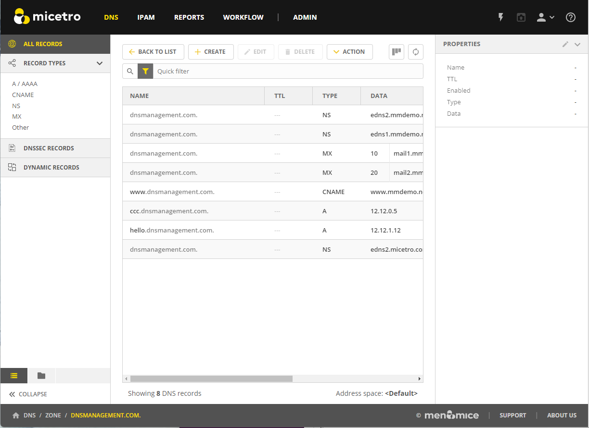
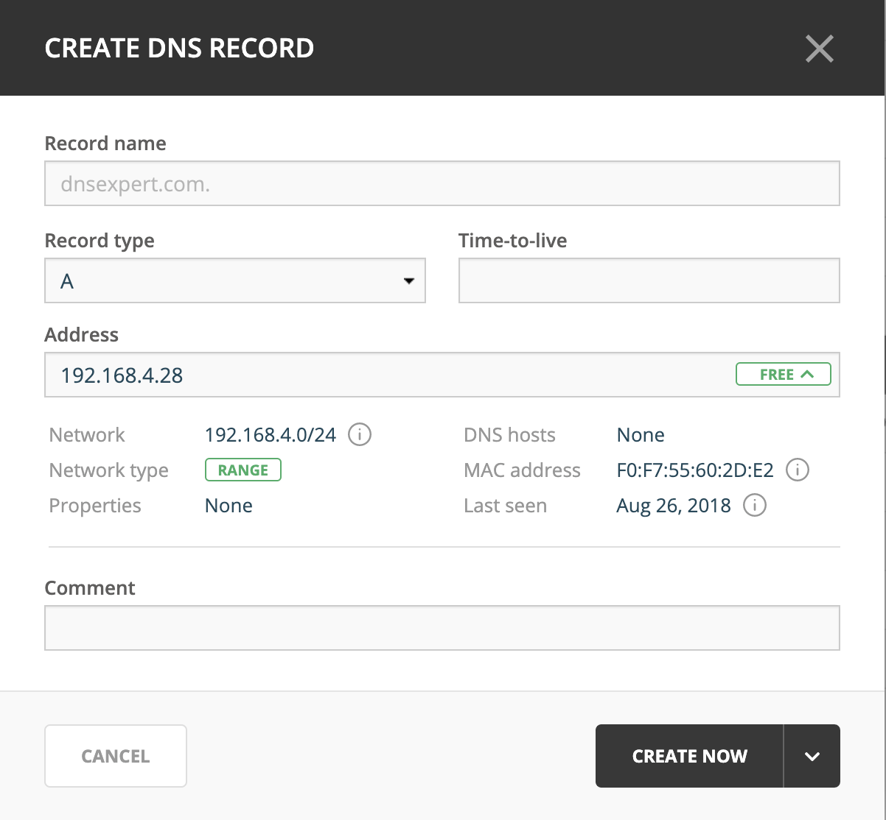

.. meta::
   :description: DNS resource records in the Micetro Web Application 
   :keywords: DNS records, DNS management, DNS

.. _dns-records:

DNS Resource Records
====================
Each zone in the Domain Name System (DNS) contains a set of resource records that define how requests are processed or delegated within that zone. To view the resource records for a particular zone, double-click the zone or select the zone in the grid and then select :guilabel:`Open` on the task bar or :guilabel:`Open zone` on the Row :guilabel:`...` menu. Once the zone is open, you can view, edit, and manipulate the resource records as needed.

|
Select a DNS record in the grid to view the following details and actions for the record in the Inspector.

.. csv-table::
  :header: "Item", "Description"
  :widths: 15, 85

  "Actions", "Lists all available actions for the selected record."
  "Properties", "Lists the properties for the selected DNS record."
  "Related DNS Data", "Lists all DNS records that are somehow associated with the selected DNS record."
  "Related IP Addresses", "Lists the related IP addresses in the case of an A or AAAA DNS record."

Available Record Types
----------------------

* A / AAAA

* MX

* TXT

* NS

* SOA

* SRV

* HINFO

* CNAME

* TLSA

* CAA

* CERT

* WKS

* RP

* AFSDB

* LOC

* SSHFP

* SPF

* DNSKEY (read only)

* NSEC (read only)

* NSEC3 (read only)

* NSEC3PARAM (read only)

* RRSIG (read only)

* DS

* DLV (read only)

* HTTPS

* SVCB

* CDS

* CDNSKEY

* CSYNC

Creating New DNS Records
-------------------------
In Micetro, you can create new DNS records for a zone.

.. note::
  For instructions on importing DNS records in bulk, refer to :ref:`webapp-import-dns-records`.
  
**To create a new DNS record**:

1. On the **DNS** page, select :guilabel:`Create`.

2. In the **Create DNS Record** dialog box, enter a name for the record and select the record type. After selecting the type, the relevant fields for that type are automatically displayed.

  .. warning::
    If you save a new DNS record with the wrong type, you cannot change the type later. You must delete the record and create a new one with the correct type.
    
3. Enter the required and any optional custom information.

   * For A records, an autocomplete behavior helps find a free IP address in a network.

   * When you enter the first digits of a network, you'll see a list of networks to choose from.

       .. image:: ../../images/create-DNS-record-ip-Micetro.png
          :width: 75%
    
  * Selecting an item from the list autofills the :guilabel:`Address` field with the next free IP address from that network, along with an indicator on the address state: ``Free``, ``Reserved``, ``Claimed`` or ``Assigned``. It also displays insights for the selected IP address.

      .. image:: ../../images/create-DNS-record-ipam-Micetro.png
         :width: 75%
    
4. When you are finished, select :guilabel:`Create Now` to save the new record to the zone or :guilabel:`Add to Request` to add it to the request queue. For more information about the request queue, refer to :ref:`webapp-workflows`.

IP Address Insights
^^^^^^^^^^^^^^^^^^^^
Once you have entered/selected the IP address in the :guilabel:`Address` field, the dialog box will display insights about the address and related objects. These insights provide more information about the IP address and can help you to better understand its state.

|
Hover over the :guilabel:`i` icon to see more information or a list of objects:

  * **Network** shows more details on the network.

  * **Properties** shows a list of all defined properties for the specified IP address.

  * **DNS hosts** shows a list of all defined DNS hosts for the specified IP address.

  * **MAC address** shows a list of additional MAC information for the specified IP address.

  * **Last seen** shows a list of additional information for the specified IP address.

.. csv-table:: IPAM Insights
  :widths: 15, 85

  "Network", "The network containing the specified IP address"
  "Network type", "Either an IP address range or a DHCP scope"
  "Properties", "Various properties including custom properties, if defined"
  "DNS hosts", "Lists all DNS hosts that are set for the specified IP address"
  "MAC address", "The MAC address of the discovered device"
  "Last seen", "The date for which the IP address was last seen"

Time-to-live (TTL)
""""""""""""""""""
When creating a DNS record, you must can provide its time-to-live (TTL). Throughout the system, the TTL value can either be specified in seconds or using the shorthand notation, such as:

   * **1s**: 1 second

   * **1m**: 1 minute

   * **1h**: 1 hour

   * **1d**: 1 day

   * **1w**: 1 week

Editing a DNS record
--------------------
When necessary, Micetro enables you to edit an existing DNS record.

.. note::
  Once a DNS record is created, you cannot edit its type. If you created a record with the wrong type, delete the record and create a new one with the correct type.

**To edit a DNS record**:

1. Select the DNS record in the grid on the **DNS** page.

2. Select either :guilabel:`Edit` on the task bar or use the Row :guilabel:`...` menu to select :guilabel:`Edit DNS record`.

3. In the dialog box, modify the DNS record as needed.

4. Click :guilabel:`Save`.

Deleting a DNS Record
---------------------
Deleting a record removes both the data and the physical record from the grid. 

**To delete a DNS record**

1. Select the record(s) that you want to delete. To select multiple records, hold down the **Ctrl** (or **Cmd** on Mac) key while making your selections.

2. Click :guilabel:`Delete` on the task bar. The record is immediately deleted from the zone.

Undoing Changes to a DNS Record
-------------------------------
If you need to undo or revert changes made to DNS records, Micetro provides a straightforward process through its History feature. It's essential to use this feature carefully, especially when dealing with critical DNS configurations.

**To undo changes to a DNS record**:

1.	Locate the zone where the changes were made, and use the Row :guilabel:`...` menu to select :guilabel:`View history`.

3.	In the **History** dialog, select the specific action you want to undo.

4.	Use the Row :guilabel:`...` menu to select :guilabel:`Undo`. This action will roll back the selected change, restoring the DNS record to its previous state.

For more information about viewing object change history, refer to :ref:`view-change-history`.
